[toc]

# Java面试


## 1. Redis

### Redis简介


https://www.cnblogs.com/aspirant/p/9166944.html

### Redis常用数据类型


https://www.cnblogs.com/ysocean/p/9102811.html#_label0_0


#### 1、演示数据类型的实现

　　上篇博客我们在介绍 key 相关命令的时候，介绍了如下命令：

```
OBJECT ENCODING    key 
```

　　该命令是用来显示那五大数据类型的底层数据结构。

　　比如对于 string 数据类型：

　　

　　我们可以看到实现string数据类型的数据结构有 embstr 以及 int。

　　再比如 list 数据类型：

　　

　　这里我们就不做过多的演示了，那么上次出现的 embstr 以及 int 还有 quicklist 是什么数据结构呢？下面我们就来介绍Redis中几种主要的数据结构。

[回到顶部](https://www.cnblogs.com/ysocean/p/9080942.html#_labelTop)

#### 2、简单动态字符串

　　第一篇文章我们就说过 Redis 是用 C 语言写的，但是对于Redis的字符串，却不是 C 语言中的字符串（即以空字符’\0’结尾的字符数组），它是自己构建了一种名为 简单动态字符串（simple dynamic string,SDS）的抽象类型，并将 SDS 作为 Redis的默认字符串表示。

　　**SDS 定义：**

```
struct` `sdshdr{``   ``//记录buf数组中已使用字节的数量``   ``//等于 SDS 保存字符串的长度``   ``int` `len;``   ``//记录 buf 数组中未使用字节的数量``   ``int` `free``;``   ``//字节数组，用于保存字符串``   ``char` `buf[];``}
```

　　用SDS保存字符串 “Redis”具体图示如下：

　　 

　　　　　　　　　图片来源：《Redis设计与实现》

 　我们看上面对于 SDS 数据类型的定义：

　　1、len 保存了SDS保存字符串的长度

　　2、buf[] 数组用来保存字符串的每个元素

　　3、free j记录了 buf 数组中未使用的字节数量

　　上面的定义相对于 C 语言对于字符串的定义，多出了 len 属性以及 free 属性。为什么不使用C语言字符串实现，而是使用 SDS呢？这样实现有什么好处？

　　**①、常数复杂度获取字符串长度**

　　由于 len 属性的存在，我们获取 SDS 字符串的长度只需要读取 len 属性，时间复杂度为 O(1)。而对于 C 语言，获取字符串的长度通常是经过遍历计数来实现的，时间复杂度为 O(n)。通过 strlen key 命令可以获取 key 的字符串长度。

　　**②、杜绝缓冲区溢出**

　　我们知道在 C 语言中使用 strcat 函数来进行两个字符串的拼接，一旦没有分配足够长度的内存空间，就会造成缓冲区溢出。而对于 SDS 数据类型，在进行字符修改的时候，会首先根据记录的 len 属性检查内存空间是否满足需求，如果不满足，会进行相应的空间扩展，然后在进行修改操作，所以不会出现缓冲区溢出。

　　**③、减少修改字符串的内存重新分配次数**

　　C语言由于不记录字符串的长度，所以如果要修改字符串，必须要重新分配内存（先释放再申请），因为如果没有重新分配，字符串长度增大时会造成内存缓冲区溢出，字符串长度减小时会造成内存泄露。

　　而对于SDS，由于len属性和free属性的存在，对于修改字符串SDS实现了空间预分配和惰性空间释放两种策略：

　　1、空间预分配：对字符串进行空间扩展的时候，扩展的内存比实际需要的多，这样可以减少连续执行字符串增长操作所需的内存重分配次数。

　　2、惰性空间释放：对字符串进行缩短操作时，程序不立即使用内存重新分配来回收缩短后多余的字节，而是使用 free 属性将这些字节的数量记录下来，等待后续使用。（当然SDS也提供了相应的API，当我们有需要时，也可以手动释放这些未使用的空间。）

　　**④、二进制安全**

　　因为C字符串以空字符作为字符串结束的标识，而对于一些二进制文件（如图片等），内容可能包括空字符串，因此C字符串无法正确存取；而所有 SDS 的API 都是以处理二进制的方式来处理 buf 里面的元素，并且 SDS 不是以空字符串来判断是否结束，而是以 len 属性表示的长度来判断字符串是否结束。

　　**⑤、兼容部分 C 字符串函数**

　　虽然 SDS 是二进制安全的，但是一样遵从每个字符串都是以空字符串结尾的惯例，这样可以重用 C 语言库<string.h> 中的一部分函数。

　　**⑥、总结**

　　

　　一般来说，SDS 除了保存数据库中的字符串值以外，SDS 还可以作为缓冲区（buffer）：包括 AOF 模块中的AOF缓冲区以及客户端状态中的输入缓冲区。后面在介绍Redis的持久化时会进行介绍。


#### 3、链表

　　链表是一种常用的数据结构，C 语言内部是没有内置这种数据结构的实现，所以Redis自己构建了链表的实现。关于链表的详细介绍可以参考我的[这篇博客](http://www.cnblogs.com/ysocean/p/7928988.html)。

　　链表定义：

```
typedef` `struct` `listNode{``    ``//前置节点``    ``struct` `listNode *prev;``    ``//后置节点``    ``struct` `listNode *next;``    ``//节点的值``    ``void` `*value; ``}listNode
```

　　通过多个 listNode 结构就可以组成链表，这是一个双向链表，Redis还提供了操作链表的数据结构：

```
typedef` `struct` `list{``   ``//表头节点``   ``listNode *head;``   ``//表尾节点``   ``listNode *tail;``   ``//链表所包含的节点数量``   ``unsigned ``long` `len;``   ``//节点值复制函数``   ``void` `(*``free``) (``void` `*ptr);``   ``//节点值释放函数``   ``void` `(*``free``) (``void` `*ptr);``   ``//节点值对比函数``   ``int` `(*match) (``void` `*ptr,``void` `*key);``}list;
```

　　

　　Redis链表特性：

　　①、双端：链表具有前置节点和后置节点的引用，获取这两个节点时间复杂度都为O(1)。

　　②、无环：表头节点的 prev 指针和表尾节点的 next 指针都指向 NULL,对链表的访问都是以 NULL 结束。　　

　　③、带链表长度计数器：通过 len 属性获取链表长度的时间复杂度为 O(1)。

　　④、多态：链表节点使用 void* 指针来保存节点值，可以保存各种不同类型的值。

#### 4、字典

　　字典又称为符号表或者关联数组、或映射（map），是一种用于保存键值对的抽象数据结构。字典中的每一个键 key 都是唯一的，通过 key 可以对值来进行查找或修改。C 语言中没有内置这种数据结构的实现，所以字典依然是 Redis自己构建的。

　　Redis 的字典使用哈希表作为底层实现，关于哈希表的详细讲解可以参考我[这篇博客](http://www.cnblogs.com/ysocean/p/8032656.html)。

　　哈希表结构定义：

```
typedef` `struct` `dictht{``   ``//哈希表数组``   ``dictEntry **table;``   ``//哈希表大小``   ``unsigned ``long` `size;``   ``//哈希表大小掩码，用于计算索引值``   ``//总是等于 size-1``   ``unsigned ``long` `sizemask;``   ``//该哈希表已有节点的数量``   ``unsigned ``long` `used;` `}dictht
```

　　哈希表是由数组 table 组成，table 中每个元素都是指向 dict.h/dictEntry 结构，dictEntry 结构定义如下：

```
typedef` `struct` `dictEntry{``   ``//键``   ``void` `*key;``   ``//值``   ``union``{``     ``void` `*val;``     ``uint64_tu64;``     ``int64_ts64;``   ``}v;` `   ``//指向下一个哈希表节点，形成链表``   ``struct` `dictEntry *next;``}dictEntry
```

　　key 用来保存键，val 属性用来保存值，值可以是一个指针，也可以是uint64_t整数，也可以是int64_t整数。

　　注意这里还有一个指向下一个哈希表节点的指针，我们知道哈希表最大的问题是存在哈希冲突，如何解决哈希冲突，有开放地址法和链地址法。这里采用的便是链地址法，通过next这个指针可以将多个哈希值相同的键值对连接在一起，用来解决**哈希冲突**。

　　

　　**①、哈希算法：**Redis计算哈希值和索引值方法如下：

```
#1、使用字典设置的哈希函数，计算键 key 的哈希值``hash = dict->type->hashFunction(key);``#2、使用哈希表的sizemask属性和第一步得到的哈希值，计算索引值``index = hash & dict->ht[x].sizemask;
```

　　**②、解决哈希冲突：**这个问题上面我们介绍了，方法是链地址法。通过字典里面的 *next 指针指向下一个具有相同索引值的哈希表节点。

　　**③、扩容和收缩：**当哈希表保存的键值对太多或者太少时，就要通过 rerehash(重新散列）来对哈希表进行相应的扩展或者收缩。具体步骤：

　　　　　　1、如果执行扩展操作，会基于原哈希表创建一个大小等于 ht[0].used*2n 的哈希表（也就是每次扩展都是根据原哈希表已使用的空间扩大一倍创建另一个哈希表）。相反如果执行的是收缩操作，每次收缩是根据已使用空间缩小一倍创建一个新的哈希表。

　　　　　　2、重新利用上面的哈希算法，计算索引值，然后将键值对放到新的哈希表位置上。

　　　　　　3、所有键值对都迁徙完毕后，释放原哈希表的内存空间。

　　**④、触发扩容的条件：**

　　　　　　1、服务器目前没有执行 BGSAVE 命令或者 BGREWRITEAOF 命令，并且负载因子大于等于1。

　　　　　　2、服务器目前正在执行 BGSAVE 命令或者 BGREWRITEAOF 命令，并且负载因子大于等于5。

　　　　ps：负载因子 = 哈希表已保存节点数量 / 哈希表大小。

　　**⑤、渐近式 rehash**

　　　　什么叫渐进式 rehash？也就是说扩容和收缩操作不是一次性、集中式完成的，而是分多次、渐进式完成的。如果保存在Redis中的键值对只有几个几十个，那么 rehash 操作可以瞬间完成，但是如果键值对有几百万，几千万甚至几亿，那么要一次性的进行 rehash，势必会造成Redis一段时间内不能进行别的操作。所以Redis采用渐进式 rehash,这样在进行渐进式rehash期间，字典的删除查找更新等操作可能会在两个哈希表上进行，第一个哈希表没有找到，就会去第二个哈希表上进行查找。但是进行 增加操作，一定是在新的哈希表上进行的。

[回到顶部](https://www.cnblogs.com/ysocean/p/9080942.html#_labelTop)

#### 5、跳跃表

　　关于跳跃表的趣味介绍：http://blog.jobbole.com/111731/

　　跳跃表（skiplist）是一种有序数据结构，它通过在每个节点中维持多个指向其它节点的指针，从而达到快速访问节点的目的。具有如下性质：

　　1、由很多层结构组成；

　　2、每一层都是一个有序的链表，排列顺序为由高层到底层，都至少包含两个链表节点，分别是前面的head节点和后面的nil节点；

　　3、最底层的链表包含了所有的元素；

　　4、如果一个元素出现在某一层的链表中，那么在该层之下的链表也全都会出现（上一层的元素是当前层的元素的子集）；

　　5、链表中的每个节点都包含两个指针，一个指向同一层的下一个链表节点，另一个指向下一层的同一个链表节点；

　　

　　Redis中跳跃表节点定义如下：

```
typedef` `struct` `zskiplistNode {``   ``//层``   ``struct` `zskiplistLevel{``      ``//前进指针``      ``struct` `zskiplistNode *forward;``      ``//跨度``      ``unsigned ``int` `span;``   ``}level[];` `   ``//后退指针``   ``struct` `zskiplistNode *backward;``   ``//分值``   ``double` `score;``   ``//成员对象``   ``robj *obj;` `} zskiplistNode
```

　　多个跳跃表节点构成一个跳跃表：

```
typedef` `struct` `zskiplist{``   ``//表头节点和表尾节点``   ``structz skiplistNode *header, *tail;``   ``//表中节点的数量``   ``unsigned ``long` `length;``   ``//表中层数最大的节点的层数``   ``int` `level;` `}zskiplist;
```

　　

　　①、搜索：从最高层的链表节点开始，如果比当前节点要大和比当前层的下一个节点要小，那么则往下找，也就是和当前层的下一层的节点的下一个节点进行比较，以此类推，一直找到最底层的最后一个节点，如果找到则返回，反之则返回空。

　　②、插入：首先确定插入的层数，有一种方法是假设抛一枚硬币，如果是正面就累加，直到遇见反面为止，最后记录正面的次数作为插入的层数。当确定插入的层数k后，则需要将新元素插入到从底层到k层。

　　③、删除：在各个层中找到包含指定值的节点，然后将节点从链表中删除即可，如果删除以后只剩下头尾两个节点，则删除这一层。

[回到顶部](https://www.cnblogs.com/ysocean/p/9080942.html#_labelTop)

#### 6、整数集合

　　整数集合（intset）是Redis用于保存整数值的集合抽象数据类型，它可以保存类型为int16_t、int32_t 或者int64_t 的整数值，并且保证集合中不会出现重复元素。

　　定义如下：

```
typedef` `struct` `intset{``   ``//编码方式``   ``uint32_t encoding;``   ``//集合包含的元素数量``   ``uint32_t length;``   ``//保存元素的数组``   ``int8_t contents[];` `}intset;
```

　　整数集合的每个元素都是 contents 数组的一个数据项，它们按照从小到大的顺序排列，并且不包含任何重复项。

　　length 属性记录了 contents 数组的大小。

　　需要注意的是虽然 contents 数组声明为 int8_t 类型，但是实际上contents 数组并不保存任何 int8_t 类型的值，其真正类型有 encoding 来决定。

　　**①、升级**

　　当我们新增的元素类型比原集合元素类型的长度要大时，需要对整数集合进行升级，才能将新元素放入整数集合中。具体步骤：

　　1、根据新元素类型，扩展整数集合底层数组的大小，并为新元素分配空间。

　　2、将底层数组现有的所有元素都转成与新元素相同类型的元素，并将转换后的元素放到正确的位置，放置过程中，维持整个元素顺序都是有序的。

　　3、将新元素添加到整数集合中（保证有序）。

　　升级能极大地节省内存。

　　**②、降级**

　　整数集合不支持降级操作，一旦对数组进行了升级，编码就会一直保持升级后的状态。

[回到顶部](https://www.cnblogs.com/ysocean/p/9080942.html#_labelTop)

#### 7、压缩列表

　　压缩列表（ziplist）是Redis为了节省内存而开发的，是由一系列特殊编码的连续内存块组成的顺序型数据结构，一个压缩列表可以包含任意多个节点（entry），每个节点可以保存一个字节数组或者一个整数值。

　　**压缩列表的原理：压缩列表并不是对数据利用某种算法进行压缩，而是将数据按照一定规则编码在一块连续的内存区域，目的是节省内存。**

　　

　　压缩列表的每个节点构成如下：

　　

　　①、previous_entry_ength：记录压缩列表前一个字节的长度。previous_entry_ength的长度可能是1个字节或者是5个字节，如果上一个节点的长度小于254，则该节点只需要一个字节就可以表示前一个节点的长度了，如果前一个节点的长度大于等于254，则previous length的第一个字节为254，后面用四个字节表示当前节点前一个节点的长度。利用此原理即当前节点位置减去上一个节点的长度即得到上一个节点的起始位置，压缩列表可以从尾部向头部遍历。这么做很有效地减少了内存的浪费。

　　②、encoding：节点的encoding保存的是节点的content的内容类型以及长度，encoding类型一共有两种，一种字节数组一种是整数，encoding区域长度为1字节、2字节或者5字节长。

　　③、content：content区域用于保存节点的内容，节点内容类型和长度由encoding决定。

[回到顶部](https://www.cnblogs.com/ysocean/p/9080942.html#_labelTop)

#### 8、总结

　　大多数情况下，Redis使用简单字符串SDS作为字符串的表示，相对于C语言字符串，SDS具有常数复杂度获取字符串长度，杜绝了缓存区的溢出，减少了修改字符串长度时所需的内存重分配次数，以及二进制安全能存储各种类型的文件，并且还兼容部分C函数。

　　通过为链表设置不同类型的特定函数，Redis链表可以保存各种不同类型的值，除了用作列表键，还在发布与订阅、慢查询、监视器等方面发挥作用（后面会介绍）。

　　Redis的字典底层使用哈希表实现，每个字典通常有两个哈希表，一个平时使用，另一个用于rehash时使用，使用链地址法解决哈希冲突。

　　跳跃表通常是有序集合的底层实现之一，表中的节点按照分值大小进行排序。

　　整数集合是集合键的底层实现之一，底层由数组构成，升级特性能尽可能的节省内存。

　　压缩列表是Redis为节省内存而开发的顺序型数据结构，通常作为列表键和哈希键的底层实现之一。

#### 1、对象的类型与编码

　　Redis使用前面说的五大数据类型来表示键和值，每次在Redis数据库中创建一个键值对时，至少会创建两个对象，一个是键对象，一个是值对象，而Redis中的每个对象都是由 redisObject 结构来表示：

```
typedef` `struct` `redisObject{``   ``//类型``   ``unsigned type:4;``   ``//编码``   ``unsigned encoding:4;``   ``//指向底层数据结构的指针``   ``void` `*ptr;``   ``//引用计数``   ``int` `refcount;``   ``//记录最后一次被程序访问的时间``   ``unsigned lru:22;` `}robj
```


##### ①、type属性

　　对象的type属性记录了对象的类型，这个类型就是前面讲的五大数据类型：

　　

　　可以通过如下命令来判断对象类型：

```
type key
```

　　

　　**注意：在Redis中，键总是一个字符串对象，而值可以是字符串、列表、集合等对象，所以我们通常说的键为字符串键，表示的是这个键对应的值为字符串对象，我们说一个键为集合键时，表示的是这个键对应的值为集合对象。**


##### ②、encoding 属性和 *prt 指针

　　对象的 prt 指针指向对象底层的数据结构，而数据结构由 encoding 属性来决定。

　　

　　而每种类型的对象都至少使用了两种不同的编码：

　　

　　可以通过如下命令查看值对象的编码：

```
OBJECT ENCODING  key
```

　　比如 string 类型：（可以是 embstr编码的简单字符串或者是 int 整数值实现）

　　

 

 

 

[回到顶部](https://www.cnblogs.com/ysocean/p/9102811.html#_labelTop)

#### 2、字符串对象

　　字符串是Redis最基本的数据类型，不仅所有key都是字符串类型，其它几种数据类型构成的元素也是字符串。注意字符串的长度不能超过512M。

　　**①、编码**

　　字符串对象的编码可以是int，raw或者embstr。

　　1、int 编码：保存的是可以用 long 类型表示的整数值。

　　2、raw 编码：保存长度大于44字节的字符串（redis3.2版本之前是39字节，之后是44字节）。

　　3、embstr 编码：保存长度小于44字节的字符串（redis3.2版本之前是39字节，之后是44字节）。

　　

 

　　由上可以看出，int 编码是用来保存整数值，raw编码是用来保存长字符串，而embstr是用来保存短字符串。其实 embstr 编码是专门用来保存短字符串的一种优化编码，raw 和 embstr 的区别：

　　

　　

　　embstr与raw都使用redisObject和sds保存数据，区别在于，embstr的使用只分配一次内存空间（因此redisObject和sds是连续的），而raw需要分配两次内存空间（分别为redisObject和sds分配空间）。因此与raw相比，embstr的好处在于创建时少分配一次空间，删除时少释放一次空间，以及对象的所有数据连在一起，寻找方便。而embstr的坏处也很明显，如果字符串的长度增加需要重新分配内存时，整个redisObject和sds都需要重新分配空间，因此redis中的embstr实现为只读。

　　**ps：Redis中对于浮点数类型也是作为字符串保存的，在需要的时候再将其转换成浮点数类型。**

　　**②、编码的转换**

　　当 int 编码保存的值不再是整数，或大小超过了long的范围时，自动转化为raw。

　　对于 embstr 编码，由于 Redis 没有对其编写任何的修改程序（embstr 是只读的），在对embstr对象进行修改时，都会先转化为raw再进行修改，因此，只要是修改embstr对象，修改后的对象一定是raw的，无论是否达到了44个字节。

[回到顶部](https://www.cnblogs.com/ysocean/p/9102811.html#_labelTop)

#### 3、列表对象

　　list 列表，它是简单的字符串列表，按照插入顺序排序，你可以添加一个元素到列表的头部（左边）或者尾部（右边），它的底层实际上是个链表结构。

　　**①、编码**

　　列表对象的编码可以是 ziplist(压缩列表) 和 linkedlist(双端链表)。 关于链表和压缩列表的特性可以看我前面的[这篇博客](https://www.cnblogs.com/ysocean/p/9080942.html)。

　　比如我们执行以下命令，创建一个 key = ‘numbers’，value = ‘1 three 5’ 的三个值的列表。

```
rpush numbers 1 ``"three"` `5
```

　　ziplist 编码表示如下：

　　

　　**linkedlist表示如下：**

　　　　

　　**②、编码转换**

　　当同时满足下面两个条件时，使用ziplist（压缩列表）编码：

　　1、列表保存元素个数小于512个

　　2、每个元素长度小于64字节

　　不能满足这两个条件的时候使用 linkedlist 编码。

　　上面两个条件可以在redis.conf 配置文件中的 list-max-ziplist-value选项和 list-max-ziplist-entries 选项进行配置。

[回到顶部](https://www.cnblogs.com/ysocean/p/9102811.html#_labelTop)

#### 4、哈希对象

　　哈希对象的键是一个字符串类型，值是一个键值对集合。

　　**①、编码**

　　哈希对象的编码可以是 ziplist 或者 hashtable。

　　当使用ziplist，也就是压缩列表作为底层实现时，新增的键值对是保存到压缩列表的表尾。比如执行以下命令：

```
hset profile name ``"Tom"``hset profile age 25``hset profile career ``"Programmer"
```

　　如果使用ziplist，profile 存储如下：

　　

　　当使用 hashtable 编码时，上面命令存储如下：

　　

　　hashtable 编码的哈希表对象底层使用字典数据结构，哈希对象中的每个键值对都使用一个字典键值对。

　　在前面介绍压缩列表时，我们介绍过压缩列表是Redis为了节省内存而开发的，是由一系列特殊编码的连续内存块组成的顺序型数据结构，相对于字典数据结构，压缩列表用于元素个数少、元素长度小的场景。其优势在于集中存储，节省空间。

　　**②、编码转换**

　　和上面列表对象使用 ziplist 编码一样，当同时满足下面两个条件时，使用ziplist（压缩列表）编码：

　　1、列表保存元素个数小于512个

　　2、每个元素长度小于64字节

　　不能满足这两个条件的时候使用 hashtable 编码。第一个条件可以通过配置文件中的 set-max-intset-entries 进行修改。

[回到顶部](https://www.cnblogs.com/ysocean/p/9102811.html#_labelTop)

#### 5、集合对象

 　集合对象 set 是 string 类型（整数也会转换成string类型进行存储）的无序集合。注意集合和列表的区别：集合中的元素是无序的，因此不能通过索引来操作元素；集合中的元素不能有重复。

　　**①、编码**

　　集合对象的编码可以是 intset 或者 hashtable。

　　intset 编码的集合对象使用整数集合作为底层实现，集合对象包含的所有元素都被保存在整数集合中。

　　hashtable 编码的集合对象使用 字典作为底层实现，字典的每个键都是一个字符串对象，这里的每个字符串对象就是一个集合中的元素，而字典的值则全部设置为 null。这里可以类比Java集合中HashSet 集合的实现，HashSet 集合是由 HashMap 来实现的，集合中的元素就是 HashMap 的key，而 HashMap 的值都设为 null。

```
SADD numbers 1 3 5
```

　　

```
SADD Dfruits ``"apple"` `"banana"` `"cherry"
```

　　

　　**②、编码转换**

　　当集合同时满足以下两个条件时，使用 intset 编码：

　　1、集合对象中所有元素都是整数

　　2、集合对象所有元素数量不超过512

　　不能满足这两个条件的就使用 hashtable 编码。第二个条件可以通过配置文件的 set-max-intset-entries 进行配置。

[回到顶部](https://www.cnblogs.com/ysocean/p/9102811.html#_labelTop)

#### 6、有序集合对象

　　和上面的集合对象相比，有序集合对象是有序的。与列表使用索引下标作为排序依据不同，有序集合为每个元素设置一个分数（score）作为排序依据。

　　**①、编码**

　　有序集合的编码可以是 ziplist 或者 skiplist。

　　ziplist 编码的有序集合对象使用压缩列表作为底层实现，每个集合元素使用两个紧挨在一起的压缩列表节点来保存，第一个节点保存元素的成员，第二个节点保存元素的分值。并且压缩列表内的集合元素按分值从小到大的顺序进行排列，小的放置在靠近表头的位置，大的放置在靠近表尾的位置。

```
ZADD price 8.5 apple 5.0 banana 6.0 cherry
```

　　

 

 

　　

 

 　skiplist 编码的有序集合对象使用 zet 结构作为底层实现，一个 zset 结构同时包含一个字典和一个跳跃表：

```
typedef` `struct` `zset{``   ``//跳跃表``   ``zskiplist *zsl;``   ``//字典``   ``dict *dice;``} zset;
```

　　字典的键保存元素的值，字典的值则保存元素的分值；跳跃表节点的 object 属性保存元素的成员，跳跃表节点的 score 属性保存元素的分值。

　　这两种数据结构会通过指针来共享相同元素的成员和分值，所以不会产生重复成员和分值，造成内存的浪费。

　　说明：其实有序集合单独使用字典或跳跃表其中一种数据结构都可以实现，但是这里使用两种数据结构组合起来，原因是假如我们单独使用 字典，虽然能以 O(1) 的时间复杂度查找成员的分值，但是因为字典是以无序的方式来保存集合元素，所以每次进行范围操作的时候都要进行排序；假如我们单独使用跳跃表来实现，虽然能执行范围操作，但是查找操作有 O(1)的复杂度变为了O(logN)。因此Redis使用了两种数据结构来共同实现有序集合。

　　**②、编码转换**

　　当有序集合对象同时满足以下两个条件时，对象使用 ziplist 编码：

　　1、保存的元素数量小于128；

　　2、保存的所有元素长度都小于64字节。

　　不能满足上面两个条件的使用 skiplist 编码。以上两个条件也可以通过Redis配置文件zset-max-ziplist-entries 选项和 zset-max-ziplist-value 进行修改。

[回到顶部](https://www.cnblogs.com/ysocean/p/9102811.html#_labelTop)

#### 7、五大数据类型的应用场景

　　对于string 数据类型，因为string 类型是二进制安全的，可以用来存放图片，视频等内容，另外由于Redis的高性能读写功能，而string类型的value也可以是数字，可以用作计数器（INCR,DECR），比如分布式环境中统计系统的在线人数，秒杀等。

　　对于 hash 数据类型，value 存放的是键值对，比如可以做单点登录存放用户信息。

　　对于 list 数据类型，可以实现简单的消息队列，另外可以利用lrange命令，做基于redis的分页功能

　　对于 set 数据类型，由于底层是字典实现的，查找元素特别快，另外set 数据类型不允许重复，利用这两个特性我们可以进行全局去重，比如在用户注册模块，判断用户名是否注册；另外就是利用交集、并集、差集等操作，可以计算共同喜好，全部的喜好，自己独有的喜好等功能。

　　对于 zset 数据类型，有序的集合，可以做范围查找，排行榜应用，取 TOP N 操作等。

[回到顶部](https://www.cnblogs.com/ysocean/p/9102811.html#_labelTop)

#### 8、内存回收和内存共享


##### ①、内存回收

　　前面讲 Redis 的每个对象都是由 redisObject 结构表示：

```
typedef` `struct` `redisObject{``   ``//类型``   ``unsigned type:4;``   ``//编码``   ``unsigned encoding:4;``   ``//指向底层数据结构的指针``   ``void` `*ptr;``   ``//引用计数``   ``int` `refcount;``   ``//记录最后一次被程序访问的时间``   ``unsigned lru:22;` `}robj
```

　　其中关键的 type属性，encoding 属性和 ptr 指针都介绍过了，那么 refcount 属性是干什么的呢？

　　因为 C 语言不具备自动回收内存功能，那么该如何回收内存呢？于是 Redis自己构建了一个内存回收机制，通过在 redisObject 结构中的 refcount 属性实现。这个属性会随着对象的使用状态而不断变化：

　　1、创建一个新对象，属性 refcount 初始化为1

　　2、对象被一个新程序使用，属性 refcount 加 1

　　3、对象不再被一个程序使用，属性 refcount 减 1

　　4、当对象的引用计数值变为 0 时，对象所占用的内存就会被释放。

　　在 Redis 中通过如下 API 来实现：

　　

　　学过Java的应该知道，引用计数的内存回收机制其实是不被Java采用的，因为不能克服循环引用的例子（比如 A 具有 B 的引用，B 具有 C 的引用，C 具有 A 的引用，除此之外，这三个对象没有任何用处了），这时候 A B C 三个对象会一直驻留在内存中，造成内存泄露。那么 Redis 既然采用引用计数的垃圾回收机制，如何解决这个问题呢？

　　在前面介绍 redis.conf 配置文件时，在 MEMORY MANAGEMENT 下有个 maxmemory-policy 配置：

　　maxmemory-policy ：当内存使用达到最大值时，redis使用的清楚策略。有以下几种可以选择：

　　　　1）volatile-lru  利用LRU算法移除设置过过期时间的key (LRU:最近使用 Least Recently Used ) 

　　　　2）allkeys-lru  利用LRU算法移除任何key 

　　　　3）volatile-random 移除设置过过期时间的随机key 

　　　　4）allkeys-random 移除随机key

　　　　5）volatile-ttl  移除即将过期的key(minor TTL) 

　　　　6）noeviction noeviction  不移除任何key，只是返回一个写错误 ，默认选项

　　通过这种配置，也可以对内存进行回收。


##### ②、内存共享 

　　refcount 属性除了能实现内存回收以外，还能用于内存共享。

　　比如通过如下命令 set k1 100,创建一个键为 k1，值为100的字符串对象，接着通过如下命令 set k2 100 ，创建一个键为 k2，值为100 的字符串对象，那么 Redis 是如何做的呢？

　　1、将数据库键的值指针指向一个现有值的对象

　　2、将被共享的值对象引用refcount 加 1

　　

 

　　注意：Redis的共享对象目前只支持整数值的字符串对象。之所以如此，实际上是对内存和CPU（时间）的平衡：共享对象虽然会降低内存消耗，但是判断两个对象是否相等却需要消耗额外的时间。对于整数值，判断操作复杂度为O(1)；对于普通字符串，判断复杂度为O(n)；而对于哈希、列表、集合和有序集合，判断的复杂度为O(n^2)。

　　虽然共享对象只能是整数值的字符串对象，但是5种类型都可能使用共享对象（如哈希、列表等的元素可以使用）。

#### 9、对象的空转时长

　　在 redisObject 结构中，前面介绍了 type、encoding、ptr 和 refcount 属性，最后一个 lru 属性，该属性记录了对象最后一次被命令程序访问的时间。

　　使用 OBJECT IDLETIME 命令可以打印给定键的空转时长，通过将当前时间减去值对象的 lru 时间计算得到。

　　

　　lru 属性除了计算空转时长以外，还可以配合前面内存回收配置使用。如果Redis打开了maxmemory选项，且内存回收算法选择的是volatile-lru或allkeys—lru，那么当Redis内存占用超过maxmemory指定的值时，Redis会优先选择空转时间最长的对象进行释放。


### 从海量数据查询某一固定前缀的key

1、留意细节

​		摸清数据规模，问清楚边界


**批量生成Redis测试数据**

```
1.Linux Bash 执行
	for((i=1;i<=20000000;i++));
		do echo "set k$i V$i" >> /tmp/redisTest.txt
	生成两千万条Redis批量设置kv的语句写入文件
2.用vim去掉行尾的^M符号，如下：
	vim /tmp/redisTest.txt
	:set fileformat=dos # 设置文件的格式，通过这句话去掉每行结尾的^M符号
3.通过Redis提供的管道--pipe形式去跑Redis，传入文件指令批量灌数据，需要十分钟左右
cat /tmp/redisTest.txt | ../redis/src/redis-cli -h ip -p --pipe
```


**存到hashset里面达到去重的效果**


### 通过Redis实现分布式锁


 

<u>**缺点：原子性得不到满足**</u>


### 如何使用Redis做异步队列


**发布订阅模式**


### Redis如何做持久化

**RDB快照**


**AOF默认关闭**


### 使用Pipeline的好处


### Redis的同步机制


**slave负责读，master负责写**


### Redis的集群原理


**最小化有损服务**


**虚拟节点一半设置为32或者更大**

### Redis过期策略和LRU

#### 一、定期删除

redis会把设置了过期时间的key放在单独的字典中，定时遍历来删除到期的key。

1）.每100ms从过期字典中 随机挑选20个，把其中过期的key删除；
 2）.如果过期的key占比超过1/4，重复步骤1

为了保证不会循环过度，导致卡顿，扫描时间上限默认不超过25ms。根据以上原理，系统中应避免大量的key同时过期，给要过期的key设置一个随机范围。

#### 二、惰性删除

过期的key并不一定会马上删除，还会占用着内存。  当你真正查询这个key时，redis会检查一下，这个设置了过期时间的key是否过期了? 如果过期了就会删除，返回空。这就是惰性删除。

#### 三、内存淘汰机制

当redis内存超出物理内存限制时，会和磁盘产生swap，这种情况性能极差，一般是不允许的。通过设置 maxmemory 限制最大使用内存。超出限制时，根据redis提供的几种内存淘汰机制让用户自己决定如何腾出新空间以提供正常的读写服务。

（1）noeviction： 拒绝写操作， 读、删除可以正常使用。默认策略，不建议使用；
 （2）allkeys-lru： 移除最近最少使用的key，最常用的策略；
 （3）allkeys-random：随机删除某个key，不建议使用；
 （4）volatile-lru：在设置了过期时间的key中，移除最近最少使用的key，不建议使用；
 （5）volatile-random：在设置了过期时间的key中，随机删除某个key，不建议使用；
 （6）volatile-ttl： 在设置了过期时间的key中，把最早要过期的key优先删除。

#### 四、用java手写一个LRU算法实现


```java
public class LRUCache<K,V> extends LinkedHashMap<K,V> {
    private int cacheSize;
    public LRUCache(int cacheSize){
        super(10,0.75f,true);
        //设置hashmap大小，true是让linkedhashmap按照访问顺序排序
        this.cacheSize = cacheSize;
    }

    @Override
    protected boolean removeEldestEntry(Map.Entry<K, V> eldest) {
        //当map中数量大于指定缓存个数的时候，自动删除最老的数据
        return size()>cacheSize;
    }
}

package com.lru;

import java.util.ArrayList;
import java.util.Collection;
import java.util.LinkedHashMap;
import java.util.Map;
import java.util.concurrent.locks.Lock;
import java.util.concurrent.locks.ReentrantLock;

/**
 * @author Join
 * @date 2018/4/9 14:41
 */

/**
 * 1. 新数据插入到链表头部；
 2. 每当缓存命中（即缓存数据被访问），则将数据移到链表头部；
 3. 当链表满的时候，将链表尾部的数据丢弃。

 利用LinkedHashMap实现简单的缓存， 必须实现removeEldestEntry方法
 */
public class LRULinkedHashMap<K,V> extends LinkedHashMap<K,V> {
    private final int maxCapacity;

    private static final float DEFAULT_LOAD_FACTOR=0.75f;

    private final Lock lock=new ReentrantLock();

    public LRULinkedHashMap(int maxCapacity){
        super(maxCapacity,DEFAULT_LOAD_FACTOR,true);
        this.maxCapacity=maxCapacity;
    }

    @Override
    protected boolean removeEldestEntry(Map.Entry <K, V> eldest) {
        return size()>maxCapacity;
    }

    @Override
    public boolean containsKey(Object key) {
        try {
            lock.lock();
            return super.containsKey(key);
        } finally {
            lock.unlock();
        }
    }

    @Override
    public V put(K key, V value) {
        try {
            lock.lock();
            return super.put(key, value);
        } finally {
            lock.unlock();
        }
    }

    @Override
    public int size() {
        try {
            lock.lock();
            return super.size();
        } finally {
            lock.unlock();
        }
    }

    @Override
    public void clear() {
        try {
            lock.lock();
            super.clear();
        } finally {
            lock.unlock();
        }
    }

    public Collection<Map.Entry<K,V>> getAll(){
        try {
            lock.lock();
            return new ArrayList <Map.Entry<K, V>>(super.entrySet());
        } finally {
            lock.unlock();
        }
    }
}
```


### Redis常见面试题

https://mp.weixin.qq.com/s?__biz=MzIzODMxODU2NA==&mid=100000470&idx=4&sn=b4cfe9903fe00f82f71e98ad7c951b7b&chksm=693a645d5e4ded4bf995f44f4c0dc96a47574b88ccb2093b1e7c0d9e3064b764bf193d48c63a&mpshare=1&scene=1&srcid=&sharer_sharetime=1585488997864&sharer_shareid=403295b4ba88192beaf0b553d244a805&key=b6dffc183f3b5981201b507fc9e18bce555a9b88ed1d79483bc808614d3e1b5995588268ad559a18d2fa7b1ce3c31bd68fc3fa91a2ea5360b692d8a910c675c47084a20335624e781a357f647b37b525&ascene=1&uin=MTAyOTcxMzY2NA%3D%3D&devicetype=Windows+10&version=62080079&lang=zh_CN&exportkey=AWDsGrfGQ6rzRL%2Flx6pvank%3D&pass_ticket=wZZBTmwhQf0OPkWs6qfGFuW3ChkZ%2F2H%2F2RXsQ5iV%2BvTgHoUKR4SawqgSYiCDCeJi

Redis(Remote Dictionary Server) 是一个使用 C 语言编写的，开源的（BSD许可）高性能非关系型（NoSQL）的键值对数据库。


Redis 可以存储键和五种不同类型的值之间的映射。键的类型只能为字符串，值支持五种数据类型：字符串、列表、集合、散列表、有序集合。


与传统数据库不同的是 Redis 的数据是存在内存中的，所以读写速度非常快，因此 redis 被广泛应用于缓存方向，每秒可以处理超过 10万次读写操作，是已知性能最快的Key-Value DB。另外，Redis 也经常用来做分布式锁。除此之外，Redis 支持事务 、持久化、LUA脚本、LRU驱动事件、多种集群方案。


#### **Redis有哪些优缺点**


**优点**

读写性能优异， Redis能读的速度是110000次/s，写的速度是81000次/s。

支持数据持久化，支持AOF和RDB两种持久化方式。


支持事务，Redis的所有操作都是原子性的，同时Redis还支持对几个操作合并后的原子性执行。


数据结构丰富，除了支持string类型的value外还支持hash、set、zset、list等数据结构。


支持主从复制，主机会自动将数据同步到从机，可以进行读写分离。


**缺点**

数据库容量受到物理内存的限制，不能用作海量数据的高性能读写，因此Redis适合的场景主要局限在较小数据量的高性能操作和运算上。


Redis 不具备自动容错和恢复功能，主机从机的宕机都会导致前端部分读写请求失败，需要等待机器重启或者手动切换前端的IP才能恢复。


主机宕机，宕机前有部分数据未能及时同步到从机，切换IP后还会引入数据不一致的问题，降低了系统的可用性。


Redis 较难支持在线扩容，在集群容量达到上限时在线扩容会变得很复杂。为避免这一问题，运维人员在系统上线时必须确保有足够的空间，这对资源造成了很大的浪费。


#### ***\*为什么要用缓存\**，为什么要用 Redis**

主要从“高性能”和“高并发”这两点来看待这个问题。


**高性能：**

假如用户第一次访问数据库中的某些数据。这个过程会比较慢，因为是从硬盘上读取的。将该用户访问的数据存在数缓存中，这样下一次再访问这些数据的时候就可以直接从缓存中获取了。操作缓存就是直接操作内存，所以速度相当快。如果数据库中的对应数据改变的之后，同步改变缓存中相应的数据即可！


**高并发：**

直接操作缓存能够承受的请求是远远大于直接访问数据库的，所以我们可以考虑把数据库中的部分数据转移到缓存中去，这样用户的一部分请求会直接到缓存这里而不用经过数据库。


#### **为什么要用 Redis 而不用 map/guava 做缓存?**

缓存分为本地缓存和分布式缓存。以 Java 为例，使用自带的 map 或者 guava 实现的是本地缓存，最主要的特点是轻量以及快速，生命周期随着 jvm 的销毁而结束，并且在多实例的情况下，每个实例都需要各自保存一份缓存，缓存不具有一致性。


使用 redis 或 memcached 之类的称为分布式缓存，在多实例的情况下，各实例共用一份缓存数据，缓存具有一致性。缺点是需要保持 redis 或 memcached服务的高可用，整个程序架构上较为复杂。


#### **Redis为什么这么快**

1、完全基于内存，绝大部分请求是纯粹的内存操作，非常快速。数据存在内存中，类似于 HashMap，HashMap 的优势就是查找和操作的时间复杂度都是O(1)；


2、数据结构简单，对数据操作也简单，Redis 中的数据结构是专门进行设计的；


3、采用单线程，避免了不必要的上下文切换和竞争条件，也不存在多进程或者多线程导致的切换而消耗 CPU，不用去考虑各种锁的问题，不存在加锁释放锁操作，没有因为可能出现死锁而导致的性能消耗；


4、使用多路 I/O 复用模型，非阻塞 IO；


5、使用底层模型不同，它们之间底层实现方式以及与客户端之间通信的应用协议不一样，Redis 直接自己构建了 VM 机制 ，因为一般的系统调用系统函数的话，会浪费一定的时间去移动和请求；

#### Redis有哪些数据类型

Redis主要有5种数据类型，包括String，List，Set，Zset，Hash，满足大部分的使用要求

| **类型** | **存储值**             | **操作**                                                     | **应用场景**                                                 |
| -------- | ---------------------- | ------------------------------------------------------------ | ------------------------------------------------------------ |
| STRING   | 字符串、整数或者浮点数 | 对整个字符串或者字符串的其中一部分执行操作； 对整数和浮点数执行自增或者自减操作 | 做简单的键值对缓存                                           |
| LIST     | 列表                   | 从两端压入或者弹出元素； 对单个或者多个元素进行修剪，只保留一个范围内的元素 | 存储一些列表型的数据结构，类似粉丝列表、文章的评论列表之类的数据 |
| SET      | 无序集合               | 添加、获取、移除单个元素； 检查一个元素是否存在于集合中； 计算交集、并集、差集； 从集合里面随机获取元素 | 交集、并集、差集的操作，比如交集，可以把两个人的粉丝列表整一个交集 |
| HASH     | 哈希                   | 添加、获取、移除单个键值对； 获取所有键值对； 检查某个键是否存在 | 结构化的数据，比如一个对象                                   |
| ZSET     | 有序集合               | 添加、获取、删除元素； 根据分值范围或者成员来获取元素； 计算一个键的排名 | 去重但可以排序，如获取排名前几名的用户                       |

#### **Redis的应用场景**

**总结一**

1、计数器

可以对 String 进行自增自减运算，从而实现计数器功能。Redis 这种内存型数据库的读写性能非常高，很适合存储频繁读写的计数量。


2、缓存

将热点数据放到内存中，设置内存的最大使用量以及淘汰策略来保证缓存的命中率。


3、会话缓存

可以使用 Redis 来统一存储多台应用服务器的会话信息。当应用服务器不再存储用户的会话信息，也就不再具有状态，一个用户可以请求任意一个应用服务器，从而更容易实现高可用性以及可伸缩性。


4、全页缓存（FPC）

除基本的会话token之外，Redis还提供很简便的FPC平台。以Magento为例，Magento提供一个插件来使用Redis作为全页缓存后端。此外，对WordPress的用户来说，Pantheon有一个非常好的插件 wp-redis，这个插件能帮助你以最快速度加载你曾浏览过的页面。


5、查找表

例如 DNS 记录就很适合使用 Redis 进行存储。查找表和缓存类似，也是利用了 Redis 快速的查找特性。但是查找表的内容不能失效，而缓存的内容可以失效，因为缓存不作为可靠的数据来源。


6、消息队列(发布/订阅功能)

List 是一个双向链表，可以通过 lpush 和 rpop 写入和读取消息。不过最好使用 Kafka、RabbitMQ 等消息中间件。


7、分布式锁实现

在分布式场景下，无法使用单机环境下的锁来对多个节点上的进程进行同步。可以使用 Redis 自带的 SETNX 命令实现分布式锁，除此之外，还可以使用官方提供的 RedLock 分布式锁实现。


8、其它

Set 可以实现交集、并集等操作，从而实现共同好友等功能。ZSet 可以实现有序性操作，从而实现排行榜等功能。


**总结二**

Redis相比其他缓存，有一个非常大的优势，就是支持多种数据类型。


数据类型说明string字符串，最简单的k-v存储hashhash格式，value为field和value，适合ID-Detail这样的场景。list简单的list，顺序列表，支持首位或者末尾插入数据set无序list，查找速度快，适合交集、并集、差集处理sorted set有序的set


其实，通过上面的数据类型的特性，基本就能想到合适的应用场景了。


**string**——适合最简单的k-v存储，类似于memcached的存储结构，短信验证码，配置信息等，就用这种类型来存储。


**hash**——一般key为ID或者唯一标示，value对应的就是详情了。如商品详情，个人信息详情，新闻详情等。


**list**——因为list是有序的，比较适合存储一些有序且数据相对固定的数据。如省市区表、字典表等。因为list是有序的，适合根据写入的时间来排序，如：最新的热点新闻，消息队列等。


**set**——可以简单的理解为ID-List的模式，如微博中一个人有哪些好友，set最牛的地方在于，可以对两个set提供交集、并集、差集操作。例如：查找两个人共同的好友等。


**Sorted Set**——是set的增强版本，增加了一个score参数，自动会根据score的值进行排序。比较适合类似于top 10等不根据插入的时间来排序的数据。


如上所述，虽然Redis不像关系数据库那么复杂的数据结构，但是，也能适合很多场景，比一般的缓存数据结构要多。了解每种数据结构适合的业务场景，不仅有利于提升开发效率，也能有效利用Redis的性能。


#### **持久化**

**什么是Redis持久化？**

持久化就是把内存的数据写到磁盘中去，防止服务宕机了内存数据丢失。


**Redis 的持久化机制是什么？各自的优缺点？**

Redis 提供两种持久化机制 RDB（默认） 和 AOF 机制；


RDB：是Redis DataBase缩写快照


RDB是Redis默认的持久化方式。按照一定的时间将内存的数据以快照的形式保存到硬盘中，对应产生的数据文件为dump.rdb。通过配置文件中的save参数来定义快照的周期。


**优点：**

1、只有一个文件 dump.rdb，方便持久化。

2、容灾性好，一个文件可以保存到安全的磁盘。

3、性能最大化，fork 子进程来完成写操作，让主进程继续处理命令，所以是 IO 最大化。使用单独子进程来进行持久化，主进程不会进行任何 IO 操作，保证了 redis 的高性能。

4、相对于数据集大时，比 AOF 的启动效率更高。


**缺点：**

1、数据安全性低。RDB 是间隔一段时间进行持久化，如果持久化之间 redis 发生故障，会发生数据丢失。所以这种方式更适合数据要求不严谨的时候)

2、AOF（Append-only file)持久化方式：是指所有的命令行记录以 redis 命令请 求协议的格式完全持久化存储)保存为 aof 文件。


**AOF：持久化**

AOF持久化(即Append Only File持久化)，则是将Redis执行的每次写命令记录到单独的日志文件中，当重启Redis会重新将持久化的日志中文件恢复数据。


当两种方式同时开启时，数据恢复Redis会优先选择AOF恢复。


**优点：**

1、数据安全，aof 持久化可以配置 appendfsync 属性，有 always，每进行一次 命令操作就记录到 aof 文件中一次。

2、通过 append 模式写文件，即使中途服务器宕机，可以通过 redis-check-aof 工具解决数据一致性问题。

3、AOF 机制的 rewrite 模式。AOF 文件没被 rewrite 之前（文件过大时会对命令 进行合并重写），可以删除其中的某些命令（比如误操作的 flushall）


**缺点：**

1、AOF 文件比 RDB 文件大，且恢复速度慢。

2、数据集大的时候，比 rdb 启动效率低。


**优缺点是什么？**

- AOF文件比RDB更新频率高，优先使用AOF还原数据
- AOF比RDB更安全也更大
- RDB性能比AOF好
- 如果两个都配了优先加载AOF


#### **如何选择合适的持久化方式？**

一般来说， 如果想达到足以媲美PostgreSQL的数据安全性，你应该同时使用两种持久化功能。在这种情况下，当 Redis 重启的时候会优先载入AOF文件来恢复原始的数据，因为在通常情况下AOF文件保存的数据集要比RDB文件保存的数据集要完整。


如果你非常关心你的数据， 但仍然可以承受数分钟以内的数据丢失，那么你可以只使用RDB持久化。


有很多用户都只使用AOF持久化，但并不推荐这种方式，因为定时生成RDB快照（snapshot）非常便于进行数据库备份， 并且 RDB 恢复数据集的速度也要比AOF恢复的速度要快，除此之外，使用RDB还可以避免AOF程序的bug。


如果你只希望你的数据在服务器运行的时候存在，你也可以不使用任何持久化方式。


#### **Redis持久化数据和缓存怎么做扩容？**

如果Redis被当做缓存使用，使用一致性哈希实现动态扩容缩容。


如果Redis被当做一个持久化存储使用，必须使用固定的keys-to-nodes映射关系，节点的数量一旦确定不能变化。否则的话(即Redis节点需要动态变化的情况），必须使用可以在运行时进行数据再平衡的一套系统，而当前只有Redis集群可以做到这样。


#### **过期键的删除策略**

**Redis的过期键的删除策略**

我们都知道，Redis是key-value数据库，我们可以设置Redis中缓存的key的过期时间。Redis的过期策略就是指当Redis中缓存的key过期了，Redis如何处理。


过期策略通常有以下三种：


**定时过期**：每个设置过期时间的key都需要创建一个定时器，到过期时间就会立即清除。该策略可以立即清除过期的数据，对内存很友好；但是会占用大量的CPU资源去处理过期的数据，从而影响缓存的响应时间和吞吐量。

**惰性过期**：只有当访问一个key时，才会判断该key是否已过期，过期则清除。该策略可以最大化地节省CPU资源，却对内存非常不友好。极端情况可能出现大量的过期key没有再次被访问，从而不会被清除，占用大量内存。

**定期过期**：每隔一定的时间，会扫描一定数量的数据库的expires字典中一定数量的key，并清除其中已过期的key。该策略是前两者的一个折中方案。通过调整定时扫描的时间间隔和每次扫描的限定耗时，可以在不同情况下使得CPU和内存资源达到最优的平衡效果。

(expires字典会保存所有设置了过期时间的key的过期时间数据，其中，key是指向键空间中的某个键的指针，value是该键的毫秒精度的UNIX时间戳表示的过期时间。键空间是指该Redis集群中保存的所有键。)

Redis中同时使用了惰性过期和定期过期两种过期策略。


#### **Redis key的过期时间和永久有效分别怎么设置？**

EXPIRE和PERSIST命令。


**我们知道通过expire来设置key 的过期时间，那么对过期的数据怎么处理呢?**

除了缓存服务器自带的缓存失效策略之外（Redis默认的有6中策略可供选择），我们还可以根据具体的业务需求进行自定义的缓存淘汰，常见的策略有两种：

1、定时去清理过期的缓存；

2、当有用户请求过来时，再判断这个请求所用到的缓存是否过期，过期的话就去底层系统得到新数据并更新缓存。


两者各有优劣，第一种的缺点是维护大量缓存的key是比较麻烦的，第二种的缺点就是每次用户请求过来都要判断缓存失效，逻辑相对比较复杂！具体用哪种方案，大家可以根据自己的应用场景来权衡。


#### **内存相关**

**MySQL里有2000w数据，redis中只存20w的数据，如何保证redis中的数据都是热点数据？**

redis内存数据集大小上升到一定大小的时候，就会施行数据淘汰策略。


**Redis的内存淘汰策略有哪些**

Redis的内存淘汰策略是指在Redis的用于缓存的内存不足时，怎么处理需要新写入且需要申请额外空间的数据。


**1、全局的键空间选择性移除**

**noeviction**：当内存不足以容纳新写入数据时，新写入操作会报错。

**allkeys-lru**：当内存不足以容纳新写入数据时，在键空间中，移除最近最少使用的key。（这个是最常用的）

**allkeys-random**：当内存不足以容纳新写入数据时，在键空间中，随机移除某个key。


**2、设置过期时间的键空间选择性移除**

**volatile-lru**：当内存不足以容纳新写入数据时，在设置了过期时间的键空间中，移除最近最少使用的key。

**volatile-random**：当内存不足以容纳新写入数据时，在设置了过期时间的键空间中，随机移除某个key。

**volatile-ttl**：当内存不足以容纳新写入数据时，在设置了过期时间的键空间中，有更早过期时间的key优先移除。

**总结**

Redis的内存淘汰策略的选取并不会影响过期的key的处理。内存淘汰策略用于处理内存不足时的需要申请额外空间的数据；过期策略用于处理过期的缓存数据。


**Redis主要消耗什么物理资源？**

内存。


**Redis的内存用完了会发生什么？**

如果达到设置的上限，Redis的写命令会返回错误信息（但是读命令还可以正常返回。）或者你可以配置内存淘汰机制，当Redis达到内存上限时会冲刷掉旧的内容。


**Redis如何做内存优化？**

可以好好利用Hash,list,sorted set,set等集合类型数据，因为通常情况下很多小的Key-Value可以用更紧凑的方式存放到一起。尽可能使用散列表（hashes），散列表（是说散列表里面存储的数少）使用的内存非常小，所以你应该尽可能的将你的数据模型抽象到一个散列表里面。比如你的web系统中有一个用户对象，不要为这个用户的名称，姓氏，邮箱，密码设置单独的key，而是应该把这个用户的所有信息存储到一张散列表里面。


#### **线程模型**

**Redis线程模型**

Redis基于Reactor模式开发了网络事件处理器，这个处理器被称为文件事件处理器（file event handler）。它的组成结构为4部分：多个套接字、IO多路复用程序、文件事件分派器、事件处理器。因为文件事件分派器队列的消费是单线程的，所以Redis才叫单线程模型。


1、文件事件处理器使用 I/O 多路复用（multiplexing）程序来同时监听多个套接字， 并根据套接字目前执行的任务来为套接字关联不同的事件处理器。

2、当被监听的套接字准备好执行连接应答（accept）、读取（read）、写入（write）、关闭（close）等操作时， 与操作相对应的文件事件就会产生， 这时文件事件处理器就会调用套接字之前关联好的事件处理器来处理这些事件。


虽然文件事件处理器以单线程方式运行， 但通过使用 I/O 多路复用程序来监听多个套接字， 文件事件处理器既实现了高性能的网络通信模型， 又可以很好地与 redis 服务器中其他同样以单线程方式运行的模块进行对接， 这保持了 Redis 内部单线程设计的简单性。


#### **事务**

**什么是事务？**

事务是一个单独的隔离操作：事务中的所有命令都会序列化、按顺序地执行。事务在执行的过程中，不会被其他客户端发送来的命令请求所打断。


事务是一个原子操作：事务中的命令要么全部被执行，要么全部都不执行。


**Redis事务的概念**

Redis 事务的本质是通过MULTI、EXEC、WATCH等一组命令的集合。事务支持一次执行多个命令，一个事务中所有命令都会被序列化。在事务执行过程，会按照顺序串行化执行队列中的命令，其他客户端提交的命令请求不会插入到事务执行命令序列中。


总结说：redis事务就是一次性、顺序性、排他性的执行一个队列中的一系列命令。


**Redis事务的三个阶段**

1、事务开始 MULTI

2、命令入队

3、事务执行 EXEC


事务执行过程中，如果服务端收到有EXEC、DISCARD、WATCH、MULTI之外的请求，将会把请求放入队列中排队


**Redis事务相关命令**

Redis事务功能是通过MULTI、EXEC、DISCARD和WATCH 四个原语实现的


Redis会将一个事务中的所有命令序列化，然后按顺序执行。


1、**redis 不支持回滚**，“Redis 在事务失败时不进行回滚，而是继续执行余下的命令”， 所以 Redis 的内部可以保持简单且快速。

2、**如果在一个事务中的命令出现错误，那么所有的命令都不会执行；**

3、**如果在一个事务中出现运行错误，那么正确的命令会被执行。**


WATCH 命令是一个乐观锁，可以为 Redis 事务提供 check-and-set （CAS）行为。可以监控一个或多个键，一旦其中有一个键被修改（或删除），之后的事务就不会执行，监控一直持续到EXEC命令。


MULTI命令用于开启一个事务，它总是返回OK。MULTI执行之后，客户端可以继续向服务器发送任意多条命令，这些命令不会立即被执行，而是被放到一个队列中，当EXEC命令被调用时，所有队列中的命令才会被执行。


EXEC：执行所有事务块内的命令。返回事务块内所有命令的返回值，按命令执行的先后顺序排列。当操作被打断时，返回空值 nil 。


通过调用DISCARD，客户端可以清空事务队列，并放弃执行事务， 并且客户端会从事务状态中退出。


UNWATCH命令可以取消watch对所有key的监控。


**事务管理（ACID）概述**

**原子性（Atomicity）**

原子性是指事务是一个不可分割的工作单位，事务中的操作要么都发生，要么都不发生。


**一致性（Consistency）**

事务前后数据的完整性必须保持一致。


**隔离性（Isolation）**

多个事务并发执行时，一个事务的执行不应影响其他事务的执行。


**持久性（Durability）**

持久性是指一个事务一旦被提交，它对数据库中数据的改变就是永久性的，接下来即使数据库发生故障也不应该对其有任何影响。


Redis的事务总是具有ACID中的一致性和隔离性，其他特性是不支持的。当服务器运行在AOF持久化模式下，并且appendfsync选项的值为always时，事务也具有耐久性。


#### **Redis事务支持隔离性吗**

Redis 是单进程程序，并且它保证在执行事务时，不会对事务进行中断，事务可以运行直到执行完所有事务队列中的命令为止。因此，Redis 的事务是总是带有隔离性的。


**Redis事务保证原子性吗，支持回滚吗**

Redis中，单条命令是原子性执行的，但事务不保证原子性，且没有回滚。事务中任意命令执行失败，其余的命令仍会被执行。


**Redis事务其他实现**

- 基于Lua脚本，Redis可以保证脚本内的命令一次性、按顺序地执行，其同时也不提供事务运行错误的回滚，执行过程中如果部分命令运行错误，剩下的命令还是会继续运。
- 基于中间标记变量，通过另外的标记变量来标识事务是否执行完成，读取数据时先读取该标记变量判断是否事务执行完成。但这样会需要额外写代码实现，比较繁琐。

### **集群方案**

### **哨兵模式**


**哨兵的介绍**

sentinel，中文名是哨兵。哨兵是 redis 集群机构中非常重要的一个组件，主要有以下功能：

**集群监控**：负责监控 redis master 和 slave 进程是否正常工作。

**消息通知**：如果某个 redis 实例有故障，那么哨兵负责发送消息作为报警通知给管理员。

**故障转移**：如果 master node 挂掉了，会自动转移到 slave node 上。

**配置中心**：如果故障转移发生了，通知 client 客户端新的 master 地址。

**哨兵用于实现 redis 集群的高可用**，本身也是分布式的，作为一个哨兵集群去运行，互相协同工作。


1、故障转移时，判断一个 master node 是否宕机了，需要大部分的哨兵都同意才行，涉及到了分布式选举的问题。

2、即使部分哨兵节点挂掉了，哨兵集群还是能正常工作的，因为如果一个作为高可用机制重要组成部分的故障转移系统本身是单点的，那就很坑爹了。


**哨兵的核心知识**

1、哨兵至少需要 3 个实例，来保证自己的健壮性。

2、哨兵 + redis 主从的部署架构，是不保证数据零丢失的，只能保证 redis 集群的高可用性。

3、对于哨兵 + redis 主从这种复杂的部署架构，尽量在测试环境和生产环境，都进行充足的测试和演练。


### 官方Redis Cluster 方案(服务端路由查询)


redis 集群模式的工作原理能说一下么？在集群模式下，redis 的 key 是如何寻址的？分布式寻址都有哪些算法？了解一致性 hash 算法吗？


**简介**

Redis Cluster是一种服务端Sharding技术，3.0版本开始正式提供。Redis Cluster并没有使用一致性hash，而是采用slot(槽)的概念，一共分成16384个槽。将请求发送到任意节点，接收到请求的节点会将查询请求发送到正确的节点上执行


**方案说明**

1、通过哈希的方式，将数据分片，每个节点均分存储一定哈希槽(哈希值)区间的数据，默认分配了16384 个槽位

2、每份数据分片会存储在多个互为主从的多节点上

3、数据写入先写主节点，再同步到从节点(支持配置为阻塞同步)

4、同一分片多个节点间的数据不保持一致性

5、读取数据时，当客户端操作的key没有分配在该节点上时，redis会返回转向指令，指向正确的节点

6、扩容时时需要需要把旧节点的数据迁移一部分到新节点


在 redis cluster 架构下，每个 redis 要放开两个端口号，比如一个是 6379，另外一个就是 加1w 的端口号，比如 16379。


16379 端口号是用来进行节点间通信的，也就是 cluster bus 的东西，cluster bus 的通信，用来进行故障检测、配置更新、故障转移授权。cluster bus 用了另外一种二进制的协议，**gossip** 协议，用于节点间进行高效的数据交换，占用更少的网络带宽和处理时间。


**节点间的内部通信机制**

基本通信原理

集群元数据的维护有两种方式：集中式、Gossip 协议。redis cluster 节点间采用 gossip 协议进行通信。


**分布式寻址算法**

- hash 算法（大量缓存重建）
- 一致性 hash 算法（自动缓存迁移）+ 虚拟节点（自动负载均衡）
- redis cluster 的 hash slot 算法


**优点**

1、无中心架构，支持动态扩容，对业务透明

2、具备Sentinel的监控和自动Failover(故障转移)能力

3、客户端不需要连接集群所有节点，连接集群中任何一个可用节点即可

4、高性能，客户端直连redis服务，免去了proxy代理的损耗


**缺点**

1、运维也很复杂，数据迁移需要人工干预

2、只能使用0号数据库

3、不支持批量操作(pipeline管道操作)

4、分布式逻辑和存储模块耦合等


### 基于客户端分配


**简介**

Redis Sharding是Redis Cluster出来之前，业界普遍使用的多Redis实例集群方法。其主要思想是采用哈希算法将Redis数据的key进行散列，通过hash函数，特定的key会映射到特定的Redis节点上。Java redis客户端驱动jedis，支持Redis Sharding功能，即ShardedJedis以及结合缓存池的ShardedJedisPool


**优点**

优势在于非常简单，服务端的Redis实例彼此独立，相互无关联，每个Redis实例像单服务器一样运行，非常容易线性扩展，系统的灵活性很强


**缺点**

1、由于sharding处理放到客户端，规模进一步扩大时给运维带来挑战。

2、客户端sharding不支持动态增删节点。服务端Redis实例群拓扑结构有变化时，每个客户端都需要更新调整。连接不能共享，当应用规模增大时，资源浪费制约优化


### 基于代理服务器分片


**简介**

客户端发送请求到一个代理组件，代理解析客户端的数据，并将请求转发至正确的节点，最后将结果回复给客户端


**特征**

1、透明接入，业务程序不用关心后端Redis实例，切换成本低

2、Proxy 的逻辑和存储的逻辑是隔离的

3、代理层多了一次转发，性能有所损耗


**业界开源方案**

1、Twtter开源的Twemproxy

2、豌豆荚开源的Codis


**Redis 主从架构**

单机的 redis，能够承载的 QPS 大概就在上万到几万不等。对于缓存来说，一般都是用来支撑读高并发的。因此架构做成主从(master-slave)架构，一主多从，主负责写，并且将数据复制到其它的 slave 节点，从节点负责读。所有的读请求全部走从节点。这样也可以很轻松实现水平扩容，支撑读高并发。


redis replication -> 主从架构 -> 读写分离 -> 水平扩容支撑读高并发


**redis replication 的核心机制**

1、redis 采用异步方式复制数据到 slave 节点，不过 redis2.8 开始，slave node 会周期性地确认自己每次复制的数据量；

2、一个 master node 是可以配置多个 slave node 的；

3、slave node 也可以连接其他的 slave node；

4、slave node 做复制的时候，不会 block master node 的正常工作；

5、slave node 在做复制的时候，也不会 block 对自己的查询操作，它会用旧的数据集来提供服务；但是复制完成的时候，需要删除旧数据集，加载新数据集，这个时候就会暂停对外服务了；

6、slave node 主要用来进行横向扩容，做读写分离，扩容的 slave node 可以提高读的吞吐量。


注意，如果采用了主从架构，那么建议必须开启 master node 的持久化，不建议用 slave node 作为 master node 的数据热备，因为那样的话，如果你关掉 master 的持久化，可能在 master 宕机重启的时候数据是空的，然后可能一经过复制， slave node 的数据也丢了。


另外，master 的各种备份方案，也需要做。万一本地的所有文件丢失了，从备份中挑选一份 rdb 去恢复 master，这样才能确保启动的时候，是有数据的，即使采用了后续讲解的高可用机制，slave node 可以自动接管 master node，但也可能 sentinel 还没检测到 master failure，master node 就自动重启了，还是可能导致上面所有的 slave node 数据被清空。


**redis 主从复制的核心原理**

当启动一个 slave node 的时候，它会发送一个 PSYNC 命令给 master node。


如果这是 slave node 初次连接到 master node，那么会触发一次 full resynchronization 全量复制。此时 master 会启动一个后台线程，开始生成一份 RDB 快照文件，


同时还会将从客户端 client 新收到的所有写命令缓存在内存中。RDB 文件生成完毕后， master 会将这个 RDB 发送给 slave，slave 会先写入本地磁盘，然后再从本地磁盘加载到内存中，


接着 master 会将内存中缓存的写命令发送到 slave，slave 也会同步这些数据。


slave node 如果跟 master node 有网络故障，断开了连接，会自动重连，连接之后 master node 仅会复制给 slave 部分缺少的数据。


**过程原理**

1、当从库和主库建立MS关系后，会向主数据库发送SYNC命令

2、主库接收到SYNC命令后会开始在后台保存快照(RDB持久化过程)，并将期间接收到的写命令缓存起来

3、当快照完成后，主Redis会将快照文件和所有缓存的写命令发送给从Redis

4、从Redis接收到后，会载入快照文件并且执行收到的缓存的命令

5、之后，主Redis每当接收到写命令时就会将命令发送从Redis，从而保证数据的一致


**缺点**

所有的slave节点数据的复制和同步都由master节点来处理，会照成master节点压力太大，使用主从从结构来解决


**Redis集群的主从复制模型是怎样的？**

为了使在部分节点失败或者大部分节点无法通信的情况下集群仍然可用，所以集群使用了主从复制模型，每个节点都会有N-1个复制品


**生产环境中的 redis 是怎么部署的？**

redis cluster，10 台机器，5 台机器部署了 redis 主实例，另外 5 台机器部署了 redis 的从实例，每个主实例挂了一个从实例，5 个节点对外提供读写服务，每个节点的读写高峰qps可能可以达到每秒 5 万，5 台机器最多是 25 万读写请求/s。


机器是什么配置？32G 内存+ 8 核 CPU + 1T 磁盘，但是分配给 redis 进程的是10g内存，一般线上生产环境，redis 的内存尽量不要超过 10g，超过 10g 可能会有问题。


5 台机器对外提供读写，一共有 50g 内存。


因为每个主实例都挂了一个从实例，所以是高可用的，任何一个主实例宕机，都会自动故障迁移，redis 从实例会自动变成主实例继续提供读写服务。


你往内存里写的是什么数据？每条数据的大小是多少？商品数据，每条数据是 10kb。100 条数据是 1mb，10 万条数据是 1g。常驻内存的是 200 万条商品数据，占用内存是 20g，仅仅不到总内存的 50%。目前高峰期每秒就是 3500 左右的请求量。


其实大型的公司，会有基础架构的 team 负责缓存集群的运维。


**说说Redis哈希槽的概念？**

Redis集群没有使用一致性hash,而是引入了哈希槽的概念，Redis集群有16384个哈希槽，每个key通过CRC16校验后对16384取模来决定放置哪个槽，集群的每个节点负责一部分hash槽。


**Redis集群会有写操作丢失吗？为什么？**

Redis并不能保证数据的强一致性，这意味这在实际中集群在特定的条件下可能会丢失写操作。


**Redis集群之间是如何复制的？**

异步复制


**Redis集群最大节点个数是多少？**

16384个


**Redis集群如何选择数据库？**

Redis集群目前无法做数据库选择，默认在0数据库。


**分区**

**Redis是单线程的，如何提高多核CPU的利用率？**

可以在同一个服务器部署多个Redis的实例，并把他们当作不同的服务器来使用，在某些时候，无论如何一个服务器是不够的， 所以，如果你想使用多个CPU，你可以考虑一下分片（shard）。


**为什么要做Redis分区？**

分区可以让Redis管理更大的内存，Redis将可以使用所有机器的内存。如果没有分区，你最多只能使用一台机器的内存。分区使Redis的计算能力通过简单地增加计算机得到成倍提升，Redis的网络带宽也会随着计算机和网卡的增加而成倍增长。


**你知道有哪些Redis分区实现方案？**

1、客户端分区就是在客户端就已经决定数据会被存储到哪个redis节点或者从哪个redis节点读取。大多数客户端已经实现了客户端分区。


2、代理分区 意味着客户端将请求发送给代理，然后代理决定去哪个节点写数据或者读数据。代理根据分区规则决定请求哪些Redis实例，然后根据Redis的响应结果返回给客户端。redis和memcached的一种代理实现就是Twemproxy。


3、查询路由(Query routing) 的意思是客户端随机地请求任意一个redis实例，然后由Redis将请求转发给正确的Redis节点。Redis Cluster实现了一种混合形式的查询路由，但并不是直接将请求从一个redis节点转发到另一个redis节点，而是在客户端的帮助下直接redirected到正确的redis节点。


**Redis分区有什么缺点？**

1、涉及多个key的操作通常不会被支持。例如你不能对两个集合求交集，因为他们可能被存储到不同的Redis实例（实际上这种情况也有办法，但是不能直接使用交集指令）。

2、同时操作多个key，则不能使用Redis事务。

3、分区使用的粒度是key，不能使用一个非常长的排序key存储一个数据集（The partitioning granularity is the key, so it is not possible to shard a dataset with a single huge key like a very big sorted set）

4、当使用分区的时候，数据处理会非常复杂，例如为了备份你必须从不同的Redis实例和主机同时收集RDB / AOF文件。

5、分区时动态扩容或缩容可能非常复杂。Redis集群在运行时增加或者删除Redis节点，能做到最大程度对用户透明地数据再平衡，但其他一些客户端分区或者代理分区方法则不支持这种特性。然而，有一种预分片的技术也可以较好的解决这个问题。


**分布式问题**

**Redis实现分布式锁**

Redis为单进程单线程模式，采用队列模式将并发访问变成串行访问，且多客户端对Redis的连接并不存在竞争关系Redis中可以使用SETNX命令实现分布式锁。


当且仅当 key 不存在，将 key 的值设为 value。若给定的 key 已经存在，则 SETNX 不做任何动作


SETNX 是『SET if Not eXists』(如果不存在，则 SET)的简写。


返回值：设置成功，返回 1 。设置失败，返回 0 。


使用SETNX完成同步锁的流程及事项如下：


使用SETNX命令获取锁，若返回0（key已存在，锁已存在）则获取失败，反之获取成功


为了防止获取锁后程序出现异常，导致其他线程/进程调用SETNX命令总是返回0而进入死锁状态，需要为该key设置一个“合理”的过期时间


释放锁，使用DEL命令将锁数据删除


**如何解决 Redis 的并发竞争 Key 问题**

所谓 Redis 的并发竞争 Key 的问题也就是多个系统同时对一个 key 进行操作，但是最后执行的顺序和我们期望的顺序不同，这样也就导致了结果的不同！


推荐一种方案：分布式锁（zookeeper 和 redis 都可以实现分布式锁）。（如果不存在 Redis 的并发竞争 Key 问题，不要使用分布式锁，这样会影响性能）


基于zookeeper临时有序节点可以实现的分布式锁。大致思想为：每个客户端对某个方法加锁时，在zookeeper上的与该方法对应的指定节点的目录下，生成一个唯一的瞬时有序节点。判断是否获取锁的方式很简单，只需要判断有序节点中序号最小的一个。当释放锁的时候，只需将这个瞬时节点删除即可。同时，其可以避免服务宕机导致的锁无法释放，而产生的死锁问题。完成业务流程后，删除对应的子节点释放锁。


在实践中，当然是从以可靠性为主。所以首推Zookeeper。


**分布式Redis是前期做还是后期规模上来了再做好？为什么？**

既然Redis是如此的轻量（单实例只使用1M内存），为防止以后的扩容，最好的办法就是一开始就启动较多实例。即便你只有一台服务器，你也可以一开始就让Redis以分布式的方式运行，使用分区，在同一台服务器上启动多个实例。


一开始就多设置几个Redis实例，例如32或者64个实例，对大多数用户来说这操作起来可能比较麻烦，但是从长久来看做这点牺牲是值得的。


这样的话，当你的数据不断增长，需要更多的Redis服务器时，你需要做的就是仅仅将Redis实例从一台服务迁移到另外一台服务器而已（而不用考虑重新分区的问题）。一旦你添加了另一台服务器，你需要将你一半的Redis实例从第一台机器迁移到第二台机器。


**什么是 RedLock**

Redis 官方站提出了一种权威的基于 Redis 实现分布式锁的方式名叫 Redlock，此种方式比原先的单节点的方法更安全。它可以保证以下特性：


1、安全特性：互斥访问，即永远只有一个 client 能拿到锁

2、避免死锁：最终 client 都可能拿到锁，不会出现死锁的情况，即使原本锁住某资源的 client crash 了或者出现了网络分区

3、容错性：只要大部分 Redis 节点存活就可以正常提供服务


### **缓存异常**

#### **缓存雪崩**

缓存雪崩是指缓存同一时间大面积的失效，所以，后面的请求都会落到数据库上，造成数据库短时间内承受大量请求而崩掉。


**解决方案**

1、缓存数据的过期时间设置随机，防止同一时间大量数据过期现象发生。

2、一般并发量不是特别多的时候，使用最多的解决方案是加锁排队。

3、给每一个缓存数据增加相应的缓存标记，记录缓存的是否失效，如果缓存标记失效，则更新数据缓存。


#### **缓存穿透**

缓存穿透是指缓存和数据库中都没有的数据，导致所有的请求都落到数据库上，造成数据库短时间内承受大量请求而崩掉。


**解决方案**

1、接口层增加校验，如用户鉴权校验，id做基础校验，id<=0的直接拦截；

2、从缓存取不到的数据，在数据库中也没有取到，这时也可以将key-value对写为key-null，缓存有效时间可以设置短点，如30秒（设置太长会导致正常情况也没法使用）。这样可以防止攻击用户反复用同一个id暴力攻击；

3、采用布隆过滤器，将所有可能存在的数据哈希到一个足够大的 bitmap 中，一个一定不存在的数据会被这个 bitmap 拦截掉，从而避免了对底层存储系统的查询压力。


**附加**

对于空间的利用到达了一种极致，那就是Bitmap和布隆过滤器(Bloom Filter)。


**Bitmap**：典型的就是哈希表

缺点是，Bitmap对于每个元素只能记录1bit信息，如果还想完成额外的功能，恐怕只能靠牺牲更多的空间、时间来完成了。


**布隆过滤器（推荐）**

就是引入了k(k>1)k(k>1)个相互独立的哈希函数，保证在给定的空间、误判率下，完成元素判重的过程。


它的优点是空间效率和查询时间都远远超过一般的算法，缺点是有一定的误识别率和删除困难。


Bloom-Filter算法的核心思想就是利用多个不同的Hash函数来解决“冲突”。


Hash存在一个冲突（碰撞）的问题，用同一个Hash得到的两个URL的值有可能相同。为了减少冲突，我们可以多引入几个Hash，如果通过其中的一个Hash值我们得出某元素不在集合中，那么该元素肯定不在集合中。只有在所有的Hash函数告诉我们该元素在集合中时，才能确定该元素存在于集合中。这便是Bloom-Filter的基本思想。


Bloom-Filter一般用于在大数据量的集合中判定某元素是否存在。


#### **缓存击穿**

缓存击穿是指缓存中没有但数据库中有的数据（一般是缓存时间到期），这时由于并发用户特别多，同时读缓存没读到数据，又同时去数据库去取数据，引起数据库压力瞬间增大，造成过大压力。和缓存雪崩不同的是，缓存击穿指并发查同一条数据，缓存雪崩是不同数据都过期了，很多数据都查不到从而查数据库。


**解决方案**

1、设置热点数据永远不过期

2、加互斥锁，互斥锁


#### **缓存预热**

缓存预热就是系统上线后，将相关的缓存数据直接加载到缓存系统。这样就可以避免在用户请求的时候，先查询数据库，然后再将数据缓存的问题！用户直接查询事先被预热的缓存数据！


**解决方案**

1、直接写个缓存刷新页面，上线时手工操作一下；

2、数据量不大，可以在项目启动的时候自动进行加载；

3、定时刷新缓存；


#### **缓存降级**

当访问量剧增、服务出现问题（如响应时间慢或不响应）或非核心服务影响到核心流程的性能时，仍然需要保证服务还是可用的，即使是有损服务。系统可以根据一些关键数据进行自动降级，也可以配置开关实现人工降级。


缓存降级的最终目的是保证核心服务可用，即使是有损的。而且有些服务是无法降级的（如加入购物车、结算）。


在进行降级之前要对系统进行梳理，看看系统是不是可以丢卒保帅；从而梳理出哪些必须誓死保护，哪些可降级；比如可以参考日志级别设置预案：

1、一般：比如有些服务偶尔因为网络抖动或者服务正在上线而超时，可以自动降级；


2、警告：有些服务在一段时间内成功率有波动（如在95~100%之间），可以自动降级或人工降级，并发送告警；


3、错误：比如可用率低于90%，或者数据库连接池被打爆了，或者访问量突然猛增到系统能承受的最大阀值，此时可以根据情况自动降级或者人工降级；


4、严重错误：比如因为特殊原因数据错误了，此时需要紧急人工降级。


服务降级的目的，是为了防止Redis服务故障，导致数据库跟着一起发生雪崩问题。因此，对于不重要的缓存数据，可以采取服务降级策略，例如一个比较常见的做法就是，Redis出现问题，不去数据库查询，而是直接返回默认值给用户。


**热点数据和冷数据**

热点数据，缓存才有价值


对于冷数据而言，大部分数据可能还没有再次访问到就已经被挤出内存，不仅占用内存，而且价值不大。频繁修改的数据，看情况考虑使用缓存


对于热点数据，比如我们的某IM产品，生日祝福模块，当天的寿星列表，缓存以后可能读取数十万次。再举个例子，某导航产品，我们将导航信息，缓存以后可能读取数百万次。


数据更新前至少读取两次，缓存才有意义。这个是最基本的策略，如果缓存还没有起作用就失效了，那就没有太大价值了。


那存不存在，修改频率很高，但是又不得不考虑缓存的场景呢？有！比如，这个读取接口对数据库的压力很大，但是又是热点数据，这个时候就需要考虑通过缓存手段，减少数据库的压力，比如我们的某助手产品的，点赞数，收藏数，分享数等是非常典型的热点数据，但是又不断变化，此时就需要将数据同步保存到Redis缓存，减少数据库压力。


**缓存热点key**

缓存中的一个Key(比如一个促销商品)，在某个时间点过期的时候，恰好在这个时间点对这个Key有大量的并发请求过来，这些请求发现缓存过期一般都会从后端DB加载数据并回设到缓存，这个时候大并发的请求可能会瞬间把后端DB压垮。


**解决方案**

对缓存查询加锁，如果KEY不存在，就加锁，然后查DB入缓存，然后解锁；其他进程如果发现有锁就等待，然后等解锁后返回数据或者进入DB查询


**常用工具**

**Redis支持的Java客户端都有哪些？官方推荐用哪个？**

Redisson、Jedis、lettuce等等，官方推荐使用Redisson。


**Redis和Redisson有什么关系？**

Redisson是一个高级的分布式协调Redis客服端，能帮助用户在分布式环境中轻松实现一些Java的对象 (Bloom filter, BitSet, Set, SetMultimap, ScoredSortedSet, SortedSet, Map, ConcurrentMap, List, ListMultimap, Queue, BlockingQueue, Deque, BlockingDeque, Semaphore, Lock, ReadWriteLock, AtomicLong, CountDownLatch, Publish / Subscribe, HyperLogLog)。


**Jedis与Redisson对比有什么优缺点？**

Jedis是Redis的Java实现的客户端，其API提供了比较全面的Redis命令的支持；Redisson实现了分布式和可扩展的Java数据结构，和Jedis相比，功能较为简单，不支持字符串操作，不支持排序、事务、管道、分区等Redis特性。Redisson的宗旨是促进使用者对Redis的关注分离，从而让使用者能够将精力更集中地放在处理业务逻辑上。


**其他问题**

**Redis与Memcached的区别**

两者都是非关系型内存键值数据库，现在公司一般都是用 Redis 来实现缓存，而且 Redis 自身也越来越强大了！Redis 与 Memcached 主要有以下不同：

| **对比参数 **    | **redis**                                                    | **memcached**                                                |
| ---------------- | ------------------------------------------------------------ | ------------------------------------------------------------ |
| 类型             | 1. 支持内存 2. 非关系型数据库                                | 1. 支持内存 2. 键值对形式 3. 缓存形式                        |
| 数据存储类型     | 1. String 2. List 3. Set 4. Hash 5. Sort Set 【俗称ZSet】    | 1. 文本型 2. 二进制类型                                      |
| 查询【操作】类型 | 1. 批量操作 2. 事务支持 3. 每个类型不同的CRUD                | 1.常用的CRUD 2. 少量的其他命令                               |
| 附加功能         | 1. 发布/订阅模式 2. 主从分区 3. 序列化支持 4. 脚本支持【Lua脚本】 | 1. 多线程服务支持                                            |
| 网络IO模型       | 单线程的多路IO复用模型                                       | 1. 多线程，非阻塞IO模式                                      |
| 事件库           | AeEvent                                                      | LibEvent                                                     |
| 持久化支持       | 1. RDB 2. AOF                                                | 不支持                                                       |
| 集群模式         | 原生支持cluster模式，可以实现主从复制，读写分离              | 没有原生的集群模式，需要依靠客户端来实现往集群中分片写入数据 |
| 内存管理机制     | 在 Redis 中，并不是所有数据都一直存储在内存中，可以将一些很久没用的 value 交换到磁盘 | Memcached 的数据则会一直在内存中，Memcached 将内存分割成特定长度的块来存储数据，以完全解决内存碎片的问题。但是这种方式会使得内存的利用率不高，例如块的大小为 128 bytes，只存储 100 bytes 的数据，那么剩下的 28 bytes 就浪费掉了。 |
| 适用场景         | 复杂数据结构，有持久化，高可用需求，value存储内容较大        | 纯key-value，数据量非常大，并发量非常大的业务                |

(1) memcached所有的值均是简单的字符串，redis作为其替代者，支持更为丰富的数据类型

(2) redis的速度比memcached快很多

(3) redis可以持久化其数据


**如何保证缓存与数据库双写时的数据一致性？**

你只要用缓存，就可能会涉及到缓存与数据库双存储双写，你只要是双写，就一定会有数据一致性的问题，那么你如何解决一致性问题？


一般来说，就是如果你的系统不是严格要求缓存+数据库必须一致性的话，缓存可以稍微的跟数据库偶尔有不一致的情况，最好不要做这个方案，读请求和写请求串行化，串到一个内存队列里去，这样就可以保证一定不会出现不一致的情况


串行化之后，就会导致系统的吞吐量会大幅度的降低，用比正常情况下多几倍的机器去支撑线上的一个请求。


还有一种方式就是可能会暂时产生不一致的情况，但是发生的几率特别小，就是**先更新数据库，然后再删除缓存**。

| **问题场景 **                                  | **描述**                                                     | **解决**                                                     |
| ---------------------------------------------- | ------------------------------------------------------------ | ------------------------------------------------------------ |
| 先写缓存，再写数据库，缓存写成功，数据库写失败 | 缓存写成功，但写数据库失败或者响应延迟，则下次读取（并发读）缓存时，就出现脏读 | 这个写缓存的方式，本身就是错误的，需要改为先写数据库，把旧缓存置为失效；读取数据的时候，如果缓存不存在，则读取数据库再写缓存 |
| 先写数据库，再写缓存，数据库写成功，缓存写失败 | 写数据库成功，但写缓存失败，则下次读取（并发读）缓存时，则读不到数据 | 缓存使用时，假如读缓存失败，先读数据库，再回写缓存的方式实现 |
| 需要缓存异步刷新                               | 指数据库操作和写缓存不在一个操作步骤中，比如在分布式场景下，无法做到同时写缓存或需要异步刷新（补救措施）时候 | 确定哪些数据适合此类场景，根据经验值确定合理的数据不一致时间，用户数据刷新的时间间隔 |

**Redis常见性能问题和解决方案？**

1、Master最好不要做任何持久化工作，包括内存快照和AOF日志文件，特别是不要启用内存快照做持久化。


2、如果数据比较关键，某个Slave开启AOF备份数据，策略为每秒同步一次。


3、为了主从复制的速度和连接的稳定性，Slave和Master最好在同一个局域网内。


4、尽量避免在压力较大的主库上增加从库


5、Master调用BGREWRITEAOF重写AOF文件，AOF在重写的时候会占大量的CPU和内存资源，导致服务load过高，出现短暂服务暂停现象。


6、为了Master的稳定性，主从复制不要用图状结构，用单向链表结构更稳定，即主从关系为：Master<–Slave1<–Slave2<–Slave3…，这样的结构也方便解决单点故障问题，实现Slave对Master的替换，也即，如果Master挂了，可以立马启用Slave1做Master，其他不变。


**Redis官方为什么不提供Windows版本？**

因为目前Linux版本已经相当稳定，而且用户量很大，无需开发windows版本，反而会带来兼容性等问题。


**一个字符串类型的值能存储最大容量是多少？**

512M


**Redis如何做大量数据插入？**

Redis2.6开始redis-cli支持一种新的被称之为pipe mode的新模式用于执行大量数据插入工作。


**假如Redis里面有1亿个key，其中有10w个key是以某个固定的已知的前缀开头的，如果将它们全部找出来？**

使用keys指令可以扫出指定模式的key列表。

对方接着追问：如果这个redis正在给线上的业务提供服务，那使用keys指令会有什么问题？

这个时候你要回答redis关键的一个特性：redis的单线程的。keys指令会导致线程阻塞一段时间，线上服务会停顿，直到指令执行完毕，服务才能恢复。这个时候可以使用scan指令，scan指令可以无阻塞的提取出指定模式的key列表，但是会有一定的重复概率，在客户端做一次去重就可以了，但是整体所花费的时间会比直接用keys指令长。


**使用Redis做过异步队列吗，是如何实现的？**

使用list类型保存数据信息，rpush生产消息，lpop消费消息，当lpop没有消息时，可以sleep一段时间，然后再检查有没有信息，如果不想sleep的话，可以使用blpop, 在没有信息的时候，会一直阻塞，直到信息的到来。redis可以通过pub/sub主题订阅模式实现一个生产者，多个消费者，当然也存在一定的缺点，当消费者下线时，生产的消息会丢失。


**Redis如何实现延时队列？**

使用sortedset，使用时间戳做score, 消息内容作为key,调用zadd来生产消息，消费者使用zrangbyscore获取n秒之前的数据做轮询处理。


**Redis回收进程如何工作的？**

1、一个客户端运行了新的命令，添加了新的数据。

2、Redis检查内存使用情况，如果大于maxmemory的限制， 则根据设定好的策略进行回收。

3、一个新的命令被执行，等等。

4、所以我们不断地穿越内存限制的边界，通过不断达到边界然后不断地回收回到边界以下。


如果一个命令的结果导致大量内存被使用（例如很大的集合的交集保存到一个新的键），不用多久内存限制就会被这个内存使用量超越。


**Redis回收使用的是什么算法？**

LRU算法


## 2. Linux知识考点


### 查找特定的文件


### 检索文件内容


### 对文件内容做统计


### 批量替换文件内容


**加一个g代表全局的，将每一行所有的都进行替换**


## 3. Java底层知识：JVM


1. 运行时数据区域

   1. 程序计数器

      较小的内存空间，可以看作是当前线程所执行的字节码的行号指示器，字节码解释器工作时就是通过改变这个计数器的值来取下一条需要执行的字节码指令，如果程序正在执行的是一个Java方法，记录的是正在执行的虚拟机字节码指令的地址，如果执行的是Native方法，这个计数器值为空，唯一一个在JVM中没有规定任何OutOfMemoryError情况的区域 

   2. Java虚拟机栈
      和程序计数器一样，是线程私有的，生命周期与线程相同，描述的是Java方法执行的内存模型，每个方法在执行的同时都会创建一个栈帧用于存储局部变量表，操作数栈，动态链接，方法出口等信息，每一个方法从调用直至执行完成的过程，就对应一个栈帧在虚拟机中从入栈到出栈的过程。


      局部变量表存放了编译器可知的各种基本数据类型（booblean，byte，char，short，int，float，long，double，对象引用，returnAddress类型）。


      局部变量表所需要的内存空间在编译期完成分配，当进入一个方法时，这个方法需要在帧中分配多大的局部变量空间是完全确定的，在方法运行期间不会改变局部变量表的大小。


      如果线程请求的栈深度大于虚拟机所允许的深度，抛出StackOverflowError异常；如果虚拟机栈可以动态扩展，在扩展石无法申请足够的内存，抛出OutOfMemoryError异常。

   3. 本地方法栈

      本地方法栈执行Native方法，在虚拟器规范中对本地方法栈中方法使用的语言，使用方式和数据结构没有强制规定，也会抛出StackOverflowError和OutOfMemoryError。

   4. Java堆

      JVM所管理的内存中最大的一块，Java堆是被所有线程共享的一块内存区域，在虚拟机启动的时候创建。唯一目的就是存放对象实例，几乎所有的对象实例都在这里分配内存。

      Java堆是垃圾收集器管理的主要区域，也称为GC堆。可细分为新生代和老年代，再细致一点有Eden空间，From Survivor空间，To Survivor空间，线程共享的Java堆中可能划分出来多个线程私有的分配缓冲区。

   5. 方法区

      各个线程共享的内存区域，用户存储已被虚拟机加载的类信息，常量，静态变量，即时编译器 编译后的代码等数据。

   6. 运行时常量池

      是方法区的一部分，Class文件中除了有类的版本，字段，方法，接口等描述信息外，还有一项就是常量池，用于存放编译期生成的各种字面量和符号引用，这部分内容在类加载后进入方法区的运行时常量池存放。

   7. 对象的创建

      遇到一个new指令，首先检查指令参数是否能在常量池中定位到类的符号引用，并检查这个符号引用代表的类是否被加载，解析，初始化过，没有的话，执行类加载过程。

      类加载检查完成后，为新生对象分配内存，大小在类加载完成后确定，根据不同的分配空间方法，分配内存，垃圾收集器

      对象创建在虚拟机中非常频繁，即使是仅仅修改一个指针指向的位置，并发下也不是线程安全的，可能正在给A分配内存，指针没修改，B又使用原来的指针分配内存。

      解决方法：1.同步操作，采用CAS配上失败重试方式保证更新操作的原子性；2.把内存分配动作按照线程分在不同的空间中，每个线程在Java堆中预先分配一小块内存，称为本地线程分配缓冲TLAB，哪个线程分配，就现在TLAB上分配，用完后分配TLAB时，同步锁定，通过-XX：+/-UseTLAB参数设定；

      分配后，必要的设置，例如这个对象是哪个类的实例，如何找到元数据，对象的GC分代年龄，存在对象的对象头中

      接着执行init方法，初始化

      1.确保常量池中存放的是已经解释过得类，

      确保对象所属的类型经过初始化

   8. 对象的内存布局

      分为三块：对象头，实例数据，对齐填充

      

      

   9. 对象的访问定位

      通过栈上的reference操作来操作堆上的具体对象，主流的访问方式有使用句柄和直接指针两种。

      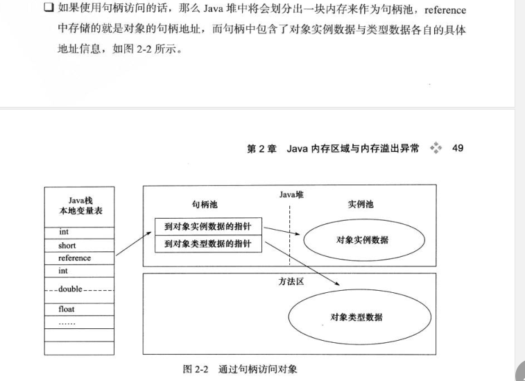
      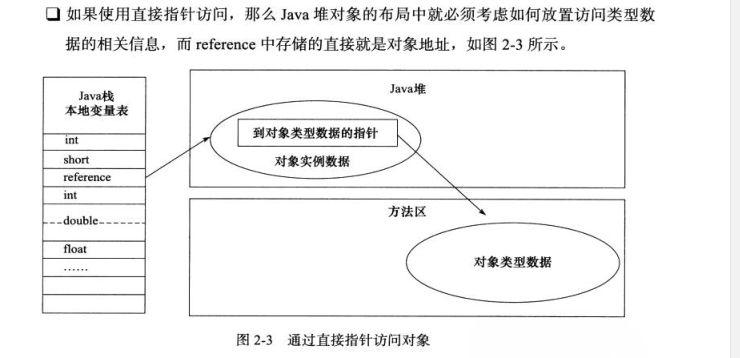
      

   10. OutofMemoryError异常

       堆溢出

       栈溢出

       方法区和运行时常量池溢出 string.intern()

       本机直接内存溢出

       java.lang.OutOfMemoryError: Java heap space ------>java堆内存溢出，此种情况最常见，一般由于内存泄露或者堆的大小设置不当引起。对于内存泄露，需要通过内存监控软件查找程序中的泄露代码，而堆大小可以通过虚拟机参数-Xms,-Xmx等修改。
       java.lang.OutOfMemoryError: PermGen space ------>java永久代溢出，即方法区溢出了，一般出现于大量Class或者jsp页面，或者采用cglib等反射机制的情况，因为上述情况会产生大量的Class信息存储于方法区。此种情况可以通过更改方法区的大小来解决，使用类似-XX:PermSize=64m -XX:MaxPermSize=256m的形式修改。另外，过多的常量尤其是字符串也会导致方法区溢出。
       java.lang.StackOverflowError ------> 不会抛OOM error，但也是比较常见的Java内存溢出。JAVA虚拟机栈溢出，一般是由于程序中存在死循环或者深度递归调用造成的，栈大小设置太小也会出现此种溢出。可以通过虚拟机参数-Xss来设置栈的大小。

       

       OOM分析--heapdump

       要dump堆的内存镜像，可以采用如下两种方式：

       设置JVM参数-XX:+HeapDumpOnOutOfMemoryError，设定当发生OOM时自动dump出堆信息。不过该方法需要JDK5以上版本。
       使用JDK自带的jmap命令。"jmap -dump:format=b,file=heap.bin <pid>"   其中pid可以通过jps获取。
       dump堆内存信息后，需要对dump出的文件进行分析，从而找到OOM的原因。常用的工具有：

       mat: eclipse memory analyzer, 基于eclipse RCP的内存分析工具。详细信息参见：http://www.eclipse.org/mat/，推荐使用。   
       jhat：JDK自带的java heap analyze tool，可以将堆中的对象以html的形式显示出来，包括对象的数量，大小等等，并支持对象查询语言OQL，分析相关的应用后，可以通过http://localhost:7000来访问分析结果。不推荐使用，因为在实际的排查过程中，一般是先在生产环境 dump出文件来，然后拉到自己的开发机器上分析，所以，不如采用高级的分析工具比如前面的mat来的高效。

       


### 谈谈对Java的理解


### 平台无关性如何实现

Compile Once，Run Anywhere


### JVM如何加载.class文件


Class Loader ： 依据特定格式，加载class文件到内存

Execution Engine: 对命令进行解析

Native Interface：融合不同开发语言的原生库为Java所用

Runtime Data Area：JVM内存空间结构模型


一：前言

Java语言的类型可以分为两大类：基本类型和引用类型。

基本类型 包括byte，short，int，long，float，double，boolean，char。

引用类型 包括类，接口，数组类和泛型参数。由于泛型参数会在编译过程中被擦除，因此Java虚拟机实际上只有前三种。在类，接口和数组类中，数组类是由Java虚拟机直接生成的，其它两种则有对应的字节流。


二：加载


1.加载，就是查找字节流，并且据此生成一个代表这个类的java.lang.Class对象的过程。注意这里字节流不一定非得要从一个Class文件获取，这里既可以从ZIP包中读取（比如从jar包和war包中读取），也可以在运行时计算生成（动态代理），也可以由其它文件生成（比如将JSP文件转换成对应的Class类）。加载的信息存储在JVM的方法区。

2.对于数组类来说，它并没有对应的字节流，而是由Java虚拟机直接生成的。对于其它的类来说，Java虚拟机则需要借助类加载器来完成查找字节流的过程。

3.类加载器有两种，一种是启动类加载器，其它的类加载器都是java.lang.ClassLoader的子类。启动类加载器是由C++实现的，没有对应的Java对象，因此在Java中只能用null代替。除了启动类加载器之外，另外两个重要的类加载器是扩展类加载器和应用类加载器，均由Java核心类库提供。 启动类加载器加载最为基础，最为重要的类，如JRE的lib目录下jar包中的类；扩展类加载器的父类是启动类加载器，它负责加载相对次要，但又通用的类，如JRE的lib/ext目录下jar包中的类；应用类加载器的父类加载器则是扩展类加载器，它负责加载应用程序路径下的类。

4.JVM通过双亲委派模型进行类的加载，当然我们也可以通过继承java.lang.ClassLoader实现自定义的类加载器。当一个类加载器收到类加载任务，会先交给其父类加载器去完成，因此最终加载任务都会传递到顶层的启动类加载器，只有当父类加载器无法完成加载任务时，才会尝试执行加载任务。

采用双亲委派的一个好处是比如加载位于rt.jar包中的类java.lang.Object，不管是哪个加载器加载这个类，最终都是委托给顶层的启动类加载器进行加载，这样就保证了使用不同的类加载器最终得到的都是同样一个Object对象。

三：链接

链接，是指将创建成的类合并至Java虚拟机中，使之能够执行的过程。它分为验证，准备和解析三个阶段。

 1.验证

该阶段的目的在于确保被加载类能够满足Java虚拟机的约束条件。

2.准备

该阶段的目的是为被加载类的静态字段分配内存，即在方法区中分配这些变量所使用的内存空间。Java代码中对静态字段的具体初始化，则会在稍后的初始化阶段中进行。

3.解析

在class文件被加载至Java虚拟机前，这个类无法知道其它类及其方法，字段所对应的具体地址。甚至不知道自己方法，字段的地址。因此，每当需要引用这些成员时，Java编译器会生成一个符号引用。在运行阶段，这个符号引用一般能够无歧义地定位到具体目标上。解析阶段的目的，正是将这些符号引用解析为实际引用。如果符号引用指向一个未被加载的类，或者未被加载类的字段或方法，那么解析将触发这个类的加载。

四：初始化

 1.初始化阶段是类加载最后一个阶段，前面的类加载阶段之后，除了在加载阶段可以自定义类加载器以外，其它操作都由JVM主导。到了初始阶段，才开始真正执行类中定义的Java程序代码。

2.在 Java 代码中，如果要初始化一个静态字段，我们可以在声明时直接赋值，也可以在静态代码块中对其赋值。

如果直接赋值的静态字段被 final 所修饰，并且它的类型是基本类型或字符串时，那么该字段便会被 Java 编译器标记成常量值（ConstantValue），其初始化直接由 Java 虚拟机完成。除此之外的直接赋值操作，以及所有静态代码块中的代码，则会被 Java 编译器置于同一方法中，并把它命名为 < clinit >。

类加载的最后一步是初始化，便是为标记为常量值的字段赋值，以及执行 < clinit > 方法的过程。Java 虚拟机会通过加锁来确保类的 < clinit > 方法仅被执行一次。

只有当初始化完成之后，类才正式成为可执行的状态。

3.JVM 规范枚举类的初始化被触发的情况：

a.当虚拟机启动时，初始化用户指定的主类；

b.当遇到用以新建目标类实例的 new 指令时，初始化 new 指令的目标类；

c.当遇到调用静态方法的指令时，初始化该静态方法所在的类；

d.当遇到访问静态字段的指令时，初始化该静态字段所在的类；

e.子类的初始化会触发父类的初始化；

f.如果一个接口定义了 default 方法，那么直接实现或者间接实现该接口的类的初始化，会触发该接口的初始化；

j.使用反射 API 对某个类进行反射调用时，初始化这个类；

h.当初次调用 MethodHandle 实例时，初始化该 MethodHandle 指向的方法所在的类。

五：总结


虚拟机把描述类的数据从 Class 文件加载到内存，并对数据进行校验、转换解析和初始化，最终形成可以被虚拟机直接使用的 Java 类型，这就是虚拟机的类加载机制。

在Java语言里面，类型的加载、连接和初始化过程都是在程序运行期间完成的

### 类加载的过程

类的个生命周期如下图：


为支持运行时绑定，解析过程在某些情况下可在初始化之后再开始，除解析过程外的其他加载过程必须按照如图顺序开始。

##### 加载

1. 通过全限定类名来获取定义此类的二进制字节流。
2. 将这个字节流所代表的静态存储结构转化为方法区的运行时数据结构。
3. 在内存中生成一个代表这个类的 java.lang.Class 对象，作为方法区这个类的各种数据的访问入口。

##### 验证

验证是连接阶段的第一步，这一阶段的目的是为了确保 Class 文件的字节流中包含的信息符合当前虚拟机的要求，并且不会危害虚拟机自身的安全。

1. 文件格式验证：如是否以魔数 0xCAFEBABE 开头、主、次版本号是否在当前虚拟机处理范围之内、常量合理性验证等。
   此阶段保证输入的字节流能正确地解析并存储于方法区之内，格式上符合描述一个 Java类型信息的要求。
2. 元数据验证：是否存在父类，父类的继承链是否正确，抽象类是否实现了其父类或接口之中要求实现的所有方法，字段、方法是否与父类产生矛盾等。
   第二阶段，保证不存在不符合 Java 语言规范的元数据信息。
3. 字节码验证：通过数据流和控制流分析，确定程序语义是合法的、符合逻辑的。例如保证跳转指令不会跳转到方法体以外的字节码指令上。
4. 符号引用验证：在解析阶段中发生，保证可以将符号引用转化为直接引用。

可以考虑使用 `-Xverify:none` 参数来关闭大部分的类验证措施，以缩短虚拟机类加载的时间。

##### 准备

为**类变量**分配内存并设置类变量初始值，这些变量所使用的内存都将在方法区中进行分配。

##### 解析

虚拟机将常量池内的符号引用替换为直接引用的过程。
解析动作主要针对类或接口、字段、类方法、接口方法、方法类型、方法句柄和调用点限定符 7 类符号引用进行。

##### 初始化

到初始化阶段，才真正开始执行类中定义的 Java 程序代码，此阶段是执行 `()` 方法的过程。

`()` 方法是由编译器按语句在源文件中出现的顺序，依次自动收集类中的所有**类变量**的赋值动作和静态代码块中的语句合并产生的。（不包括构造器中的语句。构造器是初始化对象的，类加载完成后，创建对象时候将调用的 `()` 方法来初始化对象）

静态语句块中只能访问到定义在静态语句块之前的变量，定义在它之后的变量，在前面的静态语句块可以赋值，但是不能访问，如下程序：

```java
Copypublic class Test {
    static {
        // 给变量赋值可以正常编译通过
        i = 0;
        // 这句编译器会提示"非法向前引用"
        System.out.println(i);
    }

    static int i = 1;
}
```

`()` 不需要显式调用父类（接口除外，接口不需要调用父接口的初始化方法，只有使用到父接口中的静态变量时才需要调用）的初始化方法 `()`，虚拟机会保证在子类的 `()` 方法执行之前，父类的 `()` 方法已经执行完毕，也就意味着父类中定义的静态语句块要优先于子类的变量赋值操作。

`()` 方法对于类或接口来说并不是必需的，如果一个类中没有静态语句块，也没有对变量的赋值操作，那么编译器可以不为这个类生成 `()` 方法。

虚拟机会保证一个类的 `()` 方法在多线程环境中被正确地加锁、同步，如果多个线程同时去初始化一个类，那么只会有一个线程去执行这个类的 `()` 方法，其他线程都需要阻塞等待，直到活动线程执行 `()` 方法完毕。

### 类加载的时机

对于初始化阶段，虚拟机规范规定了有且只有 5 种情况必须立即对类进行“初始化”（而加载、验证、准备自然需要在此之前开始）：

1. 遇到new、getstatic 和 putstatic 或 invokestatic 这4条字节码指令时，如果类没有进行过初始化，则需要先触发其初始化。对应场景是：使用 new 实例化对象、读取或设置一个类的静态字段（被 final 修饰、已在编译期把结果放入常量池的静态字段除外）、以及调用一个类的静态方法。
2. 对类进行反射调用的时候，如果类没有进行过初始化，则需要先触发其初始化。
3. 当初始化类的父类还没有进行过初始化，则需要先触发其父类的初始化。（而一个接口在初始化时，并不要求其父接口全部都完成了初始化）
4. 虚拟机启动时，用户需要指定一个要执行的主类（包含 main() 方法的那个类），
   虚拟机会先初始化这个主类。

> 1. 当使用 JDK 1.7 的动态语言支持时，如果一个 java.lang.invoke.MethodHandle 实例最后的解析结果 REF_getStatic、REF_putStatic、REF_invokeStatic 的方法句柄，并且这个方法句柄所对应的类没有进行过初始化，则需要先触发其初始化。

第5种情况，我暂时看不懂。

以上这 5 种场景中的行为称为对一个类进行主动引用。除此之外，所有引用类的方式都不会触发初始化，称为被动引用，例如：

1. 通过子类引用父类的静态字段，不会导致子类初始化。
2. 通过数组定义来引用类，不会触发此类的初始化。`MyClass[] cs = new MyClass[10];`
3. 常量在编译阶段会存入调用类的常量池中，本质上并没有直接引用到定义常量的类，因此不会触发定义常量的类的初始化。


### 什么是反射


**写一个反射的例子**


在项目中我用过，机器学习给出了要用的特征，然后将属性名和对应的值存下来

### 谈谈ClassLoader


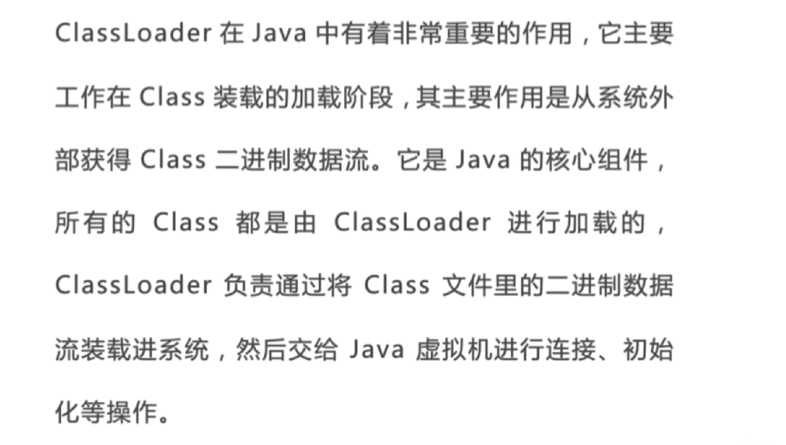


**自定义ClassLoader的实现**


````java
MyClassLoader.java

public class MyClassLoader extends ClassLoader{
    private String path;
    private String classLoaderName;
    
    public MycalssLoader(String path, String classLoaderName){
        this.path = path;
        this.classLoaderName = classLoaderName;
    }
    //用于寻找类文件
    @Override
    public Class findClass(String name){
        byte[] b = loadClassDate(name);
        return defineClass(name, b, 0, b.length);
    }
    
    //用于加载类文件
    private byte[] loadClassDate(String name){
        name = path + name +".class";
        InputStream in = null;
        ByteArrayOutputStream out = null;
        try{
            in = new FileInputStream(new File(name));
            out = new ByteArrayOutputStream();
            int i = 0;
            while((i = in.read()) != -1){
                out.write(i);
            }
        } catch(Exception e){
            e.printStackTrace();
        }finally{
            try{
                out.close();
                in.close();
            } catch(Exception e){
                e.printStackTrace();
            }
        }
        return out.toByteArray();
    }
}

ClassLoaderChecker.java

public class ClassLoaderChecker{
    public static void main(String[] args){
        MyClassLoader m = new MyClassLoader("xxxx","xxxx")
    }
    Class c = m.loadClass("Wali");
    System.out.println(c.getClassLoader());
    c.newInstance();
}

````

### ClassLoader的双亲委派机制


为什么JDBC需要破坏双亲委派模式，原因是原生的JDBC中Driver驱动本身只是一个接口，并没有具体的实现，具体的实现是由不同数据库类型去实现的。例如，MySQL的mysql-connector-*.jar中的Driver类具体实现的。 原生的JDBC中的类是放在rt.jar包的，是由启动类加载器进行类加载的，在JDBC中的Driver类中需要动态去加载不同数据库类型的Driver类，而mysql-connector-*.jar中的Driver类是用户自己写的代码，那启动类加载器肯定是不能进行加载的，既然是自己编写的代码，那就需要由应用程序启动类去进行类加载。于是乎，这个时候就引入线程上下文件类加载器(Thread Context ClassLoader)。有了这个东西之后，程序就可以把原本需要由启动类加载器进行加载的类，由应用程序类加载器去进行加载了。下面看看JDBC中是怎么去应用的呢

//callerCL为空的时候，其实说明这个ClassLoader是启动类加载器，但是这个启动类加载并不能识别rt.jar之外的类，这个时候就把callerCL赋值为Thread.currentThread().getContextClassLoader();也就是应用程序启动类


```java
private static Connection getConnection(
        String url, java.util.Properties info, Class<?> caller) throws SQLException {
        /*
         * When callerCl is null, we should check the application's
         * (which is invoking this class indirectly)
         * classloader, so that the JDBC driver class outside rt.jar
         * can be loaded from here.
         */
        //callerCL为空的时候，其实说明这个ClassLoader是启动类加载器，但是这个启动类加载并不能识别rt.jar之外的类，这个时候就把callerCL赋值为Thread.currentThread().getContextClassLoader();也就是应用程序启动类
        ClassLoader callerCL = caller != null ? caller.getClassLoader() : null;
        synchronized(DriverManager.class) {
            // synchronize loading of the correct classloader.
            if (callerCL == null) {
                callerCL = Thread.currentThread().getContextClassLoader();
            }
        }

        if(url == null) {
            throw new SQLException("The url cannot be null", "08001");
        }

        println("DriverManager.getConnection(\"" + url + "\")");

        // Walk through the loaded registeredDrivers attempting to make a connection.
        // Remember the first exception that gets raised so we can reraise it.
        SQLException reason = null;

        for(DriverInfo aDriver : registeredDrivers) {
            // If the caller does not have permission to load the driver then
            // skip it.
            //继续看这里 
            if(isDriverAllowed(aDriver.driver, callerCL)) {
                try {
                    println("    trying " + aDriver.driver.getClass().getName());
                    Connection con = aDriver.driver.connect(url, info);
                    if (con != null) {
                        // Success!
                        println("getConnection returning " + aDriver.driver.getClass().getName());
                        return (con);
                    }
                } catch (SQLException ex) {
                    if (reason == null) {
                        reason = ex;
                    }
                }

            } else {
                println("    skipping: " + aDriver.getClass().getName());
            }

        }

        // if we got here nobody could connect.
        if (reason != null)    {
            println("getConnection failed: " + reason);
            throw reason;
        }

        println("getConnection: no suitable driver found for "+ url);
        throw new SQLException("No suitable driver found for "+ url, "08001");
    }

    private static boolean isDriverAllowed(Driver driver, ClassLoader classLoader) {
        boolean result = false;
        if(driver != null) {
            Class<?> aClass = null;
            try {
                //这一步会对类进行初始化的动作，而初始化之前自然也要进行的类的加载工作
                aClass =  Class.forName(driver.getClass().getName(), true, classLoader);
            } catch (Exception ex) {
                result = false;
            }

             result = ( aClass == driver.getClass() ) ? true : false;
        }

        return result;
    }
```

### loadClass和forName的区别


Spring 中大量使用懒加载

故而使用ClassLoader.loadClass

### JAVA内存模型的线程独占部分


#### 递归为什么会引发java.lang.StackOverflowError异常

1.每次调用自身都会生成一个栈帧，放到顶部

2.保存当前栈帧状态放到虚拟机栈中，

3.切换时会

**递归过深，栈帧数超过虚拟栈深度**


例如forname0


### JAVA内存模型的线程共享部分


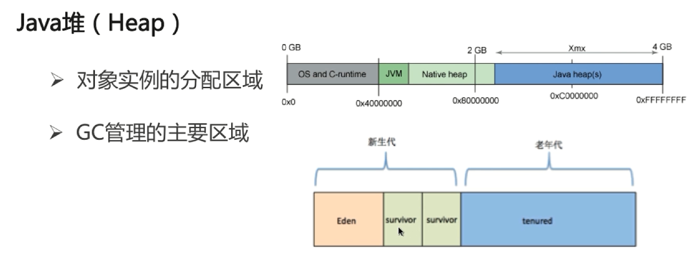

### JVM三大性能调优参数含义


### 不同JDK版本的intern（）方法


常量池挤爆了


### Java垃圾回收机制


现在的虚拟机垃圾收集大多采用这种方式，它根据对象的生存周期，将堆分为新生代(Young)和老年代(Tenure)。在新生代中，由于对象生存期短，每次回收都会有大量对象死去，那么这时就采用复制算法。老年代里的对象存活率较高，没有额外的空间进行分配担保，所以可以使用标记-整理 或者 标记-清除。

 具体过程：新生代(Young)分为Eden区，From区与To区


当系统创建一个对象的时候，总是在Eden区操作，当这个区满了，那么就会触发一次YoungGC，也就是年轻代的垃圾回收。一般来说这时候不是所有的对象都没用了，所以就会把还能用的对象复制到From区。 

 

这样整个Eden区就被清理干净了，可以继续创建新的对象，当Eden区再次被用完，就再触发一次YoungGC，然后呢，注意，这个时候跟刚才稍稍有点区别。这次触发YoungGC后，会将Eden区与From区还在被使用的对象复制到To区， 


再下一次YoungGC的时候，则是将Eden区与To区中的还在被使用的对象复制到From区。


经过若干次YoungGC后，有些对象在From与To之间来回游荡，这时候From区与To区亮出了底线（阈值），这些家伙要是到现在还没挂掉，对不起，一起滚到（复制）老年代吧。 


老年代经过这么几次折腾，也就扛不住了（空间被用完），好，那就来次集体大扫除（Full GC），也就是全量回收。如果Full GC使用太频繁的话，无疑会对系统性能产生很大的影响。所以要合理设置年轻代与老年代的大小，尽量减少Full GC的操作。


### 新生代垃圾收集器


### 老年代垃圾收集器


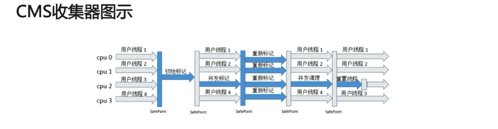


串行、并行与并发
下面2个名词都是并发编程中的概念，在谈论垃圾收集器的上下文语境中，它们可以解释如下：

串行：单个线程执行垃圾回收，并且此时用户线程仍然处于等待状态。
并行：指多条垃圾收集线程并行工作，但此时用户线程仍然处于等待状态。
并发：指用户线程与垃圾收集线程同时执行（但不一定是并行的，可能会交替执行），用户程序在继续运行，而垃圾收集程序运行于另一个CPU上。
新生代回收器：SerialGC ParNewGc ParallelScavengeGC
名称	 串行/并行/并发	回收算法	适用场景	可以与cms配合
SerialGC	串行	复制	单cpu	是
ParNewGC	并行	复制	多cpu	是
ParallelScavengeGC	并行	复制	多cpu且关注吞吐量	否

Serial(串行GC)收集器
        Serial收集器是一个新生代收集器，单线程执行，使用复制算法。它在进行垃圾收集时，必须暂停其他所有的工作线程(用户线程)。是Jvm client模式下默认的新生代收集器。对于限定单个CPU的环境来说，Serial收集器由于没有线程交互的开销，专心做垃圾收集自然可以获得最高的单线程收集效率，适用于单cpu机器的场景。在用户的桌面应用场景中，即Client模式下的虚拟机来说是一个很好的选择。
ParNew(并行GC)收集器
        ParNew收集器其实就是serial收集器的多线程版本，除了使用多条线程进行垃圾收集之外，其余行为与Serial收集器一样。它是许多运行在Server模式下的虚拟机中首选的新生代收集器，其中有一个与性能无关但很重要的原因是，除了Serial收集器外，目前只有它能与CMS收集器配合工作。ParNew在单CPU环境下绝对不会有比Serial收集器更好的效果，甚至由于存在线程交互的开销，该收集器在通过超线程技术实现的两个CPU的环境中都不能百分百保证可以超越Serial收集器。当然，随着可以使用的CPU的数量的增加，它对GC时系统资源的有效利用还是很有好处的。
Parallel Scavenge(并行回收GC)收集器
        Parallel Scavenge收集器也是一个新生代收集器，它也是使用复制算法的收集器，又是并行多线程收集器。parallel Scavenge收集器的特点是它的关注点与其他收集器不同，CMS等收集器的关注点是尽可能地缩短垃圾收集时用户线程的停顿时间，而parallel Scavenge收集器的目标则是达到一个可控制的吞吐量。吞吐量= 程序运行时间/(程序运行时间 + 垃圾收集时间)，虚拟机总共运行了100分钟。其中垃圾收集花掉1分钟，那吞吐量就是99%。由于于吞吐量关系密切，Parallel Scavenge收集器也经常被称为“吞吐量优先”收集器。Parallel Scavenge收集器有一个参数-XX:UseAdaptiveSizePolicy，当这个参数打开，虚拟机会根据当前系统的运行状况收集性能监控信息，动态调整一些如新生代大小、Eden与Survivor区的比例等等细节参数。这种自适应调节策略也是Parallel Scavenge收集器与ParNew收集器的一个重要区别。

三种老生代回收器
名称	 串行/并行/并发	回收算法	适用场景
SerialOldGC	串行	标记整理	单cpu
ParNewOldGC	并行	标记整理	多cpu
CMS	并发，几乎不会暂停用户线程	标记清除	多cpu且与用户线程共存
Seral Old(串行GC)收集器

         Serial Old是Serial收集器的老年代版本，它同样使用一个单线程执行收集，使用“标记-整理”算法。主要使用在Client模式下的虚拟机。如果在Server模式下，那么它还有两大用途：一种用途是在JDK1.5以及之前的版本中与Parallel Scavenge收集器搭配使用，另一种用途是作为CMS收集器的后备预案，在并并发手机发生Concurrent Mode Failure时使用。
Parallel Old(并行GC)收集器
        Parallel Old是Parallel Scavenge收集器的老年代版本，使用多线程和“标记-整理”算法。在注重吞吐量以及CPU资源敏感的场合，都可以优先考虑Parallel Scavenge收集器加Parallel Old收集器。
CMS(并发GC)收集器
        CMS(Concurrent Mark Sweep)收集器是一种以获取最短回收停顿时间为目标的收集器，适用于集中在互联网站或者B/S系统的服务端的Java应用。CMS收集器是基于“标记-清除”算法实现的，整个收集过程大致分为4个步骤：
①.初始标记(CMS initial mark)
②.并发标记(CMS concurrenr mark)
③.重新标记(CMS remark)
④.并发清除(CMS concurrent sweep)
     其中初始标记、重新标记这两个步骤任然需要停顿其他用户线程。初始标记仅仅只是标记出GC ROOTS能直接关联到的对象，速度很快，并发标记阶段是进行GC ROOTS 根搜索算法阶段，会判定对象是否存活。而重新标记阶段则是为了修正并发标记期间，因用户程序继续运行而导致标记产生变动的那一部分对象的标记记录，这个阶段的停顿时间会被初始标记阶段稍长，但比并发标记阶段要短。
     由于整个过程中耗时最长的并发标记和并发清除过程中，收集器线程都可以与用户线程一起工作，所以整体来说，CMS收集器的内存回收过程是与用户线程一起并发执行的。
CMS收集器的优点：并发收集、低停顿，但是CMS还远远达不到完美，主要有三个显著缺点：cpu敏感，浮动垃圾，空间碎片
　　CMS收集器对CPU资源非常敏感。在并发阶段，虽然不会导致用户线程停顿，但是会占用CPU资源而导致引用程序变慢，总吞吐量下降。CMS默认启动的回收线程数是：(CPU数量+3) / 4。
　　CMS收集器无法处理浮动垃圾，可能出现“Concurrent Mode Failure“，失败后而导致另一次Full  GC的产生。由于CMS并发清理阶段用户线程还在运行，伴随程序的运行自热会有新的垃圾不断产生，这一部分垃圾出现在标记过程之后，CMS无法在本次收集中处理它们，只好留待下一次GC时将其清理掉。这一部分垃圾称为“浮动垃圾”。也是由于在垃圾收集阶段用户线程还需要运行，
即需要预留足够的内存空间给用户线程使用，因此CMS收集器不能像其他收集器那样等到老年代几乎完全被填满了再进行收集，需要预留一部分内存空间提供并发收集时的程序运作使用。在默认设置下，CMS收集器在老年代使用了68%的空间时就会被激活，也可以通过参数-XX:CMSInitiatingOccupancyFraction的值来提供触发百分比，以降低内存回收次数提高性能。要是CMS运行期间预留的内存无法满足程序其他线程需要，就会出现“Concurrent Mode Failure”失败，这时候虚拟机将启动后备预案：临时启用Serial Old收集器来重新进行老年代的垃圾收集，这样停顿时间就很长了。所以说参数-XX:CMSInitiatingOccupancyFraction设置的过高将会很容易导致“Concurrent Mode Failure”失败，性能反而降低。
　　最后一个缺点，CMS是基于“标记-清除”算法实现的收集器，使用“标记-清除”算法收集后，会产生大量碎片。空间碎片太多时，将会给对象分配带来很多麻烦，比如说大对象，内存空间找不到连续的空间来分配不得不提前触发一次Full  GC。为了解决这个问题，CMS收集器提供了一个-XX:UseCMSCompactAtFullCollection开关参数，用于在Full  GC之后增加一个碎片整理过程，还可通过-XX:CMSFullGCBeforeCompaction参数设置执行多少次不压缩的Full  GC之后，跟着来一次碎片整理过程。

G1收集器
        G1(Garbage First)收集器是JDK1.7提供的一个新收集器，是当今收集器技术发展的最前沿成果之一。G1是一款面向服务端应用的垃圾收集器。HotSpot开发团队赋予它的使命是（在比较长期的）未来可以替换掉JDK1.5中发布的CMS收集器。
与其他GC收集器相比，G1具备如下特点：
1、并行与并发：G1能充分利用多CPU、多核环境下的硬件优势，使用多个CPU（CPU或CPU核心）来缩短Stop-The-World停顿的时间，部分其他收集器原本需要停顿Java线程执行的GC动作，G1收集器仍然可以通过并发的方式让Java程序继续执行。
2、分代收集：与其他收集器一样，分代概念在G1中依然得以保留。虽然G1可以不需要其他收集器配合就能单独管理整个GC堆，但它能够采用不同的方式去处理新创建的对象和已经存活了一段时间、熬过多次GC的旧对象已获得更好的收集效果。
3、空间整合：与CMS的“标记-清除”算法不同，G1收集器从整体上看是基于“标记-整理”算法实现的，从局部（两个Region之间）上看是基于“复制”算法实现的，但无论如何，这两种算法都意味着G1运行期间不会产生内存空间碎片，收集后能提供规整的可用内存。这种特性有利于程序的长时间运行，分配大对象时不会因为无法找到连续内存空间而提前触发下一次GC。
4、可预测的停顿：这是G1相对于CMS的另一大优势，降低停顿时间是G1和CMS共同的关注点，但G1除了追求低停顿外，还能建立可预测的停顿时间模型，能让使用者明确指定在一个长度为M毫秒的时间片段内，消耗在垃圾收集上的时间不得超过N毫秒，这几乎已经是实时Java（RTSJ）的垃圾收集器的特征了。

G1 内部结构和机制
G1 同样存在着年代的概念，但是与我前面介绍的内存结构很不一样，其内部是类似棋盘状的一个个 region 组成，请参考下面的示意图。


region介绍
大小一致，数值是在 1M 到 32M 字节之间的一个 2 的幂值数，JVM 会尽量划分 2048 个左右、同等大小的 region。当然这个数字既可以手动调整，G1 也会根据堆大小自动进行调整。
在G1实现中，一部分region 是作为Eden，一部分作为Survivor，除了意料之中的 Old region，G1 会将超过 region 50% 大小的对象归类为 Humongous 对象，并放置在相应的 region 中。逻辑上，Humongous region 算是老年代的一部分，因为复制这样的大对象是很昂贵的操作，并不适合新生代 GC 的复制算法。

G1的缺点:
region 大小和大对象很难保证一致，这会导致空间的浪费；特别大的对象是可能占用超过一个 region 的。并且，region 太小不合适，会令你在分配大对象时更难找到连续空间，这是一个长久存在的情况。

GC 算法的角度，G1 选择的是复合算法，可以简化理解为：
在新生代，G1 采用的仍然是并行的复制算法，所以同样会发生 Stop-The-World的暂停。新生代的清理会带上old区已标记好的region。
在老年代，大部分情况下都是并发标记，而整理（Compact）则是和新生代GC时捎带进行，并且不是整体性的整理，而是增量进行的,也就是原本新生代的区域中对象在足够old时，该区域可以直接成为老生代。

Humongous 对象的分配和回收
Humongous region 作为老年代的一部分，通常认为它会在并发标记结束后才进行回收，但是在新版 G1 中，Humongous 对象回收采取了更加激进的策略。我们知道 G1 记录了老年代 region 间对象引用，Humongous 对象数量有限，所以能够快速的知道是否有老年代对象引用它。如果没有，能够阻止它被回收的唯一可能，就是新生代是否有对象引用了它，但这个信息是可以在 Young GC 时就知道的，所以完全可以在 Young GC 中就进行 Humongous 对象的回收，不用像其他老年代对象那样，等待并发标记结束。

JDK11增加了两种全新的 GC 方式
Epsilon GC，简单说就是个不做垃圾收集的 GC，似乎有点奇怪，有的情况下，例如在进行性能测试的时候，可能需要明确判断 GC 本身产生了多大的开销，这就是其典型应用场景。
ZGC，这是 Oracle 开源出来的一个超级 GC 实现，具备令人惊讶的扩展能力，比如支持 T bytes 级别的堆大小，并且保证绝大部分情况下，延迟都不会超过 10 ms。虽然目前还处于实验阶段，仅支持 Linux 64 位的平台，但其已经表现出的能力和潜力都非常令人期待。

两代回收器之间的配合关系
如下图：注意新生代的parNew和老年代的ParallelOld不可搭配使用。


声明100M大小的byte数组，jvm剩余空间大于100M，报了OOM，什么原因？
数组需要连续空间100M
1 尝试放到新生代，新生代GC，发现放不下；超大对象不再走一般的存活次数记录与升级策略
2 尝试放老生代，老生代Gc，可能是serial或G1,可能清理后老生代连续空间小于100M，当然新生代也还有空间；
也可能老生代GC策略是CMS，存在浮动垃圾且空间不连续，所以放不下；

Eden区域的继续划分
Thread Local Allocation Buffer TLAB
jvm为每个线程分配的私有缓存区域，否则，多线程同时分配内存是，为避免操作同一地址，可能需要加锁等级制，进而影响共享速度。
如下图所示，start和end就是起止地址，top表示已经分配到哪里了。分配新对象，top移动。top和end相遇，表示缓存已满，会再分配。


### GC相关面试题


### JAVA中的强引用，软引用，弱引用，虚引用


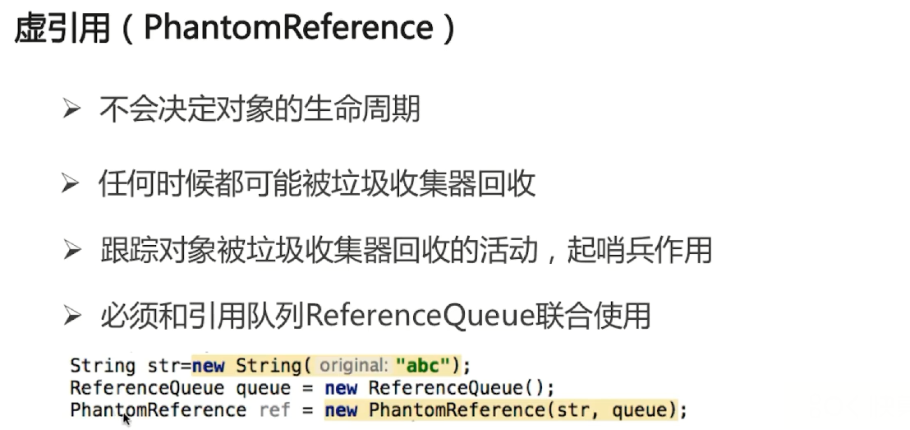


### ReferenceQueue的作用


## 4. JAVA多线程与并发

### 进程和线程的区别

#### 1、Linux用户态和内核态的转化https://www.cnblogs.com/cyyz-le/p/10962818.html

一、 **Unix/Linux的体系架构**


　　如上图所示，从宏观上来看，Linux操作系统的体系架构分为用户态和内核态（或者用户空间和内核）。内核从本质上看是一种软件——控制计算机的硬件资源，并提供上层应用程序运行的环境。用户态即上层应用程序的活动空间，应用程序的执行必须依托于内核提供的资源，包括CPU资源、存储资源、I/O资源等。为了使上层应用能够访问到这些资源，内核必须为上层应用提供访问的接口：即系统调用。

　　系统调用是操作系统的最小功能单位，这些系统调用根据不同的应用场景可以进行扩展和裁剪，现在各种版本的Unix实现都提供了不同数量的系统调用，如Linux的不同版本提供了240-260个系统调用，FreeBSD大约提供了320个（reference：UNIX环境高级编程）。我们可以把系统调用看成是一种不能再化简的操作（类似于原子操作，但是不同概念），有人把它比作一个汉字的一个“笔画”，而一个“汉字”就代表一个上层应用，我觉得这个比喻非常贴切。因此，有时候如果要实现一个完整的汉字（给某个变量分配内存空间），就必须调用很多的系统调用。如果从实现者（程序员）的角度来看，这势必会加重程序员的负担，良好的程序设计方法是：重视上层的业务逻辑操作，而尽可能避免底层复杂的实现细节。库函数正是为了将程序员从复杂的细节中解脱出来而提出的一种有效方法。它实现对系统调用的封装，将简单的业务逻辑接口呈现给用户，方便用户调用，从这个角度上看，库函数就像是组成汉字的“偏旁”。这样的一种组成方式极大增强了程序设计的灵活性，对于简单的操作，我们可以直接调用系统调用来访问资源，如“人”，对于复杂操作，我们借助于库函数来实现，如“仁”。显然，这样的库函数依据不同的标准也可以有不同的实现版本，如ISO C 标准库，POSIX标准库等。

　　Shell是一个特殊的应用程序，俗称命令行，本质上是一个命令解释器，它下通系统调用，上通各种应用，通常充当着一种“胶水”的角色，来连接各个小功能程序，让不同程序能够以一个清晰的接口协同工作，从而增强各个程序的功能。同时，Shell是可编程的，它可以执行符合Shell语法的文本，这样的文本称为Shell脚本，通常短短的几行Shell脚本就可以实现一个非常大的功能，原因就是这些Shell语句通常都对系统调用做了一层封装。为了方便用户和系统交互，一般，一个Shell对应一个终端，终端是一个硬件设备，呈现给用户的是一个图形化窗口。我们可以通过这个窗口输入或者输出文本。这个文本直接传递给shell进行分析解释，然后执行。

 

总结一下，用户态的应用程序可以通过三种方式来访问内核态的资源：

1）系统调用

2）库函数

3）Shell脚本

　　下图是对上图的一个细分结构，从这个图上可以更进一步对内核所做的事有一个“全景式”的印象。主要表现为：向下控制硬件资源，向内管理操作系统资源：包括进程的调度和管理、内存的管理、文件系统的管理、设备驱动程序的管理以及网络资源的管理，向上则向应用程序提供系统调用的接口。从整体上来看，整个操作系统分为两层：用户态和内核态，这种分层的架构极大地提高了资源管理的可扩展性和灵活性，而且方便用户对资源的调用和集中式的管理，带来一定的安全性。


**二、用户态和内核态的切换**

　　因为操作系统的资源是有限的，如果访问资源的操作过多，必然会消耗过多的资源，而且如果不对这些操作加以区分，很可能造成资源访问的冲突。所以，为了减少有限资源的访问和使用冲突，Unix/Linux的设计哲学之一就是：对不同的操作赋予不同的执行等级，就是所谓特权的概念。简单说就是有多大能力做多大的事，与系统相关的一些特别关键的操作必须由最高特权的程序来完成。Intel的X86架构的CPU提供了0到3四个特权级，数字越小，特权越高，Linux操作系统中主要采用了0和3两个特权级，分别对应的就是内核态和用户态。运行于用户态的进程可以执行的操作和访问的资源都会受到极大的限制，而运行在内核态的进程则可以执行任何操作并且在资源的使用上没有限制。很多程序开始时运行于用户态，但在执行的过程中，一些操作需要在内核权限下才能执行，这就涉及到一个从用户态切换到内核态的过程。比如C函数库中的内存分配函数malloc()，它具体是使用sbrk()系统调用来分配内存，当malloc调用sbrk()的时候就涉及一次从用户态到内核态的切换，类似的函数还有printf()，调用的是wirte()系统调用来输出字符串，等等。


　　到底在什么情况下会发生从用户态到内核态的切换，一般存在以下三种情况：

1）当然就是系统调用：原因如上的分析。

2）异常事件： 当CPU正在执行运行在用户态的程序时，突然发生某些预先不可知的异常事件，这个时候就会触发从当前用户态执行的进程转向内核态执行相关的异常事件，典型的如缺页异常。

3）外围设备的中断：当外围设备完成用户的请求操作后，会像CPU发出中断信号，此时，CPU就会暂停执行下一条即将要执行的指令，转而去执行中断信号对应的处理程序，如果先前执行的指令是在用户态下，则自然就发生从用户态到内核态的转换。

　　注意：系统调用的本质其实也是中断，相对于外围设备的硬中断，这种中断称为软中断，这是操作系统为用户特别开放的一种中断，如Linux int 80h中断。所以，从触发方式和效果上来看，这三种切换方式是完全一样的，都相当于是执行了一个中断响应的过程。但是从触发的对象来看，系统调用是进程主动请求切换的，而异常和硬中断则是被动的。

**三、总结**

　　本文仅是从宏观的角度去理解Linux用户态和内核态的设计，并没有去深究它们的具体实现方式。从实现上来看，必须要考虑到的一点我想就是性能问题，因为用户态和内核态之间的切换也会消耗大量资源。关于实现的细节，目前学艺不精不敢乱说，等日后补上。但知道了这一点，我相信对很多问题也就很容易理解了，比如说基于缓冲区的IO和无缓冲的IO，用户进程和内核进程之间的切换，IO复用中的读写内核事件表，等等，这些知识之后会一一补上。

#### 常见的系统调用

按照惯例，这个列表以man pages第2节，即系统调用节为蓝本。按照笔者的理解，对其作了大致的分类，同时也作了一些小小的修改，删去了几个仅供内核使用，不允许用户调用的系统调用，对个别本人稍觉不妥的地方作了一些小的修改，并对所有列出的系统调用附上简要注释。

其中有一些函数的作用完全相同，只是参数不同。（Linux核心是用C语言写的，C不支持重载，所以只能取成不同的函数名）。还有一些函数已经过时，被新的更好的函数所代替了（gcc在链接这些函数时会发出警告），但因为兼容的原因还保留着，这些函数我会在前面标上“*”号以示区别。

一、进程控制 

| fork                   | 创建一个新进程                                       |
| ---------------------- | ---------------------------------------------------- |
| clone                  | 按指定条件创建子进程                                 |
| execve                 | 运行可执行文件                                       |
| exit                   | 中止进程                                             |
| _exit                  | 立即中止当前进程                                     |
| getdtablesize          | 进程所能打开的最大文件数                             |
| getpgid                | 获取指定进程组标识号                                 |
| setpgid                | 设置指定进程组标志号                                 |
| getpgrp                | 获取当前进程组标识号                                 |
| setpgrp                | 设置当前进程组标志号                                 |
| getpid                 | 获取进程标识号                                       |
| getppid                | 获取父进程标识号                                     |
| getpriority            | 获取调度优先级                                       |
| setpriority            | 设置调度优先级                                       |
| modify_ldt             | 读写进程的本地描述表                                 |
| nanosleep              | 使进程睡眠指定的时间                                 |
| nice                   | 改变分时进程的优先级                                 |
| pause                  | 挂起进程，等待信号                                   |
| personality            | 设置进程运行域                                       |
| prctl                  | 对进程进行特定操作                                   |
| ptrace                 | 进程跟踪                                             |
| sched_get_priority_max | 取得静态优先级的上限                                 |
| sched_get_priority_min | 取得静态优先级的下限                                 |
| sched_getparam         | 取得进程的调度参数                                   |
| sched_getscheduler     | 取得指定进程的调度策略                               |
| sched_rr_get_interval  | 取得按RR算法调度的实时进程的时间片长度               |
| sched_setparam         | 设置进程的调度参数                                   |
| sched_setscheduler     | 设置指定进程的调度策略和参数                         |
| sched_yield            | 进程主动让出处理器,并将自己等候调度队列队尾          |
| vfork                  | 创建一个子进程，以供执行新程序，常与execve等同时使用 |
| wait                   | 等待子进程终止                                       |
| wait3                  | 参见wait                                             |
| waitpid                | 等待指定子进程终止                                   |
| wait4                  | 参见waitpid                                          |
| capget                 | 获取进程权限                                         |
| capset                 | 设置进程权限                                         |
| getsid                 | 获取会晤标识号                                       |
| setsid                 | 设置会晤标识号                                       |

 

二、文件系统控制

##### 1、文件读写操作

| fcntl     | 文件控制                     |
| --------- | ---------------------------- |
| open      | 打开文件                     |
| creat     | 创建新文件                   |
| close     | 关闭文件描述字               |
| read      | 读文件                       |
| write     | 写文件                       |
| readv     | 从文件读入数据到缓冲数组中   |
| writev    | 将缓冲数组里的数据写入文件   |
| pread     | 对文件随机读                 |
| pwrite    | 对文件随机写                 |
| lseek     | 移动文件指针                 |
| _llseek   | 在64位地址空间里移动文件指针 |
| dup       | 复制已打开的文件描述字       |
| dup2      | 按指定条件复制文件描述字     |
| flock     | 文件加/解锁                  |
| poll      | I/O多路转换                  |
| truncate  | 截断文件                     |
| ftruncate | 参见truncate                 |
| umask     | 设置文件权限掩码             |
| fsync     | 把文件在内存中的部分写回磁盘 |


##### 2、文件系统操作

|  access  | 确定文件的可存取性     |
| :------: | :--------------------- |
|  chdir   | 改变当前工作目录       |
|  fchdir  | 参见chdir              |
|  chmod   | 改变文件方式           |
|  fchmod  | 参见chmod              |
|  chown   | 改变文件的属主或用户组 |
|  fchown  | 参见chown              |
|  lchown  | 参见chown              |
|  chroot  | 改变根目录             |
|   stat   | 取文件状态信息         |
|  lstat   | 参见stat               |
|  fstat   | 参见stat               |
|  statfs  | 取文件系统信息         |
| fstatfs  | 参见statfs             |
| readdir  | 读取目录项             |
| getdents | 读取目录项             |
|  mkdir   | 创建目录               |
|  mknod   | 创建索引节点           |
|  rmdir   | 删除目录               |
|  rename  | 文件改名               |
|   link   | 创建链接               |
| symlink  | 创建符号链接           |
|  unlink  | 删除链接               |
| readlink | 读符号链接的值         |
|  mount   | 安装文件系统           |
|  umount  | 卸下文件系统           |
|  ustat   | 取文件系统信息         |
|  utime   | 改变文件的访问修改时间 |
|  utimes  | 参见utime              |
| quotactl | 控制磁盘配额           |


三、系统控制

| ioctl            | I/O总控制函数                            |
| ---------------- | ---------------------------------------- |
| _sysctl          | 读/写系统参数                            |
| acct             | 启用或禁止进程记账                       |
| getrlimit        | 获取系统资源上限                         |
| setrlimit        | 设置系统资源上限                         |
| getrusage        | 获取系统资源使用情况                     |
| uselib           | 选择要使用的二进制函数库                 |
| ioperm           | 设置端口I/O权限                          |
| iopl             | 改变进程I/O权限级别                      |
| outb             | 低级端口操作                             |
| reboot           | 重新启动                                 |
| swapon           | 打开交换文件和设备                       |
| swapoff          | 关闭交换文件和设备                       |
| bdflush          | 控制bdflush守护进程                      |
| sysfs            | 取核心支持的文件系统类型                 |
| sysinfo          | 取得系统信息                             |
| adjtimex         | 调整系统时钟                             |
| alarm            | 设置进程的闹钟                           |
| getitimer        | 获取计时器值                             |
| setitimer        | 设置计时器值                             |
| gettimeofday     | 取时间和时区                             |
| settimeofday     | 设置时间和时区                           |
| stime            | 设置系统日期和时间                       |
| time             | 取得系统时间                             |
| times            | 取进程运行时间                           |
| uname            | 获取当前UNIX系统的名称、版本和主机等信息 |
| vhangup          | 挂起当前终端                             |
| nfsservctl       | 对NFS守护进程进行控制                    |
| vm86             | 进入模拟8086模式                         |
| create_module    | 创建可装载的模块项                       |
| delete_module    | 删除可装载的模块项                       |
| init_module      | 初始化模块                               |
| query_module     | 查询模块信息                             |
| *get_kernel_syms | 取得核心符号,已被query_module代替        |


四、内存管理

| brk         | 改变数据段空间的分配         |
| ----------- | ---------------------------- |
| sbrk        | 参见brk                      |
| mlock       | 内存页面加锁                 |
| munlock     | 内存页面解锁                 |
| mlockall    | 调用进程所有内存页面加锁     |
| munlockall  | 调用进程所有内存页面解锁     |
| mmap        | 映射虚拟内存页               |
| munmap      | 去除内存页映射               |
| mremap      | 重新映射虚拟内存地址         |
| msync       | 将映射内存中的数据写回磁盘   |
| mprotect    | 设置内存映像保护             |
| getpagesize | 获取页面大小                 |
| sync        | 将内存缓冲区数据写回硬盘     |
| cacheflush  | 将指定缓冲区中的内容写回磁盘 |


五、网络管理

| getdomainname | 取域名         |
| ------------- | -------------- |
| setdomainname | 设置域名       |
| gethostid     | 获取主机标识号 |
| sethostid     | 设置主机标识号 |
| gethostname   | 获取本主机名称 |
| sethostname   | 设置主机名称   |


六、socket控制

| socketcall  | socket系统调用             |
| ----------- | -------------------------- |
| socket      | 建立socket                 |
| bind        | 绑定socket到端口           |
| connect     | 连接远程主机               |
| accept      | 响应socket连接请求         |
| send        | 通过socket发送信息         |
| sendto      | 发送UDP信息                |
| sendmsg     | 参见send                   |
| recv        | 通过socket接收信息         |
| recvfrom    | 接收UDP信息                |
| recvmsg     | 参见recv                   |
| listen      | 监听socket端口             |
| select      | 对多路同步I/O进行轮询      |
| shutdown    | 关闭socket上的连接         |
| getsockname | 取得本地socket名字         |
| getpeername | 获取通信对方的socket名字   |
| getsockopt  | 取端口设置                 |
| setsockopt  | 设置端口参数               |
| sendfile    | 在文件或端口间传输数据     |
| socketpair  | 创建一对已联接的无名socket |


 

 

七、用户管理

| getuid    | 获取用户标识号                            |
| --------- | ----------------------------------------- |
| setuid    | 设置用户标志号                            |
| getgid    | 获取组标识号                              |
| setgid    | 设置组标志号                              |
| getegid   | 获取有效组标识号                          |
| setegid   | 设置有效组标识号                          |
| geteuid   | 获取有效用户标识号                        |
| seteuid   | 设置有效用户标识号                        |
| setregid  | 分别设置真实和有效的的组标识号            |
| setreuid  | 分别设置真实和有效的用户标识号            |
| getresgid | 分别获取真实的,有效的和保存过的组标识号   |
| setresgid | 分别设置真实的,有效的和保存过的组标识号   |
| getresuid | 分别获取真实的,有效的和保存过的用户标识号 |
| setresuid | 分别设置真实的,有效的和保存过的用户标识号 |
| setfsgid  | 设置文件系统检查时使用的组标识号          |
| setfsuid  | 设置文件系统检查时使用的用户标识号        |
| getgroups | 获取后补组标志清单                        |
| setgroups | 设置后补组标志清单                        |


 

 

八、进程间通信

| ipc  | 进程间通信总控制调用 |
| ---- | -------------------- |
|      |                      |


##### 1、信号

| sigaction   | 设置对指定信号的处理方法                               |
| ----------- | ------------------------------------------------------ |
| sigprocmask | 根据参数对信号集中的信号执行阻塞/解除阻塞等操作        |
| sigpending  | 为指定的被阻塞信号设置队列                             |
| sigsuspend  | 挂起进程等待特定信号                                   |
| signal      | 参见signal                                             |
| kill        | 向进程或进程组发信号                                   |
| *sigblock   | 向被阻塞信号掩码中添加信号,已被sigprocmask代替         |
| *siggetmask | 取得现有阻塞信号掩码,已被sigprocmask代替               |
| *sigsetmask | 用给定信号掩码替换现有阻塞信号掩码,已被sigprocmask代替 |
| *sigmask    | 将给定的信号转化为掩码,已被sigprocmask代替             |
| *sigpause   | 作用同sigsuspend,已被sigsuspend代替                    |
| sigvec      | 为兼容BSD而设的信号处理函数,作用类似sigaction          |
| ssetmask    | ANSI C的信号处理函数,作用类似sigaction                 |


##### 2、消息

| msgctl | 消息控制操作 |
| ------ | ------------ |
| msgget | 获取消息队列 |
| msgsnd | 发消息       |
| msgrcv | 取消息       |


##### 3、管道

| pipe | 创建管道 |
| ---- | -------- |
|      |          |


##### 4、信号量

| semctl | 信号量控制     |
| ------ | -------------- |
| semget | 获取一组信号量 |
| semop  | 信号量操作     |


##### 5、共享内存 

| shmctl | 控制共享内存 |
| ------ | ------------ |
| shmget | 获取共享内存 |
| shmat  | 连接共享内存 |
| shmdt  | 拆卸共享内存 |


#### 2、为什么要转换https://blog.csdn.net/qq_39823627/article/details/78736650

用户态和内核态的概念：

当一个进程在执行用户自己的代码时处于用户运行态（用户态），此时特权级最低，为3级，是普通的用户进程运行的特权级，大部分用户直接面对的程序都是运行在用户态。Ring3状态不能访问Ring0的地址空间，包括代码和数据；当一个进程因为系统调用陷入内核代码中执行时处于内核运行态（内核态），此时特权级最高，为0级。执行的内核代码会使用当前进程的内核栈，每个进程都有自己的内核栈。

用户运行一个程序，该程序创建的进程开始时运行自己的代码，处于用户态。如果要执行文件操作、网络数据发送等操作必须通过write、send等系统调用，这些系统调用会调用内核的代码。进程会切换到Ring0，然后进入3G-4G中的内核地址空间去执行内核代码来完成相应的操作。内核态的进程执行完后又会切换到Ring3，回到用户态。这样，用户态的程序就不能随意操作内核地址空间，具有一定的安全保护作用。这说的保护模式是指通过内存页表操作等机制，保证进程间的地址空间不会互相冲突，一个进程的操作不会修改另一个进程地址空间中的数据。

用户态切换到内核态的3种方式

（1）系统调用

这是用户态进程主动要求切换到内核态的一种方式。用户态进程通过系统调用申请使用操作系统提供的服务程序完成工作。例如fork（）就是执行了一个创建新进程的系统调用。系统调用的机制和新是使用了操作系统为用户特别开放的一个中断来实现，如Linux的int 80h中断。

（2）异常

当cpu在执行运行在用户态下的程序时，发生了一些没有预知的异常，这时会触发由当前运行进程切换到处理此异常的内核相关进程中，也就是切换到了内核态，如缺页异常。

（3）外围设备的中断

当外围设备完成用户请求的操作后，会向CPU发出相应的中断信号，这时CPU会暂停执行下一条即将要执行的指令而转到与中断信号对应的处理程序去执行，如果前面执行的指令时用户态下的程序，那么转换的过程自然就会是 由用户态到内核态的切换。如硬盘读写操作完成，系统会切换到硬盘读写的中断处理程序中执行后边的操作等。

这三种方式是系统在运行时由用户态切换到内核态的最主要方式，其中系统调用可以认为是用户进程主动发起的，异常和外围设备中断则是被动的。从触发方式上看，切换方式都不一样，但从最终实际完成由用户态到内核态的切换操作来看，步骤有事一样的，都相当于执行了一个中断响应的过程。系统调用实际上最终是中断机制实现的，而异常和中断的处理机制基本一致。

5、用户态到内核态具体的切换步骤：

（1）从当前进程的描述符中提取其内核栈的ss0及esp0信息。

（2）使用ss0和esp0指向的内核栈将当前进程的cs,eip,eflags,ss,esp信息保存起来，这个过程也完成了由用户栈到内核栈的切换过程，同时保存了被暂停执行的程序的下一条指令。

（3）将先前由中断向量检索得到的中断处理程序的cs,eip信息装入相应的寄存器，开始执行中断处理程序，这时就转到了内核态的程序执行了。

#### 3、什么是系统中断https://blog.csdn.net/weixin_42092278/article/details/81989449

中断是指在CPU正常运行期间，由于内外部事件或由程序预先安排的事件引起的CPU暂时停止正在运行的程序，转而为该内部或外部事件或预先安排的事件服务的程序中去，服务完毕后再返回去继续运行被暂时中断的程序。

**1.1中断类型**

同步中断由CPU本身产生，又称为内部中断。这里同步是指中断请求信号与代码指令之间的同步执行，在一条指令执行完毕后，CPU才能进行中断，不能在执行期间。所以也称为异常（*exception*）。

异步中断是由外部硬件设备产生，又称为外部中断，与同步中断相反，异步中断可在任何时间产生，包括指令执行期间，所以也被称为中断（*interrupt*）。

异常又可分为可屏蔽中断（*Maskable interrupt*）和非屏蔽中断（*Nomaskable interrupt*）。而中断可分为故障（*fault*）、陷阱（*trap*）、终止（*abort*）三类。

从广义上讲，中断又可分为四类：**中断**、**故障**、**陷阱**、**终止**。这些类别之间的异同点请参考 表 1。

| *表 1：中断类别及其行为* |                   |               |                      |
| ------------------------ | ----------------- | ------------- | -------------------- |
| **类别**                 | **原因**          | **异步/同步** | **返回行为**         |
| **中断**                 | 来自I/O设备的信号 | 异步          | 总是返回到下一条指令 |
| **陷阱**                 | 有意的异常        | 同步          | 总是返回到下一条指令 |
| **故障**                 | 潜在可恢复的错误  | 同步          | 返回到当前指令       |
| **终止**                 | 不可恢复的错误    | 同步          | 不会返回             |

4、内核态的多线程是如何通过轻量级的线程方式实现的https://blog.csdn.net/thinkone/article/details/51913274


线程是进程的一部分。进程是表示资源分配的基本单位，又是调度运行的基本单位，是程序执行的一个实例; 线程是进程中执行运算的最小单位，即执行处理机调度的基本单位，是进程中的一个执行流。


###  [进程上下文切换与和线程上下文切换有什么不同？](https://www.cnblogs.com/Young111/p/11403853.html)

1.首先，需要搞明白什么是上下文切换？
上下文切换就是从当前执行任务切换到另一个任务执行的过程。但是，为了确保下次能从正确的位置继续执行，在切换之前，会保存上一个任务的状态。

\2. 然后，需要明白进程与线程的区别？（网上很多，这里简单说明）
1).线程是进程的一部分。进程是表示资源分配的基本单位，又是调度运行的基本单位，是程序执行的一个实例; 线程是进程中执行运算的最小单位，即执行处理机调度的基本单位，是进程中的一个执行流。
2).内存空间不同。每一个进程拥有自己独立的内存空间，而线程共享进程的内存空间。

\3. 所以，进程上下文切换与线程上下文切换最主要的区别就是线程的切换虚拟空间内存是相同的（因为都是属于自己的进程），但是，进程切换的虚拟空间内存则是不同的。

同时，这两种上下文切换的处理都是通过操作系统内核来完成的。内核的这种切换过程伴随的最显著的性能损耗是将寄存器中的内容切换出。

线程上下文切换比进程上下文切换快的多。

补充：多线程是如何实现的？
主要是CPU通过给每个线程分配CPU时间片来实现多线程的。即使是单核处理器（CPU）也可以执行多线程处理。

时间片是CPU分配给各个线程的时间，因为时间片非常短，所以CPU通过不停地切换线程执行，让我们感觉多个线程时同时执行的，时间片一般是几十毫秒（ms）。

\4. 在进行上下文切换时，CPU通过时间片分配算法来循环执行任务，Java中的时间片分配算法有哪些？
最简单最常用的就是基于时间片轮转调度算法。时间片轮转调度算法是非常公平的处理机分配方式，可以使就绪队列的每个进程每次仅运行一个时间片。
原理：在时间片轮转调度算法中，系统根据先来先服务的原则，将所有的就绪进程排成一个就绪队列，并且每隔一段时间产生一次中断，激活系统中的进程调度程序，完成一次处理机调度，把处理机分配给就绪队列队首进程，让其执行指令。当时间片结束或进程执行结束，系统再次将CPU分配给队首进程。
具体算法实现，点击以下链接： 
https://blog.csdn.net/abc7845129630/article/details/52419167


### Thread中的start和run方法


从源码上看，start方法，里面的start0,是一个native方法，查看源码发现new了一个JVM_StartThread方法，传入参数thread_entry，里面有run方法的名字，创建了子线程，而run方法是类内部的方法

### Thread和Runnable的关系


### 如何实现处理线程的返回值


1.主线程等待法


2.使用join阻塞


3.通过Callable接口实现：通过FutureTask 


4.线程池获取


### 线程的状态


### sleep和wait的区别


### notify和notifyAll的区别

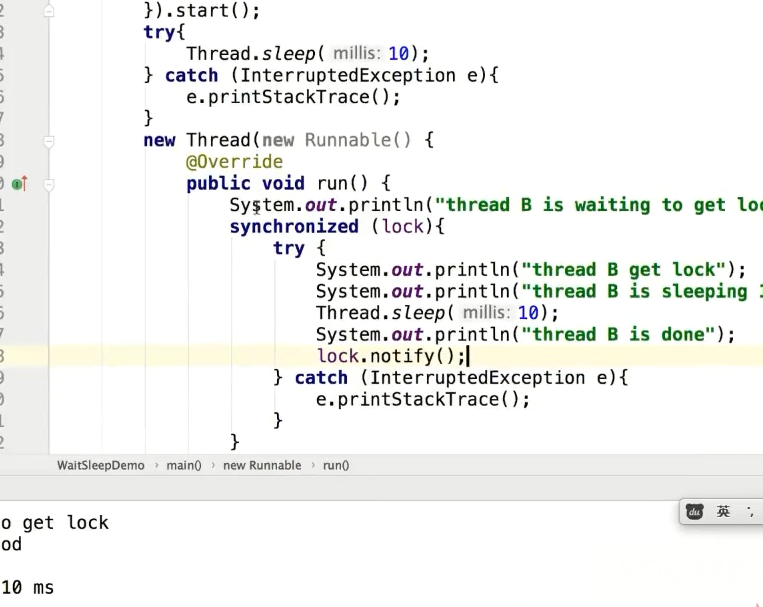


### yield函数


yield和sleep一样不会让出来锁

### 如何中断线程 interrupt


### 中断的分类和区别

这里简要的介绍下中断的分类。

内核与硬件通信的方式：轮询和中断。轮询速度太慢，中断被大量采用。
从不同的角度来说，中断可以有三种分类方法。
中断可以分为同步中断（synchronous）和异步中断(asynchronous)。
中断可分为硬中断和软中断。
中断可分为可屏蔽中断（Maskable interrupt）和非屏蔽中断（Nomaskable interrupt）。
同步中断是在指令执行时由CPU主动产生的，受到CPU控制，其执行点是可控的。
异步中断是CPU被动接收到的，由外设发出的电信号引起，其发生时间不可预测。
一般来说，同步中断又称为异常（exception），异步中断称为中断（interrupt）。
中断可分为可屏蔽中断（Maskable Interrupt）和非可屏蔽中断（Nomaskable Interrupt）。
异常可分为故障（fault）、陷阱（trap）和终止（abort）三类。
中断类别及行为可以区分如下：
类别	原因	异步/同步	返回行为
中断	来自IO设备的信号	异步	总是返回到下一条指令
陷阱	有意的异常	同步	总是返回到下一条指令
故障	潜在可恢复的错误	同步	返回到当前的指令
终止	不可恢复的错误	同步	不会返回
中断发生之后，需要中断处理程序对中断进行处理。
那么什么是中断处理程序呢？
中断处理程序是一个函数，有时也称为中断服务例程。在Linux中，中断处理程序独立于任何进程，在一个单独的中断上下文执行，其目的是为了及时响应。
中断处理程序分为两个部分：中断上半部（top half）和中断下半部(bottom half)。
中断上半部只做比较紧急的事情，在接收到一个中断时立即执行，并且不可被中断。
中断下半部处理又耗时又不紧急的工作，但是可以被中断
• 硬中断
○ 硬中断由硬件产生。每个设备或者设备集都有自己的IRQ（中断请求）。
* 硬件中断又可以分为内中断和外中断。
○ 处理中断的驱动是需要运行在CPU上的。在多核处理机上，一个中断只能中断一颗CPU。
○ 硬中断可以直接中断CPU。硬中断可以中断软中断。
○ 对于时钟中断，内核调度代码会将当前正在运行的进程挂起，从而让其他的进程运行。他的存在是为了让调度器可以调度多任务。
• 软中断
○ 软中断是当前进程产生的。
○ 通常，软中断是一些对IO的请求。
○ 软中断仅与内核联系。
软中断不会直接中断CPU。


### synchronized


### synchronized底层实现原理


我们都知道，对象被创建在堆中。并且对象在内存中的存储布局方式可以分为3块区域：对象头、实例数据、对齐填充。其中对象头，便是我们今天的主角。


关于实例数据、对齐填充的作用，各位小伙伴可以参考《深入理解Java虚拟机》。

**MDove**：对于对象头来说，主要是包括俩部分信息：

1、自身运行时的数据，比如：锁状态标志、线程持有的锁…等等。（此部分内容被称之为Mark Word）


今天我们只聊：**指向重量级锁的指针**

2、另一部分是类型指针：JVM通过这个指针来确定这个对象是哪个类的实例。

**MDove**：今天我们主要聊的是对象头，第一部分中**重量级锁**的内容。

**MDove**：先让我们从宏观的角度看一看synchronized锁的实现原理。

**synchronized锁的宏观实现**

**MDove**：synchronized的对象锁，其指针指向的是一个monitor对象（由C++实现）的起始地址。每个对象实例都会有一个 monitor。其中monitor可以与对象一起创建、销毁；亦或者当线程试图获取对象锁时自动生成。

monitor是由ObjectMonitor实现（ObjectMonitor.hpp文件，C++实现的），对于我们来说主要关注的是如下代码：


**MDove**：我们可以看到这里定义了_WaitSet 和 _EntryList俩个队列，其中_WaitSet 用来保存每个等待锁的线程对象。

**小A**：那_EntryList呢？

**MDove**：别着急，让我们先看一下_owner，它指向持有ObjectMonitor对象的线程。当多个线程同时访问一段同步代码时，会先存放到 _EntryList 集合中，接下来当线程获取到对象的monitor时，就会把_owner变量设置为当前线程。同时count变量+1。如果线程调用wait() 方法，就会释放当前持有的monitor，那么_owner变量就会被置为null，同时_count减1，并且该线程进入 WaitSet集合中，等待下一次被唤醒。

**MDove**：当然，若当前线程顺利执行完方法，也将释放monitor，重走一遍刚才的内容，也就是_owner变量就会被置为null，同时_count减1，并且该线程进入 WaitSet集合中，等待下一次被唤醒。

因为这个锁对象存放在对象本身，也就是为什么Java中任意对象可以作为锁的原因。

**synchronized代码块的底层实现**

**MDove**：咱们先写一个简单的demo，然后看一下它们的字节码：


**MDove**：根据虚拟机规范要求，在执行monitorenter指令时，首先要尝试获取对象锁，也就是上文我们提到了monitor对象。如果这个对象没有被锁定，或者当前线程已经拥有了这个对象的锁，那么就把锁的计数器（_count）加1。当然与之对应执行monitorexit指令时，锁的计数器（_count）也会减1。

**MDove**：如果当前线程获取锁失败，那么就会被阻塞住，进入_WaitSet 中，等待锁被释放为止。

**小A**：等等，我看到字节码中，有俩个monitorexit指令，这是为什么呢？

**MDove**：是这样的，编译器需要确保方法中调用过的每条monitorenter指令都要执行对应的monitorexit 指令。为了保证在方法异常时，monitorenter和monitorexit指令也能正常配对执行，编译器会自动产生一个异常处理器，它的目的就是用来执行 异常的monitorexit指令。而字节码中多出的monitorexit指令，就是异常结束时，被执行用来释放monitor的。

**小A**：我们刚才看的是同步代码块的原理，那么直接修饰在方法上呢？也是通过这个俩个指令吗？

**MDove**：你别说，还真不是：


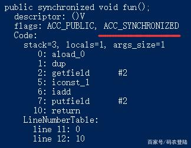

**MDove**：可以看到：字节码中并没有monitorenter指令和monitorexit指令，取得代之的是ACC_SYNCHRONIZED标识，JVM通过ACC_SYNCHRONIZED标识，就可以知道这是一个需要同步的方法，进而执行上述同步的过程，也就是_count加1，这些过程。

**小A**：哦，原来是这样。一个是用了指令，一个是用的标识呀~对了，我听说synchronized的性能特别低是这样么？

**MDove**：这句话不全对，JDK1.5后对synchronized进行了大刀阔斧的优化，这其中涉及到偏向锁、轻量级锁、自旋锁、锁消除等手段。时候也不早了，这些内容今天就不展开了。有机会我们下次再学习吧~


一个Java对象由，对象标记，类型指针，真实数据，内存对齐四部分组成。

对象标记也称Mark Word字段，存储当前对象的一些运行时数据。
类型指针，JVM根据该指针确定该对象是哪个类的实例化对象。
真实数据自然是对象的属性值。
内存补齐，是当数据不是对齐数的整数倍的时候，进行调整，使得对象的整体大小是对齐数的整数倍方便寻址。典型的以空间换时间的思想。
其中对象标记和类型指针统称为Java对象头。

Mark Word字段
Mark Word用于存储对象自身运行时的数据，如hashcode，GC分代年龄，锁状态标志位，线程持有的锁，偏向线程ID，等等。


为社么Java的任意对象都可以作为锁？
在Java对象头中，存在一个monitor对象，每个对象自创建之后在对象头中就含有monitor对象，monitor是线程私有的，不同的对象monitor自然也是不同的，因此对象作为锁的本质是对象头中的monitor对象作为了锁。这便是为什么Java的任意对象都可以作为锁的原因。

优化手段
偏向锁：
偏向锁针对的是锁不存在竞争，每次仅有一个线程来获取该锁，为了提高获取锁的效率，因此将该锁偏向该线程。提升性能。

偏向锁的获取：

1.首先检测是否为可偏向状态（锁标识是否设置成1，锁标志位是否为01）.
2.如果处于可偏向状态，测试Mark Word中的线程ID是否指向自己，如果是，不需要再次获取锁，直接执行同步代码。
3.如果线程Id，不是自己的线程Id，通过CAS获取锁，获取成功表明当前偏向锁不存在竞争，获取失败，则说明当前偏向锁存在锁竞争，偏向锁膨胀为轻量级锁。

偏向锁的撤销：

偏向锁只有当出现竞争时，才会出现锁撤销。

1。等待一个全局安全点，此时所有的线程都是暂停的，检查持有锁的线程状态，如果能找到说明当前线程还存活，说明还在执行同步块中的代码，首相将该线程阻塞，然后进行锁升级，升级到轻量级锁，唤醒该线程继续执行代同步码。
2.如果持有偏向锁的线程未存活，将对象头中的线程置null，然后直接锁升级。

轻量级锁：
偏向锁考虑的是不存在多个线程竞争同一把锁，而轻量级锁考虑的是，多个线程不会在同一时刻来竞争同一把锁。

轻量级锁的获取：

1.在线程的栈帧中创建用于存储锁记录得空间，
2.并将Mark Word复制到锁记录中，（这一步不论是否存在竞争都可以执行）。
3.尝试使用CAS将对象头中得Mark word字段变成指向锁记录得指针。
4 操作成功，不存在锁竞争，执行同步代码。
5操作失败，锁已经被其它线程抢占了，这时轻量级锁膨胀为重量级锁。

轻量级锁得释放：

反替换，使用CAS将栈帧中得锁录空间替换到对象头，成功没有锁竞争，锁得以释放，失败说明存在竞争，那块指向锁记录得指针有别的线程在用，因此锁膨胀升级为重量级锁。

重量级锁：
重量级锁描述同一时刻有多个线程竞争同一把锁。

当多个线程共同竞争同一把锁时，竞争失败得锁会被阻塞，等到持有锁的线程将锁释放后再次唤醒阻塞的线程，因为线程的唤醒和阻塞是一个很耗费CPU资源的操作，因此此处采取自适应自旋来获取重量级锁来获取重量级锁。

锁的升级
无锁 – > 偏向锁 -----> 轻量级锁 ---- > 重量级锁

其它优化
自旋锁：
线程未获得锁后，不是一昧的阻塞，而是让线程不断尝试获取锁。

缺点：若线程占用锁时间过长，导致CPU资源白白浪费。

解决方式：当尝试次数达到每个值的时候，线程挂起。

自适应自旋锁：
自旋得次数由上一次获取锁的自旋次数决定，次数稍微延长一点点。

锁消除
对于线程的私有变量，不存在并发问题，没有必要加锁，即使加锁编译后，也会去掉。

锁粗化
当一个循环中存在加锁操作时，可以将加锁操作提到循环外面执行，一次加锁代替多次加锁，提升性能。
原文链接：https://blog.csdn.net/weixin_43213517/article/details/89713899


### synchronized和ReentrantLock的区别


使用try catch finally  lock  unlock


 

### JMM的内存可见性


### volatile变量为何立即可见


### volatile如何禁止重排序优化


```csharp
public class User {
    //私有化构造函数
    private User(){ }
 
    //定义一个静态枚举类
    static enum SingletonEnum{
        //创建一个枚举对象，该对象天生为单例
        INSTANCE;
        private User user;
        //私有化枚举的构造函数
        private SingletonEnum(){
            user=new User();
        }
        public User getInstnce(){
            return user;
        }
    }
 
    //对外暴露一个获取User对象的静态方法
    public static User getInstance(){
        return SingletonEnum.INSTANCE.getInstnce();
    }
}
```


### CAS

```
在计算机科学中，比较和交换（Compare And Swap）是用于实现多线程同步的原子指令。 它将内存位置的内容与给定值进行比较，只有在相同的情况下，将该内存位置的内容修改为新的给定值。 这是作为单个原子操作完成的。 原子性保证新值基于最新信息计算; 如果该值在同一时间被另一个线程更新，则写入将失败。 操作结果必须说明是否进行替换; 这可以通过一个简单的布尔响应（这个变体通常称为比较和设置），或通过返回从内存位置读取的值来完成
```


CAS指令执行时，当且仅当内存地址V的值与预期值A相等时，将内存地址V的值修改为B，否则就什么都不做。整个比较并替换的操作是一个原子操作。

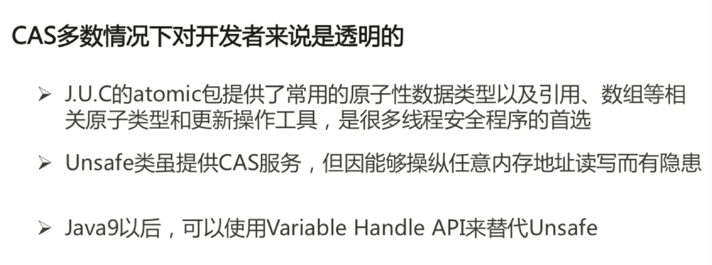


### JAVA线程池


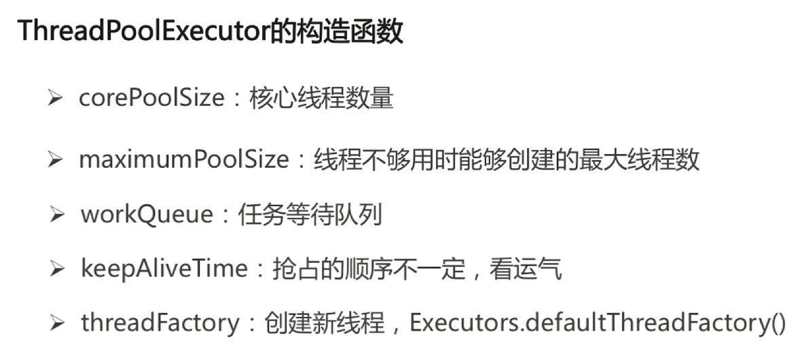

**KeepAliveTime:当前线程数量超过corePoolSize时候，空闲线程的存活时间**

**Unit:keepAliveTime的时间单位**

handler:由于任务过多或其他原因导致线程池无法处理时的任务拒绝策略

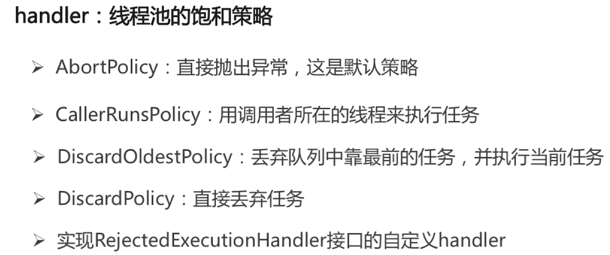


### AQS

AQS是AbstractQueuedSynchronizer的简称。AQS提供了一种实现阻塞锁和一系列依赖FIFO等待队列的同步器的框架，如下图所示。AQS为一系列同步器依赖于一个单独的原子变量（state）的同步器提供了一个非常有用的基础。子类们必须定义改变state变量的protected方法，这些方法定义了state是如何被获取或释放的。鉴于此，本类中的其他方法执行所有的排队和阻塞机制。子类也可以维护其他的state变量，但是为了保证同步，必须原子地操作这些变量。


AQS.png


   AbstractQueuedSynchronizer中对state的操作是原子的，且不能被继承。所有的同步机制的实现均依赖于对改变量的原子操作。为了实现不同的同步机制，我们需要创建一个非共有的（non-public internal）扩展了AQS类的内部辅助类来实现相应的同步逻辑。AbstractQueuedSynchronizer并不实现任何同步接口，它提供了一些可以被具体实现类直接调用的一些原子操作方法来重写相应的同步逻辑。AQS同时提供了互斥模式（exclusive）和共享模式（shared）两种不同的同步逻辑。一般情况下，子类只需要根据需求实现其中一种模式，当然也有同时实现两种模式的同步类，如`ReadWriteLock`。接下来将详细介绍AbstractQueuedSynchronizer的提供的一些具体实现方法。

#### state状态

  AbstractQueuedSynchronizer维护了一个volatile int类型的变量，用户表示当前同步状态。volatile虽然不能保证操作的原子性，但是保证了当前变量state的可见性。至于[volatile](https://www.jianshu.com/p/14fc9d34de33)的具体语义，可以参考相关文章。state的访问方式有三种:

> - getState()
> - setState()
> - compareAndSetState()

  这三种叫做均是原子操作，其中compareAndSetState的实现依赖于Unsafe的compareAndSwapInt()方法。代码实现如下：


```java
    /**
     * The synchronization state.
     */
    private volatile int state;
  
    /**
     * Returns the current value of synchronization state.
     * This operation has memory semantics of a {@code volatile} read.
     * @return current state value
     */
    protected final int getState() {
        return state;
    }

    /**
     * Sets the value of synchronization state.
     * This operation has memory semantics of a {@code volatile} write.
     * @param newState the new state value
     */
    protected final void setState(int newState) {
        state = newState;
    }

    /**
     * Atomically sets synchronization state to the given updated
     * value if the current state value equals the expected value.
     * This operation has memory semantics of a {@code volatile} read
     * and write.
     *
     * @param expect the expected value
     * @param update the new value
     * @return {@code true} if successful. False return indicates that the actual
     *         value was not equal to the expected value.
     */
    protected final boolean compareAndSetState(int expect, int update) {
        // See below for intrinsics setup to support this
        return unsafe.compareAndSwapInt(this, stateOffset, expect, update);
    }
```

#### 自定义资源共享方式

  AQS定义两种资源共享方式：Exclusive（独占，只有一个线程能执行，如ReentrantLock）和Share（共享，多个线程可同时执行，如Semaphore/CountDownLatch）。
  不同的自定义同步器争用共享资源的方式也不同。自定义同步器在实现时只需要实现共享资源state的获取与释放方式即可，至于具体线程等待队列的维护（如获取资源失败入队/唤醒出队等），AQS已经在顶层实现好了。自定义同步器实现时主要实现以下几种方法：

> - isHeldExclusively()：该线程是否正在独占资源。只有用到condition才需要去实现它。
> - tryAcquire(int)：独占方式。尝试获取资源，成功则返回true，失败则返回false。
> - tryRelease(int)：独占方式。尝试释放资源，成功则返回true，失败则返回false。
> - tryAcquireShared(int)：共享方式。尝试获取资源。负数表示失败；0表示成功，但没有剩余可用资源；正数表示成功，且有剩余资源。
> - tryReleaseShared(int)：共享方式。尝试释放资源，如果释放后允许唤醒后续等待结点返回true，否则返回false。

#### 源码实现

  接下来我们开始开始讲解AQS的源码实现。依照acquire-release、acquireShared-releaseShared的次序来。

#### 1. acquire(int)

    acquire是一种以独占方式获取资源，如果获取到资源，线程直接返回，否则进入等待队列，直到获取到资源为止，且整个过程忽略中断的影响。该方法是独占模式下线程获取共享资源的顶层入口。获取到资源后，线程就可以去执行其临界区代码了。下面是acquire()的源码：


```dart
/**
     * Acquires in exclusive mode, ignoring interrupts.  Implemented
     * by invoking at least once {@link #tryAcquire},
     * returning on success.  Otherwise the thread is queued, possibly
     * repeatedly blocking and unblocking, invoking {@link
     * #tryAcquire} until success.  This method can be used
     * to implement method {@link Lock#lock}.
     *
     * @param arg the acquire argument.  This value is conveyed to
     *        {@link #tryAcquire} but is otherwise uninterpreted and
     *        can represent anything you like.
     */
    public final void acquire(int arg) {
        if (!tryAcquire(arg) &&
            acquireQueued(addWaiter(Node.EXCLUSIVE), arg))
            selfInterrupt();
    }
```

  通过注释我们知道，acquire方法是一种互斥模式，且忽略中断。该方法至少执行一次`tryAcquire(int)`方法，如果tryAcquire(int)方法返回true，则acquire直接返回，否则当前线程需要进入队列进行排队。函数流程如下：

> 1. tryAcquire()尝试直接去获取资源，如果成功则直接返回；
> 2. addWaiter()将该线程加入等待队列的尾部，并标记为独占模式；
> 3. acquireQueued()使线程在等待队列中获取资源，一直获取到资源后才返回。如果在整个等待过程中被中断过，则返回true，否则返回false。
> 4. 如果线程在等待过程中被中断过，它是不响应的。只是获取资源后才再进行自我中断selfInterrupt()，将中断补上。

接下来一次介绍相关方法。

##### 1.1 tryAcquire(int)

   tryAcquire尝试以独占的方式获取资源，如果获取成功，则直接返回true，否则直接返回false。该方法可以用于实现Lock中的tryLock()方法。该方法的默认实现是抛出`UnsupportedOperationException`，具体实现由自定义的扩展了AQS的同步类来实现。AQS在这里只负责定义了一个公共的方法框架。这里之所以没有定义成abstract，是因为独占模式下只用实现tryAcquire-tryRelease，而共享模式下只用实现tryAcquireShared-tryReleaseShared。如果都定义成abstract，那么每个模式也要去实现另一模式下的接口。


```dart
/**
     * Attempts to acquire in exclusive mode. This method should query
     * if the state of the object permits it to be acquired in the
     * exclusive mode, and if so to acquire it.
     *
     * <p>This method is always invoked by the thread performing
     * acquire.  If this method reports failure, the acquire method
     * may queue the thread, if it is not already queued, until it is
     * signalled by a release from some other thread. This can be used
     * to implement method {@link Lock#tryLock()}.
     *
     * <p>The default
     * implementation throws {@link UnsupportedOperationException}.
     *
     * @param arg the acquire argument. This value is always the one
     *        passed to an acquire method, or is the value saved on entry
     *        to a condition wait.  The value is otherwise uninterpreted
     *        and can represent anything you like.
     * @return {@code true} if successful. Upon success, this object has
     *         been acquired.
     * @throws IllegalMonitorStateException if acquiring would place this
     *         synchronizer in an illegal state. This exception must be
     *         thrown in a consistent fashion for synchronization to work
     *         correctly.
     * @throws UnsupportedOperationException if exclusive mode is not supported
     */
    protected boolean tryAcquire(int arg) {
        throw new UnsupportedOperationException();
    }
```

##### 1.2 addWaiter(Node)

  该方法用于将当前线程根据不同的模式（`Node.EXCLUSIVE`互斥模式、`Node.SHARED`共享模式）加入到等待队列的队尾，并返回当前线程所在的结点。如果队列不为空，则以通过`compareAndSetTail`方法以CAS的方式将当前线程节点加入到等待队列的末尾。否则，通过enq(node)方法初始化一个等待队列，并返回当前节点。源码如下：


```java
/**
     * Creates and enqueues node for current thread and given mode.
     *
     * @param mode Node.EXCLUSIVE for exclusive, Node.SHARED for shared
     * @return the new node
     */
    private Node addWaiter(Node mode) {
        Node node = new Node(Thread.currentThread(), mode);
        // Try the fast path of enq; backup to full enq on failure
        Node pred = tail;
        if (pred != null) {
            node.prev = pred;
            if (compareAndSetTail(pred, node)) {
                pred.next = node;
                return node;
            }
        }
        enq(node);
        return node;
    }
```

##### 1.2.1 enq(node)

  `enq(node)`用于将当前节点插入等待队列，如果队列为空，则初始化当前队列。整个过程以CAS自旋的方式进行，直到成功加入队尾为止。源码如下：


```java
/**
     * Inserts node into queue, initializing if necessary. See picture above.
     * @param node the node to insert
     * @return node's predecessor
     */
    private Node enq(final Node node) {
        for (;;) {
            Node t = tail;
            if (t == null) { // Must initialize
                if (compareAndSetHead(new Node()))
                    tail = head;
            } else {
                node.prev = t;
                if (compareAndSetTail(t, node)) {
                    t.next = node;
                    return t;
                }
            }
        }
    }
```

##### 1.3  acquireQueued(Node, int)

  `acquireQueued()`用于队列中的线程自旋地以独占且不可中断的方式获取同步状态（acquire），直到拿到锁之后再返回。该方法的实现分成两部分：如果当前节点已经成为头结点，尝试获取锁（tryAcquire）成功，然后返回；否则检查当前节点是否应该被park，然后将该线程park并且检查当前线程是否被可以被中断。


```java
/**
     * Acquires in exclusive uninterruptible mode for thread already in
     * queue. Used by condition wait methods as well as acquire.
     *
     * @param node the node
     * @param arg the acquire argument
     * @return {@code true} if interrupted while waiting
     */
    final boolean acquireQueued(final Node node, int arg) {
        //标记是否成功拿到资源，默认false
        boolean failed = true;
        try {
            boolean interrupted = false;//标记等待过程中是否被中断过
            for (;;) {
                final Node p = node.predecessor();
                if (p == head && tryAcquire(arg)) {
                    setHead(node);
                    p.next = null; // help GC
                    failed = false;
                    return interrupted;
                }
                if (shouldParkAfterFailedAcquire(p, node) &&
                    parkAndCheckInterrupt())
                    interrupted = true;
            }
        } finally {
            if (failed)
                cancelAcquire(node);
        }
    }
```

##### 1.3.1  shouldParkAfterFailedAcquire(Node, Node)

  shouldParkAfterFailedAcquire方法通过对当前节点的前一个节点的状态进行判断，对当前节点做出不同的操作，至于每个Node的状态表示，可以参考接口文档。


```java
/**
     * Checks and updates status for a node that failed to acquire.
     * Returns true if thread should block. This is the main signal
     * control in all acquire loops.  Requires that pred == node.prev.
     *
     * @param pred node's predecessor holding status
     * @param node the node
     * @return {@code true} if thread should block
     */
    private static boolean shouldParkAfterFailedAcquire(Node pred, Node node) {
        int ws = pred.waitStatus;
        if (ws == Node.SIGNAL)
            /*
             * This node has already set status asking a release
             * to signal it, so it can safely park.
             */
            return true;
        if (ws > 0) {
            /*
             * Predecessor was cancelled. Skip over predecessors and
             * indicate retry.
             */
            do {
                node.prev = pred = pred.prev;
            } while (pred.waitStatus > 0);
            pred.next = node;
        } else {
            /*
             * waitStatus must be 0 or PROPAGATE.  Indicate that we
             * need a signal, but don't park yet.  Caller will need to
             * retry to make sure it cannot acquire before parking.
             */
            compareAndSetWaitStatus(pred, ws, Node.SIGNAL);
        }
        return false;
    }
```

##### 1.3.2  parkAndCheckInterrupt()

  该方法让线程去休息，真正进入等待状态。park()会让当前线程进入waiting状态。在此状态下，有两种途径可以唤醒该线程：1）被unpark()；2）被interrupt()。需要注意的是，Thread.interrupted()会清除当前线程的中断标记位。


```java
/**
     * Convenience method to park and then check if interrupted
     *
     * @return {@code true} if interrupted
     */
    private final boolean parkAndCheckInterrupt() {
        LockSupport.park(this);
        return Thread.interrupted();
    }
```

  我们再回到acquireQueued()，总结下该函数的具体流程：

> 1. 结点进入队尾后，检查状态，找到安全休息点；
> 2. 调用park()进入waiting状态，等待unpark()或interrupt()唤醒自己；
> 3. 被唤醒后，看自己是不是有资格能拿到号。如果拿到，head指向当前结点，并返回从入队到拿到号的整个过程中是否被中断过；如果没拿到，继续流程1。

最后，总结一下acquire()的流程：

> 1. 调用自定义同步器的tryAcquire()尝试直接去获取资源，如果成功则直接返回；
> 2. 没成功，则addWaiter()将该线程加入等待队列的尾部，并标记为独占模式；
> 3. acquireQueued()使线程在等待队列中休息，有机会时（轮到自己，会被unpark()）会去尝试获取资源。获取到资源后才返回。如果在整个等待过程中被中断过，则返回true，否则返回false。
> 4. 如果线程在等待过程中被中断过，它是不响应的。只是获取资源后才再进行自我中断selfInterrupt()，将中断补上。

#### 2. release(int)

  `release(int)`方法是独占模式下线程释放共享资源的顶层入口。它会释放指定量的资源，如果彻底释放了（即state=0）,它会唤醒等待队列里的其他线程来获取资源。这也正是unlock()的语义，当然不仅仅只限于unlock()。下面是release()的源码：


```dart
/**
     * Releases in exclusive mode.  Implemented by unblocking one or
     * more threads if {@link #tryRelease} returns true.
     * This method can be used to implement method {@link Lock#unlock}.
     *
     * @param arg the release argument.  This value is conveyed to
     *        {@link #tryRelease} but is otherwise uninterpreted and
     *        can represent anything you like.
     * @return the value returned from {@link #tryRelease}
     */
    public final boolean release(int arg) {
        if (tryRelease(arg)) {
            Node h = head;
            if (h != null && h.waitStatus != 0)
                unparkSuccessor(h);
            return true;
        }
        return false;
    }

/**
     * Attempts to set the state to reflect a release in exclusive
     * mode.
     *
     * <p>This method is always invoked by the thread performing release.
     *
     * <p>The default implementation throws
     * {@link UnsupportedOperationException}.
     *
     * @param arg the release argument. This value is always the one
     *        passed to a release method, or the current state value upon
     *        entry to a condition wait.  The value is otherwise
     *        uninterpreted and can represent anything you like.
     * @return {@code true} if this object is now in a fully released
     *         state, so that any waiting threads may attempt to acquire;
     *         and {@code false} otherwise.
     * @throws IllegalMonitorStateException if releasing would place this
     *         synchronizer in an illegal state. This exception must be
     *         thrown in a consistent fashion for synchronization to work
     *         correctly.
     * @throws UnsupportedOperationException if exclusive mode is not supported
     */
    protected boolean tryRelease(int arg) {
        throw new UnsupportedOperationException();
    }

/**
     * Wakes up node's successor, if one exists.
     *
     * @param node the node
     */
    private void unparkSuccessor(Node node) {
        /*
         * If status is negative (i.e., possibly needing signal) try
         * to clear in anticipation of signalling.  It is OK if this
         * fails or if status is changed by waiting thread.
         */
        int ws = node.waitStatus;
        if (ws < 0)
            compareAndSetWaitStatus(node, ws, 0);

        /*
         * Thread to unpark is held in successor, which is normally
         * just the next node.  But if cancelled or apparently null,
         * traverse backwards from tail to find the actual
         * non-cancelled successor.
         */
        Node s = node.next;
        if (s == null || s.waitStatus > 0) {
            s = null;
            for (Node t = tail; t != null && t != node; t = t.prev)
                if (t.waitStatus <= 0)
                    s = t;
        }
        if (s != null)
            LockSupport.unpark(s.thread);
    }
```

  与acquire()方法中的tryAcquire()类似，tryRelease()方法也是需要独占模式的自定义同步器去实现的。正常来说，tryRelease()都会成功的，因为这是独占模式，该线程来释放资源，那么它肯定已经拿到独占资源了，直接减掉相应量的资源即可(state-=arg)，也不需要考虑线程安全的问题。但要注意它的返回值，上面已经提到了，release()是根据tryRelease()的返回值来判断该线程是否已经完成释放掉资源了！所以自义定同步器在实现时，如果已经彻底释放资源(state=0)，要返回true，否则返回false。
  `unparkSuccessor(Node)`方法用于唤醒等待队列中下一个线程。这里要注意的是，下一个线程并不一定是当前节点的next节点，而是下一个可以用来唤醒的线程，如果这个节点存在，调用`unpark()`方法唤醒。
  总之，release()是独占模式下线程释放共享资源的顶层入口。它会释放指定量的资源，如果彻底释放了（即state=0）,它会唤醒等待队列里的其他线程来获取资源。

#### 3. acquireShared(int)

  `acquireShared(int)`方法是共享模式下线程获取共享资源的顶层入口。它会获取指定量的资源，获取成功则直接返回，获取失败则进入等待队列，直到获取到资源为止，整个过程忽略中断。下面是acquireShared()的源码：


```dart
/**
     * Acquires in shared mode, ignoring interrupts.  Implemented by
     * first invoking at least once {@link #tryAcquireShared},
     * returning on success.  Otherwise the thread is queued, possibly
     * repeatedly blocking and unblocking, invoking {@link
     * #tryAcquireShared} until success.
     *
     * @param arg the acquire argument.  This value is conveyed to
     *        {@link #tryAcquireShared} but is otherwise uninterpreted
     *        and can represent anything you like.
     */
    public final void acquireShared(int arg) {
        if (tryAcquireShared(arg) < 0)
            doAcquireShared(arg);
    }
```

##### 3.1 doAcquireShared(int)

  将当前线程加入等待队列尾部休息，直到其他线程释放资源唤醒自己，自己成功拿到相应量的资源后才返回。源码如下：


```java
 /**
     * Acquires in shared uninterruptible mode.
     * @param arg the acquire argument
     */
    private void doAcquireShared(int arg) {
        final Node node = addWaiter(Node.SHARED);
        boolean failed = true;
        try {
            boolean interrupted = false;
            for (;;) {
                final Node p = node.predecessor();
                if (p == head) {
                    int r = tryAcquireShared(arg);
                    if (r >= 0) {
                        setHeadAndPropagate(node, r);
                        p.next = null; // help GC
                        if (interrupted)
                            selfInterrupt();
                        failed = false;
                        return;
                    }
                }
                if (shouldParkAfterFailedAcquire(p, node) &&
                    parkAndCheckInterrupt())
                    interrupted = true;
            }
        } finally {
            if (failed)
                cancelAcquire(node);
        }
    }
```

  跟独占模式比，还有一点需要注意的是，这里只有线程是head.next时（“老二”），才会去尝试获取资源，有剩余的话还会唤醒之后的队友。那么问题就来了，假如老大用完后释放了5个资源，而老二需要6个，老三需要1个，老四需要2个。老大先唤醒老二，老二一看资源不够，他是把资源让给老三呢，还是不让？答案是否定的！老二会继续park()等待其他线程释放资源，也更不会去唤醒老三和老四了。独占模式，同一时刻只有一个线程去执行，这样做未尝不可；但共享模式下，多个线程是可以同时执行的，现在因为老二的资源需求量大，而把后面量小的老三和老四也都卡住了。当然，这并不是问题，只是AQS保证严格按照入队顺序唤醒罢了（保证公平，但降低了并发）。实现如下：


```dart
/**
     * Sets head of queue, and checks if successor may be waiting
     * in shared mode, if so propagating if either propagate > 0 or
     * PROPAGATE status was set.
     *
     * @param node the node
     * @param propagate the return value from a tryAcquireShared
     */
    private void setHeadAndPropagate(Node node, int propagate) {
        Node h = head; // Record old head for check below
        setHead(node);
        /*
         * Try to signal next queued node if:
         *   Propagation was indicated by caller,
         *     or was recorded (as h.waitStatus either before
         *     or after setHead) by a previous operation
         *     (note: this uses sign-check of waitStatus because
         *      PROPAGATE status may transition to SIGNAL.)
         * and
         *   The next node is waiting in shared mode,
         *     or we don't know, because it appears null
         *
         * The conservatism in both of these checks may cause
         * unnecessary wake-ups, but only when there are multiple
         * racing acquires/releases, so most need signals now or soon
         * anyway.
         */
        if (propagate > 0 || h == null || h.waitStatus < 0 ||
            (h = head) == null || h.waitStatus < 0) {
            Node s = node.next;
            if (s == null || s.isShared())
                doReleaseShared();
        }
    }
```

  此方法在setHead()的基础上多了一步，就是自己苏醒的同时，如果条件符合（比如还有剩余资源），还会去唤醒后继结点，毕竟是共享模式！至此，acquireShared()也要告一段落了。让我们再梳理一下它的流程：

> 1. tryAcquireShared()尝试获取资源，成功则直接返回；
> 2. 失败则通过doAcquireShared()进入等待队列park()，直到被unpark()/interrupt()并成功获取到资源才返回。整个等待过程也是忽略中断的。

#### 4. releaseShared(int)

  `releaseShared(int)`方法是共享模式下线程释放共享资源的顶层入口。它会释放指定量的资源，如果成功释放且允许唤醒等待线程，它会唤醒等待队列里的其他线程来获取资源。下面是releaseShared()的源码：


```java
/**
     * Releases in shared mode.  Implemented by unblocking one or more
     * threads if {@link #tryReleaseShared} returns true.
     *
     * @param arg the release argument.  This value is conveyed to
     *        {@link #tryReleaseShared} but is otherwise uninterpreted
     *        and can represent anything you like.
     * @return the value returned from {@link #tryReleaseShared}
     */
    public final boolean releaseShared(int arg) {
        if (tryReleaseShared(arg)) {
            doReleaseShared();
            return true;
        }
        return false;
    }
```

  此方法的流程也比较简单，一句话：释放掉资源后，唤醒后继。跟独占模式下的release()相似，但有一点稍微需要注意：独占模式下的tryRelease()在完全释放掉资源（state=0）后，才会返回true去唤醒其他线程，这主要是基于独占下可重入的考量；而共享模式下的releaseShared()则没有这种要求，共享模式实质就是控制一定量的线程并发执行，那么拥有资源的线程在释放掉部分资源时就可以唤醒后继等待结点。


```csharp
/**
     * Release action for shared mode -- signals successor and ensures
     * propagation. (Note: For exclusive mode, release just amounts
     * to calling unparkSuccessor of head if it needs signal.)
     */
    private void doReleaseShared() {
        /*
         * Ensure that a release propagates, even if there are other
         * in-progress acquires/releases.  This proceeds in the usual
         * way of trying to unparkSuccessor of head if it needs
         * signal. But if it does not, status is set to PROPAGATE to
         * ensure that upon release, propagation continues.
         * Additionally, we must loop in case a new node is added
         * while we are doing this. Also, unlike other uses of
         * unparkSuccessor, we need to know if CAS to reset status
         * fails, if so rechecking.
         */
        for (;;) {
            Node h = head;
            if (h != null && h != tail) {
                int ws = h.waitStatus;
                if (ws == Node.SIGNAL) {
                    if (!compareAndSetWaitStatus(h, Node.SIGNAL, 0))
                        continue;            // loop to recheck cases
                    unparkSuccessor(h);
                }
                else if (ws == 0 &&
                         !compareAndSetWaitStatus(h, 0, Node.PROPAGATE))
                    continue;                // loop on failed CAS
            }
            if (h == head)                   // loop if head changed
                break;
        }
    }
```

## 5. Java常用类库与技巧

### Java异常体系


### Java异常处理机制


可参考如下：https://www.cnblogs.com/pcheng/p/10968841.html


**这里mmall和miaosha里面有**


### Java集合框架


### HashMap

Map 的key 用的set value用的是collection


transient Node<K,V>[] table;

TREEIFY_THRESHOLD=8代表如果链表长度超过8，改造成红黑树

UNTREEIFY_THRESHOLD=6 如果低于6，改造成链表

懒加载

resize()方法既具备初始化，又具备扩容的方法


将近40亿，这么大数组不显示

向右移动16位

再做亦或

length总是2的n次方

与运算代替取模，获得更好效果


一文读懂HashMaphttps://www.jianshu.com/p/ee0de4c99f87

### ConcurrentHashMap

将HashMap包装成线程安全的


增加了一个mutex，在public方法上对mutex加锁synchronized

HashTable是将public方法直接加锁，synchronized

缺点：线程低下

jdk5之后：


-1代表初始化

<-1代表有几个线程在resize操作

其他的当table是空，

ConcurrentHashMap不允许插入Null的key或者value


循环


ReservationNode是一个保留节点，跟本地缓存相关

put方法


ConcurrentHashmap size 1.7方法实现
众所周知，concurrenthashmap有很多歌segments，首先遍历segments将每个segment的count加起来作为整个concurrenthashMap的size。如果没有并发的情况下这自然就可以了，但这是多线程的，如果前脚统计完后脚有变化了，这就不准确了，源码中引入了，modCount和两次比较来实现size的确认。具体过程是：

1.进行第一遍遍历segments数组，将每个segemnt的count加起来作为总数，期间把每个segment的modCount加起来sum作为结果是否被修改的判断依据。
这里需要提一下modCount，这个是当segment有任何操作都会进行一次增量操作，代表的是对Segment中元素的数量造成影响的操作的次数，这个值只增不减！！！！只增不减很重要，这样就不会出现一个segment+1，导致modcount+1,而另一个segment-1，即modcount-1 ,从而在统计所有的时候modcount没有变化。

2.size操作就是遍历了两次所有的Segments，每次记录Segment的modCount值，然后将两次的modCount进行比较，如果相同，则表示期间没有发生过写入操作，就将原先遍历的结果返回，如果不相同，则把这个过程再重复做一次，如果再不相同，则就需要将所有的Segment都锁住，然后一个一个遍历了。

3.如果经判断发现两次统计出的modCount并不一致，那就如上所说，要重新启用全部segment加锁的方式来进行count的获取和统计了，这样在此期间每个segement都被锁住，无法进行其他操作，统计出的count自然很准确。

而之所以之所以要先不加锁进行判断，道理很明显，就是不希望因为size操作获取这么多锁，因为获取锁不光占用资源，也会影响其他线程对ConcurrentHash的使用，影响并发情况下程序执行的效率。使用锁要谨慎！

ConcurrentHashmap size 1.8方法实现
1.8中使用一个volatile类型的变量baseCount记录元素的个数，当插入新数据或则删除数据时，会通过addCount()方法更新baseCount，实现如下：

```
if ((as = counterCells) != null ||
    !U.compareAndSwapLong(this, BASECOUNT, b = baseCount, s = b + x)) {
    CounterCell a; long v; int m;
    boolean uncontended = true;
    if (as == null || (m = as.length - 1) < 0 ||
        (a = as[ThreadLocalRandom.getProbe() & m]) == null ||
        !(uncontended =
          U.compareAndSwapLong(a, CELLVALUE, v = a.value, v + x))) {
        fullAddCount(x, uncontended);
        return;
    }
    if (check <= 1)
        return;
    s = sumCount();
}

```


1、初始化时counterCells为空，在并发量很高时，如果存在两个线程同时执行CAS修改baseCount值，则失败的线程会继续执行方法体中的逻辑，使用CounterCell记录元素个数的变化；

2、如果CounterCell数组counterCells为空，调用fullAddCount()方法进行初始化，并插入对应的记录数，通过CAS设置cellsBusy字段，只有设置成功的线程才能初始化CounterCell数组，实现如下：

```
else if (cellsBusy == 0 && counterCells == as &&
         U.compareAndSwapInt(this, CELLSBUSY, 0, 1)) {
    boolean init = false;
    try {                           // Initialize table
        if (counterCells == as) {
            CounterCell[] rs = new CounterCell[2];
            rs[h & 1] = new CounterCell(x);
            counterCells = rs;
            init = true;
        }
    } finally {
        cellsBusy = 0;
    }
    if (init)
        break;
}

```


3、如果通过CAS设置cellsBusy字段失败的话，则继续尝试通过CAS修改baseCount字段，如果修改baseCount字段成功的话，就退出循环，否则继续循环插入CounterCell对象；

```
else if (U.compareAndSwapLong(this, BASECOUNT, v = baseCount, v + x))
    break;
所以在1.8中的size实现比1.7简单多，因为元素个数保存baseCount中，部分元素的变化个数保存在CounterCell数组中，实现如下：

public int size() {
    long n = sumCount();
    return ((n < 0L) ? 0 :
            (n > (long)Integer.MAX_VALUE) ? Integer.MAX_VALUE :
            (int)n);
}
 
final long sumCount() {
    CounterCell[] as = counterCells; CounterCell a;
    long sum = baseCount;
    if (as != null) {
        for (int i = 0; i < as.length; ++i) {
            if ((a = as[i]) != null)
                sum += a.value;
        }
    }
    return sum;
}
```


通过累加baseCount和CounterCell数组中的数量，即可得到元素的总个数；


JDK1.7 和 JDK1.8 对 size 的计算是不一样的。 1.7 中是先不加锁计算三次，如果三次结果不一样在加锁。

JDK1.8 size 是通过对 baseCount 和 counterCell 进行 CAS 计算，最终通过 baseCount 和 遍历 CounterCell 数组得出 size。

JDK 8 推荐使用mappingCount 方法，因为这个方法的返回值是 long 类型，不会因为 size 方法是 int 类型限制最大值。

size（）最大值是 Integer 类型的最大值，但是 Map 的 size 可能超过 MAX_VALUE， 所以还有一个方法 mappingCount()，JDK 的建议使用 mappingCount() 而不是size()。mappingCount() 的代码如下

#### ConcurrentHashMap扩容

**ConcurrenHashMap 在扩容过程中主要使用 sizeCtl 和 transferIndex 这两个属性来协调多线程之间的并发操作，并且在扩容过程中大部分数据依旧可以做到访问不阻塞，具体是如何实现的，请继续 。**

https://blog.csdn.net/ZOKEKAI/article/details/90051567?depth_1-utm_source=distribute.pc_relevant.none-task-blog-BlogCommendFromBaidu-1&utm_source=distribute.pc_relevant.none-task-blog-BlogCommendFromBaidu-1


### JUC包的梳理

#### 生产者消费者

 [Java生产者消费者的三种实现](https://www.cnblogs.com/xindoo/p/11426659.html)

Java生产者消费者是最基础的线程同步问题，java岗面试中还是很容易遇到的，之前没写过多线程的代码，面试中被问到很尬啊，面完回来恶补下。在网上查到大概有5种生产者消费者的写法，分别如下。

1. 用synchronized对存储加锁，然后用object原生的wait() 和 notify()做同步。
2. 用concurrent.locks.Lock，然后用condition的await() 和signal()做同步。
3. 直接使用concurrent.BlockingQueue。
4. 使用PipedInputStream/PipedOutputStream。
5. 使用信号量semaphore。　　

我的理解，生产者消费者模式，其实只要保证在存储端同一时刻只有一个线程读或写就不会有问题，然后再去考虑线程同步。方法1 2 5都比较类似，都是加锁来限制同一时刻只能有一个读或写。而方法3 4其实是在存储内部去保证读和写的唯一的，最低层肯定还是通过锁机制来实现的，java底层代码都封装好了而已。　　
我自己尝试写了下前三种，代码如下：　

### synchronized版本

```
import java.util.LinkedList;
import java.util.Queue;

public class ProducerAndConsumer {
    private final int MAX_LEN = 10;
    private Queue<Integer> queue = new LinkedList<Integer>();
    class Producer extends Thread {
        @Override
        public void run() {
            producer();
        }
        private void producer() {
            while(true) {
                synchronized (queue) {
                    while (queue.size() == MAX_LEN) {
                        queue.notify();
                        System.out.println("当前队列满");
                        try {
                            queue.wait();
                        } catch (InterruptedException e) {
                            e.printStackTrace();
                        }
                    }
                    queue.add(1);
                    queue.notify();
                    System.out.println("生产者生产一条任务，当前队列长度为" + queue.size());
                    try {
                        Thread.sleep(500);
                    } catch (InterruptedException e) {
                        e.printStackTrace();
                    }
                }
            }
        }
    }
    class Consumer extends Thread {
        @Override
        public void run() {
            consumer();
        }
        private void consumer() {
            while (true) {
                synchronized (queue) {
                    while (queue.size() == 0) {
                        queue.notify();
                        System.out.println("当前队列为空");
                        try {
                            queue.wait();
                        } catch (InterruptedException e) {
                            e.printStackTrace();
                        }
                    }
                    queue.poll();
                    queue.notify();
                    System.out.println("消费者消费一条任务，当前队列长度为" + queue.size());
                    try {
                        Thread.sleep(500);
                    } catch (InterruptedException e) {
                        e.printStackTrace();
                    }
                }
            }
        }
    }
    public static void main(String[] args) {
        ProducerAndConsumer pc = new ProducerAndConsumer();
        Producer producer = pc.new Producer();
        Consumer consumer = pc.new Consumer();
        producer.start();
        consumer.start();
    }
}
```

### lock版实现，使用了condition做线程之间的同步。

```
import java.util.LinkedList;
import java.util.Queue;
import java.util.concurrent.locks.Condition;
import java.util.concurrent.locks.Lock;
import java.util.concurrent.locks.ReentrantLock;

/**
 * version 1 doesn't use synchronized to improve performance
 */
public class ProducerAndConsumer1 {
    private final int MAX_LEN = 10;
    private Queue<Integer> queue = new LinkedList<Integer>();
    private final Lock lock = new ReentrantLock();
    private final Condition condition = lock.newCondition();
    class Producer extends Thread {
        @Override
        public void run() {
            producer();
        }
        private void producer() {
            while(true) {
                lock.lock();
                try {
                    while (queue.size() == MAX_LEN) {
                        System.out.println("当前队列满");
                        try {
                            condition.await();
                        } catch (InterruptedException e) {
                            e.printStackTrace();
                        }
                    }
                    queue.add(1);
                    condition.signal();
                    System.out.println("生产者生产一条任务，当前队列长度为" + queue.size());
                    try {
                        Thread.sleep(500);
                    } catch (InterruptedException e) {
                        e.printStackTrace();
                    }
                } finally {
                    lock.unlock();
                }
            }
        }
    }
    class Consumer extends Thread {
        @Override
        public void run() {
            consumer();
        }
        private void consumer() {
            while (true) {
                lock.lock();
                try {
                    while (queue.size() == 0) {
                        System.out.println("当前队列为空");
                        try {
                            condition.await();
                        } catch (InterruptedException e) {
                            e.printStackTrace();
                        }
                    }
                    queue.poll();
                    condition.signal();
                    System.out.println("消费者消费一条任务，当前队列长度为" + queue.size());
                    try {
                        Thread.sleep(500);
                    } catch (InterruptedException e) {
                        e.printStackTrace();
                    }
                } finally {
                    lock.unlock();
                }
            }
        }
    }
    public static void main(String[] args) {
        ProducerAndConsumer pc = new ProducerAndConsumer();
        Producer producer = pc.new Producer();
        Consumer consumer = pc.new Consumer();
        producer.start();
        consumer.start();
    }
}
```

### BlockingQueue版实现

```
import java.util.Random;
import java.util.concurrent.BlockingQueue;
import java.util.concurrent.LinkedBlockingQueue;


public class ProducerAndConsumer {
    private BlockingQueue<Integer> queue = new LinkedBlockingQueue<Integer>(10);
    class Producer extends Thread {
        @Override
        public void run() {
            producer();
        }
        private void producer() {
            while(true) {
                try {
                    queue.put(1);
                } catch (InterruptedException e) {
                    e.printStackTrace();
                }
                System.out.println("生产者生产一条任务，当前队列长度为" + queue.size());
                try {
                    Thread.sleep(new Random().nextInt(1000)+500);
                } catch (InterruptedException e) {
                    e.printStackTrace();
                }
            }
        }
    }
    class Consumer extends Thread {
        @Override
        public void run() {
            consumer();
        }
        private void consumer() {
            while (true) {
                try {
                    queue.take();
                } catch (InterruptedException e) {
                    e.printStackTrace();
                }
                System.out.println("消费者消费一条任务，当前队列长度为" + queue.size());
                try {
                    Thread.sleep(new Random().nextInt(1000)+500);
                } catch (InterruptedException e) {
                    e.printStackTrace();
                }
            }
        }
    }
    public static void main(String[] args) {
        ProducerAndConsumer pc = new ProducerAndConsumer();
        Producer producer = pc.new Producer();
        Consumer consumer = pc.new Consumer();
        producer.start();
        consumer.start();
    }
}
```


put take

offer poll

阻塞入队和出队


线程安全

### Java的IO机制


BIO


多路复用的NIO


AIO


## 6. Spring家族

### IOC原理


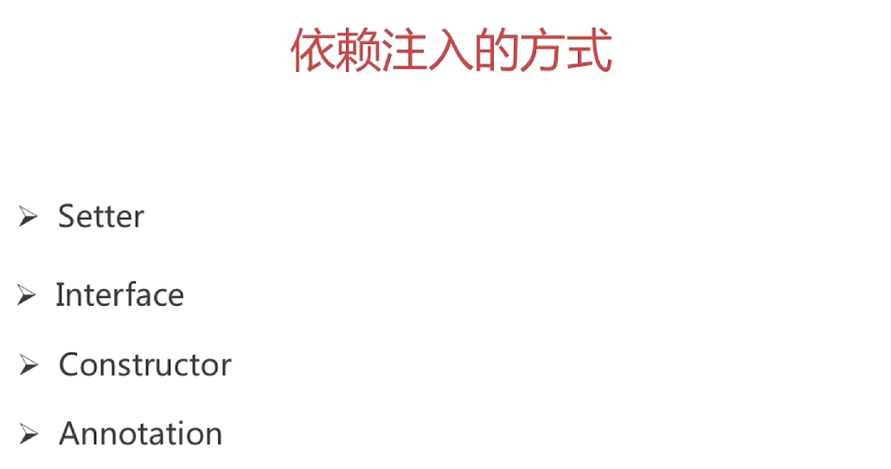


### IOC的应用


1.通过动态代理生成对象，在beanFactoryPostProcesser中通过beanFactory对象的registerSingletonObject方法注册到单例池中，交给Spring管理

2.利用factoryBean，覆写getObject方法，以及getObjectType方法，在getObject中通过new或者动态代理方法，返回一个对象，通过Applicationcontext的getBean方法，获取到对象，并且默认是单例的


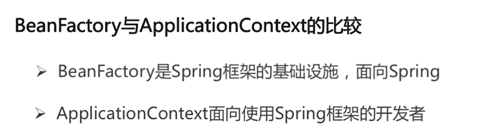

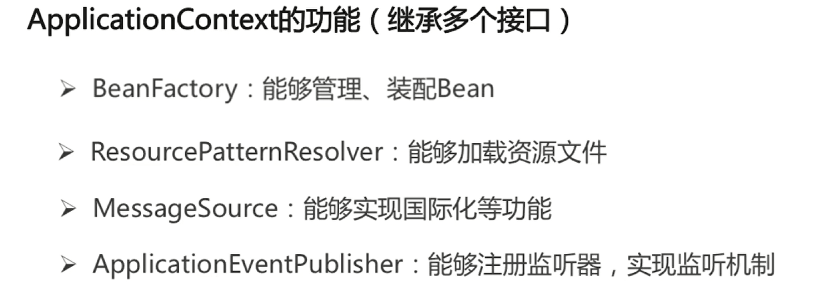


简单粗暴


### SpringIOC的refresh源码解析

spring源码版本5.0.5

Spring容器创建之后，会调用它的refresh方法刷新Spring应用的上下文。

首先整体查看AbstractApplicationContext#refresh源码

[](javascript:void(0);)

```
    public void refresh() throws BeansException, IllegalStateException {
        synchronized (this.startupShutdownMonitor) {
            //刷新前的预处理;
            prepareRefresh();

            //获取BeanFactory；默认实现是DefaultListableBeanFactory，在创建容器的时候创建的
            ConfigurableListableBeanFactory beanFactory = obtainFreshBeanFactory();

            //BeanFactory的预准备工作（BeanFactory进行一些设置，比如context的类加载器，BeanPostProcessor和XXXAware自动装配等）
            prepareBeanFactory(beanFactory);

            try {
                //BeanFactory准备工作完成后进行的后置处理工作
                postProcessBeanFactory(beanFactory);

                //执行BeanFactoryPostProcessor的方法；
                invokeBeanFactoryPostProcessors(beanFactory);

                //注册BeanPostProcessor（Bean的后置处理器），在创建bean的前后等执行
                registerBeanPostProcessors(beanFactory);

                //初始化MessageSource组件（做国际化功能；消息绑定，消息解析）；
                initMessageSource();

                //初始化事件派发器
                initApplicationEventMulticaster();

                //子类重写这个方法，在容器刷新的时候可以自定义逻辑；如创建Tomcat，Jetty等WEB服务器
                onRefresh();

                //注册应用的监听器。就是注册实现了ApplicationListener接口的监听器bean，这些监听器是注册到ApplicationEventMulticaster中的
                registerListeners();

                //初始化所有剩下的非懒加载的单例bean
                finishBeanFactoryInitialization(beanFactory);

                //完成context的刷新。主要是调用LifecycleProcessor的onRefresh()方法，并且发布事件（ContextRefreshedEvent）
                finishRefresh();
            }

            ......
    }
```

[](javascript:void(0);)

#### prepareRefresh方法

表示在真正做refresh操作之前需要准备做的事情：

- 设置Spring容器的启动时间，
- 开启活跃状态，撤销关闭状态，。
- 初始化context environment（上下文环境）中的占位符属性来源。
- 验证环境信息里一些必须存在的属性

#### ConfigurableListableBeanFactory beanFactory = obtainFreshBeanFactory()

让这个类（AbstractApplicationContext）的子类刷新内部bean工厂。

- AbstractRefreshableApplicationContext容器：实际上就是重新创建一个bean工厂，并设置工厂的一些属性。
- GenericApplicationContext容器：获取创建容器的就创建的bean工厂，并且设置工厂的ID.

#### prepareBeanFactory方法

上一步已经把工厂建好了，但是还不能投入使用，因为工厂里什么都没有，还需要配置一些东西。看看这个方法的注释

```
    /**
     * Configure the factory's standard context characteristics,
     * such as the context's ClassLoader and post-processors.
     * @param beanFactory the BeanFactory to configure
     */
```

他说配置这个工厂的标准环境，比如context的类加载器和post-processors后处理器。

[](javascript:void(0);)

```
    protected void prepareBeanFactory(ConfigurableListableBeanFactory beanFactory) {
        //设置BeanFactory的类加载器
        beanFactory.setBeanClassLoader(getClassLoader());
        //设置支持表达式解析器
        beanFactory.setBeanExpressionResolver(new StandardBeanExpressionResolver(beanFactory.getBeanClassLoader()));
        beanFactory.addPropertyEditorRegistrar(new ResourceEditorRegistrar(this, getEnvironment()));

        //添加部分BeanPostProcessor【ApplicationContextAwareProcessor】
        beanFactory.addBeanPostProcessor(new ApplicationContextAwareProcessor(this));
        //设置忽略的自动装配的接口EnvironmentAware、EmbeddedValueResolverAware、xx,因为ApplicationContextAwareProcessor#invokeAwareInterfaces已经把这5个接口的实现工作做了
        beanFactory.ignoreDependencyInterface(EnvironmentAware.class);
        beanFactory.ignoreDependencyInterface(EmbeddedValueResolverAware.class);
        beanFactory.ignoreDependencyInterface(ResourceLoaderAware.class);
        beanFactory.ignoreDependencyInterface(ApplicationEventPublisherAware.class);
        beanFactory.ignoreDependencyInterface(MessageSourceAware.class);
        beanFactory.ignoreDependencyInterface(ApplicationContextAware.class);

        //注册可以解析的自动装配；我们能直接在任何组件中自动注入：BeanFactory、ResourceLoader、ApplicationEventPublisher、ApplicationContext
        //其他组件中可以通过 @autowired 直接注册使用
        beanFactory.registerResolvableDependency(BeanFactory.class, beanFactory);
        beanFactory.registerResolvableDependency(ResourceLoader.class, this);
        beanFactory.registerResolvableDependency(ApplicationEventPublisher.class, this);
        beanFactory.registerResolvableDependency(ApplicationContext.class, this);

        //添加BeanPostProcessor【ApplicationListenerDetector】后置处理器，在bean初始化前后的一些工作
        beanFactory.addBeanPostProcessor(new ApplicationListenerDetector(this));

        // Detect a LoadTimeWeaver and prepare for weaving, if found.
        if (beanFactory.containsBean(LOAD_TIME_WEAVER_BEAN_NAME)) {
            beanFactory.addBeanPostProcessor(new LoadTimeWeaverAwareProcessor(beanFactory));
            // Set a temporary ClassLoader for type matching.
            beanFactory.setTempClassLoader(new ContextTypeMatchClassLoader(beanFactory.getBeanClassLoader()));
        }

        //给BeanFactory中注册一些能用的组件；
        if (!beanFactory.containsLocalBean(ENVIRONMENT_BEAN_NAME)) {
            //环境信息ConfigurableEnvironment
            beanFactory.registerSingleton(ENVIRONMENT_BEAN_NAME, getEnvironment());
        }
        if (!beanFactory.containsLocalBean(SYSTEM_PROPERTIES_BEAN_NAME)) {
          //系统属性，systemProperties【Map<String, Object>】
            beanFactory.registerSingleton(SYSTEM_PROPERTIES_BEAN_NAME, getEnvironment().getSystemProperties());
        }
        if (!beanFactory.containsLocalBean(SYSTEM_ENVIRONMENT_BEAN_NAME)) {
          //系统环境变量systemEnvironment【Map<String, Object>】
            beanFactory.registerSingleton(SYSTEM_ENVIRONMENT_BEAN_NAME, getEnvironment().getSystemEnvironment());
        }
    }
```

[](javascript:void(0);)

####  postProcessBeanFactory方法

上面对bean工厂进行了许多配置，现在需要对bean工厂进行一些处理。不同的Spring容器做不同的操作。比如GenericWebApplicationContext容器的操作会在BeanFactory中添加ServletContextAwareProcessor用于处理ServletContextAware类型的bean初始化的时候调用setServletContext或者setServletConfig方法(跟ApplicationContextAwareProcessor原理一样)。

GenericWebApplicationContext#postProcessBeanFactory源码：

[](javascript:void(0);)

```
    protected void postProcessBeanFactory(ConfigurableListableBeanFactory beanFactory) {
        if (this.servletContext != null) {
            beanFactory.addBeanPostProcessor(new ServletContextAwareProcessor(this.servletContext));
            beanFactory.ignoreDependencyInterface(ServletContextAware.class);
        }
        WebApplicationContextUtils.registerWebApplicationScopes(beanFactory, this.servletContext);
        WebApplicationContextUtils.registerEnvironmentBeans(beanFactory, this.servletContext);
    }
```

[](javascript:void(0);)

AnnotationConfigServletWebServerApplicationContext#postProcessBeanFactory方法

[](javascript:void(0);)

```
    @Override
    protected void postProcessBeanFactory(ConfigurableListableBeanFactory beanFactory) {
        super.postProcessBeanFactory(beanFactory);
        // 查看basePackages属性，如果设置了会使用ClassPathBeanDefinitionScanner去扫描basePackages包下的bean并注册
        if (this.basePackages != null && this.basePackages.length > 0) {
            this.scanner.scan(this.basePackages);
        }
        // 查看annotatedClasses属性，如果设置了会使用AnnotatedBeanDefinitionReader去注册这些bean
        if (!this.annotatedClasses.isEmpty()) {
            this.reader.register(ClassUtils.toClassArray(this.annotatedClasses));
        }
    }
```

[](javascript:void(0);)

#### invokeBeanFactoryPostProcessors方法

先介绍两个接口：

- BeanFactoryPostProcessor：用来修改Spring容器中已经存在的bean的定义，使用ConfigurableListableBeanFactory对bean进行处理
- BeanDefinitionRegistryPostProcessor：继承BeanFactoryPostProcessor，作用跟BeanFactoryPostProcessor一样，只不过是使用BeanDefinitionRegistry对bean进行处理

在Spring容器中找出实现了BeanFactoryPostProcessor接口的processor并执行。Spring容器会委托给PostProcessorRegistrationDelegate的invokeBeanFactoryPostProcessors方法执行。

注
1.在springboot的web程序初始化AnnotationConfigServletWebServerApplicationContext容器时，会初始化内部属性AnnotatedBeanDefinitionReader reader，这个reader构造的时候会在BeanFactory中注册一些post processor，包括BeanPostProcessor和BeanFactoryPostProcessor(比如ConfigurationClassPostProcessor、AutowiredAnnotationBeanPostProcessor)：

```
AnnotationConfigUtils.registerAnnotationConfigProcessors(this.registry);
```

2.在使用mybatis时，一般配置了MapperScannerConfigurer的bean，这个bean就是继承的BeanDefinitionRegistryPostProcessor，所以也是这个地方把扫描的mybatis的接口注册到容器中的。

invokeBeanFactoryPostProcessors方法处理BeanFactoryPostProcessor的逻辑如下：

从Spring容器中找出BeanDefinitionRegistryPostProcessor类型的bean(这些processor是在容器刚创建的时候通过构造AnnotatedBeanDefinitionReader的时候注册到容器中的)，然后按照优先级分别执行，优先级的逻辑如下：

1. 实现PriorityOrdered接口的BeanDefinitionRegistryPostProcessor先全部找出来，然后排序后依次执行
2. 实现Ordered接口的BeanDefinitionRegistryPostProcessor找出来，然后排序后依次执行
3. 没有实现PriorityOrdered和Ordered接口的BeanDefinitionRegistryPostProcessor找出来执行并依次执行

  接下来从Spring容器内查找BeanFactoryPostProcessor接口的实现类，然后执行(如果processor已经执行过，则忽略)，这里的查找规则跟上面查找BeanDefinitionRegistryPostProcessor一样，先找PriorityOrdered，然后是Ordered，最后是两者都没。

​    这里需要说明的是ConfigurationClassPostProcessor这个processor是优先级最高的被执行的processor(实现了PriorityOrdered接口)。这个ConfigurationClassPostProcessor会去BeanFactory中找出所有有@Configuration注解的bean，然后使用ConfigurationClassParser去解析这个类。ConfigurationClassParser内部有个Map<ConfigurationClass, ConfigurationClass>类型的configurationClasses属性用于保存解析的类，ConfigurationClass是一个对要解析的配置类的封装，内部存储了配置类的注解信息、被@Bean注解修饰的方法、@ImportResource注解修饰的信息、ImportBeanDefinitionRegistrar等都存储在这个封装类中。

​    这里ConfigurationClassPostProcessor最先被处理还有另外一个原因是如果程序中有自定义的BeanFactoryPostProcessor，那么这个PostProcessor首先得通过ConfigurationClassPostProcessor被解析出来，然后才能被Spring容器找到并执行。(ConfigurationClassPostProcessor不先执行的话，这个Processor是不会被解析的，不会被解析的话也就不会执行了)。

1. 处理@PropertySources注解：进行一些配置信息的解析
2. 处理@ComponentScan注解：使用ComponentScanAnnotationParser扫描basePackage下的需要解析的类(@SpringBootApplication注解也包括了@ComponentScan注解，只不过basePackages是空的，空的话会去获取当前@Configuration修饰的类所在的包)，并注册到BeanFactory中(这个时候bean并没有进行实例化，而是进行了注册。具体的实例化在finishBeanFactoryInitialization方法中执行)。对于扫描出来的类，递归解析
3. 处理@Import注解：先递归找出所有的注解，然后再过滤出只有@Import注解的类，得到@Import注解的值。比如查找@SpringBootApplication注解的@Import注解数据的话，首先发现@SpringBootApplication不是一个@Import注解，然后递归调用修饰了@SpringBootApplication的注解，发现有个@EnableAutoConfiguration注解，再次递归发现被@Import(EnableAutoConfigurationImportSelector.class)修饰，还有@AutoConfigurationPackage注解修饰，再次递归@AutoConfigurationPackage注解，发现被@Import(AutoConfigurationPackages.Registrar.class)注解修饰，所以@SpringBootApplication注解对应的@Import注解有2个，分别是@Import(AutoConfigurationPackages.Registrar.class)和@Import(EnableAutoConfigurationImportSelector.class)。找出所有的@Import注解之后，开始处理逻辑：
   1. 遍历这些@Import注解内部的属性类集合
   2. 如果这个类是个ImportSelector接口的实现类，实例化这个ImportSelector，如果这个类也是DeferredImportSelector接口的实现类，那么加入ConfigurationClassParser的deferredImportSelectors属性中让第6步处理。否则调用ImportSelector的selectImports方法得到需要Import的类，然后对这些类递归做@Import注解的处理
   3. 如果这个类是ImportBeanDefinitionRegistrar接口的实现类，设置到配置类的importBeanDefinitionRegistrars属性中
   4. 其它情况下把这个类入队到ConfigurationClassParser的importStack(队列)属性中，然后把这个类当成是@Configuration注解修饰的类递归重头开始解析这个类
4. 处理@ImportResource注解：获取@ImportResource注解的locations属性，得到资源文件的地址信息。然后遍历这些资源文件并把它们添加到配置类的importedResources属性中
5. 处理@Bean注解：获取被@Bean注解修饰的方法，然后添加到配置类的beanMethods属性中
6. 处理DeferredImportSelector：处理第3步@Import注解产生的DeferredImportSelector，进行selectImports方法的调用找出需要import的类，然后再调用第3步相同的处理逻辑处理

​    这里@SpringBootApplication注解被@EnableAutoConfiguration修饰，@EnableAutoConfiguration注解被@Import(EnableAutoConfigurationImportSelector.class)修饰，所以在第3步会找出这个@Import修饰的类EnableAutoConfigurationImportSelector，这个类刚好实现了DeferredImportSelector接口，接着就会在第6步被执行。第6步selectImport得到的类就是自动化配置类。

​    EnableAutoConfigurationImportSelector的selectImport方法会在spring-boot-autoconfigure包的META-INF里面的spring.factories文件中找出key为org.springframework.boot.autoconfigure.EnableAutoConfiguration对应的值，有109个，这109个就是所谓的自动化配置类(XXXAutoConfiguration)。（如果引入了mybatis和pagehelper，也会在对应的XXXautoconfigure包的META-INF里面的spring.factories找到EnableAutoConfiguration，这样可能最后得到的自动配置类会大于109个。）然后在过滤排除一下不需要的配置，最后返回实际用到的。

 

​    ConfigurationClassParser解析完成之后，被解析出来的类会放到configurationClasses属性中。然后使用ConfigurationClassBeanDefinitionReader去解析这些类。

这个时候这些bean只是被加载到了Spring容器中。下面这段代码是ConfigurationClassBeanDefinitionReader的解析bean过程：这个时候这些bean只是被加载到了Spring容器中。下面这段代码是ConfigurationClassBeanDefinitionReader#loadBeanDefinitions的解析bean过程：

[](javascript:void(0);)

```
    public void loadBeanDefinitions(Set<ConfigurationClass> configurationModel) {
        TrackedConditionEvaluator trackedConditionEvaluator = new TrackedConditionEvaluator();
        for (ConfigurationClass configClass : configurationModel) {
            //对每一个配置类，调用loadBeanDefinitionsForConfigurationClass方法
            loadBeanDefinitionsForConfigurationClass(configClass, trackedConditionEvaluator);
        }
    }
```

[](javascript:void(0);)

[](javascript:void(0);)

```
    private void loadBeanDefinitionsForConfigurationClass(ConfigurationClass configClass,
            TrackedConditionEvaluator trackedConditionEvaluator) {
        //使用条件注解判断是否需要跳过这个配置类
        if (trackedConditionEvaluator.shouldSkip(configClass)) {
            //跳过配置类的话在Spring容器中移除bean的注册
            String beanName = configClass.getBeanName();
            if (StringUtils.hasLength(beanName) && this.registry.containsBeanDefinition(beanName)) {
                this.registry.removeBeanDefinition(beanName);
            }
            this.importRegistry.removeImportingClass(configClass.getMetadata().getClassName());
            return;
        }

        if (configClass.isImported()) {
            //如果自身是被@Import注释所import的，注册自己
            registerBeanDefinitionForImportedConfigurationClass(configClass);
        }
        //注册方法中被@Bean注解修饰的bean
        for (BeanMethod beanMethod : configClass.getBeanMethods()) {
            loadBeanDefinitionsForBeanMethod(beanMethod);
        }
        //注册@ImportResource注解注释的资源文件中的bean
        loadBeanDefinitionsFromImportedResources(configClass.getImportedResources());
        //注册@Import注解中的ImportBeanDefinitionRegistrar接口的registerBeanDefinitions
        loadBeanDefinitionsFromRegistrars(configClass.getImportBeanDefinitionRegistrars());
    }
```

[](javascript:void(0);)

​    invokeBeanFactoryPostProcessors方法总结来说就是从Spring容器中找出BeanDefinitionRegistryPostProcessor和BeanFactoryPostProcessor接口的实现类并按照一定的规则顺序进行执行。 其中ConfigurationClassPostProcessor这个BeanDefinitionRegistryPostProcessor优先级最高，它会对项目中的@Configuration注解修饰的类(@Component、@ComponentScan、@Import、@ImportResource修饰的类也会被处理)进行解析，解析完成之后把这些bean注册到BeanFactory中。需要注意的是这个时候注册进来的bean还没有实例化。

下面这图就是对ConfigurationClassPostProcessor后置器的总结：

 

####  registerBeanPostProcessors方法

​    从Spring容器中找出的BeanPostProcessor接口的bean，并设置到BeanFactory的属性中。之后bean被实例化的时候会调用这个BeanPostProcessor。

​    该方法委托给了PostProcessorRegistrationDelegate类的registerBeanPostProcessors方法执行。这里的过程跟invokeBeanFactoryPostProcessors类似：

1. 先找出实现了PriorityOrdered接口的BeanPostProcessor并排序后加到BeanFactory的BeanPostProcessor集合中
2. 找出实现了Ordered接口的BeanPostProcessor并排序后加到BeanFactory的BeanPostProcessor集合中
3. 没有实现PriorityOrdered和Ordered接口的BeanPostProcessor加到BeanFactory的BeanPostProcessor集合中

​    这些已经存在的BeanPostProcessor在postProcessBeanFactory方法中已经说明，都是由AnnotationConfigUtils的registerAnnotationConfigProcessors方法注册的。这些BeanPostProcessor包括有AutowiredAnnotationBeanPostProcessor(处理被@Autowired注解修饰的bean并注入)、RequiredAnnotationBeanPostProcessor(处理被@Required注解修饰的方法)、CommonAnnotationBeanPostProcessor(处理@PreDestroy、@PostConstruct、@Resource等多个注解的作用)等。

​    如果是自定义的BeanPostProcessor，已经被ConfigurationClassPostProcessor注册到容器内。

​    这些BeanPostProcessor会在这个方法内被实例化(通过调用BeanFactory的getBean方法，如果没有找到实例化的类，就会去实例化)。

#### initMessageSource方法

初始化MessageSource组件（做国际化功能；消息绑定，消息解析）,这个接口提供了消息处理功能。主要用于国际化/i18n。

#### initApplicationEventMulticaster方法

在Spring容器中初始化事件广播器，事件广播器用于事件的发布。

程序首先会检查bean工厂中是否有bean的名字和这个常量(applicationEventMulticaster)相同的，如果没有则说明没有那么就使用默认的ApplicationEventMulticaster 的实现：SimpleApplicationEventMulticaster

#### onRefresh方法

一个模板方法，不同的Spring容器做不同的事情。

比如web程序的容器ServletWebServerApplicationContext中会调用createWebServer方法去创建内置的Servlet容器。

目前SpringBoot只支持3种内置的Servlet容器：

- Tomcat
- Jetty
- Undertow

#### registerListeners方法

​    注册应用的监听器。就是注册实现了ApplicationListener接口的监听器bean，这些监听器是注册到ApplicationEventMulticaster中的。这不会影响到其它监听器bean。在注册完以后，还会将其前期的事件发布给相匹配的监听器。

[](javascript:void(0);)

```
    protected void registerListeners() {
        //1、从容器中拿到所有已经创建的ApplicationListener
        for (ApplicationListener<?> listener : getApplicationListeners()) {
            //2、将每个监听器添加到事件派发器中；
            getApplicationEventMulticaster().addApplicationListener(listener);
        }

        // Do not initialize FactoryBeans here: We need to leave all regular beans
        // uninitialized to let post-processors apply to them!
        // 1.获取所有还没有创建的ApplicationListener
        String[] listenerBeanNames = getBeanNamesForType(ApplicationListener.class, true, false);
        for (String listenerBeanName : listenerBeanNames) {
            //2、将每个监听器添加到事件派发器中；
            getApplicationEventMulticaster().addApplicationListenerBean(listenerBeanName);
        }

        // earlyApplicationEvents 中保存之前的事件，
        Set<ApplicationEvent> earlyEventsToProcess = this.earlyApplicationEvents;
        this.earlyApplicationEvents = null;
        if (earlyEventsToProcess != null) {
            for (ApplicationEvent earlyEvent : earlyEventsToProcess) {
                //3、派发之前步骤产生的事件；
                getApplicationEventMulticaster().multicastEvent(earlyEvent);
            }
        }
    }
```

[](javascript:void(0);)

#### finishBeanFactoryInitialization方法

实例化BeanFactory中已经被注册但是未实例化的所有实例(懒加载的不需要实例化)。

比如invokeBeanFactoryPostProcessors方法中根据各种注解解析出来的类，在这个时候都会被初始化。

实例化的过程各种BeanPostProcessor开始起作用。

后面在详细分析此步骤

#### finishRefresh方法

refresh做完之后需要做的其他事情。

- 初始化生命周期处理器，并设置到Spring容器中(LifecycleProcessor)
- 调用生命周期处理器的onRefresh方法，这个方法会找出Spring容器中实现了SmartLifecycle接口的类并进行start方法的调用
- 发布ContextRefreshedEvent事件告知对应的ApplicationListener进行响应的操作

如果是web容器ServletWebServerApplicationContext还会启动web服务和发布消息

[](javascript:void(0);)

```
    protected void finishRefresh() {
        super.finishRefresh();
        WebServer webServer = startWebServer();
        if (webServer != null) {
            publishEvent(new ServletWebServerInitializedEvent(webServer, this));
        }
    }
```

[](javascript:void(0);)

### SpringIOC的getBean源码解析

当我们通过向Spring容器获取某个bean的时候，总是调用Spring中重载的各种getBean方法。那么，getBean中的流程是什么样的？

通过本文，你将对getBean方法的主流程有一个详细的认识。

入口当然是getBean方法：

```java
public Object getBean(String name) throws BeansException {
        return doGetBean(name, null, null, false);
    }

    protected <T> T doGetBean(
            final String name, final Class<T> requiredType, final Object[] args,
            boolean typeCheckOnly) throws BeansException {
        //beanName转换，这里主要有两方面的考虑：
        //1:如果beanName是以&开头的，则表明是要返回FactoryBean本身
        //而不是其生产出来的对象，而FactoryBean存储的时候，跟普通的bean一样
        //2:如果传入的是别名，则是需要转换为实际的beanName的
        final String beanName = transformedBeanName(name);
        Object bean;

        // 检查bean是否已经存在了缓存中
        Object sharedInstance = getSingleton(beanName);
        
        //不为空则表明之前被创建过
        if (sharedInstance != null && args == null) {
            if (logger.isDebugEnabled()) {
		           .............
            }
            //这里对于普通的bean，则会直接的返回，
            //如果是FactoryBean类型的则会创建对应的实例返回
            bean = getObjectForBeanInstance(sharedInstance, name, beanName, null);
        } else {
            //如果是正在创建的Prototype类型的bean,无法处理该类型循环依赖的问题，则直接抛出异常信息
            if (isPrototypeCurrentlyInCreation(beanName)) {
                throw new BeanCurrentlyInCreationException(beanName);
            }
            // 查看父类中是否有相关的bean的定义信息
            BeanFactory parentBeanFactory = getParentBeanFactory();
            if (parentBeanFactory != null && !containsBeanDefinition(beanName)) {
                // 如果name是以&开头的  则返回&+beanName的格式
                String nameToLookup = originalBeanName(name);
                if (args != null) {
                    //递归去父类中查找
                    return (T) parentBeanFactory.getBean(nameToLookup, args);
                } else {
                    //递归去父类中查找
                    return parentBeanFactory.getBean(nameToLookup, requiredType);
                }
            }
            if (!typeCheckOnly) {
                markBeanAsCreated(beanName);
            }
            try {
                //将父类的定义的BeanDefinition与子类的BeanDefinition进行合并覆盖
                final RootBeanDefinition mbd = getMergedLocalBeanDefinition(beanName);
                checkMergedBeanDefinition(mbd, beanName, args);
                //判断bean是否有dependsOn 类的依赖
                //如果没有循环依赖，则先创建所dependsOn依赖的bean
                String[] dependsOn = mbd.getDependsOn();
                if (dependsOn != null) {
                    for (String dep : dependsOn) {
                        //这里主要是判断是否有以下这种类型的依赖：
                        //<bean id="beanA" class="BeanA" depends-on="beanB">
                        //<bean id="beanB" class="BeanB" depends-on="beanA">
                        //如果有，则直接抛出异常
                        if (isDependent(beanName, dep)) {
					......
                        }
                        registerDependentBean(dep, beanName);
                        getBean(dep);
                    }
                }
                // 处理完bean的依赖关系，则开始来创建bean
                if (mbd.isSingleton()) {
                    //创建单例的bean，这里的createBean下文将详细讲解
                    sharedInstance = getSingleton(beanName, new ObjectFactory<Object>() {
                        @Override
                        public Object getObject() throws BeansException {
                            try {
                                return createBean(beanName, mbd, args);
                            } catch (BeansException ex) {
                                destroySingleton(beanName);
                                throw ex;
                            }
                        }
                    });
                    bean = getObjectForBeanInstance(sharedInstance, name, beanName, mbd);
                } else if (mbd.isPrototype()) {
                    //创建原型的bean
                    Object prototypeInstance = null;
                    try {
                        beforePrototypeCreation(beanName);
                        prototypeInstance = createBean(beanName, mbd, args);
                    } finally {
                        afterPrototypeCreation(beanName);
                    }
                    bean = getObjectForBeanInstance(prototypeInstance,
                            name, beanName, mbd);
                } else {
                    //创建其他生命周期的bean
                    String scopeName = mbd.getScope();
                    final Scope scope = this.scopes.get(scopeName);
                    if (scope == null) {
				.........
                    }
                    try {
                        Object scopedInstance = scope.get(beanName, new ObjectFactory<Object>() {
                            @Override
                            public Object getObject() throws BeansException {
                                beforePrototypeCreation(beanName);
                                try {
                                    return createBean(beanName, mbd, args);
                                } finally {
                                    afterPrototypeCreation(beanName);
                                }
                            }
                        });
                        bean = getObjectForBeanInstance(scopedInstance, name, beanName, mbd);
                    } catch (IllegalStateException ex) {
						........
                    }
                }
            } catch (BeansException ex) {
                cleanupAfterBeanCreationFailure(beanName);
                throw ex;
            }
        }
        // bean的类型转换
        if (requiredType != null &&
                bean != null && !requiredType.isAssignableFrom(bean.getClass())) {
            try {
                return getTypeConverter().convertIfNecessary(bean, requiredType);
            } catch (TypeMismatchException ex) {
				........
            }
        }
        return (T) bean;
    }
```

整个getBean大的流程如上所示，在以上源码中，我们将看下以下的几个的方法：

1：transformedBeanName方法：

```java
	protected String transformedBeanName(String name) {
		//如果beanName是以&开头的  则截取掉开头的&
		return canonicalName(BeanFactoryUtils.transformedBeanName(name));
	}
	public String canonicalName(String name) {

		String canonicalName = name;
		// 循环的去获取别名，直到获取到真实的beanName
		//aliasA->aliasB->beanName


		String resolvedName;


		do {


			resolvedName = this.aliasMap.get(canonicalName);


			if (resolvedName != null) {


				canonicalName = resolvedName;


			}


		}


		while (resolvedName != null);


		return canonicalName;


	}


 
```

2：getSingleton方法

```java
	public Object getSingleton(String beanName) {


		return getSingleton(beanName, true);


	}


	//判断是否有缓存起来的bean


	protected Object getSingleton(String beanName, boolean allowEarlyReference) {


		//singletonObjects保存的为实例化并赋值过的bean,可以直接使用


		Object singletonObject = this.singletonObjects.get(beanName);


		if (singletonObject == null && isSingletonCurrentlyInCreation(beanName)) {


			synchronized (this.singletonObjects) {


			//earlySingletonObjects主要是保存允许提前暴露出来的bean


			//主要是为了解决循环依赖的问题


			singletonObject = this.earlySingletonObjects.get(beanName);


				if (singletonObject == null && allowEarlyReference) {


				    ObjectFactory<?> singletonFactory = this.singletonFactories.get(beanName);


					if (singletonFactory != null) {


						singletonObject = singletonFactory.getObject();


						this.earlySingletonObjects.put(beanName, singletonObject);


						this.singletonFactories.remove(beanName);


					}


				}


			}


		}


		return (singletonObject != NULL_OBJECT ? singletonObject : null);


	}
```

3：getObjectForBeanInstance方法

```java
	protected Object getObjectForBeanInstance(


			Object beanInstance, String name, String beanName, RootBeanDefinition mbd) {


 


		//如果name是以&开头的 但是不是FactoryBean，则直接抛出异常


		if (BeanFactoryUtils.isFactoryDereference(name) && !(beanInstance instanceof FactoryBean)) {


			throw new BeanIsNotAFactoryException(transformedBeanName(name), beanInstance.getClass());


		}


 


		// 则beanInstance可能是一个普通的bean,也可能是一个FactoryBean


		// 如果是一个普通的bean，则直接返回


		if (!(beanInstance instanceof FactoryBean) || BeanFactoryUtils.isFactoryDereference(name)) {


			return beanInstance;


		}


 


		//FactoryBean创建出bean实例返回


		Object object = null;


		if (mbd == null) {


			object = getCachedObjectForFactoryBean(beanName);


		}


		if (object == null) {


			FactoryBean<?> factory = (FactoryBean<?>) beanInstance;


			if (mbd == null && containsBeanDefinition(beanName)) {


				mbd = getMergedLocalBeanDefinition(beanName);


			}


			boolean synthetic = (mbd != null && mbd.isSynthetic());


			object = getObjectFromFactoryBean(factory, beanName, !synthetic);


		}


		return object;


	}
```

以上对getBean主流程以及其主要的几个方法做了分析，下面将对其getBean的主流程做一个分析：


通过流程图，将其主要的流程的轮廓给描述的出来。更加的直观。在下文中，我将对Spring中createBean做一个详细的描述

### getBean


### Spring容器高层视图

Spring 启动时读取应用程序提供的Bean配置信息，并在Spring容器中生成一份相应的Bean配置注册表，然后根据这张注册表实例化Bean，装配好Bean之间的依赖关系，为上层应用提供准备就绪的运行环境。


Bean缓存池：HashMap实现

##### **IOC容器介绍**

Spring 通过一个配置文件描述 Bean 及 Bean 之间的依赖关系，利用 Java 语言的反射功能实例化 Bean 并建立 Bean 之间的依赖关系。 Spring 的 IoC 容器在完成这些底层工作的基础上，还提供了 Bean 实例缓存、生命周期管理、 Bean 实例代理、事件发布、资源装载等高级服务。

BeanFactory 是 Spring 框架的基础设施，面向 Spring 本身；

ApplicationContext 面向使用 Spring 框架的开发者，几乎所有的应用场合我们都直接使用 ApplicationContext 而非底层的 BeanFactory。

##### **BeanFactory**

BeanFactory体系架构：


BeanDefinitionRegistry： Spring 配置文件中每一个节点元素在 Spring 容器里都通过一个 BeanDefinition 对象表示，它描述了 Bean 的配置信息。而 BeanDefinitionRegistry 接口提供了向容器手工注册 BeanDefinition 对象的方法。

BeanFactory 接口位于类结构树的顶端 ，它最主要的方法就是 getBean(String beanName)，该方法从容器中返回特定名称的 Bean，BeanFactory 的功能通过其他的接口得到不断扩展：

**ListableBeanFactory**：该接口定义了访问容器中 Bean 基本信息的若干方法，如查看Bean 的个数、获取某一类型 Bean 的配置名、查看容器中是否包括某一 Bean 等方法；

**HierarchicalBeanFactory**：父子级联 IoC 容器的接口，子容器可以通过接口方法访问父容器； 通过 HierarchicalBeanFactory 接口， Spring 的 IoC 容器可以建立父子层级关联的容器体系，子容器可以访问父容器中的 Bean，但父容器不能访问子容器的 Bean。Spring 使用父子容器实现了很多功能，比如在 Spring MVC 中，展现层 Bean 位于一个子容器中，而业务层和持久层的 Bean 位于父容器中。这样，展现层 Bean 就可以引用业务层和持久层的 Bean，而业务层和持久层的 Bean 则看不到展现层的 Bean。

**ConfigurableBeanFactory**：是一个重要的接口，增强了 IoC 容器的可定制性，它定义了设置类装载器、属性编辑器、容器初始化后置处理器等方法；

**AutowireCapableBeanFactory**：定义了将容器中的 Bean 按某种规则（如按名字匹配、按类型匹配等）进行自动装配的方法；

**SingletonBeanRegistry**：定义了允许在运行期间向容器注册单实例 Bean 的方法；

**例子：**

使用 Spring 配置文件为 Car 提供配置信息：beans.xml：


通过 BeanFactory 装载配置文件，启动 Spring IoC 容器：


XmlBeanFactory 通过 Resource 装载 Spring 配置信息并启动 IoC 容器，然后就可以通过 BeanFactory#getBean(beanName)方法从 IoC 容器中获取 Bean 了。通过 BeanFactory 启动IoC 容器时，并不会初始化配置文件中定义的 Bean，初始化动作发生在第一个调用时。

对于单实例（ singleton）的 Bean 来说，BeanFactory会缓存 Bean 实例，所以第二次使用 getBean() 获取 Bean 时将直接从 IoC 容器的缓存中获取 Bean 实例。Spring 在 DefaultSingletonBeanRegistry 类中提供了一个用于缓存单实例 Bean 的缓存器，它是一个用HashMap 实现的缓存器，单实例的 Bean 以 beanName 为键保存在这个HashMap 中。

值得一提的是，在初始化 BeanFactory 时，必须为其提供一种日志框架，比如使用Log4J， 即在类路径下提供 Log4J 配置文件，这样启动 Spring 容器才不会报错。

##### **ApplicationContext**

ApplicationContext 由 BeanFactory 派生而来，提供了更多面向实际应用的功能。

在BeanFactory 中，很多功能需要以编程的方式实现，而在 ApplicationContext 中则可以通过配置的方式实现。


ApplicationContext 继承了 HierarchicalBeanFactory 和 ListableBeanFactory 接口，在此基础上，还通过多个其他的接口扩展了 BeanFactory 的功能：

ClassPathXmlApplicationContext：默认从类路径加载配置文件

FileSystemXmlApplicationContext：默认从文件系统中装载配置文件

ApplicationEventPublisher：让容器拥有发布应用上下文事件的功能，包括容器启动事件、关闭事件等。实现了 ApplicationListener 事件监听接口的 Bean 可以接收到容器事件 ， 并对事件进行响应处理 。 在 ApplicationContext 抽象实现类AbstractApplicationContext 中，我们可以发现存在一个 ApplicationEventMulticaster，它负责保存所有监听器，以便在容器产生上下文事件时通知这些事件监听者。

MessageSource：为应用提供 i18n 国际化消息访问的功能；

ResourcePatternResolver ： 所 有 ApplicationContext 实现类都实现了类似于PathMatchingResourcePatternResolver 的功能，可以通过带前缀的 Ant 风格的资源文件路径装载 Spring 的配置文件。

LifeCycle：该接口是 Spring 2.0 加入的，该接口提供了 start()和 stop()两个方法，主要用于控制异步处理过程。在具体使用时，该接口同时被 ApplicationContext 实现及具体 Bean 实现， ApplicationContext 会将 start/stop 的信息传递给容器中所有实现了该接口的 Bean，以达到管理和控制 JMX、任务调度等目的。

ConfigurableApplicationContext 扩展于 ApplicationContext，它新增加了两个主要的方法： refresh()和 close()，让 ApplicationContext 具有启动、刷新和关闭应用上下文的能力。在应用上下文关闭的情况下调用 refresh()即可启动应用上下文，在已经启动的状态下，调用 refresh()则清除缓存并重新装载配置信息，而调用close()则可关闭应用上下文。这些接口方法为容器的控制管理带来了便利，但作为开发者，我们并不需要过多关心这些方法。

**使用：**

如果配置文件放置在类路径下，用户可以优先使用 ClassPathXmlApplicationContext 实现类：

如果配置文件放置在文件系统的路径下，则可以优先考虑使用 FileSystemXmlApplicationContext 实现类：

Spring 3.0 支持基于类注解的配置方式，主要功能来自于 Spring 的一个名为 JavaConfig 子项目，目前 JavaConfig已经升级为 Spring核心框架的一部分。

ApplicationContext 在初始化应用上下文时就实例化所有单实例的 Bean。

**WebApplicationContext**

WebApplication体系架构：


WebApplicationContext 是专门为 Web 应用准备的，它允许从相对于 Web 根目录的路径中装载配置文件完成初始化工作。从WebApplicationContext 中可以获得 ServletContext 的引用，整个 Web 应用上下文对象将作为属性放置到 ServletContext 中，以便 Web 应用环境可以访问 Spring 应用上下文。 WebApplicationContext 定义了一个常量ROOT_WEB_APPLICATION_CONTEXT_ATTRIBUTE，在上下文启动时， WebApplicationContext 实例即以此为键放置在 ServletContext 的属性列表中，因此我们可以直接通过以下语句从 Web 容器中获取WebApplicationContext：


Spring 和 Web 应用的上下文融合：


WebApplicationContext 的初始化方式：WebApplicationContext 需要 ServletContext 实例，它必须在拥有 Web 容器的前提下才能完成启动的工作。可以在 web.xml 中配置自启动的 Servlet 或定义 Web 容器监听器（ ServletContextListener），借助这两者中的任何一个就可以完成启动 Spring Web 应用上下文的工作。Spring 分别提供了用于启动 WebApplicationContext 的 Servlet 和 Web 容器监听器：

org.springframework.web.context.ContextLoaderServlet；

org.springframework.web.context.ContextLoaderListener

由于 WebApplicationContext 需要使用日志功能，比如日志框架使用Log4J，用户可以将 Log4J 的配置文件放置到类路径 WEB-INF/classes 下，这时 Log4J 引擎即可顺利启动。如果 Log4J 配置文件放置在其他位置，用户还必须在 web.xml 指定 Log4J 配置文件位置。

##### **Bean的生命周期**

1．当调用者通过 getBean(beanName)向容器请求某一个 Bean 时，如果容器注册了org.springframework.beans.factory.config.InstantiationAwareBeanPostProcessor 接口，在实例化 Bean 之前，将调用接口的 postProcessBeforeInstantiation()方法；

2．根据配置情况调用 Bean 构造函数或工厂方法实例化 Bean；

3．如果容器注册了 InstantiationAwareBeanPostProcessor 接口，在实例化 Bean 之后，调用该接口的 postProcessAfterInstantiation()方法，可在这里对已经实例化的对象进行一些“梳妆打扮”；

4．如果 Bean 配置了属性信息，容器在这一步着手将配置值设置到 Bean 对应的属性中，不过在设置每个属性之前将先调用InstantiationAwareBeanPostProcessor 接口的postProcessPropertyValues()方法；

5．调用 Bean 的属性设置方法设置属性值；

6．如果 Bean 实现了 org.springframework.beans.factory.BeanNameAware 接口，将调用setBeanName()接口方法，将配置文件中该 Bean 对应的名称设置到 Bean 中；

7．如果 Bean 实现了 org.springframework.beans.factory.BeanFactoryAware 接口，将调用 setBeanFactory()接口方法，将 BeanFactory 容器实例设置到 Bean 中；

8．如果 BeanFactory 装配了 org.springframework.beans.factory.config.BeanPostProcessor后处理器，将调用 BeanPostProcessor 的 Object postProcessBeforeInitialization(Object bean, String beanName)接口方法对 Bean 进行加工操作。其中入参 bean 是当前正在处理的 Bean，而 beanName 是当前 Bean 的配置名，返回的对象为加工处理后的 Bean。用户可以使用该方法对某些 Bean 进行特殊的处理，甚至改变 Bean 的行为， BeanPostProcessor 在 Spring 框架中占有重要的地位，为容器提供对 Bean 进行后续加工处理的切入点， Spring 容器所提供的各种“神奇功能”（如 AOP，动态代理等）都通过 BeanPostProcessor 实施；

9．如果 Bean 实现了 InitializingBean 的接口，将调用接口的 afterPropertiesSet()方法；

10．如果在通过 init-method 属性定义了初始化方法，将执行这个方法；

11．BeanPostProcessor 后处理器定义了两个方法：其一是 postProcessBeforeInitialization() 在第 8 步调用；其二是 Object postProcessAfterInitialization(Object bean, String beanName)方法，这个方法在此时调用，容器再次获得对 Bean 进行加工处理的机会；

12．如果在中指定 Bean 的作用范围为 scope=“prototype”，将 Bean 返回给调用者，调用者负责 Bean 后续生命的管理， Spring 不再管理这个 Bean 的生命周期。如果作用范围设置为 scope=“singleton”，则将 Bean 放入到 Spring IoC 容器的缓存池中，并将 Bean引用返回给调用者， Spring 继续对这些 Bean 进行后续的生命管理；

13．对于 scope=“singleton”的 Bean，当容器关闭时，将触发 Spring 对 Bean 的后续生命周期的管理工作，首先如果 Bean 实现了 DisposableBean 接口，则将调用接口的afterPropertiesSet()方法，可以在此编写释放资源、记录日志等操作；

14．对于 scope=“singleton”的 Bean，如果通过的 destroy-method 属性指定了 Bean 的销毁方法， Spring 将执行 Bean 的这个方法，完成 Bean 资源的释放等操作。

可以将这些方法大致划分为三类：

**Bean 自身的方法**：如调用 Bean 构造函数实例化 Bean，调用 Setter 设置 Bean 的属性值以及通过的 init-method 和 destroy-method 所指定的方法；

**Bean 级生命周期接口方法**：如 BeanNameAware、 BeanFactoryAware、 InitializingBean 和 DisposableBean，这些接口方法由 Bean 类直接实现；

**容器级生命周期接口方法**：在上图中带“★” 的步骤是由 InstantiationAwareBean PostProcessor 和BeanPostProcessor 这两个接口实现，一般称它们的实现类为“ 后处理器” 。 后处理器接口一般不由 Bean 本身实现，它们独立于 Bean，实现类以容器附加装置的形式注册到 Spring 容器中并通过接口反射为 Spring 容器预先识别。当Spring 容器创建任何 Bean 的时候，这些后处理器都会发生作用，所以这些后处理器的影响是全局性的。当然，用户可以通过合理地编写后处理器，让其仅对感兴趣Bean 进行加工处理

ApplicationContext 和 BeanFactory 另一个最大的不同之处在于：ApplicationContext会利用 Java 反射机制自动识别出配置文件中定义的 BeanPostProcessor、 InstantiationAwareBeanPostProcessor 和 BeanFactoryPostProcessor，并自动将它们注册到应用上下文中；而后者需要在代码中通过手工调用 addBeanPostProcessor()方法进行注册。这也是为什么在应用开发时，我们普遍使用 ApplicationContext 而很少使用 BeanFactory 的原因之一

##### **IOC容器工作机制**

**容器启动过程**

**web环境下Spring容器、SpringMVC容器启动过程：**

首先，对于一个web应用，其部署在web容器中，web容器提供其一个全局的上下文环境，这个上下文就是ServletContext，其为后面的spring IoC容器提供宿主环境；

其次，在web.xml中会提供有contextLoaderListener（或ContextLoaderServlet）。在web容器启动时，会触发容器初始化事件，此时contextLoaderListener会监听到这个事件，其contextInitialized方法会被调用，在这个方法中，spring会初始化一个启动上下文，这个上下文被称为根上下文，即WebApplicationContext，这是一个接口类，确切的说，其实际的实现类是XmlWebApplicationContext。这个就是spring的IoC容器，其对应的Bean定义的配置由web.xml中的context-param标签指定。在这个IoC容器初始化完毕后，spring容器以WebApplicationContext.ROOTWEBAPPLICATIONCONTEXTATTRIBUTE为属性Key，将其存储到ServletContext中，便于获取；

再次，contextLoaderListener监听器初始化完毕后，开始初始化web.xml中配置的Servlet，这个servlet可以配置多个，以最常见的DispatcherServlet为例（Spring MVC），这个servlet实际上是一个标准的前端控制器，用以转发、匹配、处理每个servlet请求。DispatcherServlet上下文在初始化的时候会建立自己的IoC上下文容器，用以持有spring mvc相关的bean，这个servlet自己持有的上下文默认实现类也是XmlWebApplicationContext。在建立DispatcherServlet自己的IoC上下文时，会利用WebApplicationContext.ROOTWEBAPPLICATIONCONTEXTATTRIBUTE先从ServletContext中获取之前的根上下文(即WebApplicationContext)作为自己上下文的parent上下文（即第2步中初始化的XmlWebApplicationContext作为自己的父容器）。有了这个parent上下文之后，再初始化自己持有的上下文（这个DispatcherServlet初始化自己上下文的工作在其initStrategies方法中可以看到，大概的工作就是初始化处理器映射、视图解析等）。初始化完毕后，spring以与servlet的名字相关(此处不是简单的以servlet名为Key，而是通过一些转换)的属性为属性Key，也将其存到ServletContext中，以便后续使用。这样每个servlet就持有自己的上下文，即拥有自己独立的bean空间，同时各个servlet共享相同的bean，即根上下文定义的那些bean。

**Bean加载过程**

Spring的高明之处在于，它使用众多接口描绘出了所有装置的蓝图，构建好Spring的骨架，继而通过继承体系层层推演，不断丰富，最终让Spring成为有血有肉的完整的框架。所以查看Spring框架的源码时，有两条清晰可见的脉络：

1）接口层描述了容器的重要组件及组件间的协作关系；

2）继承体系逐步实现组件的各项功能。

接口层清晰地勾勒出Spring框架的高层功能，框架脉络呼之欲出。有了接口层抽象的描述后，不但Spring自己可以提供具体的实现，任何第三方组织也可以提供不同实现， 可以说Spring完善的接口层使框架的扩展性得到了很好的保证。纵向继承体系的逐步扩展，分步骤地实现框架的功能，这种实现方案保证了框架功能不会堆积在某些类的身上，造成过重的代码逻辑负载，框架的复杂度被完美地分解开了。

Spring组件按其所承担的角色可以划分为两类：

1）**物料组件**：Resource、BeanDefinition、PropertyEditor以及最终的Bean等，它们是加工流程中被加工、被消费的组件，就像流水线上被加工的物料；

BeanDefinition：Spring通过BeanDefinition将配置文件中的配置信息转换为容器的内部表示，并将这些BeanDefinition注册到BeanDefinitionRegistry中。Spring容器的后续操作直接从BeanDefinitionRegistry中读取配置信息。

2）**加工设备组件**：ResourceLoader、BeanDefinitionReader、BeanFactoryPostProcessor、InstantiationStrategy以及BeanWrapper等组件像是流水线上不同环节的加工设备，对物料组件进行加工处理。

InstantiationStrategy：负责实例化Bean操作，相当于Java语言中new的功能，并不会参与Bean属性的配置工作。属性填充工作留待BeanWrapper完成

BeanWrapper：继承了PropertyAccessor和PropertyEditorRegistry接口，BeanWrapperImpl内部封装了两类组件：（1）被封装的目标Bean（2）一套用于设置Bean属性的属性编辑器；具有三重身份：（1）Bean包裹器（2）属性访问器 （3）属性编辑器注册表。PropertyAccessor：定义了各种访问Bean属性的方法。PropertyEditorRegistry：属性编辑器的注册表

该图描述了Spring容器从加载配置文件到创建出一个完整Bean的作业流程：


１、ResourceLoader从存储介质中加载Spring配置信息，并使用Resource表示这个配置文件的资源；

２、BeanDefinitionReader读取Resource所指向的配置文件资源，然后解析配置文件。配置文件中每一个解析成一个BeanDefinition对象，并保存到BeanDefinitionRegistry中；

３、容器扫描BeanDefinitionRegistry中的BeanDefinition，使用Java的反射机制自动识别出Bean工厂后处理后器（实现BeanFactoryPostProcessor接口）的Bean，然后调用这些Bean工厂后处理器对BeanDefinitionRegistry中的BeanDefinition进行加工处理。主要完成以下两项工作：

1）对使用到占位符的元素标签进行解析，得到最终的配置值，这意味对一些半成品式的BeanDefinition对象进行加工处理并得到成品的BeanDefinition对象；

2）对BeanDefinitionRegistry中的BeanDefinition进行扫描，通过Java反射机制找出所有属性编辑器的Bean（实现java.beans.PropertyEditor接口的Bean），并自动将它们注册到Spring容器的属性编辑器注册表中（PropertyEditorRegistry）；

4．Spring容器从BeanDefinitionRegistry中取出加工后的BeanDefinition，并调用InstantiationStrategy着手进行Bean实例化的工作；

5．在实例化Bean时，Spring容器使用BeanWrapper对Bean进行封装，BeanWrapper提供了很多以Java反射机制操作Bean的方法，它将结合该Bean的BeanDefinition以及容器中属性编辑器，完成Bean属性的设置工作；

6．利用容器中注册的Bean后处理器（实现BeanPostProcessor接口的Bean）对已经完成属性设置工作的Bean进行后续加工，直接装配出一个准备就绪的Bean。

**总结**

Spring IOC容器主要有继承体系底层的BeanFactory、高层的ApplicationContext和WebApplicationContext

Bean有自己的生命周期

**容器启动原理：**Spring应用的IOC容器通过tomcat的Servlet或Listener监听启动加载；Spring MVC的容器由DispatchServlet作为入口加载；Spring容器是Spring MVC容器的父容器

**容器加载Bean原理：**

BeanDefinitionReader读取Resource所指向的配置文件资源，然后解析配置文件。配置文件中每一个解析成一个BeanDefinition对象，并保存到BeanDefinitionRegistry中；

容器扫描BeanDefinitionRegistry中的BeanDefinition；调用InstantiationStrategy进行Bean实例化的工作；使用BeanWrapper完成Bean属性的设置工作；

单例Bean缓存池：Spring 在 DefaultSingletonBeanRegistry 类中提供了一个用于缓存单实例 Bean 的缓存器，它是一个用 HashMap 实现的缓存器，单实例的 Bean 以 beanName 为键保存在这个HashMap 中。


### SpringAOP


### SpringAOP原理


doGetBean()


## 7. Java IO

### BIO


### NIO

#### **一、概述**

NIO主要有三大核心部分：Channel(通道)，Buffer(缓冲区), Selector。传统IO基于字节流和字符流进行操作，而NIO基于Channel和Buffer(缓冲区)进行操作，数据总是从通道读取到缓冲区中，或者从缓冲区写入到通道中。Selector(选择区)用于监听多个通道的事件（比如：连接打开，数据到达）。因此，单个线程可以监听多个数据通道。

NIO和传统IO（一下简称IO）之间第一个最大的区别是，IO是面向流的，NIO是面向缓冲区的。 Java IO面向流意味着每次从流中读一个或多个字节，直至读取所有字节，它们没有被缓存在任何地方。此外，它不能前后移动流中的数据。如果需要前后移动从流中读取的数据，需要先将它缓存到一个缓冲区。NIO的缓冲导向方法略有不同。数据读取到一个它稍后处理的缓冲区，需要时可在缓冲区中前后移动。这就增加了处理过程中的灵活性。但是，还需要检查是否该缓冲区中包含所有您需要处理的数据。而且，需确保当更多的数据读入缓冲区时，不要覆盖缓冲区里尚未处理的数据。

IO的各种流是阻塞的。这意味着，当一个线程调用read() 或 write()时，该线程被阻塞，直到有一些数据被读取，或数据完全写入。该线程在此期间不能再干任何事情了。 NIO的非阻塞模式，使一个线程从某通道发送请求读取数据，但是它仅能得到目前可用的数据，如果目前没有数据可用时，就什么都不会获取。而不是保持线程阻塞，所以直至数据变得可以读取之前，该线程可以继续做其他的事情。 非阻塞写也是如此。一个线程请求写入一些数据到某通道，但不需要等待它完全写入，这个线程同时可以去做别的事情。 线程通常将非阻塞IO的空闲时间用于在其它通道上执行IO操作，所以一个单独的线程现在可以管理多个输入和输出通道（channel）。

##### **Channel**

首先说一下Channel，国内大多翻译成“通道”。Channel和IO中的Stream(流)是差不多一个等级的。只不过Stream是单向的，譬如：InputStream, OutputStream.而Channel是双向的，既可以用来进行读操作，又可以用来进行写操作。
NIO中的Channel的主要实现有：

- FileChannel
- DatagramChannel
- SocketChannel
- ServerSocketChannel

这里看名字就可以猜出个所以然来：分别可以对应文件IO、UDP和TCP（Server和Client）。下面演示的案例基本上就是围绕这4个类型的Channel进行陈述的。

##### **Buffer**

NIO中的关键Buffer实现有：ByteBuffer, CharBuffer, DoubleBuffer, FloatBuffer, IntBuffer, LongBuffer, ShortBuffer，分别对应基本数据类型: byte, char, double, float, int, long, short。当然NIO中还有MappedByteBuffer, HeapByteBuffer, DirectByteBuffer等这里先不进行陈述。

##### **Selector**

Selector运行单线程处理多个Channel，如果你的应用打开了多个通道，但每个连接的流量都很低，使用Selector就会很方便。例如在一个聊天服务器中。要使用Selector, 得向Selector注册Channel，然后调用它的select()方法。这个方法会一直阻塞到某个注册的通道有事件就绪。一旦这个方法返回，线程就可以处理这些事件，事件的例子有如新的连接进来、数据接收等。

#### **二、FileChannel**

看完上面的陈述，对于第一次接触NIO的同学来说云里雾里，只说了一些概念，也没记住什么，更别说怎么用了。这里开始通过传统IO以及更改后的NIO来做对比，以更形象的突出NIO的用法，进而使你对NIO有一点点的了解。

##### **传统IO vs NIO**

首先，案例1是采用FileInputStream读取文件内容的：

```
    public static void method2(){


        InputStream in = null;


        try{


            in = new BufferedInputStream(new FileInputStream("src/nomal_io.txt"));


            byte [] buf = new byte[1024];


            int bytesRead = in.read(buf);


            while(bytesRead != -1)


            {


                for(int i=0;i<bytesRead;i++)


                    System.out.print((char)buf[i]);


                bytesRead = in.read(buf);


            }


        }catch (IOException e)


        {


            e.printStackTrace();


        }finally{


            try{


                if(in != null){


                    in.close();


                }


            }catch (IOException e){


                e.printStackTrace();


            }


        }


    }
```

输出结果：（略）

案例是对应的NIO（这里通过RandomAccessFile进行操作，当然也可以通过FileInputStream.getChannel()进行操作）：

```
    public static void method1(){


        RandomAccessFile aFile = null;


        try{


            aFile = new RandomAccessFile("src/nio.txt","rw");


            FileChannel fileChannel = aFile.getChannel();


            ByteBuffer buf = ByteBuffer.allocate(1024);


            int bytesRead = fileChannel.read(buf);


            System.out.println(bytesRead);


            while(bytesRead != -1)


            {


                buf.flip();


                while(buf.hasRemaining())


                {


                    System.out.print((char)buf.get());


                }


                buf.compact();


                bytesRead = fileChannel.read(buf);


            }


        }catch (IOException e){


            e.printStackTrace();


        }finally{


            try{


                if(aFile != null){


                    aFile.close();


                }


            }catch (IOException e){


                e.printStackTrace();


            }


        }


    }
```

输出结果：（略）
通过仔细对比案例1和案例2，应该能看出个大概，最起码能发现NIO的实现方式比叫复杂。有了一个大概的印象可以进入下一步了。

##### **Buffer的使用**

从案例2中可以总结出使用Buffer一般遵循下面几个步骤：

- 分配空间（ByteBuffer buf = ByteBuffer.allocate(1024); 还有一种allocateDirector后面再陈述）
- 写入数据到Buffer(int bytesRead = fileChannel.read(buf);)
- 调用filp()方法（ buf.flip();）
- 从Buffer中读取数据（System.out.print((char)buf.get());）
- 调用clear()方法或者compact()方法

Buffer顾名思义：缓冲区，实际上是一个容器，一个连续数组。Channel提供从文件、网络读取数据的渠道，但是读写的数据都必须经过Buffer。如下图：


 

向Buffer中写数据：

- 从Channel写到Buffer (fileChannel.read(buf))
- 通过Buffer的put()方法 （buf.put(…)）

从Buffer中读取数据：

- 从Buffer读取到Channel (channel.write(buf))
- 使用get()方法从Buffer中读取数据 （buf.get()）

可以把Buffer简单地理解为一组基本数据类型的元素列表，它通过几个变量来保存这个数据的当前位置状态：capacity, position, limit, mark：

| 索引     | 说明                                                    |
| -------- | ------------------------------------------------------- |
| capacity | 缓冲区数组的总长度                                      |
| position | 下一个要操作的数据元素的位置                            |
| limit    | 缓冲区数组中不可操作的下一个元素的位置：limit<=capacity |
| mark     | 用于记录当前position的前一个位置或者默认是-1            |

​                   
无图无真相，举例：我们通过ByteBuffer.allocate(11)方法创建了一个11个byte的数组的缓冲区，初始状态如上图，position的位置为0，capacity和limit默认都是数组长度。当我们写入5个字节时，变化如下图：

这时我们需要将缓冲区中的5个字节数据写入Channel的通信信道，所以我们调用ByteBuffer.flip()方法，变化如下图所示(position设回0，并将limit设成之前的position的值)：


这时底层操作系统就可以从缓冲区中正确读取这个5个字节数据并发送出去了。在下一次写数据之前我们再调用clear()方法，缓冲区的索引位置又回到了初始位置。

调用clear()方法：position将被设回0，limit设置成capacity，换句话说，Buffer被清空了，其实Buffer中的数据并未被清除，只是这些标记告诉我们可以从哪里开始往Buffer里写数据。如果Buffer中有一些未读的数据，调用clear()方法，数据将“被遗忘”，意味着不再有任何标记会告诉你哪些数据被读过，哪些还没有。如果Buffer中仍有未读的数据，且后续还需要这些数据，但是此时想要先写些数据，那么使用compact()方法。compact()方法将所有未读的数据拷贝到Buffer起始处。然后将position设到最后一个未读元素正后面。limit属性依然像clear()方法一样，设置成capacity。现在Buffer准备好写数据了，但是不会覆盖未读的数据。

通过调用Buffer.mark()方法，可以标记Buffer中的一个特定的position，之后可以通过调用Buffer.reset()方法恢复到这个position。Buffer.rewind()方法将position设回0，所以你可以重读Buffer中的所有数据。limit保持不变，仍然表示能从Buffer中读取多少个元素。

#### **三、SocketChannel**

说完了FileChannel和Buffer, 大家应该对Buffer的用法比较了解了，这里使用SocketChannel来继续探讨NIO。NIO的强大功能部分来自于Channel的非阻塞特性，套接字的某些操作可能会无限期地阻塞。例如，对accept()方法的调用可能会因为等待一个客户端连接而阻塞；对read()方法的调用可能会因为没有数据可读而阻塞，直到连接的另一端传来新的数据。总的来说，创建/接收连接或读写数据等I/O调用，都可能无限期地阻塞等待，直到底层的网络实现发生了什么。慢速的，有损耗的网络，或仅仅是简单的网络故障都可能导致任意时间的延迟。然而不幸的是，在调用一个方法之前无法知道其是否阻塞。NIO的channel抽象的一个重要特征就是可以通过配置它的阻塞行为，以实现非阻塞式的信道。

```
            channel.configureBlocking(false)
```

在非阻塞式信道上调用一个方法总是会立即返回。这种调用的返回值指示了所请求的操作完成的程度。例如，在一个非阻塞式ServerSocketChannel上调用accept()方法，如果有连接请求来了，则返回客户端SocketChannel，否则返回null。

这里先举一个TCP应用案例，客户端采用NIO实现，而服务端依旧使用BIO实现。
客户端代码（案例3）：

```
    public static void client(){


        ByteBuffer buffer = ByteBuffer.allocate(1024);


        SocketChannel socketChannel = null;


        try


        {


            socketChannel = SocketChannel.open();


            socketChannel.configureBlocking(false);


            socketChannel.connect(new InetSocketAddress("10.10.195.115",8080));


            if(socketChannel.finishConnect())


            {


                int i=0;


                while(true)


                {


                    TimeUnit.SECONDS.sleep(1);


                    String info = "I'm "+i+++"-th information from client";


                    buffer.clear();


                    buffer.put(info.getBytes());


                    buffer.flip();


                    while(buffer.hasRemaining()){


                        System.out.println(buffer);


                        socketChannel.write(buffer);


                    }


                }


            }


        }


        catch (IOException | InterruptedException e)


        {


            e.printStackTrace();


        }


        finally{


            try{


                if(socketChannel!=null){


                    socketChannel.close();


                }


            }catch(IOException e){


                e.printStackTrace();


            }


        }


    }
```

服务端代码（案例4）：

```
    public static void server(){


        ServerSocket serverSocket = null;


        InputStream in = null;


        try


        {


            serverSocket = new ServerSocket(8080);


            int recvMsgSize = 0;


            byte[] recvBuf = new byte[1024];


            while(true){


                Socket clntSocket = serverSocket.accept();


                SocketAddress clientAddress = clntSocket.getRemoteSocketAddress();


                System.out.println("Handling client at "+clientAddress);


                in = clntSocket.getInputStream();


                while((recvMsgSize=in.read(recvBuf))!=-1){


                    byte[] temp = new byte[recvMsgSize];


                    System.arraycopy(recvBuf, 0, temp, 0, recvMsgSize);


                    System.out.println(new String(temp));


                }


            }


        }


        catch (IOException e)


        {


            e.printStackTrace();


        }


        finally{


            try{


                if(serverSocket!=null){


                    serverSocket.close();


                }


                if(in!=null){


                    in.close();


                }


            }catch(IOException e){


                e.printStackTrace();


            }


        }


    }
```

输出结果：（略）

根据案例分析，总结一下SocketChannel的用法。
打开SocketChannel：

```
            socketChannel = SocketChannel.open();


            socketChannel.connect(new InetSocketAddress("10.10.195.115",8080));
```

关闭：

```
            socketChannel.close();
```

读取数据：

```
                    String info = "I'm "+i+++"-th information from client";


                    buffer.clear();


                    buffer.put(info.getBytes());


                    buffer.flip();


                    while(buffer.hasRemaining()){


                        System.out.println(buffer);


                        socketChannel.write(buffer);


                    }
```

注意SocketChannel.write()方法的调用是在一个while循环中的。write()方法无法保证能写多少字节到SocketChannel。所以，我们重复调用write()直到Buffer没有要写的字节为止。
非阻塞模式下,read()方法在尚未读取到任何数据时可能就返回了。所以需要关注它的int返回值，它会告诉你读取了多少字节。

#### **四、TCP服务端的NIO写法**

到目前为止，所举的案例中都没有涉及Selector。不要急，好东西要慢慢来。Selector类可以用于避免使用阻塞式客户端中很浪费资源的“忙等”方法。例如，考虑一个IM服务器。像QQ或者旺旺这样的，可能有几万甚至几千万个客户端同时连接到了服务器，但在任何时刻都只是非常少量的消息。

需要读取和分发。这就需要一种方法阻塞等待，直到至少有一个信道可以进行I/O操作，并指出是哪个信道。NIO的选择器就实现了这样的功能。一个Selector实例可以同时检查一组信道的I/O状态。用专业术语来说，选择器就是一个多路开关选择器，因为一个选择器能够管理多个信道上的I/O操作。然而如果用传统的方式来处理这么多客户端，使用的方法是循环地一个一个地去检查所有的客户端是否有I/O操作，如果当前客户端有I/O操作，则可能把当前客户端扔给一个线程池去处理，如果没有I/O操作则进行下一个轮询，当所有的客户端都轮询过了又接着从头开始轮询；这种方法是非常笨而且也非常浪费资源，因为大部分客户端是没有I/O操作，我们也要去检查；而Selector就不一样了，它在内部可以同时管理多个I/O，当一个信道有I/O操作的时候，他会通知Selector，Selector就是记住这个信道有I/O操作，并且知道是何种I/O操作，是读呢？是写呢？还是接受新的连接；所以如果使用Selector，它返回的结果只有两种结果，一种是0，即在你调用的时刻没有任何客户端需要I/O操作，另一种结果是一组需要I/O操作的客户端，这时你就根本不需要再检查了，因为它返回给你的肯定是你想要的。这样一种通知的方式比那种主动轮询的方式要高效得多！

要使用选择器（Selector），需要创建一个Selector实例（使用静态工厂方法open()）并将其注册（register）到想要监控的信道上（注意，这要通过channel的方法实现，而不是使用selector的方法）。最后，调用选择器的select()方法。该方法会阻塞等待，直到有一个或更多的信道准备好了I/O操作或等待超时。select()方法将返回可进行I/O操作的信道数量。现在，在一个单独的线程中，通过调用select()方法就能检查多个信道是否准备好进行I/O操作。如果经过一段时间后仍然没有信道准备好，select()方法就会返回0，并允许程序继续执行其他任务。

下面将上面的TCP服务端代码改写成NIO的方式（案例5）：

```
public class ServerConnect


{


    private static final int BUF_SIZE=1024;


    private static final int PORT = 8080;


    private static final int TIMEOUT = 3000;


    public static void main(String[] args)


    {


        selector();


    }


    public static void handleAccept(SelectionKey key) throws IOException{


        ServerSocketChannel ssChannel = (ServerSocketChannel)key.channel();


        SocketChannel sc = ssChannel.accept();


        sc.configureBlocking(false);


        sc.register(key.selector(), SelectionKey.OP_READ,ByteBuffer.allocateDirect(BUF_SIZE));


    }


    public static void handleRead(SelectionKey key) throws IOException{


        SocketChannel sc = (SocketChannel)key.channel();


        ByteBuffer buf = (ByteBuffer)key.attachment();


        long bytesRead = sc.read(buf);


        while(bytesRead>0){


            buf.flip();


            while(buf.hasRemaining()){


                System.out.print((char)buf.get());


            }


            System.out.println();


            buf.clear();


            bytesRead = sc.read(buf);


        }


        if(bytesRead == -1){


            sc.close();


        }


    }


    public static void handleWrite(SelectionKey key) throws IOException{


        ByteBuffer buf = (ByteBuffer)key.attachment();


        buf.flip();


        SocketChannel sc = (SocketChannel) key.channel();


        while(buf.hasRemaining()){


            sc.write(buf);


        }


        buf.compact();


    }


    public static void selector() {


        Selector selector = null;


        ServerSocketChannel ssc = null;


        try{


            selector = Selector.open();


            ssc= ServerSocketChannel.open();


            ssc.socket().bind(new InetSocketAddress(PORT));


            ssc.configureBlocking(false);


            ssc.register(selector, SelectionKey.OP_ACCEPT);


            while(true){


                if(selector.select(TIMEOUT) == 0){


                    System.out.println("==");


                    continue;


                }


                Iterator<SelectionKey> iter = selector.selectedKeys().iterator();


                while(iter.hasNext()){


                    SelectionKey key = iter.next();


                    if(key.isAcceptable()){


                        handleAccept(key);


                    }


                    if(key.isReadable()){


                        handleRead(key);


                    }


                    if(key.isWritable() && key.isValid()){


                        handleWrite(key);


                    }


                    if(key.isConnectable()){


                        System.out.println("isConnectable = true");


                    }


                    iter.remove();


                }


            }


        }catch(IOException e){


            e.printStackTrace();


        }finally{


            try{


                if(selector!=null){


                    selector.close();


                }


                if(ssc!=null){


                    ssc.close();


                }


            }catch(IOException e){


                e.printStackTrace();


            }


        }


    }


}
```

下面来慢慢讲解这段代码。

##### **ServerSocketChannel**

打开ServerSocketChannel：

```
ServerSocketChannel serverSocketChannel = ServerSocketChannel.open();
```

关闭ServerSocketChannel：

```
serverSocketChannel.close();
```

监听新进来的连接：

```
while(true){


    SocketChannel socketChannel = serverSocketChannel.accept();


}
```

ServerSocketChannel可以设置成非阻塞模式。在非阻塞模式下，accept() 方法会立刻返回，如果还没有新进来的连接,返回的将是null。 因此，需要检查返回的SocketChannel是否是null.如：

```
        ServerSocketChannel serverSocketChannel = ServerSocketChannel.open();


        serverSocketChannel.socket().bind(new InetSocketAddress(9999));


        serverSocketChannel.configureBlocking(false);


        while (true)


        {


            SocketChannel socketChannel = serverSocketChannel.accept();


            if (socketChannel != null)


            {


                // do something with socketChannel...


            }


        }
```

##### **Selector**

Selector的创建：Selector selector = Selector.open();

为了将Channel和Selector配合使用，必须将Channel注册到Selector上，通过SelectableChannel.register()方法来实现，沿用案例5中的部分代码：

```
            ssc= ServerSocketChannel.open();


            ssc.socket().bind(new InetSocketAddress(PORT));


            ssc.configureBlocking(false);


            ssc.register(selector, SelectionKey.OP_ACCEPT);
```

与Selector一起使用时，Channel必须处于非阻塞模式下。这意味着不能将FileChannel与Selector一起使用，因为FileChannel不能切换到非阻塞模式。而套接字通道都可以。

注意register()方法的第二个参数。这是一个“interest集合”，意思是在通过Selector监听Channel时对什么事件感兴趣。可以监听四种不同类型的事件：

```
1. Connect


2. Accept


3. Read


4. Write
```

通道触发了一个事件意思是该事件已经就绪。所以，某个channel成功连接到另一个服务器称为“连接就绪”。一个server socket channel准备好接收新进入的连接称为“接收就绪”。一个有数据可读的通道可以说是“读就绪”。等待写数据的通道可以说是“写就绪”。

这四种事件用SelectionKey的四个常量来表示：

```
1. SelectionKey.OP_CONNECT


2. SelectionKey.OP_ACCEPT


3. SelectionKey.OP_READ


4. SelectionKey.OP_WRITE
```

##### **SelectionKey**

当向Selector注册Channel时，register()方法会返回一个SelectionKey对象。这个对象包含了一些你感兴趣的属性：

- interest集合
- ready集合
- Channel
- Selector
- 附加的对象（可选）

interest集合：就像向Selector注册通道一节中所描述的，interest集合是你所选择的感兴趣的事件集合。可以通过SelectionKey读写interest集合。

ready 集合是通道已经准备就绪的操作的集合。在一次选择(Selection)之后，你会首先访问这个ready set。Selection将在下一小节进行解释。可以这样访问ready集合：

```
int readySet = selectionKey.readyOps();
```

可以用像检测interest集合那样的方法，来检测channel中什么事件或操作已经就绪。但是，也可以使用以下四个方法，它们都会返回一个布尔类型：

```
selectionKey.isAcceptable();


selectionKey.isConnectable();


selectionKey.isReadable();


selectionKey.isWritable();
```

从SelectionKey访问Channel和Selector很简单。如下：

```
Channel  channel  = selectionKey.channel();


Selector selector = selectionKey.selector();
```

可以将一个对象或者更多信息附着到SelectionKey上，这样就能方便的识别某个给定的通道。例如，可以附加 与通道一起使用的Buffer，或是包含聚集数据的某个对象。使用方法如下：

```
selectionKey.attach(theObject);


Object attachedObj = selectionKey.attachment();
```

还可以在用register()方法向Selector注册Channel的时候附加对象。如：

```
SelectionKey key = channel.register(selector, SelectionKey.OP_READ, theObject);
```

##### **通过Selector选择通道**

一旦向Selector注册了一或多个通道，就可以调用几个重载的select()方法。这些方法返回你所感兴趣的事件（如连接、接受、读或写）已经准备就绪的那些通道。换句话说，如果你对“读就绪”的通道感兴趣，select()方法会返回读事件已经就绪的那些通道。

下面是select()方法：

- int select()
- int select(long timeout)
- int selectNow()

select()阻塞到至少有一个通道在你注册的事件上就绪了。
select(long timeout)和select()一样，除了最长会阻塞timeout毫秒(参数)。
selectNow()不会阻塞，不管什么通道就绪都立刻返回（译者注：此方法执行非阻塞的选择操作。如果自从前一次选择操作后，没有通道变成可选择的，则此方法直接返回零。）。

select()方法返回的int值表示有多少通道已经就绪。亦即，自上次调用select()方法后有多少通道变成就绪状态。如果调用select()方法，因为有一个通道变成就绪状态，返回了1，若再次调用select()方法，如果另一个通道就绪了，它会再次返回1。如果对第一个就绪的channel没有做任何操作，现在就有两个就绪的通道，但在每次select()方法调用之间，只有一个通道就绪了。

一旦调用了select()方法，并且返回值表明有一个或更多个通道就绪了，然后可以通过调用selector的selectedKeys()方法，访问“已选择键集（selected key set）”中的就绪通道。如下所示：

```
Set selectedKeys = selector.selectedKeys();
```

当向Selector注册Channel时，Channel.register()方法会返回一个SelectionKey 对象。这个对象代表了注册到该Selector的通道。

注意每次迭代末尾的keyIterator.remove()调用。Selector不会自己从已选择键集中移除SelectionKey实例。必须在处理完通道时自己移除。下次该通道变成就绪时，Selector会再次将其放入已选择键集中。

SelectionKey.channel()方法返回的通道需要转型成你要处理的类型，如ServerSocketChannel或SocketChannel等。

一个完整的使用Selector和ServerSocketChannel的案例可以参考案例5的selector()方法。

------

#### **五、内存映射文件**

JAVA处理大文件，一般用BufferedReader,BufferedInputStream这类带缓冲的IO类，不过如果文件超大的话，更快的方式是采用MappedByteBuffer。

MappedByteBuffer是NIO引入的文件内存映射方案，读写性能极高。NIO最主要的就是实现了对异步操作的支持。其中一种通过把一个套接字通道(SocketChannel)注册到一个选择器(Selector)中,不时调用后者的选择(select)方法就能返回满足的选择键(SelectionKey),键中包含了SOCKET事件信息。这就是select模型。

SocketChannel的读写是通过一个类叫ByteBuffer来操作的.这个类本身的设计是不错的,比直接操作byte[]方便多了. ByteBuffer有两种模式:直接/间接.间接模式最典型(也只有这么一种)的就是HeapByteBuffer,即操作堆内存 (byte[]).但是内存毕竟有限,如果我要发送一个1G的文件怎么办?不可能真的去分配1G的内存.这时就必须使用"直接"模式,即 MappedByteBuffer,文件映射.

先中断一下,谈谈操作系统的内存管理.一般操作系统的内存分两部分:物理内存;虚拟内存.虚拟内存一般使用的是页面映像文件,即硬盘中的某个(某些)特殊的文件.操作系统负责页面文件内容的读写,这个过程叫"页面中断/切换". MappedByteBuffer也是类似的,你可以把整个文件(不管文件有多大)看成是一个ByteBuffer.MappedByteBuffer 只是一种特殊的ByteBuffer，即是ByteBuffer的子类。 MappedByteBuffer 将文件直接映射到内存（这里的内存指的是虚拟内存，并不是物理内存）。通常，可以映射整个文件，如果文件比较大的话可以分段进行映射，只要指定文件的那个部分就可以。

##### **概念**

FileChannel提供了map方法来把文件影射为内存映像文件： MappedByteBuffer map(int mode,long position,long size); 可以把文件的从position开始的size大小的区域映射为内存映像文件，mode指出了 可访问该内存映像文件的方式：

- READ_ONLY,（只读）： 试图修改得到的缓冲区将导致抛出 ReadOnlyBufferException.(MapMode.READ_ONLY)
- READ_WRITE（读/写）： 对得到的缓冲区的更改最终将传播到文件；该更改对映射到同一文件的其他程序不一定是可见的。 (MapMode.READ_WRITE)
- PRIVATE（专用）： 对得到的缓冲区的更改不会传播到文件，并且该更改对映射到同一文件的其他程序也不是可见的；相反，会创建缓冲区已修改部分的专用副本。 (MapMode.PRIVATE)

MappedByteBuffer是ByteBuffer的子类，其扩充了三个方法：

- force()：缓冲区是READ_WRITE模式下，此方法对缓冲区内容的修改强行写入文件；
- load()：将缓冲区的内容载入内存，并返回该缓冲区的引用；
- isLoaded()：如果缓冲区的内容在物理内存中，则返回真，否则返回假；

##### **案例对比**

这里通过采用ByteBuffer和MappedByteBuffer分别读取大小约为5M的文件"src/1.ppt"来比较两者之间的区别，method3()是采用MappedByteBuffer读取的，method4()对应的是ByteBuffer。

```
    public static void method4(){


        RandomAccessFile aFile = null;


        FileChannel fc = null;


        try{


            aFile = new RandomAccessFile("src/1.ppt","rw");


            fc = aFile.getChannel();


            long timeBegin = System.currentTimeMillis();


            ByteBuffer buff = ByteBuffer.allocate((int) aFile.length());


            buff.clear();


            fc.read(buff);


            //System.out.println((char)buff.get((int)(aFile.length()/2-1)));


            //System.out.println((char)buff.get((int)(aFile.length()/2)));


            //System.out.println((char)buff.get((int)(aFile.length()/2)+1));


            long timeEnd = System.currentTimeMillis();


            System.out.println("Read time: "+(timeEnd-timeBegin)+"ms");


        }catch(IOException e){


            e.printStackTrace();


        }finally{


            try{


                if(aFile!=null){


                    aFile.close();


                }


                if(fc!=null){


                    fc.close();


                }


            }catch(IOException e){


                e.printStackTrace();


            }


        }


    }


    public static void method3(){


        RandomAccessFile aFile = null;


        FileChannel fc = null;


        try{


            aFile = new RandomAccessFile("src/1.ppt","rw");


            fc = aFile.getChannel();


            long timeBegin = System.currentTimeMillis();


            MappedByteBuffer mbb = fc.map(FileChannel.MapMode.READ_ONLY, 0, aFile.length());


            // System.out.println((char)mbb.get((int)(aFile.length()/2-1)));


            // System.out.println((char)mbb.get((int)(aFile.length()/2)));


            //System.out.println((char)mbb.get((int)(aFile.length()/2)+1));


            long timeEnd = System.currentTimeMillis();


            System.out.println("Read time: "+(timeEnd-timeBegin)+"ms");


        }catch(IOException e){


            e.printStackTrace();


        }finally{


            try{


                if(aFile!=null){


                    aFile.close();


                }


                if(fc!=null){


                    fc.close();


                }


            }catch(IOException e){


                e.printStackTrace();


            }


        }


    }
```

通过在入口函数main()中运行：

```
        method3();


        System.out.println("=============");


        method4();
```

输出结果（运行在普通PC机上）：

```
Read time: 2ms


=============


Read time: 12ms
```

通过输出结果可以看出彼此的差别，一个例子也许是偶然，那么下面把5M大小的文件替换为200M的文件，输出结果：

```
Read time: 1ms


=============


Read time: 407ms
```

可以看到差距拉大。

> 注：MappedByteBuffer有资源释放的问题：被MappedByteBuffer打开的文件只有在垃圾收集时才会被关闭，而这个点是不确定的。在Javadoc中这里描述：A mapped byte buffer and the file mapping that it represents remian valid until the buffer itself is garbage-collected。详细可以翻阅参考资料5和6.

------

#### **六、其余功能介绍**

看完以上陈述，详细大家对NIO有了一定的了解，下面主要通过几个案例，来说明NIO的其余功能，下面代码量偏多，功能性讲述偏少。

##### **Scatter/Gatter**

分散（scatter）从Channel中读取是指在读操作时将读取的数据写入多个buffer中。因此，Channel将从Channel中读取的数据“分散（scatter）”到多个Buffer中。

聚集（gather）写入Channel是指在写操作时将多个buffer的数据写入同一个Channel，因此，Channel 将多个Buffer中的数据“聚集（gather）”后发送到Channel。

scatter / gather经常用于需要将传输的数据分开处理的场合，例如传输一个由消息头和消息体组成的消息，你可能会将消息体和消息头分散到不同的buffer中，这样你可以方便的处理消息头和消息体。

案例：

```
import java.io.File;


import java.io.FileNotFoundException;


import java.io.FileOutputStream;


import java.io.IOException;


import java.io.OutputStream;


import java.nio.ByteBuffer;


import java.nio.channels.Channel;


import java.nio.channels.FileChannel;


public class ScattingAndGather


{


    public static void main(String args[]){


        gather();


    }


    public static void gather()


    {


        ByteBuffer header = ByteBuffer.allocate(10);


        ByteBuffer body = ByteBuffer.allocate(10);


        byte [] b1 = {'0', '1'};


        byte [] b2 = {'2', '3'};


        header.put(b1);


        body.put(b2);


        ByteBuffer [] buffs = {header, body};


        try


        {


            FileOutputStream os = new FileOutputStream("src/scattingAndGather.txt");


            FileChannel channel = os.getChannel();


            channel.write(buffs);


        }


        catch (IOException e)


        {


            e.printStackTrace();


        }


    }


}
```

##### **transferFrom & transferTo**

FileChannel的transferFrom()方法可以将数据从源通道传输到FileChannel中。

```
    public static void method1(){


        RandomAccessFile fromFile = null;


        RandomAccessFile toFile = null;


        try


        {


            fromFile = new RandomAccessFile("src/fromFile.xml","rw");


            FileChannel fromChannel = fromFile.getChannel();


            toFile = new RandomAccessFile("src/toFile.txt","rw");


            FileChannel toChannel = toFile.getChannel();


            long position = 0;


            long count = fromChannel.size();


            System.out.println(count);


            toChannel.transferFrom(fromChannel, position, count);


        }


        catch (IOException e)


        {


            e.printStackTrace();


        }


        finally{


            try{


                if(fromFile != null){


                    fromFile.close();


                }


                if(toFile != null){


                    toFile.close();


                }


            }


            catch(IOException e){


                e.printStackTrace();


            }


        }


    }
```

方法的输入参数position表示从position处开始向目标文件写入数据，count表示最多传输的字节数。如果源通道的剩余空间小于 count 个字节，则所传输的字节数要小于请求的字节数。此外要注意，在SoketChannel的实现中，SocketChannel只会传输此刻准备好的数据（可能不足count字节）。因此，SocketChannel可能不会将请求的所有数据(count个字节)全部传输到FileChannel中。

transferTo()方法将数据从FileChannel传输到其他的channel中。

```
    public static void method2()


    {


        RandomAccessFile fromFile = null;


        RandomAccessFile toFile = null;


        try


        {


            fromFile = new RandomAccessFile("src/fromFile.txt","rw");


            FileChannel fromChannel = fromFile.getChannel();


            toFile = new RandomAccessFile("src/toFile.txt","rw");


            FileChannel toChannel = toFile.getChannel();


            long position = 0;


            long count = fromChannel.size();


            System.out.println(count);


            fromChannel.transferTo(position, count,toChannel);


        }


        catch (IOException e)


        {


            e.printStackTrace();


        }


        finally{


            try{


                if(fromFile != null){


                    fromFile.close();


                }


                if(toFile != null){


                    toFile.close();


                }


            }


            catch(IOException e){


                e.printStackTrace();


            }


        }


    }
```

上面所说的关于SocketChannel的问题在transferTo()方法中同样存在。SocketChannel会一直传输数据直到目标buffer被填满。

##### **Pipe**

Java NIO 管道是2个线程之间的单向数据连接。Pipe有一个source通道和一个sink通道。数据会被写到sink通道，从source通道读取。

```
    public static void method1(){


        Pipe pipe = null;


        ExecutorService exec = Executors.newFixedThreadPool(2);


        try{


            pipe = Pipe.open();


            final Pipe pipeTemp = pipe;


            exec.submit(new Callable<Object>(){


                @Override


                public Object call() throws Exception


                {


                    Pipe.SinkChannel sinkChannel = pipeTemp.sink();//向通道中写数据


                    while(true){


                        TimeUnit.SECONDS.sleep(1);


                        String newData = "Pipe Test At Time "+System.currentTimeMillis();


                        ByteBuffer buf = ByteBuffer.allocate(1024);


                        buf.clear();


                        buf.put(newData.getBytes());


                        buf.flip();


                        while(buf.hasRemaining()){


                            System.out.println(buf);


                            sinkChannel.write(buf);


                        }


                    }


                }


            });


            exec.submit(new Callable<Object>(){


                @Override


                public Object call() throws Exception


                {


                    Pipe.SourceChannel sourceChannel = pipeTemp.source();//向通道中读数据


                    while(true){


                        TimeUnit.SECONDS.sleep(1);


                        ByteBuffer buf = ByteBuffer.allocate(1024);


                        buf.clear();


                        int bytesRead = sourceChannel.read(buf);


                        System.out.println("bytesRead="+bytesRead);


                        while(bytesRead >0 ){


                            buf.flip();


                            byte b[] = new byte[bytesRead];


                            int i=0;


                            while(buf.hasRemaining()){


                                b[i]=buf.get();


                                System.out.printf("%X",b[i]);


                                i++;


                            }


                            String s = new String(b);


                            System.out.println("=================||"+s);


                            bytesRead = sourceChannel.read(buf);


                        }


                    }


                }


            });


        }catch(IOException e){


            e.printStackTrace();


        }finally{


            exec.shutdown();


        }


    }
```

##### **DatagramChannel**

Java NIO中的DatagramChannel是一个能收发UDP包的通道。因为UDP是无连接的网络协议，所以不能像其它通道那样读取和写入。它发送和接收的是数据包。

```
    public static void  reveive(){


        DatagramChannel channel = null;


        try{


            channel = DatagramChannel.open();


            channel.socket().bind(new InetSocketAddress(8888));


            ByteBuffer buf = ByteBuffer.allocate(1024);


            buf.clear();


            channel.receive(buf);


            buf.flip();


            while(buf.hasRemaining()){


                System.out.print((char)buf.get());


            }


            System.out.println();


        }catch(IOException e){


            e.printStackTrace();


        }finally{


            try{


                if(channel!=null){


                    channel.close();


                }


            }catch(IOException e){


                e.printStackTrace();


            }


        }


    }


    public static void send(){


        DatagramChannel channel = null;


        try{


            channel = DatagramChannel.open();


            String info = "I'm the Sender!";


            ByteBuffer buf = ByteBuffer.allocate(1024);


            buf.clear();


            buf.put(info.getBytes());


            buf.flip();


            int bytesSent = channel.send(buf, new InetSocketAddress("10.10.195.115",8888));


            System.out.println(bytesSent);


        }catch(IOException e){


            e.printStackTrace();


        }finally{


            try{


                if(channel!=null){


                    channel.close();


                }


            }catch(IOException e){


                e.printStackTrace();


            }


        }


    }
```

转：[原文](http://mp.weixin.qq.com/s/c9tkrokcDQR375kiwCeV9w)

## 8. 计算机网络

### 网络基础知识


```
物理层：定义网线类型，光纤的接口，传输介质速度，传输比特流，数模转换，传输的是比特
数据链路层：定义如何格式化数据，错误检测，确保
```


### TCP三次握手


### TCP四次挥手


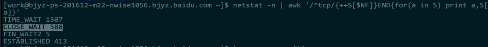

### TCP与UDP的区别


TCP头部20字节，UDP8个

### TCP的滑动窗口


### 滑动窗口协议：

- TCP协议的使用
- 维持发送方/接收方缓冲区
  缓冲区是 用来解决网络之间数据不可靠的问题，例如丢包，重复包，出错，乱序

在TCP协议中，发送方和接受方通过各自维护自己的缓冲区。通过商定包的重传机制等一系列操作，来解决不可靠的问题。

### 问题一：如何保证次序？

> 提出问题：在我们滑动窗口协议之前，我们如何来保证发送方与接收方之间，每个包都能被收到。并且是按次序的呢？


发送方发送一个包1，这时候接收方确认包1。发送包2，确认包2。就这样一直下去，知道把数据完全发送完毕，这样就结束了。那么就解决了丢包，出错，乱序等一些情况！同时也存在一些问题。问题：吞吐量非常的低。我们发完包1，一定要等确认包1.我们才能发送第二个包。

### 问题二：如何提高吞吐量？

> 提出问题：那么我们就不能先连发几个包等他一起确认吗？这样的话，我们的速度会不会更快，吞吐量更高些呢？


如图，这个就是我们把两个包一起发送，然后一起确认。可以看出我们改进的方案比之前的好很多，所花的时间只是一个来回的时间。接下来，我们还有一个问题：改善了吞吐量的问题

### 问题三：如何实现最优解？

> 问题：我们每次需要发多少个包过去呢？发送多少包是最优解呢？

我们能不能把第一个和第二个包发过去后，收到第一个确认包就把第三个包发过去呢？而不是去等到第二个包的确认包才去发第三个包。这样就很自然的产生了我们"滑动窗口"的实现。

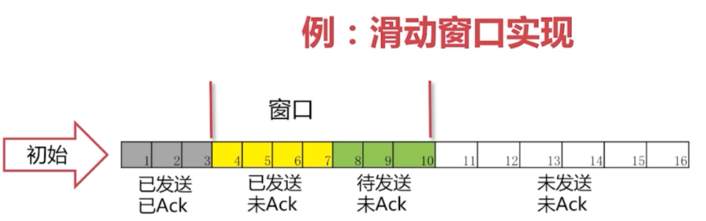

在图中，我们可看出灰色1号2号3号包已经发送完毕，并且已经收到Ack。这些包就已经是过去式。4、5、6、7号包是黄色的，表示已经发送了。但是并没有收到对方的Ack，所以也不知道接收方有没有收到。8、9、10号包是绿色的。是我们还没有发送的。这些绿色也就是我们接下来马上要发送的包。 可以看出我们的窗口正好是11格。后面的11-16还没有被读进内存。要等4号-10号包有接下来的动作后，我们的包才会继续往下发送。

#### 正常情况


可以看到4号包对方已经被接收到，所以被涂成了灰色。“窗口”就往右移一格，这里只要保证“窗口”是7格的。 我们就把11号包读进了我们的缓存。进入了“待发送”的状态。8、9号包已经变成了黄色，表示已经发送出去了。接下来的操作就是一样的了，确认包后，窗口往后移继续将未发送的包读进缓存，把“待发送“状态的包变为”已发送“。

#### 丢包情况

有可能我们包发过去，对方的Ack丢了。也有可能我们的包并没有发送过去。从发送方角度看就是我们没有收到Ack。


发生的情况：一直在等Ack。如果一直等不到的话，我们也会把读进缓存的待发送的包也一起发过去。但是，这个时候我们的窗口已经发满了。所以并不能把12号包读进来，而是始终在等待5号包的Ack。

> 如果我们这个Ack始终不来怎么办呢？

#### 超时重发

这时候我们有个解决方法：`超时重传`
这里有一点要说明：这个Ack是要按顺序的。必须要等到5的Ack收到，才会把6-11的Ack发送过去。这样就保证了滑动窗口的一个顺序。


这时候可以看出5号包已经接受到Ack，后面的6、7、8号包也已经发送过去已Ack。窗口便继续向后移动。

### HTTP相关

HTTP报文详解

HTTP有两种报文：请求报文和响应报文，具体介绍如下

#### **一、HTTP请求报文**

先上个图，细细分析

[](https://s3.51cto.com/wyfs02/M02/22/DA/wKioL1MpX-qwK1-PAAExXPRpR8M814.jpg)

HTTP请求报文主要包括请求行、请求头部以及请求的数据（实体）三部分

**请求行（HTTP请求报文的第一行）**

请求行由方法字段、URL字段和HTTP协议版本字段。其中，方法字段严格区分大小写，当前HTTP协议中的方法都是大写，方法字段如下介绍如下：

**方法字段**

①GET:请求获取Request-URI(URI:通用资源标识符,URL是其子集，URI注重的是标识，而URL强调的是位置，可以将URL看成原始的URI),所标识的资源

②POST：在Request-URI所标识的资源后附加新的数据；支持HTML表单提交，表单中有用户添入的数据，这些数据会发送到服务器端，由服务器存储至某位置（例如发送处理程序）

③HEAD:请求Request-URI所标识的资源响应消息报头，HEAD方法可以在响应时不返回消息体。

④PUT：与GET相反，请求服务器存储一个资源，并用Request-URI做为其标识；例如发布系统。

⑤DELETE：请求删除URL指向的资源

⑥OPTIONS：请求查询服务器的性能，或者查询与资源相关的选项

⑦TRACE：跟踪请求要经过的防火墙、代理或网关等，主要用于测试或诊断

⑧CONNECT保留将来使用

- **URL**

一个完整的包括类型、主机名和可选路径名的统一资源引用名，如：http://www.example.com/path/to/file.html

**请求头部：位于请求行的下面**

请求报文中常见的标头有：

Connetion标头（连接管理）、Host标头（指定请求资源的主机）、Range标头（请求实体的字节范围）、User-Agent标头（包含发出请求的用户信息）、Accept标头（首选的媒体类型）、Accept-Language(首选的自然语言)

**HTTP首部：**

**通用首部：请求和响应都可以使用的；**

Connection：定义C/S之间关于请求/响应的有关选项

对于http/1.0, Connection: keep-alive

Via: 显示了报文经过的中间节点

Cache-Control: 缓存指示

**实体首部：用于指定实体属性**

实体主体用于POST方法中。用户向Web服务器提交表单数据的时候，需要使用POST方法，此时主体中包含用户添写在表单的各个属性字段的值，当Web服务器收到POST方法的HTTP请求报文后，可以从实体中取出需要的属性字段的值。

也就是说，当用户通过Web浏览器向Web服务器发送请求时,Web浏览器会根据用户的具体请求来选择不同的HTTP请求方法，再将相应的URL和HTTP协议版本及相关的标头填入头部行中，若是POST方法，还会将相关的表单数据填入实体主体中，产生一个HTTP请求报文，然后将这个报文发送给Web服务器。

 

Location: 资源的新位置

Allow: 允许对此资源使用的请求方法

1、内容首部：

Content-Encoding：支持的编码

Content-Language：支持的自然语言

Content-Length：文本长度

Content-Location：资源所在位置

Content-Range：在整个资源中此实体表示的字节范围

Content-Type：主体的对象类型

2、缓存首部：

ETag: 实体标签

Expires: 过期期限

Last-Modified: 上一次的修改时间

#### **请求首部：**

Host: 请求的主机名和端口号，虚拟主机环境下用于不同的虚拟主机

Referer：指明了请求当前资源的原始资源的URL

User-Agent: 用户代理，使用什么工具发出的请求

1、Accept首部：用户标明客户自己更倾向于支持的能力

Accept: 指明服务器能发送的媒体类型

Accept-Charset: 支持使用的字符集

Accept-Encoding: 支持使用的编码方式

Accept-Language: 支持使用语言

2、条件请求首部：

Expect: 告诉服务器能够发送来哪些媒体类型

If-Modified-Since: 是否在指定时间以来修改过此资源

If-None-Match:如果提供的实体标记与当前文档的实体标记不符，就获取此文档

跟安全相关的请求首部：

Authorization: 客户端提交给服务端的认证数据，如帐号和密码

Cookie: 客户端发送给服务器端身份标识

[](https://s3.51cto.com/wyfs02/M02/22/DA/wKiom1MphduAsu6XAAM_loPLbc0713.jpg)

上图展示一般请求所带有的属性

=====================================================================================

#### **二、响应报文**

上图分析

[](https://s3.51cto.com/wyfs02/M02/22/DB/wKiom1MpmHWALc2UAADu14JLceA655.jpg)

HTTP响应报文同样也分为三部分，有状态行、首部行、实体

状态行:HTTP响应报文的第一行

状态行包括三个字段：协议版本、状态码与原因短语。

#### **状态码：**

**1xx：**

这一类型的状态码，代表请求已被接受，需要继续处理。这类响应是临时响应，只包含状态行和某些可选的响应头信息，并以空行结束。

**2xx:**

这一类型的状态码，代表请求已成功被服务器接收、理解、并接受。

**3xx:**

这类状态码代表需要客户端采取进一步的操作才能完成请求。通常，这些状态码用来重定向，后续的请求地址（重定向目标）在本次响应的Location域中指明。

**4xx:**

这类的状态码代表客户端类的错误

**5xx:**

服务器类的错误

常遇到的状态码说明

 

| 状态码 | 状态描述                   | 简要说明                                                     |
| ------ | -------------------------- | ------------------------------------------------------------ |
| 200    | OK                         | 客户端请求成功                                               |
| 201    | Created                    | 请求已经被实现，而且有一个新的资源已经依据请求的需要而创建，且其URI已经随Location头信息返回。 |
| 301    | Moved Permanently          | 被请求的资源已永久移动到新位置，并且将来任何对此资源的引用都应该使用本响应返回的若干个URI之一 |
| 302    | Found                      | 在响应报文中使用首部“Location: URL”指定临时资源位置          |
| 304    | Not Modified               | 条件式请求中使用                                             |
| 403    | Forbidden                  | 请求被服务器拒绝                                             |
| 404    | Not Found                  | 服务器无法找到请求的URL                                      |
| 405    | Method Not Allowed         | 不允许使用此方法请求相应的URL                                |
| 500    | Internal Server Error      | 服务器内部错误                                               |
| 502    | Bad Gateway                | 代理服务器从上游收到了一条伪响应                             |
| 503    | Service Unavailable        | 服务器此时无法提供服务，但将来可能可用                       |
| 505    | HTTP Version Not Supported | 服务器不支持，或者拒绝支持在请求中使用的HTTP版本。这暗示着服务器不能或不愿使用与客户端相同的版本。响应中应当包含一个描述了为何版本不被支持以及服务器支持哪些协议的实体。 |

#### **响应首部（首部行）**：

位于响应报文状态行之后

Date标头：消息产生的时间

Age标头:（从最初创建开始）响应持续时间

Server标头: 向客户端标明服务器程序名称和版本

ETage标头：不透明验证者

Location标头：URL备用的位置

Content-Length标头：实体的长度

Content-Type标头：实体的媒体类型

协商首部：

Accept-Ranges: 对当前资源来讲，服务器所能够接受的范围类型

Vary: 首部列表，服务器会根据列表中的内容挑选出最适合的版本发送给客户端

跟安全相关的响应首部：

Set-Cookie: 服务器端在某客户端第一次请求时发给令牌

WWW-Authentication: 质询，即要求客户提供帐号和密码

响应首部一般包含如下内容：

[](https://s3.51cto.com/wyfs02/M02/22/DB/wKiom1MprnXiYF18AALhmNtc3OE334.jpg)

**实体**：位于首部行之后

实体包含了Web客户端请求的对象。Content-Length标头及Content-Type标头用于计算实体的位置、数据类型和数据长度。当Web服务器接收到Web客户端的请求报文后，对HTTP请求报文进行解析，并将Web客户端的请求的对象取出打包，通过HTTP响应报文将数据传回给Web客户端，如果出现错误则返回包含对应错误的错误代码和错误原因的HTTP响应报文。


 


### HTTP与HTTPS区别


s


作者：herongwei
链接：https://zhuanlan.zhihu.com/p/108822858
来源：知乎
著作权归作者所有。商业转载请联系作者获得授权，非商业转载请注明出处。


**1、UDP 和 TCP 的特点与区别**

**2、UDP 、TCP 首部格式**

**3、TCP 的三次握手和四次挥手**

**4、TCP 的三次握手（为什么三次？）**

**5、TCP 的四次挥手（为什么四次？）**

**6、TCP 长连接和短连接的区别**

**7、TCP粘包、拆包及解决办法**

**8、TCP 可靠传输**

**9、TCP 滑动窗口**

**10、TCP 流量控制**

**11、TCP 拥塞控制**

**12、提供网络利用率**


### **前言**

网络层只把分组发送到目的主机，但是真正通信的并不是主机而是主机中的进程。传输层提供了进程间的逻辑通信，传输层向高层用户屏蔽了下面网络层的核心细节，使应用程序看起来像是在两个传输层实体之间有一条端到端的逻辑通信信道。

**1、UDP 和 TCP 的特点与区别**

**用户数据报协议 UDP（User Datagram Protocol）**

是无连接的，尽最大可能交付，没有拥塞控制，面向报文（对于应用程序传下来的报文不合并也不拆分，只是添加 UDP 首部），支持一对一、一对多、多对一和多对多的交互通信。

**传输控制协议 TCP（Transmission Control Protocol）**

是面向连接的，提供可靠交付，有流量控制，拥塞控制，提供全双工通信，面向字节流（把应用层传下来的报文看成字节流，把字节流组织成大小不等的数据块），每一条 TCP 连接只能是点对点的（一对一）。

### **2、UDP 、TCP 首部格式** 


UDP 首部字段只有 8 个字节，包括源端口、目的端口、长度、检验和。12 字节的伪首部是为了计算检验和临时添加的。


TCP 首部格式比 UDP 复杂。

**序号：**用于对字节流进行编号，例如序号为 301，表示第一个字节的编号为 301，如果携带的数据长度为 100 字节，那么下一个报文段的序号应为 401。

**确认号：**期望收到的下一个报文段的序号。例如 B 正确收到 A 发送来的一个报文段，序号为 501，携带的数据长度为 200 字节，因此 B 期望下一个报文段的序号为 701，B 发送给 A 的确认报文段中确认号就为 701。

**数据偏移：**指的是数据部分距离报文段起始处的偏移量，实际上指的是首部的长度。

**控制位：**八位从左到右分别是 CWR，ECE，URG，ACK，PSH，RST，SYN，FIN。

**CWR：**CWR 标志与后面的 ECE 标志都用于 IP 首部的 ECN 字段，ECE 标志为 1 时，则通知对方已将拥塞窗口缩小；

**ECE：**若其值为 1 则会通知对方，从对方到这边的网络有阻塞。在收到数据包的 IP 首部中 ECN 为 1 时将 TCP 首部中的 ECE 设为 1；

**URG：**该位设为 1，表示包中有需要紧急处理的数据，对于需要紧急处理的数据，与后面的紧急指针有关；

**ACK：**该位设为 1，确认应答的字段有效，TCP规定除了最初建立连接时的 SYN 包之外该位必须设为 1；

**PSH：**该位设为 1，表示需要将收到的数据立刻传给上层应用协议，若设为 0，则先将数据进行缓存；

**RST：**该位设为 1，表示 TCP 连接出现异常必须强制断开连接；

**SYN：**用于建立连接，该位设为 1，表示希望建立连接，并在其序列号的字段进行序列号初值设定；

**FIN：**该位设为 1，表示今后不再有数据发送，希望断开连接。当通信结束希望断开连接时，通信双方的主机之间就可以相互交换 FIN 位置为 1 的 TCP 段。

每个主机又对对方的 FIN 包进行确认应答之后可以断开连接。不过，主机收到 FIN 设置为 1 的 TCP 段之后不必马上回复一个 FIN 包，而是可以等到缓冲区中的所有数据都因为已成功发送而被自动删除之后再发 FIN 包；

**窗口：**窗口值作为接收方让发送方设置其发送窗口的依据。之所以要有这个限制，是因为接收方的数据缓存空间是有限的。

### **3、什么是 TCP 的三次握手和四次挥手？**

TCP 是一种面向连接的单播协议，在发送数据前，通信双方必须在彼此间建立一条连接。所谓的“连接”，其实是客户端和服务器的内存里保存的一份关于对方的信息，如 IP 地址、端口号等。

TCP 可以看成是一种字节流，它会处理 IP 层或以下的层的丢包、重复以及错误问题。在连接的建立过程中，双方需要交换一些连接的参数。这些参数可以放在 TCP 头部。

TCP 提供了一种可靠、面向连接、字节流、传输层的服务，采用三次握手建立一个连接；采用四次挥手来关闭一个连接。

一个 TCP 连接由一个 4 元组构成，分别是两个 IP 地址和两个端口号。一个TCP连接通常分为三个阶段：启动、数据传输、退出（关闭）。

当 TCP 接收到另一端的数据时，它会发送一个确认，但这个确认不会立即发送，一般会延迟一会（提供网络利用率这部分有讲到）。

ACK 是累积的，一个确认字节号 N 的 ACK 表示所有直到 N 的字节（不包括 N）已经成功被接收了。这样的好处是如果一个 ACK 丢失，很可能后续的 ACK 就足以确认前面的报文段了。

**一个完整的 TCP 连接是双向和对称的，数据可以在两个方向上平等地流动。给上层应用程序提供一种双工服务。一旦建立了一个连接，这个连接的一个方向上的每个 TCP 报文段都包含了相反方向上的报文段的一个 ACK。**

序列号的作用是使得一个 TCP 接收端可丢弃重复的报文段，记录以杂乱次序到达的报文段。因为 TCP 使用 IP 来传输报文段，而IP 不提供重复消除或者保证次序正确的功能。

另一方面，TCP 是一个字节流协议，绝不会以杂乱的次序给上层程序发送数据。因此 TCP 接收端会被迫先保持大序列号的数据不交给应用程序，直到缺失的小序列号的报文段被填满。

### **4、TCP 的三次握手（为什么三次？）**

三次握手：


假设 A 为客户端，B 为服务器端。

首先 B 处于 LISTEN（监听）状态，等待客户的连接请求。

- A 向 B 发送连接请求报文，SYN=1，ACK=0，选择一个初始的序号 x。
- B 收到连接请求报文，如果同意建立连接，则向 A 发送连接确认报文，SYN=1，ACK=1，确认号为 x+1，同时也选择一个初始的序号 y。
- A 收到 B 的连接确认报文后，还要向 B 发出确认，确认号为 y+1，序号为 x+1。

B 收到 A 的确认后，连接建立。

**为什么三次？**

1、第三次握手是为了防止失效的连接请求到达服务器，让服务器错误打开连接。

2、换个易于理解的视角来看为什么要 3 次握手。

客户端和服务端通信前要进行连接，“3次握手”的作用就是双方都能明确自己和对方的收、发能力是正常的。

第一次握手：客户端发送网络包，服务端收到了。这样服务端就能得出结论：客户端的发送能力、服务端的接收能力是正常的。

第二次握手：服务端发包，客户端收到了。这样客户端就能得出结论：服务端的接收、发送能力，客户端的接收、发送能力是正常的。从客户端的视角来看，我接到了服务端发送过来的响应数据包，说明服务端接收到了我在第一次握手时发送的网络包，并且成功发送了响应数据包，这就说明，服务端的接收、发送能力正常。而另一方面，我收到了服务端的响应数据包，说明我第一次发送的网络包成功到达服务端，这样，我自己的发送和接收能力也是正常的。

第三次握手：客户端发包，服务端收到了。这样服务端就能得出结论：客户端的接收、发送能力，服务端的发送、接收能力是正常的。第一、二次握手后，服务端并不知道客户端的接收能力以及自己的发送能力是否正常。

而在第三次握手时，服务端收到了客户端对第二次握手作的回应。从服务端的角度，我在第二次握手时的响应数据发送出去了，客户端接收到了。所以，我的发送能力是正常的。而客户端的接收能力也是正常的。

经历了上面的三次握手过程，客户端和服务端都确认了自己的接收、发送能力是正常的。之后就可以正常通信了。

**每次都是接收到数据包的一方可以得到一些结论，发送的一方其实没有任何头绪。我虽然有发包的动作，但是我怎么知道我有没有发出去，而对方有没有接收到呢？**

而从上面的过程可以看到，最少是需要三次握手过程的。两次达不到让双方都得出自己、对方的接收、发送能力都正常的结论。

其实每次收到网络包的一方至少是可以得到：对方的发送、我方的接收是正常的。而每一步都是有关联的，下一次的“响应”是由于第一次的“请求”触发，因此每次握手其实是可以得到额外的结论的。

比如第三次握手时，服务端收到数据包，表明看服务端只能得到客户端的发送能力、服务端的接收能力是正常的，但是结合第二次，说明服务端在第二次发送的响应包，客户端接收到了，并且作出了响应，从而得到额外的结论：客户端的接收、服务端的发送是正常的。

### **5、TCP 的四次挥手（为什么四次？）**

四次挥手：

****

- 客户端发送一个 FIN 段，并包含一个希望接收者看到的自己当前的序列号 K. 同时还包含一个 ACK 表示确认对方最近一次发过来的数据。
- 服务端将 K 值加 1 作为 ACK 序号值，表明收到了上一个包。这时上层的应用程序会被告知另一端发起了关闭操作，通常这将引起应用程序发起自己的关闭操作。
- 服务端发起自己的 FIN 段，ACK=K+1, Seq=L。
- 客户端确认。进入 TIME-WAIT 状态，等待 2 MSL（最大报文存活时间）后释放连接。ACK=L+1。

**为什么建立连接是三次握手，而关闭连接却是四次挥手呢？**

1、TCP连接是双向传输的对等的模式，就是说双方都可以同时向对方发送或接收数据。当有一方要关闭连接时，会发送指令告知对方，我要关闭连接了。

**2、这时对方会回一个ACK，此时一个方向的连接关闭。但是另一个方向仍然可以继续传输数据，也就是说，服务端收到客户端的 FIN 标志，知道客户端想要断开这次连接了，但是，我服务端，我还想发数据呢？我等到发送完了所有的数据后，会发送一个 FIN 段来关闭此方向上的连接。接收方发送 ACK确认关闭连接。**

注意，接收到FIN报文的一方只能回复一个ACK, 它是无法马上返回对方一个FIN报文段的，因为结束数据传输的“指令”是上层应用层给出的，我只是一个“搬运工”，我无法了解“上层的意志”。

3、客户端发送了 FIN 连接释放报文之后，服务器收到了这个报文，就进入了 CLOSE-WAIT 状态。这个状态是为了让服务器端发送还未传送完毕的数据，传送完毕之后，服务器会发送 FIN 连接释放报文。

4、因为服务端在 LISTEN 状态下，收到建立连接请求的 SYN 报文后，把 ACK 和 SYN 放在一个报文里发送给客户端。而关闭连接时，当收到对方的 FIN 报文时，仅仅表示对方不再发送数据了但是还能接收数据，己方是否现在关闭发送数据通道，需要上层应用来决定，因此，己方 ACK 和 FIN 一般都会分开发。

**TIME_WAIT**

客户端接收到服务器端的 FIN 报文后进入此状态，此时并不是直接进入 CLOSED 状态，还需要等待一个时间计时器设置的时间 2MSL。这么做有两个理由：

- 确保最后一个确认报文能够到达。如果 B 没收到 A 发送来的确认报文，那么就会重新发送连接释放请求报文，A 等待一段时间就是为了处理这种情况的发生。
- 等待一段时间是为了让本连接持续时间内所产生的所有报文都从网络中消失，使得下一个新的连接不会出现旧的连接请求报文。

### **6、TCP 短连接和长连接的区别**

**短连接：**Client 向 Server 发送消息，Server 回应 Client，然后一次读写就完成了，这时候双方任何一个都可以发起 close 操作，不过一般都是 Client 先发起 close 操作。短连接一般只会在 Client/Server 间传递一次读写操作。

短连接的优点：管理起来比较简单，建立存在的连接都是有用的连接，不需要额外的控制手段。

**长连接：**Client 与 Server 完成一次读写之后，它们之间的连接并不会主动关闭，后续的读写操作会继续使用这个连接。

在长连接的应用场景下，Client 端一般不会主动关闭它们之间的连接，Client 与 Server 之间的连接如果一直不关闭的话，随着客户端连接越来越多，Server 压力也越来越大，这时候 Server 端需要采取一些策略，如关闭一些长时间没有读写事件发生的连接，这样可以避免一些恶意连接导致 Server 端服务受损；如果条件再允许可以以客户端为颗粒度，限制每个客户端的最大长连接数，从而避免某个客户端连累后端的服务。

长连接和短连接的产生在于 Client 和 Server 采取的关闭策略，具体的应用场景采用具体的策略。

### **7、TCP粘包、拆包及解决办法**

**为什么常说 TCP 有粘包和拆包的问题而不说 UDP ？**

由前两节可知，UDP 是基于报文发送的，UDP首部采用了 16bit 来指示 UDP 数据报文的长度，因此在应用层能很好的将不同的数据报文区分开，从而避免粘包和拆包的问题。

而 TCP 是基于字节流的，虽然应用层和 TCP 传输层之间的数据交互是大小不等的数据块，但是 TCP 并没有把这些数据块区分边界，仅仅是一连串没有结构的字节流；另外从 TCP 的帧结构也可以看出，在 TCP 的首部没有表示数据长度的字段，基于上面两点，在使用 TCP 传输数据时，才有粘包或者拆包现象发生的可能。

**什么是粘包、拆包？**

假设 Client 向 Server 连续发送了两个数据包，用 packet1 和 packet2 来表示，那么服务端收到的数据可以分为三种情况，现列举如下：

第一种情况，接收端正常收到两个数据包，即没有发生拆包和粘包的现象。


第二种情况，接收端只收到一个数据包，但是这一个数据包中包含了发送端发送的两个数据包的信息，这种现象即为粘包。这种情况由于接收端不知道这两个数据包的界限，所以对于接收端来说很难处理。


第三种情况，这种情况有两种表现形式，如下图。接收端收到了两个数据包，但是这两个数据包要么是不完整的，要么就是多出来一块，这种情况即发生了拆包和粘包。这两种情况如果不加特殊处理，对于接收端同样是不好处理的。


**为什么会发生 TCP 粘包、拆包？**

- 要发送的数据大于 TCP 发送缓冲区剩余空间大小，将会发生拆包。
- 待发送数据大于 MSS（最大报文长度），TCP 在传输前将进行拆包。
- 要发送的数据小于 TCP 发送缓冲区的大小，TCP 将多次写入缓冲区的数据一次发送出去，将会发生粘包。
- 接收数据端的应用层没有及时读取接收缓冲区中的数据，将发生粘包。

**粘包、拆包解决办法**

由于 TCP 本身是面向字节流的，无法理解上层的业务数据，所以在底层是无法保证数据包不被拆分和重组的，这个问题只能通过上层的应用协议栈设计来解决，根据业界的主流协议的解决方案，归纳如下：

- **消息定长：**发送端将每个数据包封装为固定长度（不够的可以通过补 0 填充），这样接收端每次接收缓冲区中读取固定长度的数据就自然而然的把每个数据包拆分开来。
- **设置消息边界：**服务端从网络流中按消息边界分离出消息内容。在包尾增加回车换行符进行分割，例如 FTP 协议。
- **将消息分为消息头和消息体：**消息头中包含表示消息总长度（或者消息体长度）的字段。
- 更复杂的应用层协议比如 Netty 中实现的一些协议都对粘包、拆包做了很好的处理。

### **8、TCP 可靠传输**

TCP 使用超时重传来实现可靠传输：如果一个已经发送的报文段在超时时间内没有收到确认，那么就重传这个报文段。

一个报文段从发送再到接收到确认所经过的时间称为往返时间 RTT，加权平均往返时间 RTTs 计算如下：

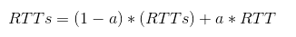

其中，0 ≤ a ＜ 1，RTTs 随着 a 的增加更容易受到 RTT 的影响。超时时间 RTO 应该略大于 RTTs，TCP 使用的超时时间计算如下：


其中 RTTd 为偏差的加权平均值。

### **9、TCP 滑动窗口**

窗口是缓存的一部分，用来暂时存放字节流。发送方和接收方各有一个窗口，接收方通过 TCP 报文段中的窗口字段告诉发送方自己的窗口大小，发送方根据这个值和其它信息设置自己的窗口大小。

发送窗口内的字节都允许被发送，接收窗口内的字节都允许被接收。如果发送窗口左部的字节已经发送并且收到了确认，那么就将发送窗口向右滑动一定距离，直到左部第一个字节不是已发送并且已确认的状态；接收窗口的滑动类似，接收窗口左部字节已经发送确认并交付主机，就向右滑动接收窗口。

接收窗口只会对窗口内最后一个按序到达的字节进行确认，例如接收窗口已经收到的字节为 {31, 34, 35}，其中 {31} 按序到达，而 {34, 35} 就不是，因此只对字节 31 进行确认。发送方得到一个字节的确认之后，就知道这个字节之前的所有字节都已经被接收。


### **10、TCP 流量控制**

流量控制是为了控制发送方发送速率，保证接收方来得及接收。

接收方发送的确认报文中的窗口字段可以用来控制发送方窗口大小，从而影响发送方的发送速率。将窗口字段设置为 0，则发送方不能发送数据。

**实际上，为了避免此问题的产生，发送端主机会时不时的发送一个叫做窗口探测的数据段**，此数据段仅包含一个字节来获取最新的窗口大小信息。

### **11、TCP 拥塞控制**

如果网络出现拥塞，分组将会丢失，此时发送方会继续重传，从而导致网络拥塞程度更高。因此当出现拥塞时，应当控制发送方的速率。这一点和流量控制很像，但是出发点不同。流量控制是为了让接收方能来得及接收，而拥塞控制是为了降低整个网络的拥塞程度。


TCP 主要通过四个算法来进行拥塞控制：

**慢开始、拥塞避免、快重传、快恢复。**

发送方需要维护一个叫做拥塞窗口（cwnd）的状态变量，注意拥塞窗口与发送方窗口的区别：拥塞窗口只是一个状态变量，实际决定发送方能发送多少数据的是发送方窗口。

为了便于讨论，做如下假设：

- 接收方有足够大的接收缓存，因此不会发生流量控制；
- 虽然 TCP 的窗口基于字节，但是这里设窗口的大小单位为报文段。


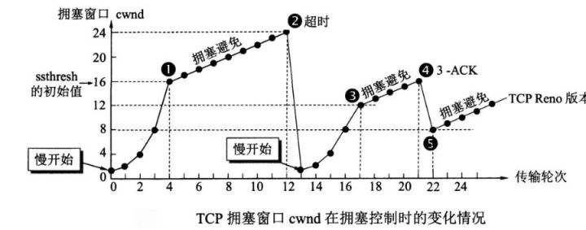


**慢开始与拥塞避免**

发送的最初执行慢开始，令 cwnd = 1，发送方只能发送 1 个报文段；当收到确认后，将 cwnd 加倍，因此之后发送方能够发送的报文段数量为：2、4、8 ...

注意到慢开始每个轮次都将 cwnd 加倍，这样会让 cwnd 增长速度非常快，从而使得发送方发送的速度增长速度过快，网络拥塞的可能性也就更高。设置一个慢开始门限 ssthresh，当 cwnd >= ssthresh 时，进入拥塞避免，每个轮次只将 cwnd 加 1。

如果出现了超时，则令 ssthresh = cwnd / 2，然后重新执行慢开始。

**快重传与快恢复**

在接收方，要求每次接收到报文段都应该对最后一个已收到的有序报文段进行确认。例如已经接收到 M1 和 M2，此时收到 M4，应当发送对 M2 的确认。

在发送方，如果收到三个重复确认，那么可以知道下一个报文段丢失，此时执行快重传，立即重传下一个报文段。例如收到三个 M2，则 M3 丢失，立即重传 M3。

在这种情况下，只是丢失个别报文段，而不是网络拥塞。因此执行快恢复，令 ssthresh = cwnd / 2 ，cwnd = ssthresh，注意到此时直接进入拥塞避免。

慢开始和快恢复的快慢指的是 cwnd 的设定值，而不是 cwnd 的增长速率。慢开始 cwnd 设定为 1，而快恢复 cwnd 设定为 ssthresh。


### **12、提供网络利用率**

**1、Nagle 算法**

发送端即使还有应该发送的数据，但如果这部分数据很少的话，则进行延迟发送的一种处理机制。具体来说，就是仅在下列任意一种条件下才能发送数据。如果两个条件都不满足，那么暂时等待一段时间以后再进行数据发送。

- 已发送的数据都已经收到确认应答。
- 可以发送最大段长度的数据时。

**2、延迟确认应答**

接收方收到数据之后可以并不立即返回确认应答，而是延迟一段时间的机制。

- 在没有收到 2*最大段长度的数据为止不做确认应答。
- 其他情况下，最大延迟 0.5秒 发送确认应答。
- TCP 文件传输中，大多数是每两个数据段返回一次确认应答。

**3、捎带应答**

在一个 TCP 包中既发送数据又发送确认应答的一种机制，由此，网络利用率会提高，计算机的负荷也会减轻，但是这种应答必须等到应用处理完数据并将作为回执的数据返回为止。


## 9. 数据库

### 数据库架构

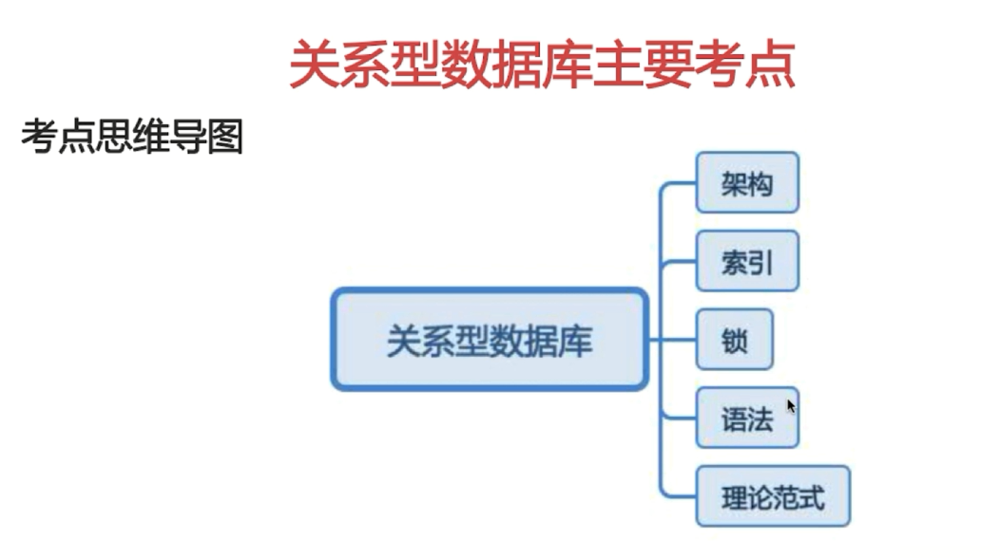


### 优化索引-二叉查找树


二叉  数据多 深度深，每层一次IO，导致效率低下

### 优化索引-运用B树


减少IO次数


### 优化索引-运用B+树


### 优化索引-运用Hash以及BitMap


### 为什么说B+树比B树更适合数据库索引？

1、 **B+树的磁盘读写代价更低：B+树的内部节点并没有指向关键字具体信息的指针，因此其内部节点相对B树更小，如果把所有同一内部节点的关键字存放在同一盘块中，那么盘块所能容纳的关键字数量也越多，一次性读入内存的需要查找的关键字也就越多，相对IO读写次数就降低了。**

2、**B+树的查询效率更加稳定：由于非终结点并不是最终指向文件内容的结点，而只是叶子结点中关键字的索引。所以任何关键字的查找必须走一条从根结点到叶子结点的路。所有关键字查询的路径长度相同，导致每一个数据的查询效率相当。**

**3、由于B+树的数据都存储在叶子结点中，分支结点均为索引，方便扫库，只需要扫一遍叶子结点即可，但是B树因为其分支结点同样存储着数据，我们要找到具体的数据，需要进行一次中序遍历按序来扫，所以B+树更加适合在区间查询的情况，所以通常B+树用于数据库索引。**

PS：我在知乎上看到有人是这样说的,我感觉说的也挺有道理的：

他们认为数据库索引采用B+树的主要原因是：B树在提高了IO性能的同时并没有解决元素遍历的我效率低下的问题，正是为了解决这个问题，B+树应用而生。B+树只需要去遍历叶子节点就可以实现整棵树的遍历。而且在数据库中基于范围的查询是非常频繁的，而B树不支持这样的操作或者说效率太低。

今天看了几篇文章，自己总结一下。

数据库使用B+树肯定是为了提升查找效率。

但是具体如何提升查找效率呢？

查找数据，最简单的方式是顺序查找。但是对于几十万上百万，甚至上亿的数据库查询就很慢了。

所以要对查找的方式进行优化，熟悉的二分查找，二叉树可以把速度提升到O(log(n,2))，查询的瓶颈在于树的深度，最坏的情况要查找到二叉树的最深层，由于，每查找深一层，就要访问更深一层的索引文件。在多达数G的索引文件中，这将是很大的开销。所以，尽量把数据结构设计的更为‘矮胖’一点就可以减少访问的层数。在众多的解决方案中，B-/B+树很好的适合。B-树定义具体可以查阅，简而言之就是中间节点可以多余两个子节点，而且中间的元素可以是一个域。相比B-树，B+树的父节点也必须存在于子节点中，是其中最大或者最小元素，B+树的节点只存储索引key值，具体信息的地址存在于叶子节点的地址中。这就使以页为单位的索引中可以存放更多的节点。减少更多的I/O支出。因此，B+树成为了数据库比较优秀的数据结构，MySQL中MyIsAM和InnoDB都是采用的B+树结构。不同的是前者是非聚集索引，后者主键是聚集索引，所谓聚集索引是物理地址连续存放的索引，在取区间的时候，查找速度非常快，但同样的，插入的速度也会受到影响而降低。聚集索引的物理位置使用链表来进行存储。

### 索引失效

#### 创建索引的原则

- 最左前缀匹配原则
- 频繁作为查询条件的字段才去创建索引
- 频繁更新的字段不适合创建索引
- 索引列不能参与计算，不能有函数操作
- 优先考虑扩展索引，而不是新建索引，避免不必要的索引
- 在order by或者group by子句中，创建索引需要注意顺序
- 区分度低的数据列不适合做索引列(如性别）
- 定义有外键的数据列一定要建立索引
- 对于定义为text、image数据类型的列不要建立索引
- 删除不再使用或者很少使用的索引

#### 索引失效的情况

- 查询条件包含or，**可能**导致索引失效

  where子句中包含or，并且or条件连接的字段中不是都有索引，则索引失效；

  如果我们想用or又想让它命中索引，那么只能将or条件中的每一列都加上索引！！！

- like通配符**可能**导致索引失效。（解决方法：使用覆盖索引）

  如果用like查询的话，%在最左边则索引失效，%在右边会命中索引；

  但是当我们使用索引列进行查询的时候，就都会命中索引！！！

- 如果字段类型是字符串，where时一定用引号括起来，否则索引失效

- 联合索引，查询时的条件列不是联合索引中的第一个列，索引失效。

- 在索引列上使用MySQL的内置函数，索引失效。

- 对索引列运算（如，+、-、*、/），索引失效。

- 索引字段上使用（!= 或者 < >，not in）时，**可能**会导致索引失效。

- 索引字段上使用is null， is not null，**可能**导致索引失效。

- 左连接查询或者右连接查询查询关联的字段编码格式不一样，可能导致索引失效。

- MySQL估计使用全表扫描要比使用索引快,则不使用索引。

补充知识：

【覆盖索引】：一个索引中包含所有需要查询字段的值。优点：无需回表，只需要在一棵索引树上就能获取SQL所需的所有列数据，无需回表，速度更快。

【回表】：二级索引无法直接查询所有列的数据，所以通过二级索引查询到聚集索引后，再通过聚集索引查询到想要的数据，这种通过二级索引查询出来的过程，就叫做回表。就是先通过数据库索引扫描出数据所在的行，再通过行主键id取出索引中未提供的数据，即基于非主键索引的查询需要多扫描一棵索引树。

常见的方法是：将被查询的字段，建立到联合索引里去。

普通索引的查询过程，通常情况下，需要扫码两遍索引树。

例如：

```mysql
select * from t where name = 'lisi';　
```


### 红黑树

红黑树也是二叉查找树，我们知道，二叉查找树这一数据结构并不难，而红黑树之所以难是难在它是自平衡的二叉查找树，在进行插入和删除等可能会破坏树的平衡的操作时，需要重新自处理达到平衡状态。现在在脑海想下怎么实现？是不是太多情景需要考虑了？啧啧，先别急，通过本文的学习后，你会觉得，其实也不过如此而已。好吧，我们先来看下红黑树的定义和一些基本性质。

#### 红黑树定义和性质

红黑树是一种含有红黑结点并能自平衡的二叉查找树。它必须满足下面性质：

- 性质1：每个节点要么是黑色，要么是红色。
- 性质2：根节点是黑色。
- 性质3：每个叶子节点（NIL）是黑色。
- 性质4：每个红色结点的两个子结点一定都是黑色。
- **性质5：任意一结点到每个叶子结点的路径都包含数量相同的黑结点。**

从性质5又可以推出：

- 性质5.1：如果一个结点存在黑子结点，那么该结点肯定有两个子结点

图1就是一颗简单的红黑树。其中Nil为叶子结点，并且它是黑色的。(值得提醒注意的是，在Java中，叶子结点是为null的结点。)


图1 一颗简单的红黑树

红黑树并不是一个*完美*平衡二叉查找树，从图1可以看到，根结点P的左子树显然比右子树高，但左子树和右子树的黑结点的层数是相等的，也即任意一个结点到到每个叶子结点的路径都包含数量相同的黑结点(性质5)。所以我们叫红黑树这种平衡为**黑色完美平衡**。

介绍到此，为了后面讲解不至于混淆，我们还需要来约定下红黑树一些结点的叫法，如图2所示。


图2 结点叫法约定

我们把正在处理(遍历)的结点叫做当前结点，如图2中的D，它的父亲叫做父结点，它的父亲的另外一个子结点叫做兄弟结点，父亲的父亲叫做祖父结点。

前面讲到红黑树能自平衡，它靠的是什么？三种操作：左旋、右旋和变色。

- **左旋**：以某个结点作为支点(旋转结点)，其右子结点变为旋转结点的父结点，右子结点的左子结点变为旋转结点的右子结点，左子结点保持不变。如图3。
- **右旋**：以某个结点作为支点(旋转结点)，其左子结点变为旋转结点的父结点，左子结点的右子结点变为旋转结点的左子结点，右子结点保持不变。如图4。
- **变色**：结点的颜色由红变黑或由黑变红。


图3 左旋


图4 右旋

上面所说的旋转结点也即旋转的支点，图4和图5中的P结点。
 我们先忽略颜色，可以看到旋转操作不会影响旋转结点的父结点，父结点以上的结构还是保持不变的。
 **左旋**只影响旋转结点和其**右子树**的结构，把右子树的结点往左子树挪了。
 **右旋**只影响旋转结点和其**左子树**的结构，把左子树的结点往右子树挪了。

所以旋转操作是**局部**的。另外可以看出旋转能保持红黑树平衡的一些端详了：当一边子树的结点少了，那么向另外一边子树“借”一些结点；当一边子树的结点多了，那么向另外一边子树“租”一些结点。

但要保持红黑树的性质，结点不能乱挪，还得靠变色了。怎么变？具体情景又不同变法，后面会具体讲到，现在只需要记住**红黑树总是通过旋转和变色达到自平衡**。

balabala了这么多，相信你对红黑树有一定印象了，那么现在来考考你：

***思考题1：黑结点可以同时包含一个红子结点和一个黑子结点吗？\*** (答案见文末)

接下来先讲解红黑树的查找热热身。

------

#### 红黑树查找

因为红黑树是一颗二叉平衡树，并且查找不会破坏树的平衡，所以查找跟二叉平衡树的查找无异：

1. 从根结点开始查找，把根结点设置为当前结点；
2. 若当前结点为空，返回null；
3. 若当前结点不为空，用当前结点的key跟查找key作比较；
4. 若当前结点key等于查找key，那么该key就是查找目标，返回当前结点；
5. 若当前结点key大于查找key，把当前结点的左子结点设置为当前结点，重复步骤2；
6. 若当前结点key小于查找key，把当前结点的右子结点设置为当前结点，重复步骤2；

如图5所示。


图5 二叉树查找流程图

非常简单，但简单不代表它效率不好。正由于红黑树总保持黑色完美平衡，所以它的查找最坏时间复杂度为O(2lgN)，也即整颗树刚好红黑相隔的时候。能有这么好的查找效率得益于红黑树自平衡的特性，而这背后的付出，红黑树的插入操作功不可没～

------

#### 红黑树插入

插入操作包括两部分工作：一查找插入的位置；二插入后自平衡。查找插入的父结点很简单，跟查找操作区别不大：

1. 从根结点开始查找；
2. 若根结点为空，那么插入结点作为根结点，结束。
3. 若根结点不为空，那么把根结点作为当前结点；
4. 若当前结点为null，返回当前结点的父结点，结束。
5. 若当前结点key等于查找key，那么该key所在结点就是插入结点，更新结点的值，结束。
6. 若当前结点key大于查找key，把当前结点的左子结点设置为当前结点，重复步骤4；
7. 若当前结点key小于查找key，把当前结点的右子结点设置为当前结点，重复步骤4；

如图6所示。


图6 红黑树插入位置查找

ok，插入位置已经找到，把插入结点放到正确的位置就可以啦，但插入结点是应该是什么颜色呢？答案是**红色**。理由很简单，红色在父结点（如果存在）为黑色结点时，红黑树的黑色平衡没被破坏，不需要做自平衡操作。但如果插入结点是黑色，那么插入位置所在的子树黑色结点总是多1，必须做自平衡。

所有插入情景如图7所示。


图7 红黑树插入情景

嗯，插入情景很多呢，8种插入情景！但情景1、2和3的处理很简单，而情景4.2和情景4.3只是方向反转而已，懂得了一种情景就能推出另外一种情景，所以总体来看，并不复杂，后续我们将一个一个情景来看，把它彻底搞懂。

另外，根据二叉树的性质，**除了情景2，所有插入操作都是在叶子结点进行的**。这点应该不难理解，因为查找插入位置时，我们就是在找子结点为空的父结点的。

在开始每个情景的讲解前，我们还是先来约定下，如图8所示。


图8 插入操作结点的叫法约定

图8的字母并不代表结点Key的大小。I表示插入结点，P表示插入结点的父结点，S表示插入结点的叔叔结点，PP表示插入结点的祖父结点。

好了，下面让我们一个一个来分析每个插入的情景以其处理。

##### 插入情景1：红黑树为空树

最简单的一种情景，直接把插入结点作为根结点就行，但注意，根据红黑树性质2：根节点是黑色。还需要把插入结点设为黑色。

**处理：把插入结点作为根结点，并把结点设置为黑色**。

##### 插入情景2：插入结点的Key已存在

插入结点的Key已存在，既然红黑树总保持平衡，在插入前红黑树已经是平衡的，那么把插入结点设置为将要替代结点的颜色，再把结点的值更新就完成插入。

**处理：**

- **把I设为当前结点的颜色**
- **更新当前结点的值为插入结点的值**

##### 插入情景3：插入结点的父结点为黑结点

由于插入的结点是红色的，当插入结点的黑色时，并不会影响红黑树的平衡，直接插入即可，无需做自平衡。

**处理：直接插入**。

##### 插入情景4：插入结点的父结点为红结点

再次回想下红黑树的性质2：根结点是黑色。**如果插入的父结点为红结点，那么该父结点不可能为根结点，所以插入结点总是存在祖父结点**。这点很重要，因为后续的旋转操作肯定需要祖父结点的参与。

情景4又分为很多子情景，下面将进入重点部分，各位看官请留神了。

**插入情景4.1：叔叔结点存在并且为红结点**
 从红黑树性质4可以，祖父结点肯定为黑结点，因为不可以同时存在两个相连的红结点。那么此时该插入子树的红黑层数的情况是：黑红红。显然最简单的处理方式是把其改为：红黑红。如图9和图10所示。

**处理：**

- **将P和S设置为黑色**
- **将PP设置为红色**
- **把PP设置为当前插入结点**


图9 插入情景4.1_1


图10 插入情景4.1_2

可以看到，我们把PP结点设为红色了，如果PP的父结点是黑色，那么无需再做任何处理；但如果PP的父结点是红色，根据性质4，此时红黑树已不平衡了，所以还需要把PP当作新的插入结点，继续做插入操作自平衡处理，直到平衡为止。

试想下PP刚好为根结点时，那么根据性质2，我们必须把PP重新设为黑色，那么树的红黑结构变为：黑黑红。换句话说，从根结点到叶子结点的路径中，黑色结点增加了。**这也是唯一一种会增加红黑树黑色结点层数的插入情景**。

我们还可以总结出另外一个经验：**红黑树的生长是自底向上的**。这点不同于普通的二叉查找树，普通的二叉查找树的生长是自顶向下的。

**插入情景4.2：叔叔结点不存在或为黑结点，并且插入结点的父亲结点是祖父结点的左子结点**
 单纯从插入前来看，也即不算情景4.1自底向上处理时的情况，叔叔结点非红即为叶子结点(Nil)。因为如果叔叔结点为黑结点，而父结点为红结点，那么叔叔结点所在的子树的黑色结点就比父结点所在子树的多了，这不满足红黑树的性质5。后续情景同样如此，不再多做说明了。

前文说了，需要旋转操作时，肯定一边子树的结点多了或少了，需要租或借给另一边。插入显然是多的情况，那么把多的结点租给另一边子树就可以了。

**插入情景4.2.1：插入结点是其父结点的左子结点**
 **处理：**

- **将P设为黑色**
- **将PP设为红色**
- **对PP进行右旋**


图11 插入情景4.2.1

由图11可得，左边两个红结点，右边不存在，那么一边一个刚刚好，并且因为为红色，肯定不会破坏树的平衡。

咦，可以把P设为红色，I和PP设为黑色吗？答案是可以！看过《算法：第4版》的同学可能知道，书中讲解的就是把P设为红色，I和PP设为黑色。但把P设为红色，显然又会出现情景4.1的情况，需要自底向上处理，做多了无谓的操作，既然能自己消化就不要麻烦祖辈们啦～

**插入情景4.2.2：插入结点是其父结点的右子结点**
 这种情景显然可以转换为情景4.2.1，如图12所示，不做过多说明了。

**处理：**

- **对P进行左旋**
- **把P设置为插入结点，得到情景4.2.1**
- **进行情景4.2.1的处理**


图12 插入情景4.2.2

**插入情景4.3：叔叔结点不存在或为黑结点，并且插入结点的父亲结点是祖父结点的右子结点**
 该情景对应情景4.2，只是方向反转，不做过多说明了，直接看图。

**插入情景4.3.1：插入结点是其父结点的右子结点**
 **处理：**

- **将P设为黑色**
- **将PP设为红色**
- **对PP进行左旋**


图13 插入情景4.3.1

**插入情景4.3.2：插入结点是其父结点的右子结点**
 **处理：**

- **对P进行右旋**
- **把P设置为插入结点，得到情景4.3.1**
- **进行情景4.3.1的处理**


图14 插入情景4.3.2

好了，讲完插入的所有情景了。可能又同学会想：上面的情景举例的都是第一次插入而不包含自底向上处理的情况，那么上面所说的情景都适合自底向上的情况吗？答案是肯定的。理由很简单，但每棵子树都能自平衡，那么整棵树最终总是平衡的。好吧，在出个习题，请大家拿出笔和纸画下试试（请务必动手画下，加深印象）：

***习题1：请画出图15的插入自平衡处理过程。\***（答案见文末）


图15 习题1

------

#### 红黑树删除

红黑树插入已经够复杂了，但删除更复杂，也是红黑树最复杂的操作了。但稳住，胜利的曙光就在前面了！

红黑树的删除操作也包括两部分工作：一查找目标结点；而删除后自平衡。查找目标结点显然可以复用查找操作，当不存在目标结点时，忽略本次操作；当存在目标结点时，删除后就得做自平衡处理了。删除了结点后我们还需要找结点来替代删除结点的位置，不然子树跟父辈结点断开了，除非删除结点刚好没子结点，那么就不需要替代。

二叉树删除结点找替代结点有3种情情景：

- 情景1：若删除结点无子结点，直接删除
- 情景2：若删除结点只有一个子结点，用子结点替换删除结点
- 情景3：若删除结点有两个子结点，用后继结点（大于删除结点的最小结点）替换删除结点

补充说明下，情景3的后继结点是大于删除结点的最小结点，也是删除结点的右子树种最左结点。那么可以拿前继结点（删除结点的左子树最左结点）替代吗？可以的。但习惯上大多都是拿后继结点来替代，后文的讲解也是用后继结点来替代。另外告诉大家一种找前继和后继结点的直观的方法（不知为何没人提过，大家都知道？）：**把二叉树所有结点投射在X轴上，所有结点都是从左到右排好序的，所有目标结点的前后结点就是对应前继和后继结点**。如图16所示。


图16 二叉树投射x轴后有序

接下来，讲一个重要的思路：**删除结点被替代后，在不考虑结点的键值的情况下，对于树来说，可以认为删除的是替代结点！**话很苍白，我们看图17。在不看键值对的情况下，图17的红黑树最终结果是删除了Q所在位置的结点！这种思路非常重要，大大简化了后文讲解红黑树删除的情景！


图17 删除结点换位思路

基于此，上面所说的3种二叉树的删除情景可以相互转换并且最终都是转换为情景1！

- 情景2：删除结点用其唯一的子结点替换，子结点替换为删除结点后，可以认为删除的是子结点，若子结点又有两个子结点，那么相当于转换为情景3，一直自顶向下转换，总是能转换为情景1。（对于红黑树来说，根据性质5.1，只存在一个子结点的结点肯定在树末了）
- 情景3：删除结点用后继结点（肯定不存在左结点），如果后继结点有右子结点，那么相当于转换为情景2，否则转为为情景1。

二叉树删除结点情景关系图如图18所示。


图18 二叉树删除情景转换

综上所述，**删除操作删除的结点可以看作删除替代结点，而替代结点最后总是在树末。**有了这结论，我们讨论的删除红黑树的情景就少了很多，因为我们只考虑删除树末结点的情景了。

同样的，我们也是先来总体看下删除操作的所有情景，如图19所示。


图19 红黑树删除情景

哈哈，是的，即使简化了还是有9种情景！但跟插入操作一样，存在左右对称的情景，只是方向变了，没有本质区别。同样的，我们还是来约定下，如图20所示。


图20 删除操作结点的叫法约定

图20的字母并不代表结点Key的大小。R表示替代结点，P表示替代结点的父结点，S表示替代结点的兄弟结点，SL表示兄弟结点的左子结点，SR表示兄弟结点的右子结点。灰色结点表示它可以是红色也可以是黑色。

值得特别提醒的是，**R是即将被替换到删除结点的位置的替代结点，在删除前，它还在原来所在位置参与树的子平衡，平衡后再替换到删除结点的位置，才算删除完成。**

万事具备，我们进入最后的也是最难的讲解。

##### 删除情景1：替换结点是红色结点

我们把替换结点换到了删除结点的位置时，由于替换结点时红色，删除也了不会影响红黑树的平衡，只要把替换结点的颜色设为删除的结点的颜色即可重新平衡。

**处理：颜色变为删除结点的颜色**

##### 删除情景2：替换结点是黑结点

当替换结点是黑色时，我们就不得不进行自平衡处理了。我们必须还得考虑替换结点是其父结点的左子结点还是右子结点，来做不同的旋转操作，使树重新平衡。

**删除情景2.1：替换结点是其父结点的左子结点**
 **删除情景2.1.1：替换结点的兄弟结点是红结点**
 若兄弟结点是红结点，那么根据性质4，兄弟结点的父结点和子结点肯定为黑色，不会有其他子情景，我们按图21处理，得到删除情景2.1.2.3（后续讲解，这里先记住，此时R仍然是替代结点，它的新的兄弟结点SL和兄弟结点的子结点都是黑色）。

**处理：**

- **将S设为黑色**
- **将P设为红色**
- **对P进行左旋，得到情景2.1.2.3**
- **进行情景2.1.2.3的处理**


图21 删除情景2.1.1

**删除情景2.1.2：替换结点的兄弟结点是黑结点**
 当兄弟结点为黑时，其父结点和子结点的具体颜色也无法确定（如果也不考虑自底向上的情况，子结点非红即为叶子结点Nil，Nil结点为黑结点），此时又得考虑多种子情景。

**删除情景2.1.2.1：替换结点的兄弟结点的右子结点是红结点，左子结点任意颜色**
 即将删除的左子树的一个黑色结点，显然左子树的黑色结点少1了，然而右子树又又红色结点，那么我们直接向右子树“借”个红结点来补充黑结点就好啦，此时肯定需要用旋转处理了。如图22所示。

**处理：**

- **将S的颜色设为P的颜色**
- **将P设为黑色**
- **将SR设为黑色**
- **对P进行左旋**


图22 删除情景2.1.2.1

平衡后的图怎么不满足红黑树的性质？前文提醒过，R是即将替换的，它还参与树的自平衡，平衡后再替换到删除结点的位置，所以R最终可以看作是删除的。另外图2.1.2.1是考虑到第一次替换和自底向上处理的情况，如果只考虑第一次替换的情况，根据红黑树性质，SL肯定是红色或为Nil，所以最终结果树是平衡的。如果是自底向上处理的情况，同样，每棵子树都保持平衡状态，最终整棵树肯定是平衡的。后续的情景同理，不做过多说明了。

**删除情景2.1.2.2：替换结点的兄弟结点的右子结点为黑结点，左子结点为红结点**
 兄弟结点所在的子树有红结点，我们总是可以向兄弟子树借个红结点过来，显然该情景可以转换为情景2.1.2.1。图如23所示。

**处理：**

- **将S设为红色**
- **将SL设为黑色**
- **对S进行右旋，得到情景2.1.2.1**
- **进行情景2.1.2.1的处理**


图23 删除情景2.1.2.2

**删除情景2.1.2.3：替换结点的兄弟结点的子结点都为黑结点**
 好了，此次兄弟子树都没红结点“借”了，兄弟帮忙不了，找父母呗，这种情景我们把兄弟结点设为红色，再把父结点当作替代结点，自底向上处理，去找父结点的兄弟结点去“借”。但为什么需要把兄弟结点设为红色呢？显然是为了在P所在的子树中保证平衡（R即将删除，少了一个黑色结点，子树也需要少一个），后续的平衡工作交给父辈们考虑了，还是那句，当每棵子树都保持平衡时，最终整棵总是平衡的。

**处理：**

- **将S设为红色**
- **把P作为新的替换结点**
- **重新进行删除结点情景处理**


图24 情景2.1.2.3

**删除情景2.2：替换结点是其父结点的右子结点**
 好啦，右边的操作也是方向相反，不做过多说明了，相信理解了删除情景2.1后，肯定可以理解2.2。

**删除情景2.2.1：替换结点的兄弟结点是红结点**
 处理：

- **将S设为黑色**
- **将P设为红色**
- **对P进行右旋，得到情景2.2.2.3**
- **进行情景2.2.2.3的处理**


图25 删除情景2.2.1

**删除情景2.2.2：替换结点的兄弟结点是黑结点**
 **删除情景2.2.2.1：替换结点的兄弟结点的左子结点是红结点，右子结点任意颜色**
 **处理：**

- **将S的颜色设为P的颜色**
- **将P设为黑色**
- **将SL设为黑色**
- **对P进行右旋**


图26 删除情景2.2.2.1

**删除情景2.2.2.2：替换结点的兄弟结点的左子结点为黑结点，右子结点为红结点**
 **处理：**

- **将S设为红色**
- **将SR设为黑色**
- **对S进行左旋，得到情景2.2.2.1**
- **进行情景2.2.2.1的处理**


图27 删除情景2.2.2.2

**删除情景2.2.2.3：替换结点的兄弟结点的子结点都为黑结点**
 **处理：**

- **将S设为红色**
- **把P作为新的替换结点**
- **重新进行删除结点情景处理**


图28 删除情景2.2.2.3

综上，红黑树删除后自平衡的处理可以总结为：

1. 自己能搞定的自消化（情景1）
2. 自己不能搞定的叫兄弟帮忙（除了情景1、情景2.1.2.3和情景2.2.2.3）
3. 兄弟都帮忙不了的，通过父母，找远方亲戚（情景2.1.2.3和情景2.2.2.3）

哈哈，是不是跟现实中很像，当我们有困难时，首先先自己解决，自己无力了总兄弟姐妹帮忙，如果连兄弟姐妹都帮不上，再去找远方的亲戚了。这里记忆应该会好记点～

最后再做个习题加深理解（请不熟悉的同学务必动手画下）：

***习题2：请画出图29的删除自平衡处理过程。


习题2

------

------

### 写在后面

耗时良久，终于写完了～自己加深了红黑树的理解的同时，也希望能帮助大家。如果你之前没学习过红黑树，看完这篇文章后可能还存在很多疑问，如果有疑问可以在评论区写出来，我会尽自己所能解答。另外给大家推荐一个支持红黑树在线生成的网站，来做各种情景梳理很有帮助：[在线生成红黑树](https://links.jianshu.com/go?to=https%3A%2F%2Fsandbox.runjs.cn%2Fshow%2F2nngvn8w)。（删除操作那个把替代结点看作删除结点思路就是我自己在用这个网站时自己顿悟的，我觉得这样讲解更容易理解。）

少了代码是不是觉得有点空虚？哈哈，后续我会写关于Java和HashMap和TreeMap的文章，里面都有红黑树相关的知识。相信看了这篇文章后，再去看Java和HashMap和TreeMap的源码绝对没难度！

最后来看下思考题和习题的答案吧。

------

#### 思考题和习题答案

***思考题1：黑结点可以同时包含一个红子结点和一个黑子结点吗？\***
 答：可以。如下图的F结点：


***习题1：请画出图15的插入自平衡处理过程。\***
 答：


***习题2：请画出图29的删除自平衡处理过程。\***
 答：


作者：安卓大叔
链接：https://www.jianshu.com/p/e136ec79235c
来源：简书
著作权归作者所有。商业转载请联系作者获得授权，非商业转载请注明出处。

### 密集索引和稀疏索引的区别


MyISAM索引和数据是分开的

InnoDB索引和数据在一块

区别
密集索引文件中的每个搜索码值都对应一个索引值
稀疏索引文件只为索引码的某些值建立索引项


密集索引的定义：叶子节点保存的不只是键值，还保存了位于同一行记录里的其他列的信息，由于密集索引决定了表的物理排列顺序，一个表只有一个物理排列顺序，所以一个表只能创建一个密集索引

稀疏索引：叶子节点仅保存了键位信息以及该行数据的地址，有的稀疏索引只保存了键位信息机器主键

myisam存储引擎，不管是主键索引，唯一键索引还是普通索引都是稀疏索引

innodb存储引擎：有且只有一个密集索引。密集索引的选取规则如下：

```
若主键被定义，则主键作为密集索引
如果没有主键被定义，该表的第一个唯一非空索引则作为密集索引
若不满足以上条件，innodb内部会生成一个隐藏主键（密集索引）
非主键索引存储相关键位和其对应的主键值，包含两次查找
```

### 聚簇索引和非聚簇索引的区别（存疑）

**聚簇索引：**将数据存储与索引放到了一块，索引结构的叶子节点保存了行数据

**非聚簇索引：**将数据与索引分开存储，索引结构的叶子节点指向了数据对应的位置

 

**在innodb中**，在聚簇索引之上创建的索引称之为辅助索引，非聚簇索引都是辅助索引，像复合索引、前缀索引、唯一索引。**辅助索引叶子节点存储的不再是行的物理位置，而是主键值，辅助索引访问数据总是需要二次查找**。


1. InnoDB使用的是聚簇索引，将主键组织到一棵B+树中，而行数据就储存在叶子节点上，若使用"where id = 14"这样的条件查找主键，则按照B+树的检索算法即可查找到对应的叶节点，之后获得行数据。
2. 若对Name列进行条件搜索，则需要两个步骤：第一步在辅助索引B+树中检索Name，到达其叶子节点获取对应的主键。第二步使用主键在主索引B+树种再执行一次B+树检索操作，最终到达叶子节点即可获取整行数据。（重点在于通过其他键需要建立辅助索引）

 

**聚簇索引具有唯一性**，由于聚簇索引是将数据跟索引结构放到一块，因此一个表仅有一个聚簇索引。

**表中行的物理顺序和索引中行的物理顺序是相同的**，**在创建任何非聚簇索引之前创建聚簇索引**，这是因为聚簇索引改变了表中行的物理顺序，数据行 按照一定的顺序排列，并且自动维护这个顺序；

**聚簇索引默认是主键**，如果表中没有定义主键，InnoDB 会选择一个**唯一且非空的索引**代替。如果没有这样的索引，InnoDB 会**隐式定义一个主键（类似oracle中的RowId）**来作为聚簇索引。如果已经设置了主键为聚簇索引又希望再单独设置聚簇索引，必须先删除主键，然后添加我们想要的聚簇索引，最后恢复设置主键即可。

 

MyISAM使用的是非聚簇索引，**非聚簇索引的两棵B+树看上去没什么不同**，节点的结构完全一致只是存储的内容不同而已，主键索引B+树的节点存储了主键，辅助键索引B+树存储了辅助键。表数据存储在独立的地方，这两颗B+树的叶子节点都使用一个地址指向真正的表数据，对于表数据来说，这两个键没有任何差别。由于**索引树是独立的，通过辅助键检索无需访问主键的索引树**。


**使用聚簇索引的优势：**

**每次使用辅助索引检索都要经过两次B+树查找，**看上去聚簇索引的效率明显要低于非聚簇索引，这不是多此一举吗？聚簇索引的优势在哪？

1.由于行数据和聚簇索引的叶子节点存储在一起，同一页中会有多条行数据，访问同一数据页不同行记录时，已经把页加载到了Buffer中（缓存器），再次访问时，会在内存中完成访问，不必访问磁盘。这样主键和行数据是一起被载入内存的，找到叶子节点就可以立刻将行数据返回了，如果按照主键Id来组织数据，获得数据更快。

2.辅助索引的叶子节点，存储主键值，而不是数据的存放地址。好处是当行数据放生变化时，索引树的节点也需要分裂变化；或者是我们需要查找的数据，在上一次IO读写的缓存中没有，需要发生一次新的IO操作时，可以避免对辅助索引的维护工作，只需要维护聚簇索引树就好了。另一个好处是，因为辅助索引存放的是主键值，减少了辅助索引占用的存储空间大小。

注：我们知道一次io读写，可以获取到16K大小的资源，我们称之为读取到的数据区域为Page。而我们的B树，B+树的索引结构，叶子节点上存放好多个关键字（索引值）和对应的数据，都会在一次IO操作中被读取到缓存中，所以在访问同一个页中的不同记录时，会在内存里操作，而不用再次进行IO操作了。除非发生了页的分裂，即要查询的行数据不在上次IO操作的换村里，才会触发新的IO操作。

3.因为MyISAM的主索引并非聚簇索引，那么他的数据的物理地址必然是凌乱的，拿到这些物理地址，按照合适的算法进行I/O读取，于是开始不停的寻道不停的旋转。聚簇索引则只需一次I/O。（强烈的对比）

4.不过，如果涉及到大数据量的排序、全表扫描、count之类的操作的话，还是MyISAM占优势些，因为索引所占空间小，这些操作是需要在内存中完成的。

 

**聚簇索引需要注意的地方**

当使用主键为聚簇索引时，主键最好不要使用uuid，因为uuid的值太过离散，不适合排序且可能出线新增加记录的uuid，会插入在索引树中间的位置，导致索引树调整复杂度变大，消耗更多的时间和资源。

建议使用int类型的自增，方便排序并且默认会在索引树的末尾增加主键值，对索引树的结构影响最小。而且，主键值占用的存储空间越大，辅助索引中保存的主键值也会跟着变大，占用存储空间，也会影响到IO操作读取到的数据量。

**为什么主键通常建议使用自增id**

**聚簇索引的数据的物理存放顺序与索引顺序是一致的**，即：**只要索引是相邻的，那么对应的数据一定也是相邻地存放在磁盘上的**。如果主键不是自增id，那么可以想 象，它会干些什么，不断地调整数据的物理地址、分页，当然也有其他一些措施来减少这些操作，但却无法彻底避免。但，如果是自增的，那就简单了，它只需要一 页一页地写，索引结构相对紧凑，磁盘碎片少，效率也高。

### 聚簇索引和非聚簇索引

1. 什么是聚合索引(clustered index) / 什么是非聚合索引(nonclustered index)
2. 聚合索引和非聚合索引有什么区别?


  一： 深入浅出理解索引结构：

​    把索引理解为一种特殊的目录。微软的SQL SERVER提供了两种索引：聚集索引（clustered index，也称聚类索引、簇集索引）和非聚集索引（nonclustered index，也称非聚类索引、非簇集索引）。下面，我们举例来说明一下聚集索引和非聚集索引的区别： 

​    其实，我们的汉语字典的正文本身就是一个聚集索引。比如，我们要查"安"字，就会很自然地翻开字典的前几页，因为"安"的拼音是"an"，而按照拼音排序 汉字的字典是以英文字母"a"开头并以"z"结尾的，那么"安"字就自然地排在字典的前部。如果您翻完了所有以"a"开头的部分仍然找不到这个字，那么就 说明您的字典中没有这个字；同样的，如果查"张"字，那您也会将您的字典翻到最后部分，因为"张"的拼音是"zhang"。也就是说，字典的正文部分本身 就是一个目录，您不需要再去查其他目录来找到您需要找的内容。 

   我们把这种正文内容本身就是一种按照一定规则排列的目录称为"聚集索引"

   如果您认识某个字，您可以快速地从自动中查到这个字。但您也可能会遇到您不认识的字，不知道它的发音，这时候，您就不能按照刚才的方法找到您要查的字，而 需要去根据"偏旁部首"查到您要找的字，然后根据这个字后的页码直接翻到某页来找到您要找的字。但您结合"部首目录"和"检字表"而查到的字的排序并不是 真正的正文的排序方法，比如您查"张"字，我们可以看到在查部首之后的检字表中"张"的页码是672页，检字表中"张"的上面是"驰"字，但页码却是63 页，"张"的下面是"弩"字，页面是390页。很显然，这些字并不是真正的分别位于"张"字的上下方，现在您看到的连续的"驰、张、弩"三字实际上就是他 们在非聚集索引中的排序，是字典正文中的字在非聚集索引中的映射。我们可以通过这种方式来找到您所需要的字，但它需要两个过程，先找到目录中的结果，然后 再翻到您所需要的页码。

 

我们把这种目录纯粹是目录，正文纯粹是正文的排序方式称为"非聚集索引"。

   二：如何使用聚集索引和非聚集索引

每个表只能有一个聚集索引 ，因为目录只能按照一种方法进行排序。

   总结了何时使用聚集索引或非聚集索引（很重要）。

 

### 索引额外的问题-如何调优SQL


出现index或者all就可能需要优化了


### explain详解


在日常工作中，我们会有时会开慢查询去记录一些执行时间比较久的SQL语句，找出这些SQL语句并不意味着完事了，些时我们常常用到explain这个命令来查看一个这些SQL语句的执行计划，查看该SQL语句有没有使用上了索引，有没有做全表扫描，这都可以通过explain命令来查看。所以我们深入了解MySQL的基于开销的优化器，还可以获得很多可能被优化器考虑到的访问策略的细节，以及当运行SQL语句时哪种策略预计会被优化器采用。（QEP：sql生成一个执行计划query Execution plan）

```
mysql> explain select * from servers;
+----+-------------+---------+------+---------------+------+---------+------+------+-------+
| id | select_type | table   | type | possible_keys | key  | key_len | ref  | rows | Extra |
+----+-------------+---------+------+---------------+------+---------+------+------+-------+
|  1 | SIMPLE      | servers | ALL  | NULL          | NULL | NULL    | NULL |    1 | NULL  |
+----+-------------+---------+------+---------------+------+---------+------+------+-------+
row in set (0.03 sec)
```

expain出来的信息有10列，分别是id、select_type、table、type、possible_keys、key、key_len、ref、rows、Extra,下面对这些字段出现的可能进行解释：

一、 **id**

   **我的理解是SQL执行的顺序的标识,SQL从大到小的执行**

1. id相同时，执行顺序由上至下

2. 如果是子查询，id的序号会递增，id值越大优先级越高，越先被执
3. id如果相同，可以认为是一组，从上往下顺序执行；在所有组中，id值越大，优先级越高，越先执行

 

**二、select_type**

   ***\*示查询中每个select子句的类型\****

(1) SIMPLE(简单SELECT,不使用UNION或子查询等)

(2) PRIMARY(查询中若包含任何复杂的子部分,最外层的select被标记为PRIMARY)

(3) UNION(UNION中的第二个或后面的SELECT语句)

(4) DEPENDENT UNION(UNION中的第二个或后面的SELECT语句，取决于外面的查询)

(5) UNION RESULT(UNION的结果)

(6) SUBQUERY(子查询中的第一个SELECT)

(7) DEPENDENT SUBQUERY(子查询中的第一个SELECT，取决于外面的查询)

(8) DERIVED(派生表的SELECT, FROM子句的子查询)

(9) UNCACHEABLE SUBQUERY(一个子查询的结果不能被缓存，必须重新评估外链接的第一行)

 

**三、table**

显示这一行的数据是关于哪张表的，有时不是真实的表名字,看到的是derivedx(x是个数字,我的理解是第几步执行的结果)

[](javascript:void(0);)

```
mysql> explain select * from (select * from ( select * from t1 where id=2602) a) b;
+----+-------------+------------+--------+-------------------+---------+---------+------+------+-------+
| id | select_type | table      | type   | possible_keys     | key     | key_len | ref  | rows | Extra |
+----+-------------+------------+--------+-------------------+---------+---------+------+------+-------+
|  1 | PRIMARY     | <derived2> | system | NULL              | NULL    | NULL    | NULL |    1 |       |
|  2 | DERIVED     | <derived3> | system | NULL              | NULL    | NULL    | NULL |    1 |       |
|  3 | DERIVED     | t1         | const  | PRIMARY,idx_t1_id | PRIMARY | 4       |      |    1 |       |
+----+-------------+------------+--------+-------------------+---------+---------+------+------+-------+
```

[](javascript:void(0);)

 

**四、type**

表示MySQL在表中找到所需行的方式，又称“访问类型”。

常用的类型有： **ALL, index, range, ref, eq_ref, const, system, NULL（从左到右，性能从差到好）**

**Select_type 说明查询中使用到的索引类型，如果没有用有用到索引则为all**

ALL：Full Table Scan， MySQL将遍历全表以找到匹配的行

index: Full Index Scan，index与ALL区别为index类型只遍历索引树

range:只检索给定范围的行，使用一个索引来选择行

ref: 表示上述表的连接匹配条件，即哪些列或常量被用于查找索引列上的值

eq_ref: 类似ref，区别就在使用的索引是唯一索引，对于每个索引键值，表中只有一条记录匹配，简单来说，就是多表连接中使用primary key或者 unique key作为关联条件

const、system: 当MySQL对查询某部分进行优化，并转换为一个常量时，使用这些类型访问。如将主键置于where列表中，MySQL就能将该查询转换为一个常量,system是const类型的特例，当查询的表只有一行的情况下，使用system

NULL: MySQL在优化过程中分解语句，执行时甚至不用访问表或索引，例如从一个索引列里选取最小值可以通过单独索引查找完成。

 

**五、possible_keys**

**指出MySQL能使用哪个索引在表中找到记录，查询涉及到的字段上若存在索引，则该索引将被列出，但不一定被查询使用**

该列完全独立于EXPLAIN输出所示的表的次序。这意味着在possible_keys中的某些键实际上不能按生成的表次序使用。
如果该列是NULL，则没有相关的索引。在这种情况下，可以通过检查WHERE子句看是否它引用某些列或适合索引的列来提高你的查询性能。如果是这样，创造一个适当的索引并且再次用EXPLAIN检查查询

 

**六、Key**

**key列显示MySQL实际决定使用的键（索引）**

如果没有选择索引，键是NULL。要想强制MySQL使用或忽视possible_keys列中的索引，在查询中使用FORCE INDEX、USE INDEX或者IGNORE INDEX。

 

**七、key_len**

***\*表示索引中使用的字节数，可通过该列计算查询中使用的索引的长度（key_len显示的值为索引字段的最大可能长度，并非实际使用长度，即key_len是根据表定义计算而得，不是通过表内检索出的）\****

不损失精确性的情况下，长度越短越好 

 

**八、ref**

**表示上述表的连接匹配条件，即哪些列或常量被用于查找索引列上的值**

 

**九、rows**

 **表示MySQL根据表统计信息及索引选用情况，估算的找到所需的记录所需要读取的行数**

 

**十、Extra**

**该列包含MySQL解决查询的详细信息,有以下几种情况：**

Using where:列数据是从仅仅使用了索引中的信息而没有读取实际的行动的表返回的，这发生在对表的全部的请求列都是同一个索引的部分的时候，表示mysql服务器将在存储引擎检索行后再进行过滤

Using temporary：表示MySQL需要使用临时表来存储结果集，常见于排序和分组查询

Using filesort：MySQL中无法利用索引完成的排序操作称为“文件排序”

(如果出现以上的两种的红色的Using temporary和Using filesort说明效率低)

Using join buffer：改值强调了在获取连接条件时没有使用索引，并且需要连接缓冲区来存储中间结果。如果出现了这个值，那应该注意，根据查询的具体情况可能需要添加索引来改进能。

Impossible where：这个值强调了where语句会导致没有符合条件的行。

Select tables optimized away：这个值意味着仅通过使用索引，优化器可能仅从聚合函数结果中返回一行

 (复合索引再使用时，尽量的考虑查询时，常用的排序方向和字段组合顺序)

### 索引额外的问题-最左匹配原则的成因


### 索引额外的问题-索引是建立越多越好吗


### 锁模块-MyISAM与InnoDB关于锁的区别


InnoDB如果不走索引的话，用的表级锁


### 数据库事务的四大特性


### 锁模块-事务并发访问产生的问题，以及事务隔离机制


oracle 默认隔离级别为 read-commited

mysql 默认隔离级别 RR

最低的隔离级别为read-uncommitted


```
两种开启事务的方法：
1.start transaction;
2.修改默认为手动commit
```

oracle默认为read-committed


最高隔离级别SERIALIZABLE_READ可以保证不出现幻读的问题。
Repeatable Read (RR)
　　
针对当前读，RR隔离级别保证对读取到的记录加锁 (记录锁)，同时保证对读取的范围加锁，

新的满足查询条件的记录不能够插入 (间隙锁)，不存在幻读现象

` 注意：Mysql 的 InnoDB 的可重复读事务隔离级别，通过巧妙的方式避免了幻读的发生。`

**不可重复读**


设置为串行最高级别


### 锁模块-当前读和快照读


### 锁模块-如何避免幻读


### 锁小结


### 关键语法部分


### MySQL的主从同步

```
从库生成两个线程，一个I/O线程，一个SQL线程；i/o线程去请求主库的binlog，并将得到的binlog日志写到relay log（中继日志） 文件中；主库会生成一个 log dump 线程，用来给从库 i/o线程传binlog；SQL 线程，会读取relay log文件中的日志，并解析成具体操作，来实现主从的操作一致，而最终数据一致；

一、什么是主从复制? 主从复制，是用来建立一个和主数据库完全一样的数据库环境，称为从数据库；主数据库一般是准实时的业务数据库。二、主从复制的作用（好处，或者说为什么要做主从）重点! 
1、做数据的热备，作为后备数据库，主数据库服务器故障后，可切换到从数据库继续工作，避免 数据丢失。
2、架构的扩展。业务量越来越大，I/O访问频率过高，单机无法满足，此时做多库的存储，降低 磁盘I/O访问的频率，提高单个机器的I/O性能。
3、读写分离，使数据库能支撑更大的并发。在报表中尤其重要。由于部分报表sql语句非常的慢， 导致锁表，影响前台服务。如果前台使用master，报表使用slave，那么报表sql将不会造成前台 锁，保证了前台速度。

三、主从复制的原理（重中之重，面试必问）：
1.数据库有个bin­log二进制文件，记录了所有sql语句。
2.我们的目标就是把主数据库的bin­log文件的sql语句复制过来。
3.让其在从数据的relay­log重做日志文件中再执行一次这些sql语句即可。
4.下面的主从配置就是围绕这个原理配置 
5.具体需要三个线程来操作：
1.binlog输出线程:每当有从库连接到主库的时候，主库都会创建一个线程然后发送binlog内容到从库。在从库里，当复制开始的时候，从库就会创建两个线程进行处理：
2.从库I/O线程:当START SLAVE语句在从库开始执行之后，从库创建一个I/O线程，该线程连接到主库并请求主库发送binlog里面的更新记录到从库上。从库I/O线程读取主库的binlog输出线程发送的更新并拷贝这些更新到本地文件，其中包括relay log文件。
3.从库的SQL线程:从库创建一个SQL线程，这个线程读取从库I/O线程写到relay log的更新事件并执行。可以知道，对于每一个主从复制的连接，都有三个线程。拥有多个从库的主库为每一个连接到主库 的从库创建一个binlog输出线程，每一个从库都有它自己的I/O线程和SQL线程。
主从复制如图：步骤一：主库db的更新事件(update、insert、delete)被写到binlog 
步骤二：从库发起连接，连接到主库 
步骤三：此时主库创建一个binlog dump thread线程，把binlog的内容发送到从库 
步骤四：从库启动之后，创建一个I/O线程，读取主库传过来的binlog内容并写入到relay log. 
步骤五：还会创建一个SQL线程，从relay log里面读取内容，从Exec_Master_Log_Pos位置开始执行读取到的更新事件，将更新内容写入到slave的db. 
异步复制是MySQL默认的复制方式，主库写入binlog日志后即可成功返回客户端，无须等待 binlog日志传递给从库的过程，但是一旦主库宕机，就有可能出现丢失数据的情况。
```

### MVCC多版本并发控制

> MVCC
>  MVCC，全称Multi-Version Concurrency Control，即多版本并发控制。MVCC是一种并发控制的方法，一般在数据库管理系统中，实现对数据库的并发访问，在编程语言中实现事务内存。

MVCC在MySQL InnoDB中的实现主要是为了提高数据库并发性能，用更好的方式去处理读-写冲突，做到即使有读写冲突时，也能做到不加锁，非阻塞并发读

#### 什么是当前读和快照读？

在学习MVCC多版本并发控制之前，我们必须先了解一下，什么是MySQL InnoDB下的当前读和快照读?

- 当前读
   像select lock in share mode(共享锁), select for update ; update, insert ,delete(排他锁)这些操作都是一种当前读，为什么叫当前读？就是它读取的是记录的最新版本，读取时还要保证其他并发事务不能修改当前记录，会对读取的记录进行加锁。
- 快照读
   像不加锁的select操作就是快照读，即不加锁的非阻塞读；快照读的前提是隔离级别不是串行级别，串行级别下的快照读会退化成当前读；之所以出现快照读的情况，是基于提高并发性能的考虑，快照读的实现是基于多版本并发控制，即MVCC,可以认为MVCC是行锁的一个变种，但它在很多情况下，避免了加锁操作，降低了开销；既然是基于多版本，即快照读可能读到的并不一定是数据的最新版本，而有可能是之前的历史版本

说白了MVCC就是为了实现读-写冲突不加锁，而这个读指的就是快照读, 而非当前读，当前读实际上是一种加锁的操作，是悲观锁的实现

#### 当前读，快照读和MVCC的关系

- 准确的说，MVCC多版本并发控制指的是 “维持一个数据的多个版本，使得读写操作没有冲突” 这么一个概念。仅仅是一个理想概念
- 而在MySQL中，实现这么一个MVCC理想概念，我们就需要MySQL提供具体的功能去实现它，而快照读就是MySQL为我们实现MVCC理想模型的其中一个具体非阻塞读功能。而相对而言，当前读就是悲观锁的具体功能实现
- 要说的再细致一些，快照读本身也是一个抽象概念，再深入研究。MVCC模型在MySQL中的具体实现则是由 3个隐式字段，undo日志 ，Read View 等去完成的，具体可以看下面的MVCC实现原理

#### MVCC能解决什么问题，好处是？

###### 数据库并发场景有三种，分别为：

- 读-读：不存在任何问题，也不需要并发控制
- 读-写：有线程安全问题，可能会造成事务隔离性问题，可能遇到脏读，幻读，不可重复读
- 写-写：有线程安全问题，可能会存在更新丢失问题，比如第一类更新丢失，第二类更新丢失

###### MVCC带来的好处是？

多版本并发控制（MVCC）是一种用来解决读-写冲突的无锁并发控制，也就是为事务分配单向增长的时间戳，为每个修改保存一个版本，版本与事务时间戳关联，读操作只读该事务开始前的数据库的快照。 所以MVCC可以为数据库解决以下问题

- 在并发读写数据库时，可以做到在读操作时不用阻塞写操作，写操作也不用阻塞读操作，提高了数据库并发读写的性能
- 同时还可以解决脏读，幻读，不可重复读等事务隔离问题，但不能解决更新丢失问题

###### 小结一下咯

总之，MVCC就是因为大牛们，不满意只让数据库采用悲观锁这样性能不佳的形式去解决读-写冲突问题，而提出的解决方案，所以在数据库中，因为有了MVCC，所以我们可以形成两个组合：

- MVCC + 悲观锁
   MVCC解决读写冲突，悲观锁解决写写冲突
- MVCC + 乐观锁
   MVCC解决读写冲突，乐观锁解决写写冲突
   这种组合的方式就可以最大程度的提高数据库并发性能，并解决读写冲突，和写写冲突导致的问题

#### MVCC的实现原理

MVCC的目的就是多版本并发控制，在数据库中的实现，就是为了解决读写冲突，它的实现原理主要是依赖记录中的 3个隐式字段，undo日志 ，Read View 来实现的。所以我们先来看看这个三个point的概念

#### 隐式字段

每行记录除了我们自定义的字段外，还有数据库隐式定义的DB_TRX_ID,DB_ROLL_PTR,DB_ROW_ID等字段

- DB_TRX_ID
   6byte，最近修改(修改/插入)事务ID：记录创建这条记录/最后一次修改该记录的事务ID

- DB_ROLL_PTR
   7byte，回滚指针，指向这条记录的上一个版本（存储于rollback segment里）

- DB_ROW_ID
   6byte，隐含的自增ID（隐藏主键），如果数据表没有主键，InnoDB会自动以DB_ROW_ID产生一个聚簇索引

- 实际还有一个删除flag隐藏字段, 既记录被更新或删除并不代表真的删除，而是删除flag变了

  

如上图，DB_ROW_ID是数据库默认为该行记录生成的唯一隐式主键，DB_TRX_ID是当前操作该记录的事务ID,而DB_ROLL_PTR是一个回滚指针，用于配合undo日志，指向上一个旧版本

#### undo日志

undo log主要分为两种：

- insert undo log
   代表事务在insert新记录时产生的undo log, 只在事务回滚时需要，并且在事务提交后可以被立即丢弃
- update undo log
   事务在进行update或delete时产生的undo log; 不仅在事务回滚时需要，在快照读时也需要；所以不能随便删除，只有在快速读或事务回滚不涉及该日志时，对应的日志才会被purge线程统一清除

> purge
>
> - 从前面的分析可以看出，为了实现InnoDB的MVCC机制，更新或者删除操作都只是设置一下老记录的deleted_bit，并不真正将过时的记录删除。
> - 为了节省磁盘空间，InnoDB有专门的purge线程来清理deleted_bit为true的记录。为了不影响MVCC的正常工作，purge线程自己也维护了一个read view（这个read view相当于系统中最老活跃事务的read view）;如果某个记录的deleted_bit为true，并且DB_TRX_ID相对于purge线程的read view可见，那么这条记录一定是可以被安全清除的。

对MVCC有帮助的实质是update undo log ，undo log实际上就是存在rollback segment中旧记录链，它的执行流程如下：

一、 比如一个有个事务插入persion表插入了一条新记录，记录如下，name为Jerry, age为24岁，隐式主键是1，事务ID和回滚指针，我们假设为NULL


二、 现在来了一个事务1对该记录的name做出了修改，改为Tom

- 在事务1修改该行(记录)数据时，数据库会先对该行加排他锁

- 然后把该行数据拷贝到undo log中，作为旧记录，既在undo log中有当前行的拷贝副本

- 拷贝完毕后，修改该行name为Tom，并且修改隐藏字段的事务ID为当前事务1的ID, 我们默认从1开始，之后递增，回滚指针指向拷贝到undo log的副本记录，既表示我的上一个版本就是它

- 事务提交后，释放锁

  

三、 又来了个事务2修改person表的同一个记录，将age修改为30岁

- 在事务2修改该行数据时，数据库也先为该行加锁

- 然后把该行数据拷贝到undo log中，作为旧记录，发现该行记录已经有undo log了，那么最新的旧数据作为链表的表头，插在该行记录的undo log最前面

- 修改该行age为30岁，并且修改隐藏字段的事务ID为当前事务2的ID, 那就是2，回滚指针指向刚刚拷贝到undo log的副本记录

- 事务提交，释放锁

  

从上面，我们就可以看出，不同事务或者相同事务的对同一记录的修改，会导致该记录的undo log成为一条记录版本线性表，既链表，undo log的链首就是最新的旧记录，链尾就是最早的旧记录（当然就像之前说的该undo log的节点可能是会purge线程清除掉，向图中的第一条insert undo log，其实在事务提交之后可能就被删除丢失了，不过这里为了演示，所以还放在这里）

#### Read View(读视图)

###### 什么是Read View?

什么是Read View，说白了Read View就是事务进行快照读操作的时候生产的读视图(Read View)，在该事务执行的快照读的那一刻，会生成数据库系统当前的一个快照，记录并维护系统当前活跃事务的ID(当每个事务开启时，都会被分配一个ID, 这个ID是递增的，所以最新的事务，ID值越大)

所以我们知道 Read View主要是用来做可见性判断的, 即当我们某个事务执行快照读的时候，对该记录创建一个Read View读视图，把它比作条件用来判断当前事务能够看到哪个版本的数据，既可能是当前最新的数据，也有可能是该行记录的undo log里面的某个版本的数据。

Read View遵循一个可见性算法，主要是将要被修改的数据的最新记录中的DB_TRX_ID（即当前事务ID）取出来，与系统当前其他活跃事务的ID去对比（由Read View维护），如果DB_TRX_ID跟Read View的属性做了某些比较，不符合可见性，那就通过DB_ROLL_PTR回滚指针去取出Undo Log中的DB_TRX_ID再比较，即遍历链表的DB_TRX_ID（从链首到链尾，即从最近的一次修改查起），直到找到满足特定条件的DB_TRX_ID, 那么这个DB_TRX_ID所在的旧记录就是当前事务能看见的最新老版本

那么这个判断条件是什么呢？


如上，它是一段MySQL判断可见性的一段源码，即changes_visible方法（不完全哈，但能看出大致逻辑），该方法展示了我们拿DB_TRX_ID去跟Read View某些属性进行怎么样的比较

在展示之前，我先简化一下Read View，我们可以把Read View简单的理解成有三个全局属性

> trx_list（名字我随便取的）
>  一个数值列表，用来维护Read View生成时刻系统正活跃的事务ID
>  up_limit_id
>  记录trx_list列表中事务ID最小的ID
>  low_limit_id
>  ReadView生成时刻系统尚未分配的下一个事务ID，也就是目前已出现过的事务ID的最大值+1

- 首先比较DB_TRX_ID < up_limit_id, 如果小于，则当前事务能看到DB_TRX_ID 所在的记录，如果大于等于进入下一个判断
- 接下来判断 DB_TRX_ID 大于等于 low_limit_id , 如果大于等于则代表DB_TRX_ID 所在的记录在Read View生成后才出现的，那对当前事务肯定不可见，如果小于则进入下一个判断
- 判断DB_TRX_ID 是否在活跃事务之中，trx_list.contains(DB_TRX_ID)，如果在，则代表我Read View生成时刻，你这个事务还在活跃，还没有Commit，你修改的数据，我当前事务也是看不见的；如果不在，则说明，你这个事务在Read View生成之前就已经Commit了，你修改的结果，我当前事务是能看见的

#### 整体流程

我们在了解了隐式字段，undo log， 以及Read View的概念之后，就可以来看看MVCC实现的整体流程是怎么样了

整体的流程是怎么样的呢？我们可以模拟一下

- 当事务2对某行数据执行了快照读，数据库为该行数据生成一个Read View读视图，假设当前事务ID为2，此时还有事务1和事务3在活跃中，事务4在事务2快照读前一刻提交更新了，所以Read View记录了系统当前活跃事务1，3的ID，维护在一个列表上，假设我们称为trx_list

  

- Read View不仅仅会通过一个列表trx_list来维护事务2执行快照读那刻系统正活跃的事务ID，还会有两个属性up_limit_id（记录trx_list列表中事务ID最小的ID），low_limit_id(记录trx_list列表中事务ID最大的ID，也有人说快照读那刻系统尚未分配的下一个事务ID也就是目前已出现过的事务ID的最大值+1，我更倾向于后者；所以在这里例子中up_limit_id就是1，low_limit_id就是4 + 1 = 5，trx_list集合的值是1,3，Read View如下图

  

- 我们的例子中，只有事务4修改过该行记录，并在事务2执行快照读前，就提交了事务，所以当前该行当前数据的undo log如下图所示；我们的事务2在快照读该行记录的时候，就会拿该行记录的DB_TRX_ID去跟up_limit_id,low_limit_id和活跃事务ID列表(trx_list)进行比较，判断当前事务2能看到该记录的版本是哪个。

  

- 所以先拿该记录DB_TRX_ID字段记录的事务ID 4去跟Read View的的up_limit_id比较，看4是否小于up_limit_id(1)，所以不符合条件，继续判断 4 是否大于等于 low_limit_id(5)，也不符合条件，最后判断4是否处于trx_list中的活跃事务, 最后发现事务ID为4的事务不在当前活跃事务列表中, 符合可见性条件，所以事务4修改后提交的最新结果对事务2快照读时是可见的，所以事务2能读到的最新数据记录是事务4所提交的版本，而事务4提交的版本也是全局角度上最新的版本

  

- 也正是Read View生成时机的不同，从而造成RC,RR级别下快照读的结果的不同

#### MVCC相关问题

#### RR是如何在RC级的基础上解决不可重复读的？

当前读和快照读在RR级别下的区别：
 表1:


表2:


而在表2这里的顺序中，事务B在事务A提交后的快照读和当前读都是实时的新数据400，这是为什么呢？

- 这里与上表的唯一区别仅仅是表1的事务B在事务A修改金额前快照读过一次金额数据，而表2的事务B在事务A修改金额前没有进行过快照读。

所以我们知道事务中快照读的结果是非常依赖该事务首次出现快照读的地方，即某个事务中首次出现快照读的地方非常关键，它有决定该事务后续快照读结果的能力

我们这里测试的是更新，同时删除和更新也是一样的，如果事务B的快照读是在事务A操作之后进行的，事务B的快照读也是能读取到最新的数据的

#### RC,RR级别下的InnoDB快照读有什么不同？

正是Read View生成时机的不同，从而造成RC,RR级别下快照读的结果的不同

- 在RR级别下的某个事务的对某条记录的第一次快照读会创建一个快照及Read View, 将当前系统活跃的其他事务记录起来，此后在调用快照读的时候，还是使用的是同一个Read View，所以只要当前事务在其他事务提交更新之前使用过快照读，那么之后的快照读使用的都是同一个Read View，所以对之后的修改不可见；

- 即RR级别下，快照读生成Read View时，Read View会记录此时所有其他活动事务的快照，这些事务的修改对于当前事务都是不可见的。而早于Read View创建的事务所做的修改均是可见

- 而在RC级别下的，事务中，每次快照读都会新生成一个快照和Read View, 这就是我们在RC级别下的事务中可以看到别的事务提交的更新的原因

  ```
  总之在RC隔离级别下，是每个快照读都会生成并获取最新的Read View；而在RR隔离级别下，则是同一个事务中的第一个快照读才会创建Read View, 之后的快照读获取的都是同一个Read View。
  ```


### 事务的原理

#### 开篇

相信大家都用过事务以及了解他的特点，如原子性(Atomicity),一致性(Consistency),隔离型(Isolation)以及持久性(Durability)等。今天想跟大家一起研究下事务内部到底是怎么实现的，在讲解前我想先抛出个问题：
**事务想要做到什么效果？**

按我理解，无非是要做到**可靠性**以及**并发处理**

可靠性：数据库要保证当insert或update操作时抛异常或者数据库crash的时候需要保障数据的操作前后的一致，想要做到这个，我需要知道我修改之前和修改之后的状态，所以就有了undo log和redo log。

并发处理：也就是说当多个并发请求过来，并且其中有一个请求是对数据修改操作的时候会有影响，为了避免读到脏数据，所以需要对事务之间的读写进行隔离，至于隔离到啥程度得看业务系统的场景了，实现这个就得用MySQL 的隔离级别。

下面我首先讲实现事务功能的三个技术，分别是日志文件(redo log 和 undo log)，锁技术以及MVCC，然后再讲事务的实现原理，包括原子性是怎么实现的，隔离型是怎么实现的等等。最后在做一个总结，希望大家能够耐心看完

- redo log与undo log介绍
- mysql锁技术以及MVCC基础
- 事务的实现原理
- 总结

------

#### 二、 redo log 与 undo log介绍

#### 1. redo log

**什么是redo log ?**

redo log叫做**重做**日志，是用来实现事务的持久性。该日志文件由两部分组成：重做日志缓冲（redo log buffer）以及重做日志文件（redo log）,前者是在内存中，后者在磁盘中。当**事务提交之后**会把所有修改信息都会存到该日志中。假设有个表叫做tb1(id,username) 现在要插入数据（3，ceshi）


```
start transaction;
select balance from bank where name="zhangsan";
// 生成 重做日志 balance=600
update bank set balance = balance - 400; 
// 生成 重做日志 amount=400
update finance set amount = amount + 400;
commit;
```


**redo log 有什么作用？**

mysql 为了提升性能不会把每次的修改都实时同步到磁盘，而是会先存到Boffer Pool(缓冲池)里头，把这个当作缓存来用。然后使用后台线程去做**缓冲池和磁盘之间的同步**。

那么问题来了，如果还没来的同步的时候宕机或断电了怎么办？还没来得及执行上面图中红色的操作。这样会导致丢部分已提交事务的修改信息！

所以引入了redo log来记录已成功提交事务的修改信息，并且会把redo log持久化到磁盘，系统重启之后在读取redo log恢复最新数据。

总结：
redo log是用来恢复数据的 用于保障，已提交事务的持久化特性

#### 2.undo log

**什么是 undo log ？**

undo log 叫做回滚日志，用于记录数据**被修改前**的信息。他正好跟前面所说的重做日志所记录的相反，重做日志记录数据被修改后的信息。undo log主要记录的是数据的逻辑变化，为了在发生错误时回滚之前的操作，需要将之前的操作都记录下来，然后在发生错误时才可以回滚。

还用上面那两张表


每次写入数据或者修改数据之前都会把修改前的信息记录到 undo log。

**undo log 有什么作用？**

undo log 记录事务修改之前版本的数据信息，因此假如由于系统错误或者rollback操作而回滚的话可以根据undo log的信息来进行回滚到没被修改前的状态。

总结：
undo log是用来回滚数据的用于保障 未提交事务的原子性

------

#### 三、mysql锁技术以及MVCC基础

#### 1. mysql锁技术

当有多个请求来读取表中的数据时可以不采取任何操作，但是多个请求里有读请求，又有修改请求时必须有一种措施来进行并发控制。不然很有可能会造成不一致。
**读写锁**
解决上述问题很简单，只需用两种锁的组合来对读写请求进行控制即可，这两种锁被称为：

共享锁(shared lock),又叫做"读锁"
读锁是可以共享的，或者说多个读请求可以共享一把锁读数据，不会造成阻塞。

排他锁(exclusive lock),又叫做"写锁"
写锁会排斥其他所有获取锁的请求，一直阻塞，直到写入完成释放锁。


总结：
通过读写锁，可以做到读读可以并行，但是不能做到写读，写写并行
事务的隔离性就是根据读写锁来实现的！！！这个后面再说。

#### 2. MVCC基础

MVCC (MultiVersion Concurrency Control) 叫做多版本并发控制。

> InnoDB的 MVCC ，是通过在每行记录的后面保存两个隐藏的列来实现的。这两个列，
> 一个保存了行的创建时间，一个保存了行的过期时间，
> 当然存储的并不是实际的时间值，而是系统版本号。

以上片段摘自《高性能Mysql》这本书对MVCC的定义。他的主要实现思想是通过**数据多版本**来做到**读写分离**。从而实现不加锁读进而做到读写并行。

**MVCC在mysql中的实现依赖的是undo log与read view**

- undo log :undo log 中记录某行数据的多个版本的数据。
- read view :用来判断当前版本数据的可见性


------

#### 四、事务的实现

前面讲的重做日志，回滚日志以及锁技术就是实现事务的基础。

- 事务的原子性是通过 undo log 来实现的
- 事务的持久性性是通过 redo log 来实现的
- 事务的隔离性是通过 (读写锁+MVCC)来实现的
- 而事务的终极大 boss **一致性**是通过原子性，持久性，隔离性来实现的！！！

**原子性，持久性，隔离性折腾半天的目的也是为了保障数据的一致性！**

总之，ACID只是个概念，事务最终目的是要保障数据的可靠性，一致性。

#### 1.原子性的实现

什么是原子性：

一个事务必须被视为不可分割的最小工作单位，一个事务中的所有操作要么全部成功提交，要么全部失败回滚，对于一个事务来说不可能只执行其中的部分操作，这就是事务的原子性。

上面这段话取自《高性能MySQL》这本书对原子性的定义，原子性可以概括为就是要实现要么全部失败，要么全部成功。

以上概念相信大家伙儿都了解，那么数据库是怎么实现的呢？ 就是通过**回滚**操作。
所谓回滚操作就是当发生错误异常或者显式的执行rollback语句时需要把数据还原到原先的模样，所以这时候就需要用到undo log来进行回滚，接下来看一下undo log在实现事务原子性时怎么发挥作用的

##### 1.1 undo log 的生成

假设有两个表 bank和finance，表中原始数据如图所示，当进行插入，删除以及更新操作时生成的undo log如下面图所示：


从上图可以了解到数据的变更都伴随着回滚日志的产生：
(1) 产生了被修改前数据(zhangsan,1000) 的回滚日志

(2) 产生了被修改前数据(zhangsan,0) 的回滚日志

根据上面流程可以得出如下结论：
**1.每条数据变更(insert/update/delete)操作都伴随一条undo log的生成,并且回滚日志必须先于数据持久化到磁盘上**
**2.所谓的回滚就是根据回滚日志做逆向操作，比如delete的逆向操作为insert，insert的逆向操作为delete，update的逆向为update等。**

思考：为什么先写日志后写数据库？ ---稍后做解释

##### 1.2 根据undo log 进行回滚

为了做到同时成功或者失败，当系统发生错误或者执行rollback操作时需要根据undo log 进行回滚


回滚操作就是要还原到原来的状态，undo log记录了数据被修改前的信息以及新增和被删除的数据信息，根据undo log生成回滚语句，比如：

(1) 如果在回滚日志里有新增数据记录，则生成删除该条的语句

(2) 如果在回滚日志里有删除数据记录，则生成生成该条的语句

(3) 如果在回滚日志里有修改数据记录，则生成修改到原先数据的语句

#### 2.持久性的实现

事务一旦提交，其所作做的修改会永久保存到数据库中，此时即使系统崩溃修改的数据也不会丢失。

先了解一下MySQL的数据存储机制，MySQL的表数据是存放在磁盘上的，因此想要存取的时候都要经历磁盘IO,然而即使是使用SSD磁盘IO也是非常消耗性能的。
为此，为了提升性能InnoDB提供了缓冲池(Buffer Pool)，Buffer Pool中包含了磁盘数据页的映射，可以当做缓存来使用：
**读数据**：会首先从缓冲池中读取，如果缓冲池中没有，则从磁盘读取在放入缓冲池；
**写数据**：会首先写入缓冲池，缓冲池中的数据会定期同步到磁盘中；

上面这种缓冲池的措施虽然在性能方面带来了质的飞跃，但是它也带来了新的问题，当MySQL系统宕机，断电的时候可能会丢数据！！！

因为我们的数据已经提交了，但此时是在缓冲池里头，还没来得及在磁盘持久化，所以我们急需一种机制需要存一下已提交事务的数据，为恢复数据使用。

于是 redo log就派上用场了。下面看下redo log是什么时候产生的


既然redo log也需要存储，也涉及磁盘IO为啥还用它？

（1）redo log 的存储是顺序存储，而缓存同步是随机操作。

（2）缓存同步是以数据页为单位的，每次传输的数据大小大于redo log。

------

#### 3.隔离性实现

隔离性是事务ACID特性里最复杂的一个。在SQL标准里定义了四种隔离级别，每一种级别都规定一个事务中的修改，哪些是事务之间可见的，哪些是不可见的。

级别越低的隔离级别可以执行越高的并发，但同时实现复杂度以及开销也越大。

Mysql 隔离级别有以下四种（级别由低到高）：

- **READ UNCOMMITED** (未提交读)
- **READ COMMITED** (提交读)
- **REPEATABLE READ** (可重复读)
- **SERIALIZABLE** (可重复读)

只要彻底理解了隔离级别以及他的实现原理就相当于理解了ACID里的隔离型。前面说过原子性，隔离性，持久性的目的都是为了要做到一致性，但隔离型跟其他两个有所区别，原子性和持久性是为了要实现数据的可性保障靠，比如要做到宕机后的恢复，以及错误后的回滚。

那么隔离性是要做到什么呢？ **隔离性是要管理多个并发读写请求的访问顺序。** 这种顺序包括**串行**或者是**并行**
说明一点，写请求不仅仅是指insert操作，又包括update操作。


总之，从隔离性的实现可以看出这是一场数据的可靠性与性能之间的权衡。

- 可靠性性高的，并发性能低(比如 Serializable)
- 可靠性低的，并发性能高(比如 Read Uncommited)

**READ UNCOMMITTED**

在READ UNCOMMITTED隔离级别下，事务中的修改即使还没提交，对其他事务是可见的。事务可以读取未提交的数据，造成脏读。

因为读不会加任何锁，所以写操作在读的过程中修改数据，所以会造成脏读。好处是可以提升并发处理性能，能做到**读写并行**。

换句话说，读的操作不能排斥写请求。


优点：读写并行，性能高
缺点：造成脏读

**READ COMMITTED**

一个事务的修改在他提交之前的所有修改，对其他事务都是不可见的。其他事务能读到已提交的修改变化。在很多场景下这种逻辑是可以接受的。

InnoDB在 READ COMMITTED，使用排它锁,读取数据不加锁而是使用了MVCC机制。或者换句话说他采用了**读写分离机制**。
但是该级别会产生**不可重读**以及**幻读**问题。

> 什么是不可重读？

在一个事务内多次读取的结果不一样。

> 为什么会产生不可重复读？

这跟 READ COMMITTED 级别下的MVCC机制有关系，在该隔离级别下每次 select的时候新**生成一个版本号**，所以每次select的时候读的不是一个副本而是不同的副本。

在每次select之间有其他事务**更新**了我们读取的数据并提交了，那就出现了不可重复读


**REPEATABLE READ**(Mysql默认隔离级别)

在一个事务内的多次读取的结果是一样的。这种级别下可以避免，脏读，不可重复读等查询问题。mysql 有两种机制可以达到这种隔离级别的效果，分别是采用读写锁以及MVCC。

**采用读写锁实现**：


为什么能可重复度？只要没释放读锁，在次读的时候还是可以读到第一次读的数据。

优点：实现起来简单

缺点：无法做到读写并行

**采用MVCC实现**：


为什么能可重复度？因为多次读取只生成一个版本，读到的自然是相同数据。

优点：读写并行

缺点：实现的复杂度高

但是在该隔离级别下仍会存在幻读的问题，关于幻读的解决我打算另开一篇来介绍。

**SERIALIZABLE**

该隔离级别理解起来最简单，实现也最单。在隔离级别下除了不会造成数据不一致问题，没其他优点。


--摘自《高性能Mysql》

#### 4.一致性的实现

> 数据库总是从一个一致性的状态转移到另一个一致性的状态.

下面举个例子:zhangsan 从银行卡转400到理财账户

```
start transaction;
select balance from bank where name="zhangsan";
// 生成 重做日志 balance=600
update bank set balance = balance - 400; 
// 生成 重做日志 amount=400
update finance set amount = amount + 400;
commit;
```

1.假如执行完 `update bank set balance = balance - 400;`之发生异常了，银行卡的钱也不能平白无辜的减少，而是回滚到最初状态。

2.又或者事务提交之后，缓冲池还没同步到磁盘的时候宕机了，这也是不能接受的，应该在重启的时候恢复并持久化。

3.假如有并发事务请求的时候也应该做好事务之间的可见性问题，避免造成脏读，不可重复读，幻读等。在涉及并发的情况下往往在性能和一致性之间做平衡，做一定的取舍，所以隔离性也是对一致性的一种破坏。

------

#### 总结

本文出发点是想讲一下Mysql的事务的实现原理。

实现事务采取了哪些技术以及思想？

- 原子性：使用 undo log ，从而达到回滚
- 持久性：使用 redo log，从而达到故障后恢复
- 隔离性：使用锁以及MVCC,运用的优化思想有读写分离，读读并行，读写并行
- 一致性：通过回滚，以及恢复，和在并发环境下的隔离做到一致性。

## 10.设计模式

### 1、设计模式

#### 1、单例模式

```
@ThreadSafe
@Recommend
public class SingletonExample7 {


    //私有构造函数
    private SingletonExample7(){

    }
    //静态的工厂方法
    public static SingletonExample7 getInstance(){
        return Singleton.INSTANCE.getInstance();
    }

    private enum Singleton{
        INSTANCE;

        private SingletonExample7 singleton;

        //JVM 保证这个方法绝对只是调用一次
        Singleton(){
            singleton = new SingletonExample7();
        }

        public SingletonExample7 getInstance(){
            return singleton;
        }
    }

    public static void main(String[] args) {
        System.out.println(getInstance().hashCode());
        System.out.println(getInstance().hashCode());
    }
}

```

```
@ThreadSafe
public class SingletonExample5 {


    //私有构造函数
    private SingletonExample5(){

    }

    // 1。memory = allocate() 分配对象的内存空间
    // 2。ctornstance（）初始化对象
    // 3。instance = memory 设置instance 指向刚才分配的内存


    //volatile 限制指令重排

    //单例对象 volatile + 双重检测机制， 禁止指令重排
    private volatile static SingletonExample5 instance = null;


    //静态的工厂方法
    public static SingletonExample5 getInstance(){
        if (instance == null){  //双重检测机制    //B
            synchronized (SingletonExample5.class){  //同步锁
                if (instance == null){
                    instance = new SingletonExample5();  //A
                }
            }
        }
        return instance;
    }
}

```


#### 2、工厂模式

定义了一个创建对象的接口,但由子类决定要实例化哪个类。工厂方法把实例化操作推迟到子类。

在简单工厂中,创建对象的是另一个类,而在工厂方法中,是由子类来创建对象。
下图中,Factory 有一个 doSomething() 方法,这个方法需要用到一个产品对象,这个产品对象由 factoryMethod()
方法创建。该方法是抽象的,需要由子类去实现。

```
public abstract class Factory {
		abstract public Product factoryMethod();
		public void doSomething() {
				Product product = factoryMethod();
				// do something with the product
		}
}
```

```
public class ConcreteFactory extends Factory {
		public Product factoryMethod() {
				return new ConcreteProduct();
		}
}
```

```
public class ConcreteFactory1 extends Factory {
				public Product factoryMethod() {
						return new ConcreteProduct1();
				}
}
```

```
public class ConcreteFactory2 extends Factory {
				public Product factoryMethod() {
						return new ConcreteProduct2();
				}
}
```

#### 3、简单工厂模式

在创建一个对象时不向客户暴露内部细节,并提供一个创建对象的通用接口。

简单工厂把实例化的操作单独放到一个类中,这个类就成为简单工厂类,让简单工厂类来决定应该用哪个具体子类来
实例化。
这样做能把客户类和具体子类的实现解耦,客户类不再需要知道有哪些子类以及应当实例化哪个子类。客户类往往有
多个,如果不使用简单工厂,那么所有的客户类都要知道所有子类的细节。而且一旦子类发生改变,例如增加子类,
那么所有的客户类都要进行修改。

```
public interface Product {
}

public class ConcreteProduct implements Product {
}

public class ConcreteProduct1 implements Product {
}

```
```
public class SimpleFactory {
		public Product createProduct(int type) {
				if (type == 1) {
						return new ConcreteProduct1();
				} else if (type == 2) {
						return new ConcreteProduct2();
				}
				return new ConcreteProduct();
		}
}
```

```
ublic class Client {
		public static void main(String[] args) {
				SimpleFactory simpleFactory = new SimpleFactory();
				Product product = simpleFactory.createProduct(1);
				// do something with the product
		}
}
```

#### 4、抽象工厂模式

提供一个接口,用于创建 相关的对象家族 。
Class Diagram
抽象工厂模式创建的是对象家族,也就是很多对象而不是一个对象,并且这些对象是相关的,也就是说必须一起创建
出来。而工厂方法模式只是用于创建一个对象,这和抽象工厂模式有很大不同。
抽象工厂模式用到了工厂方法模式来创建单一对象,AbstractFactory 中的 createProductA() 和 createProductB() 方
法都是让子类来实现,这两个方法单独来看就是在创建一个对象,这符合工厂方法模式的定义。
至于创建对象的家族这一概念是在 Client 体现,Client 要通过 AbstractFactory 同时调用两个方法来创建出两个对
象,在这里这两个对象就有很大的相关性,Client 需要同时创建出这两个对象。
从高层次来看,抽象工厂使用了组合,即 Cilent 组合了 AbstractFactory,而工厂方法模式使用了继承。


#### 5、观察者模式


#### 6、建造者模式


#### 7、责任链模式

使多个对象都有机会处理请求,从而避免请求的发送者和接收者之间的耦合关系。将这些对象连成一条链,并沿着这
条链发送该请求,直到有一个对象处理它为止。
Class Diagram
Handler:定义处理请求的接口,并且实现后继链(successor)


#### 8、适配器模式


#### 9、代理模式

按照代理类的创建时期，代理类可分为两种。

| 静态代理 | 由程序员创建或由特定工具自动生成源代码，再对其编译。                         在程序运行前，代理类的.class文件就已经存在了                                   静态代理通常只代理一个类静态代理事先知道要代理的是什么 |
| :------- | ------------------------------------------------------------ |
| 动态代理 | 在程序运行时，运用反射机制动态创建而成                                                      动态代理是代理一个接口下的多个实现类                                                 动态代理不知道要代理什么东西，只有在运行时才知道 |

**1). 代理**

　　代理模式其实很常见，比如买火车票这件小事：黄牛相当于是我们本人的的代理，我们可以通过黄牛买票。通过黄牛买票，我们可以避免与火车站的直接交互，可以省很多事，并且还能享受到黄牛更好的服务(如果钱给够的话)。在软件开发中，代理也具有类似的作用，并且一般可以分为静态代理和动态代理两种，上述的这个黄牛买票的例子就是静态代理。

　　那么，静态代理与动态代理的区别是什么呢？所谓静态代理，其实质是自己手写(或者用工具生成)代理类，也就是在程序运行前就已经存在的编译好的代理类。但是，如果我们需要很多的代理，每一个都这么去创建实属浪费时间，而且会有大量的重复代码，此时我们就可以采用动态代理，动态代理可以在程序运行期间根据需要动态的创建代理类及其实例来完成具体的功能。**总的来说，根据代理类的创建时机和创建方式的不同，我们可以将代理分为静态代理和动态代理两种形式。**

　　就像我们也可以自己直接去买票一样，在软件开发中，方法直接调用就可以完成功能，为什么非要通过代理呢？原因是采用代理模式可以有效的将具体的实现(买票过程)与调用方(买票者)进行解耦，通过面向接口进行编码完全将具体的实现(买票过程)隐藏在内部(黄牛)。此外，代理类不仅仅是一个隔离客户端和目标类的中介，我们还可以借助代理来在增加一些功能，而不需要修改原有代码，是开闭原则的典型应用。代理类主要负责为目标类预处理消息、过滤消息、把消息转发给目标类，以及事后处理消息等。代理类与目标类之间通常会存在关联关系，一个代理类的对象与一个目标类的对象关联，代理类的对象本身并不真正实现服务，而是通过调用目标类的对象的相关方法，来提供特定的服务。总的来说，

-   代理对象存在的价值主要用于拦截对真实业务对象的访问(我们不需要直接与火车站打交道，而是把这个任务委托给黄牛)；
-   代理对象应该具有和目标对象(真实业务对象)相同的方法，即实现共同的接口或继承于同一个类；
-   代理对象应该是目标对象的增强，否则我们就没有必要使用代理了。

**事实上，真正的业务功能还是由目标类来实现，代理类只是用于扩展、增强目标类的行为。**例如，在项目开发中我们没有加入缓冲、日志这些功能而后期需要加入，我们就可以使用代理来实现，而没有必要去直接修改已经封装好的目标类。

------

**2). 代理模式**

　　代理模式是较常见的模式之一，在许多框架中经常见到，比如Spring的面向切面的编程，MyBatis中缓存机制对PooledConnection的管理等。代理模式使得客户端在使用目标对象的时候间接通过操作代理对象进行，代理对象是对目标对象的增强，代理模式的UML示意图如下：

　　　　　　　　　　　　

代理模式包含如下几个角色：

-   客户端：客户端面向接口编程，使用代理角色完成某项功能。
-   抽象主题：一般实现为接口，是对(被代理对象的)行为的抽象。
-   被代理角色(目标类)：直接实现上述接口，是抽象主题的具体实现。
-   代理角色(代理类)：实现上述接口，是对被代理角色的增强。

**代理模式的使用本质上是对开闭原则(Open for Extension, Close for Modification)的直接支持。**

------

##### 二. 静态代理

　　静态代理的实现模式一般是：首先创建一个接口（JDK代理都是面向接口的），然后创建具体实现类来实现这个接口，然后再创建一个代理类同样实现这个接口，不同之处在于，具体实现类的方法中需要将接口中定义的方法的业务逻辑功能实现，而代理类中的方法只要调用具体类中的对应方法即可，这样我们在需要使用接口中的某个方法的功能时直接调用代理类的方法即可，将具体的实现类隐藏在底层。下面我们借用CSDN博友frank909在其[《轻松学，Java 中的代理模式及动态代理》](http://blog.csdn.net/briblue/article/details/73928350)一文中的例子来了解静态代理：

　　我们平常去电影院看电影的时候，在电影开始的阶段是不是经常会放广告呢？

　　电影是电影公司委托给影院进行播放的，但是影院可以在播放电影的时候，产生一些自己的经济收益，比如卖爆米花、可乐等，然后在影片开始结束时播放一些广告，现在用代码来进行模拟。

------

1). 抽象主题(接口)

　　首先得有一个接口，通用的接口是代理模式实现的基础。这个接口我们命名为Movie，代表电影这个主题。

```java
package com.frank.test;

public interface Movie {
    void play();
}
```

------

2). 被代理角色(目标类)与代理角色(代理类)

　　然后，我们要有一个真正的实现这个 Movie 接口的类和一个只是实现接口的代理类。

```java
package com.frank.test;
public class RealMovie implements Movie {
    @Override
    public void play() {
        // TODO Auto-generated method stub
        System.out.println("您正在观看电影 《肖申克的救赎》");
    }
}
```

　　这个表示真正的影片。它实现了 Movie 接口，play()方法调用时，影片就开始播放。那么代理类呢？

```java
package com.frank.test;

public class Cinema implements Movie {

    RealMovie movie;
    public Cinema(RealMovie movie) {
        super();
        this.movie = movie;
    }

    @Override
    public void play() {
        guanggao(true);    // 代理类的增强处理
        movie.play();     // 代理类把具体业务委托给目标类，并没有直接实现
        guanggao(false);    // 代理类的增强处理
    }

    public void guanggao(boolean isStart){
        if ( isStart ) {
            System.out.println("电影马上开始了，爆米花、可乐、口香糖9.8折，快来买啊！");
        } else {
            System.out.println("电影马上结束了，爆米花、可乐、口香糖9.8折，买回家吃吧！");
        }
    }
}
```

　　Cinema 就是代理对象，它有一个 play() 方法。不过调用 play() 方法时，它进行了一些相关利益的处理，那就是广告。也就是说，Cinema(代理类) 与 RealMovie(目标类) 都可以播放电影，但是除此之外，Cinema(代理类)还对“播放电影”这个行为进行进一步增强，即增加了额外的处理，同时不影响RealMovie(目标类)的实现。

------

3). 客户端

```java
package com.frank.test;
public class ProxyTest {
    public static void main(String[] args) {
        RealMovie realmovie = new RealMovie();
        Movie movie = new Cinema(realmovie);
        movie.play();
    }
}/** Output
        电影马上开始了，爆米花、可乐、口香糖9.8折，快来买啊！
        您正在观看电影 《肖申克的救赎》
        电影马上结束了，爆米花、可乐、口香糖9.8折，买回家吃吧！
 **/123456789101112
```

　　现在可以看到，代理模式可以在不修改被代理对象的基础上(符合开闭原则)，通过扩展代理类，进行一些功能的附加与增强。值得注意的是，代理类和被代理类应该共同实现一个接口，或者是共同继承某个类。如前所述，由于Cinema(代理类)是事先编写、编译好的，而不是在程序运行过程中动态生成的，因此这个例子是一个静态代理的应用。

------

##### 三. 动态代理

　　在第一节我们已经提到，动态代理可以在程序运行期间根据需要动态的创建代理类及其实例来完成具体的功能，下面我们结合具体实例来介绍JDK动态代理。

------

1). 抽象主题(接口)

　　同样地，首先得有一个接口，通用的接口是代理模式实现的基础。

```java
package cn.inter;

public interface Subject {
    public void doSomething();
}12345
```

------

2). 被代理角色(目标类)

　　然后，我们要有一个真正的实现这个 Subject 接口的类，以便代理。

```java
package cn.impl;

import cn.inter.Subject;

public class RealSubject implements Subject {
    public void doSomething() {
        System.out.println("call doSomething()");
    }
}123456789
```

------

3). 代理角色(代理类)与客户端

　　在动态代理中，代理类及其实例是程序自动生成的，因此我们不需要手动去创建代理类。在Java的动态代理机制中，InvocationHandler(Interface)接口和Proxy(Class)类是实现我们动态代理所必须用到的。事实上，Proxy通过使用InvocationHandler对象生成具体的代理代理对象，下面我们看一下对InvocationHandler接口的实现：

```java
package cn.handler;

import java.lang.reflect.InvocationHandler;
import java.lang.reflect.Method;
/**
 * Title: InvocationHandler 的实现 
 * Description: 每个代理的实例都有一个与之关联的 InvocationHandler
 * 实现类，如果代理的方法被调用，那么代理便会通知和转发给内部的 InvocationHandler 实现类，由它调用invoke()去处理。
 * 
 * @author rico
 * @created 2017年7月3日 下午3:08:55
 */
public class ProxyHandler implements InvocationHandler {

    private Object proxied;   // 被代理对象

    public ProxyHandler(Object proxied) {
        this.proxied = proxied;
    }

    public Object invoke(Object proxy, Method method, Object[] args)
            throws Throwable {

        // 在转调具体目标对象之前，可以执行一些功能处理
        System.out.println("前置增强处理： yoyoyo...");

        // 转调具体目标对象的方法(三要素：实例对象 + 实例方法 + 实例方法的参数)
        Object obj = method.invoke(proxied, args);

        // 在转调具体目标对象之后，可以执行一些功能处理
        System.out.println("后置增强处理：hahaha...");

        return obj;
    }
}
```

------

　　在实现了InvocationHandler接口后，我们就可以创建代理对象了。在Java的动态代理机制中，我们使用Proxy类的静态方法newProxyInstance创建代理对象，如下：

```java
package cn.client;

import java.lang.reflect.Proxy;

import cn.handler.ProxyHandler;
import cn.impl.RealSubject;
import cn.inter.Subject;

public class Test {
    public static void main(String args[]) {

        // 真实对象real
        Subject real = new RealSubject();

        // 生成real的代理对象
        Subject proxySubject = (Subject) Proxy.newProxyInstance(
                Subject.class.getClassLoader(), new Class[] { Subject.class },
                new ProxyHandler(real));

        proxySubject.doSomething();
        System.out.println("代理对象的类型 ： " + proxySubject.getClass().getName());
        System.out.println("代理对象所在类的父类型 ： " + proxySubject.getClass().getGenericSuperclass());
    }
}/** Output
        前置增强处理： yoyoyo...
        call doSomething()
        后置增强处理：hahaha...
        代理对象的类型 ： com.sun.proxy.$Proxy0
        代理对象所在类的父类型 ： class java.lang.reflect.Proxy
 **/
```

　　到此为止，我们给出了完整的基于JDK动态代理机制的代理模式的实现。我们从上面的实例中可以看到，代理对象proxySubject的类型为”com.sun.proxy.$Proxy0”，这恰好印证了proxySubject对象是一个代理对象。除此之外，**我们还发现代理对象proxySubject所对应的类继承自java.lang.reflect.Proxy类，这也正是JDK动态代理机制无法实现对class的动态代理的原因：Java只允许单继承。**

------

4). JDK中InvocationHandler接口与Proxy类

**(1). InvocationHandler接口**

　　InvocationHandler 是一个接口，官方文档解释说：**每个代理的实例都有一个与之关联的 InvocationHandler 实现类，如果代理的方法被调用，那么代理便会通知和转发给内部的 InvocationHandler 实现类，由它决定处理。**

```java
public interface InvocationHandler {
    public Object invoke(Object proxy, Method method, Object[] args)
        throws Throwable;
}1234
```

　　InvocationHandler中的invoke() 方法决定了怎么样处理代理传递过来的方法调用。

------

**(2). Proxy类**

　　JDK通过 Proxy 的静态方法 newProxyInstance 动态地创建代理，该方法在Java中的声明如下：

```java
    /**     
     * @description 
     * @author rico       
     * @created 2017年7月3日 下午3:16:49     
     * @param loader 类加载器
     * @param interfaces 目标类所实现的接口
     * @param h  InvocationHandler 实例
     * @return     
     */
    public static Object newProxyInstance(ClassLoader loader,
            Class<?>[] interfaces,
            InvocationHandler h)123456789101112
```

　　事实上，Proxy 动态产生的代理对象调用目标方法时，代理对象会调用 InvocationHandler 实现类，所以 InvocationHandler 是实际执行者。

------

##### 五. Spring AOP 与 动态代理

　　AOP 专门用于处理系统中分布于各个模块（不同方法）中的交叉关注点的问题，在 Java EE 应用中，常常通过 AOP 来处理一些具有横切性质的系统级服务，如事务管理、安全检查、缓存、对象池管理等，AOP 已经成为一种非常常用的解决方案。

　　AOP机制是 Spring 所提供的核心功能之一，其既是Java动态代理机制的经典应用，也是动态AOP实现的代表。Spring AOP默认使用Java动态代理来创建AOP代理，具体通过以下几个步骤来完成：

1.  Spring IOC 容器创建Bean(目标类对象)；
2.  Bean创建完成后，Bean后处理器(BeanPostProcessor)根据具体的切面逻辑及Bean本身使用Java动态代理技术生成代理对象；
3.  应用程序使用上述生成的代理对象替代原对象来完成业务逻辑，从而达到增强处理的目的。


### 2、设计原则

#### 1、单一职责原则

修改一个类的原因应该只有一个。
换句话说就是让一个类只负责一件事,当这个类需要做过多事情的时候,就需要分解这个类。
如果一个类承担的职责过多,就等于把这些职责耦合在了一起,一个职责的变化可能会削弱这个类完成其它职责的能
力。

#### 2、开放封闭原则

类应该对扩展开放,对修改关闭。
扩展就是添加新功能的意思,因此该原则要求在添加新功能时不需要修改代码。
符合开闭原则最典型的设计模式是装饰者模式,它可以动态地将责任附加到对象上,而不用去修改类的代码。

#### 3、里氏替换原则

子类对象必须能够替换掉所有父类对象。
继承是一种 IS-A 关系,子类需要能够当成父类来使用,并且需要比父类更特殊。
如果不满足这个原则,那么各个子类的行为上就会有很大差异,增加继承体系的复杂度。

#### 4、接口分离原则

不应该强迫客户依赖于它们不用的方法。
因此使用多个专门的接口比使用单一的总接口要好。

#### 5、依赖倒置原则

高层模块不应该依赖于低层模块,二者都应该依赖于抽象;
抽象不应该依赖于细节,细节应该依赖于抽象。
高层模块包含一个应用程序中重要的策略选择和业务模块,如果高层模块依赖于低层模块,那么低层模块的改动就会
直接影响到高层模块,从而迫使高层模块也需要改动。依赖于抽象意味着:
任何变量都不应该持有一个指向具体类的指针或者引用;
任何类都不应该从具体类派生;
任何方法都不应该覆写它的任何基类中的已经实现的方法。

#### 6、迪米特法则

迪米特法则又叫作最少知识原则(Least Knowledge Principle,简写 LKP),就是说一个对象应当对其他对象有尽可
能少的了解,不和陌生人说话。

#### 7、合成复用原则

尽量使用对象组合,而不是通过继承来达到复用的目的。


## 11.排序算法

### 一、所谓排序

就是使一串记录，按照其中的某个或某些关键字的大小，递增或递减的排列起来的操作。排序算法，就是如何使得记录按照要求排列的方法。排序算法在很多领域得到相当地重视，尤其是在大量数据的处理方面。一个优秀的算法可以节省大量的资源。在各个领域中考虑到数据的各种限制和规范，要得到一个符合实际的优秀算法，得经过大量的推理和分析。

### 　　二、排序算法可以分为**内部排序**和**外部排序**。

　　　　内部排序是数据记录在内存中进行排序。

　　　　外部排序是因排序的数据很大，一次不能容纳全部的排序记录，在排序过程中需要访问外存。

　　　　常见的内部排序算法有：[冒泡排序](https://www.cnblogs.com/ll409546297/p/10956960.html#mppx)、[选择排序](https://www.cnblogs.com/ll409546297/p/10956960.html#xzpx)、[插入排序](https://www.cnblogs.com/ll409546297/p/10956960.html#crpx)、[希尔排序](https://www.cnblogs.com/ll409546297/p/10956960.html#xepx)、[快速排序](https://www.cnblogs.com/ll409546297/p/10956960.html#kspx)、[归并排序](https://www.cnblogs.com/ll409546297/p/10956960.html#gbpx)等。

　　　　

　　　　当然：实际的排序算法可不止这么一点，如果像了解其他算法可以参考：[https://baike.baidu.com/item/%E6%8E%92%E5%BA%8F%E7%AE%97%E6%B3%95/5399605?fr=aladdin#3](https://baike.baidu.com/item/排序算法/5399605?fr=aladdin#3)

### 　　三、这里主要介绍常见的几种排序算法

　　1）**冒泡排序**

　　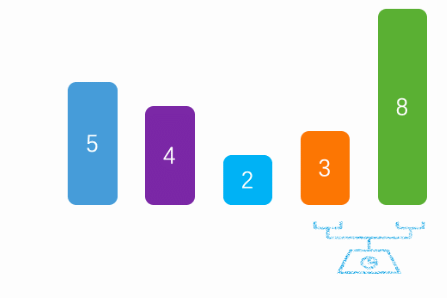

　　a、冒泡排序，是通过每一次遍历获取最大/最小值

　　b、将最大值/最小值放在尾部/头部

　　c、然后除开最大值/最小值，剩下的数据在进行遍历获取最大/最小值

　　d、代码实现

[](javascript:void(0);)

```
public static void main(String[] args) {

        int arr[] = {8, 5, 3, 2, 4};

        //冒泡
        for (int i = 0; i < arr.length; i++) {
            //外层循环，遍历次数
            for (int j = 0; j < arr.length - i - 1; j++) {
                //内层循环，升序（如果前一个值比后一个值大，则交换）
                //内层循环一次，获取一个最大值
                if (arr[j] > arr[j + 1]) {
                    int temp = arr[j + 1];
                    arr[j + 1] = arr[j];
                    arr[j] = temp;
                }
            }
        }
    }
```

[](javascript:void(0);)

　　e、排序过程（红色：移动的数据）

```
5,3,2,4,8
3,2,4,5,8
2,3,4,5,8
2,3,4,5,8
2,3,4,5,8
```

　　2）**选择排序**

　　

　　a、将第一个值看成最小值

　　b、然后和后续的比较找出最小值和下标

　　c、交换本次遍历的起始值和最小值

　　d、说明：每次遍历的时候，将前面找出的最小值，看成一个有序的列表，后面的看成无序的列表，然后每次遍历无序列表找出最小值。

　　e、代码实现

[](javascript:void(0);)

```
public static void main(String[] args) {

        int arr[] = {6, 5, 3, 2, 4};

        //选择
        for (int i = 0; i < arr.length; i++) {
            //默认第一个是最小的。
            int min = arr[i];
            //记录最小的下标
            int index = i;
            //通过与后面的数据进行比较得出，最小值和下标
            for (int j = i + 1; j < arr.length; j++) {
                if (min > arr[j]) {
                    min = arr[j];
                    index = j;
                }
            }
            //然后将最小值与本次循环的，开始值交换
            int temp = arr[i];
            arr[i] = min;
            arr[index] = temp;
            //说明：将i前面的数据看成一个排好的队列，i后面的看成一个无序队列。每次只需要找无需的最小值，做替换
        }
    }
```

[](javascript:void(0);)

　　f、排序过程（红色：移动的数据）

```
2,5,3,6,4
2,3,5,6,4
2,3,4,6,5
2,3,4,5,6
2,3,4,5,6
```

　　3）**插入排序**

　　

　　a、默认从第二个数据开始比较。

　　b、如果第二个数据比第一个小，则交换。然后在用第三个数据比较，如果比前面小，则插入（狡猾）。否则，退出循环

　　c、说明：默认将第一数据看成有序列表，后面无序的列表循环每一个数据，如果比前面的数据小则插入（交换）。否则退出。

　　d、代码实现

[](javascript:void(0);)

```
public static void main(String[] args) {

        int arr[] = {7, 5, 3, 2, 4};

        //插入排序
        for (int i = 1; i < arr.length; i++) {
            //外层循环，从第二个开始比较
            for (int j = i; j > 0; j--) {
                //内存循环，与前面排好序的数据比较，如果后面的数据小于前面的则交换
                if (arr[j] < arr[j - 1]) {
                    int temp = arr[j - 1];
                    arr[j - 1] = arr[j];
                    arr[j] = temp;
                } else {
                    //如果不小于，说明插入完毕，退出内层循环
                    break;
                }
            }
        }
    }
```

[](javascript:void(0);)

　　e、排序过程（红色：有序，黑色：无序）

```
5,7,3,2,4
3,5,7,2,4
2,3,5,7,4
2,3,4,5,7
```

　　4）**希尔排序**（插入排序变种版）

　　

　　a、基本上和插入排序一样的道理

　　b、不一样的地方在于，每次循环的步长，通过减半的方式来实现

　　c、说明：基本原理和插入排序类似，不一样的地方在于。通过间隔多个数据来进行插入排序。

　　d、代码实现

[](javascript:void(0);)

```
public static void main(String[] args) {

        int arr[] = {7, 5, 3, 2, 4};

        //希尔排序（插入排序变种版）
        for (int i = arr.length / 2; i > 0; i /= 2) {
            //i层循环控制步长
            for (int j = i; j < arr.length; j++) {
                //j控制无序端的起始位置
                for (int k = j; k > 0  && k - i >= 0; k -= i) {
                    if (arr[k] < arr[k - i]) {
                        int temp = arr[k - i];
                        arr[k - i] = arr[k];
                        arr[k] = temp;
                    } else {
                        break;
                    }
                }
            }
            //j,k为插入排序，不过步长为i
        }
    }
```

[](javascript:void(0);)

　　e、排序过程(步长4/2/1)

4,1,3,2,6,5,8,9,7
3,1,4,2,6,5,7,9,8
1,2,3,4,5,6,7,8,9

　　5）**快速排序**

 　

　　a、确认列表第一个数据为中间值，第一个值看成空缺（低指针空缺）。

　　b、然后在剩下的队列中，看成有左右两个指针（高低）。

　　c、开始高指针向左移动，如果遇到小于中间值的数据，则将这个数据赋值到低指针空缺，并且将高指针的数据看成空缺值（高指针空缺）。然后先向右移动一下低指针，并且切换低指针移动。

　　d、当低指针移动到大于中间值的时候，赋值到高指针空缺的地方。然后先高指针向左移动，并且切换高指针移动。重复c、d操作。

　　e、直到高指针和低指针相等时退出，并且将中间值赋值给对应指针位置。

　　f、然后将中间值的左右两边看成行的列表，进行快速排序操作。

　　g、代码实现

[](javascript:void(0);)

```
 public static void main(String[] args) {

        int arr[] = {7, 5, 3, 2, 4, 1, 8, 9, 6};

        //快速排序
        int low = 0;
        int high = arr.length - 1;
        quickSort(arr, low, high);  
    }

    public static void quickSort(int[] arr, int low, int high) {
        //如果指针在同一位置(只有一个数据时)，退出
        if (high - low < 1) {
            return;
        }
        //标记，从高指针开始，还是低指针（默认高指针）
        boolean flag = true;
        //记录指针的其实位置
        int start = low;
        int end = high;
        //默认中间值为低指针的第一个值
        int midValue = arr[low];
        while (true) {
            //高指针移动
            if (flag) {
                //如果列表右方的数据大于中间值，则向左移动
                if (arr[high] > midValue) {
                    high--;
                } else if (arr[high] < midValue) {
                    //如果小于，则覆盖最开始的低指针值，并且移动低指针，标志位改成从低指针开始移动
                    arr[low] = arr[high];
                    low++;
                    flag = false;
                }
            } else {
                //如果低指针数据小于中间值，则低指针向右移动
                if (arr[low] < midValue) {
                    low++;
                } else if (arr[low] > midValue) {
                    //如果低指针的值大于中间值，则覆盖高指针停留时的数据，并向左移动高指针。切换为高指针移动
                    arr[high] = arr[low];
                    high--;
                    flag = true;
                }
            }
            //当两个指针的位置相同时，则找到了中间值的位置，并退出循环
            if (low == high) {
                arr[low] = midValue;
                break;
            }
        }
        //然后出现有，中间值左边的小于中间值。右边的大于中间值。
        //然后在对左右两边的列表在进行快速排序
        quickSort(arr, start, low -1);
        quickSort(arr, low + 1, end);
    }
```

[](javascript:void(0);)

　　h、排序过程(青色：中间值，蓝色：确认位置的数据，红色：移动的数据)

[](javascript:void(0);)


```
public void quickSort(int[] s, int left, int right){
    if (left < right){
        int index = Partition(s, left, right);
        quickSort(s, left, index - 1);
        quickSort(s, index + 1, right);
    }
}

public int Partition(int[] s, int left, int right){
    int i = left, j = right;
    int x = s[left];
    while (i < j){
        //从右向左找小于x的数来填s[i]
        while (i < j && s[j] >= x){
            j--;
        }
        if (i < j){
            s[i] = s[j]; //将s[j]填到s[i]中，s[j]就形成了一个新的坑
            i++;
        }

        // 从左向右找大于或等于x的数来填s[j]
        while(i < j && s[i] < x){
            i++;
        }
        if(i < j) {
            s[j] = s[i]; //将s[i]填到s[j]中，s[i]就形成了一个新的坑
            j--;
        }
    }
    //退出时，i等于j。将x填到这个坑中。
    s[i] = x;
    return i;
}
```

```
6,5,3,2,4,1,7,9,8
1,5,3,2,4,6,7,9,8
1,5,3,2,4,6,7,9,8
1,4,3,2,5,6,7,9,8
1,2,3,4,5,6,7,9,8
1,2,3,4,5,6,7,9,8
1,2,3,4,5,6,7,8,9
```

[](javascript:void(0);)

 　6）**归并排序**

　　

　　a、将列表按照对等的方式进行拆分

　　b、拆分小最小快的时候，在将最小块按照原来的拆分，进行合并

　　c、合并的时候，通过左右两块的左边开始比较大小。小的数据放入新的块中

　　d、说明：简单一点就是先对半拆成最小单位，然后将两半数据合并成一个有序的列表。

　　e、代码实现

[](javascript:void(0);)

```
public static void main(String[] args) {

        int arr[] = {7, 5, 3, 2, 4, 1，6};

        //归并排序
        int start = 0;
        int end = arr.length - 1;
        mergeSort(arr, start, end);
    }

    public static void mergeSort(int[] arr, int start, int end) {
        //判断拆分的不为最小单位
        if (end - start > 0) {
            //再一次拆分，知道拆成一个一个的数据
            mergeSort(arr, start, (start + end) / 2);
            mergeSort(arr, (start + end) / 2 + 1, end);
            //记录开始/结束位置
            int left = start;
            int right = (start + end) / 2 + 1;
            //记录每个小单位的排序结果
            int index = 0;
            int[] result = new int[end - start + 1];
            //如果查分后的两块数据，都还存在
            while (left <= (start + end) / 2 && right <= end) {
                //比较两块数据的大小，然后赋值，并且移动下标
                if (arr[left] <= arr[right]) {
                    result[index] = arr[left];
                    left++;
                } else {
                    result[index] = arr[right];
                    right++;
                }
                //移动单位记录的下标
                index++;
            }
            //当某一块数据不存在了时
            while (left <= (start + end) / 2 || right <= end) {
                //直接赋值到记录下标
                if (left <= (start + end) / 2) {
                    result[index] = arr[left];
                    left++;
                } else {
                    result[index] = arr[right];
                    right++;
                }
                index++;
            }
            //最后将新的数据赋值给原来的列表，并且是对应分块后的下标。
            for (int i = start; i <= end; i++) {
                arr[i] = result[i - start];
            }
        }
    }
```

[](javascript:void(0);)

　　f、排序过程（）

```
5,7,3,2,4,1,6
5,7,2,3,4,1,6
2,3,5,7,4,1,6
2,3,5,7,1,4,6
2,3,5,7,1,4,6
1,2,3,4,5,6,7
```

堆排序

```
    public void heapSort(int[] arr) {
        if (arr == null || arr.length == 0) {
            return;
        }
        int len = arr.length;
        buildMaxHeap(arr, len);

        for (int i = len - 1; i > 0; i--) {
            swap(arr, 0, i);
            len--;
            heapify(arr, 0, len);
        }
    }

    private void heapify(int[] arr, int i, int len) {
        int l = i * 2 + 1, r = i * 2 + 2, largest = i;
        if (l < len && arr[l] > arr[largest]) {
            largest = l;
        }
        if (l < len && arr[r] > arr[largest]) {
            largest = r;
        }
        if (largest != i) {
            swap(arr, i, largest);
            heapify(arr, largest, len);
        }
    }

    public void buildMaxHeap(int[] arr, int len) {
        for (int i = len / 2 - 1; i >= 0; i++) {
            heapify(arr, i, len);
        }
    }

    public void swap(int[] arr, int a, int b) {
        int temp = arr[b];
        arr[a] = arr[b];
        arr[b] = temp;
    }
```

## 12.操作系统

CYC2018   105-163页内容

[cys2018](/media/zyan/文档/笔记/JAVA面试/技术面试必备基础知识+CyC2018.pdf)

### 1. 什么是进程？

进程就是正在执行的程序，是操作系统资源分配的基本单位。一般来说，进程包含指令、数据和`PCB`。

#### 延伸问题：孤儿进程和僵尸进程有什么区别？

- 孤儿进程就是说一个父进程退出，而它的一个或多个子进程还在运行，那么这些子进程将成为孤儿进程。孤儿进程将被 `init` 进程(进程`ID`为`1`的进程)所收养，并由 `init` 进程对它们完成状态收集工作。因为孤儿进程会被 `init` 进程收养，所以孤儿进程不会对系统造成危害。

- 僵尸进程就是一个子进程的进程描述符在子进程退出时不会释放，只有当父进程通过 `wait()` 或 `waitpid()` 获取了子进程信息后才会释放。如果子进程退出，而父进程并没有调用 `wait()` 或 `waitpid()`，那么子进程的进程描述符仍然保存在系统中，这种进程称之为僵尸进程。僵尸进程通过 `ps` 命令显示出来的状态为 `Z`。

  系统所能使用的进程号是有限的，如果产生大量僵尸进程，可能会因为没有可用的进程号而导致系统不能产生新的进程。如果要消灭系统中大量的僵尸进程，只需要将其父进程杀死，此时僵尸进程就会变成孤儿进程，从而被 `init` 进程所收养，这样 `init` 进程就会释放所有的僵尸进程所占有的资源，从而结束僵尸进程。

#### 延伸问题：什么是守护进程？

**守护进程**是运行在后台的一种特殊进程，它是独立于控制终端的，并周期性地执行某些任务。

### 2. 什么是线程？

线程是进程内部的不同的执行路径，是操作系统独立调度的基本单位。一个进程中可以有多个线程，它们共享进程资源。比如说，微信和浏览器是两个进程，浏览器进程里面有很多线程，例如 `HTTP` 请求线程、事件响应线程、渲染线程等等，线程的并发执行使得在浏览器中点击一个新链接从而发起 `HTTP` 请求时，浏览器还可以响应用户的其它事件。

### 3.进程与线程有什么区别？

#### 拥有资源

进程是资源分配的基本单位，但是线程不拥有资源，线程可以访问隶属于进程的资源。

#### 调度

线程是独立调度的基本单位，在同一进程中，线程的切换不会引起进程切换，从一个进程中的线程切换到另一个进程中的线程时，会引起进程切换。

#### 系统开销

由于创建或撤销进程时，系统都要为之分配或回收资源，如内存空间、`I/O` 设备等，所付出的开销远大于创建或撤销线程时的开销。类似地，在进行进程切换时，涉及当前执行进程 `CPU` 环境的保存及新调度进程 `CPU` 环境的设置，而线程切换时只需保存和设置少量寄存器内容，开销很小。

#### 通信方面

线程间可以通过直接读写同一进程中的数据进行通信，但是进程通信需要借助 `IPC`。

#### 延伸问题：线程有哪两种？

- 用户级线程(`user level thread`)：对于这类线程，有关线程管理的所有工作都由应用程序完成，内核意识不到线程的存在。在应用程序启动后，操作系统分配给该程序一个进程号，以及其对应的内存空间等资源。应用程序通常先在一个线程中运行，该线程被成为主线程。在其运行的某个时刻，可以通过调用线程库中的函数创建一个在相同进程中运行的新线程。**用户级线程的好处是非常高效，不需要进入内核空间，但并发效率不高。** 
- 内核级线程(`kernel level thread`)：对于这类线程，有关线程管理的所有工作由内核完成，应用程序没有进行线程管理的代码，只能调用内核线程的接口。内核维护进程及其内部的每个线程，调度也由内核基于线程架构完成。内核级线程的好处是，**内核可以将不同线程更好地分配到不同的CPU，以实现真正的并行计算。** 

事实上，在现代操作系统中，往往使用组合方式实现多线程，即线程创建完全在用户空间中完成，并且一个应用程序中的多个用户级线程被映射到一些内核级线程上，相当于是一种折中方案。

### 4. 并发和并行有什么区别？

并发就是在一段时间内，多个任务都会被处理；但在某一时刻，只有一个任务在执行。单核处理器可以做到并发。比如有两个进程`A`和`B`，`A`运行一个时间片之后，切换到`B`，`B`运行一个时间片之后又切换到`A`。因为切换速度足够快，所以宏观上表现为在一段时间内能同时运行多个程序。

并行就是在同一时刻，有多个任务在执行。这个需要多核处理器才能完成，在微观上就能同时执行多条指令，不同的程序被放到不同的处理器上运行，这个是物理上的多个进程同时进行。

### 5. 大内核和微内核有什么区别？

- 大内核，就是将操作系统的全部功能都放进内核里面，包括调度、文件系统、网络、设备驱动器、存储管理等等，组成一个紧密连接整体。大内核的优点就是效率高，但是很难定位`bug`，拓展性比较差，每次需要增加新的功能，都要将新的代码和原来的内核代码重新编译。 
- 微内核与单体内核不同，微内核只是将操作中最核心的功能加入内核，包括`IPC`、地址空间分配和基本的调度，这些东西都在内核态运行，其他功能作为模块被内核调用，并且是在用户空间运行。微内核比较好维护和拓展，但是效率可能不高，因为需要频繁地在内核态和用户态之间切换。 

### 6. 分时系统和实时系统有什么区别？

- 分时系统(`Sharing time system`)就是系统把`CPU`时间分成很短的时间片，轮流地分配给多个作业。它的优点就是对多个用户的多个作业都能保证足够快的响应时间，并且有效提高了资源的利用率。 
- 实时系统(`Real-time system`)是系统对外部输入的信息，能够在规定的时间内（截止期限）处理完毕并做出反应。它的优点是能够集中地及时地处理并作出反应，高可靠性，安全性。 
- 通常计算机采用的是分时，就是多个进程／用户之间共享`CPU`，从形势上实现多任务。各个用户／进程之间的调度并非精准度特别高，如果一个进程被锁住，可以给它分配更多的时间。而实时操作系统则不同，软件和硬件必须遵从严格的时间限制，超过时限的进程可能直接被终止。在这样的操作系统中，每次加锁都需要仔细考虑。 

### 7.静态链接和动态链接有什么区别？

- 静态链接就是在编译期间，由编译器和连接器将静态库集成到应用程序内，并制作成目标文件以及可以独立运作的可执行文件。静态库一般是一些外部函数与变量的集合。 
- 静态库很方便，但是如果我们只是想用库中的某一个函数，却仍然得把所有的内容都链接进去。一个更现代的方法是使用共享库，避免了在文件中静态库的大量重复。 
- 动态链接可以在首次载入的时候执行，也可以在程序开始执行的时候完成。这个是由动态链接器完成，比方标准 `C` 库(`libc.so`) 通常就是动态链接的，这样所有的程序可以共享同一个库，而不用分别进行封装。 

### 8. 编译有哪些阶段？

- 预处理阶段：处理以 `#` 开头的预处理命令； 
- 编译阶段：翻译成汇编文件； 
- 汇编阶段：将汇编文件翻译成可重定位目标文件； 
- 链接阶段：将可重定位目标文件和 `printf.o` 等单独预编译好的目标文件进行合并，得到最终的可执行目标文件。 

### 9. 进程有哪些状态？


- 在五状态模型里面，进程一共有`5`中状态，分别是创建、就绪、运行、终止、阻塞。 
- 运行状态就是进程正在`CPU`上运行。在单处理机环境下，每一时刻最多只有一个进程处于运行状态。 
- 就绪状态就是说进程已处于准备运行的状态，即进程获得了除`CPU`之外的一切所需资源，一旦得到`CPU`即可运行。 
- 阻塞状态就是进程正在等待某一事件而暂停运行，比如等待某资源为可用或等待`I/O`完成。即使`CPU`空闲，该进程也不能运行。 

**运行态→阻塞态**：往往是由于等待外设，等待主存等资源分配或等待人工干预而引起的。
**阻塞态→就绪态**：则是等待的条件已满足，只需分配到处理器后就能运行。
**运行态→就绪态**：不是由于自身原因，而是由外界原因使运行状态的进程让出处理器，这时候就变成就绪态。例如时间片用完，或有更高优先级的进程来抢占处理器等。
**就绪态→运行态**：系统按某种策略选中就绪队列中的一个进程占用处理器，此时就变成了运行态。

### 10. 进程调度算法有哪些？

**先来先服务**

非抢占式的调度算法，按照请求的顺序进行调度。

有利于长作业，但不利于短作业，因为短作业必须一直等待前面的长作业执行完毕才能执行，而长作业又需要执行很长时间，造成了短作业等待时间过长。另外，对`I/O`密集型进程也不利，因为这种进程每次进行`I/O`操作之后又得重新排队。

**短作业优先**

非抢占式的调度算法，按估计运行时间最短的顺序进行调度。

长作业有可能会饿死，处于一直等待短作业执行完毕的状态。因为如果一直有短作业到来，那么长作业永远得不到调度。

**最短剩余时间优先**

最短作业优先的抢占式版本，按剩余运行时间的顺序进行调度。 当一个新的作业到达时，其整个运行时间与当前进程的剩余时间作比较。如果新的进程需要的时间更少，则挂起当前进程，运行新的进程。否则新的进程等待。

**时间片轮转**

将所有就绪进程按 `FCFS` 的原则排成一个队列，每次调度时，把 `CPU` 时间分配给队首进程，该进程可以执行一个时间片。当时间片用完时，由计时器发出时钟中断，调度程序便停止该进程的执行，并将它送往就绪队列的末尾，同时继续把 `CPU` 时间分配给队首的进程。

时间片轮转算法的效率和时间片的大小有很大关系：

- 因为进程切换都要保存进程的信息并且载入新进程的信息，如果时间片太小，会导致进程切换得太频繁，在进程切换上就会花过多时间。 
- 而如果时间片过长，那么实时性就不能得到保证。 

**优先级调度**

为每个进程分配一个优先级，按优先级进行调度。

为了防止低优先级的进程永远等不到调度，可以随着时间的推移增加等待进程的优先级。

#### 延伸问题：什么是抢占式调度？什么是非抢占式调度？

- **抢占式**就是说操作系统将正在运行的进程强行暂停，由调度器将`CPU`分配给其他就绪进程。 
- **非抢占式**是调度器一旦把处理机分配给某进程后便让它一直运行下去，直到进程完成或发生进程调度进程调度某事件而阻塞时，才把处理机分配给另一个进程。 

### 11. 什么是上下文切换？

对于单核单线程`CPU`而言，在某一时刻只能执行一条`CPU`指令。上下文切换(`Context Switch`)是一种将`CPU`资源从一个进程分配给另一个进程的机制。从用户角度看，计算机能够并行运行多个进程，这恰恰是操作系统通过快速上下文切换造成的结果。在切换的过程中，操作系统需要先存储当前进程的状态(包括内存空间的指针，当前执行完的指令等等)，再读入下一个进程的状态，然后执行此进程。

### 12.系统调用和库函数有什么区别？

- 系统调用是应用程序向系统内核请求服务的方式。可以包括硬件相关的服务(例如，访问硬盘等)，或者创建新进程，调度其他进程等。系统调用是程序和操作系统之间的重要接口。 
- 库函数就是说把一些常用的函数编写完放到一个文件里，编写应用程序时调用，这是由第三方提供的，发生在用户地址空间。 
- 在移植性方面，不同操作系统的系统调用一般是不同的，移植性差；库函数会相对好一些。比如说在所有的`ANSI C`编译器版本中，`C`库函数是相同的。 
- 在调用开销方面，系统调用需要在用户空间和内核环境间切换，开销较大；而库函数调用开销较小。 

### 13. 什么是死锁？

在两个或多个并发进程中，如果一个进程集合中的每个进程都在等待只能由该进程集合中的其他进程才能引发的事件，那么该进程集合就产生了死锁。

#### 延伸问题：死锁产生有哪些条件？

死锁产生的根本原因是多个进程竞争资源时，进程的推进顺序出现不正确。

- 互斥：每个资源要么已经分配给了一个进程，要么就是可用的。 
- 占有和等待：已经得到了某个资源的进程可以再请求新的资源。 
- 不可抢占：已经分配给一个进程的资源不能强制性地被抢占，它只能被占有它的进程显式地释放。 
- 环路等待：有两个或者两个以上的进程组成一条环路，该环路中的每个进程都在等待下一个进程所占有的资源。 

#### 延伸问题：怎么解决死锁？

对于死锁，主要有`4`种解决策略。

**鸵鸟策略**

就是直接忽略死锁。就像鸵鸟遇到危险的时候，把头埋在沙子里，假装根本没发生问题。因为解决死锁问题的代价很高，因此鸵鸟策略这种不采取任务措施的方案会获得更高的性能。当发生死锁时不会对用户造成多大影响，或发生死锁的概率很低，可以采用鸵鸟策略。大多数操作系统，包括 `Unix`，`Linux` 和 `Windows`，处理死锁问题的办法仅仅是忽略它。

**死锁预防**

死锁预防是指通过破坏死锁产生的四个必要条件中的一个或多个，以避免发生死锁。

- 破坏互斥：不让资源被一个进程独占，可通过假脱机技术允许多个进程同时访问资源； 
- 破坏占有和等待：有两种方案，  
  - 已拥有资源的进程不能再去请求其他资源。一种实现方法是要求进程在开始执行前请求需要的所有资源。 
  - 要求进程请求资源时，先暂时释放其当前拥有的所有资源，再尝试一次获取所需的全部资源。 
- 破坏不可抢占：有些资源可以通过虚拟化方式实现可抢占； 
- 破坏循环等待：有两种方案：  
  - 一种方法是保证每个进程在任何时刻只能占用一个资源，如果要请求另一个资源，必须先释放第一个资源； 
  - 另一种方法是将所有资源进行统一编号，进程可以在任何时刻请求资源，但要求进程必须按照顺序请求资源。 

**死锁避免**

为了避免因为预防死锁而导致所有线程变慢，死锁避免采用了与死锁预防相反的措施。它允许三个必要条件，但通过算法**判断资源请求是否可能导致循环等待的形成并相应决策**，来避免死锁点的产生。因此，其前提是知道当前资源使用的整体情况，以及申请资源线程本身所占有的资源细节。

判断和决策中，主要使用两种避免方法。

- 线程启动拒绝：如果一个线程的请求会引发死锁，则不允许其启动。 
- 资源分配拒绝：如果一个线程增加的资源请求会导致死锁，则不允许此申请。 

整体来看，**死锁避免是从资源和线程相互间关系着手，避免形成循环等待是其主要任务。**

**死锁检测和恢复**

可以允许系统进入死锁状态，但会维护一个系统的资源分配图，定期调用死锁检测算法来检测途中是否存在死锁，检测到死锁发生后，采取死锁恢复算法进行恢复。

死锁检测方法如下：

- 在资源分配图中，找到不会阻塞又不独立的进程结点，使该进程获得其所需资源并运行，运行完毕后，再释放其所占有的全部资源。也就是消去该进程结点的请求边和分配边。 
- 使用上面的算法进行一系列简化，若能消去所有边，则表示不会出现死锁，否则会出现死锁。 

检测到死锁后，就需要解决死锁。目前操作系统中主要采用如下几种方法：

- 取消所有死锁相关线程，简单粗暴，但也确实是最常用的 
- 把每个死锁线程回滚到某些检查点，然后重启 
- 连续取消死锁线程直到死锁解除，顺序基于特定最小代价原则 
- 连续抢占资源直到死锁解除 

### 14. 进程同步的方式有哪些？

#### 临界区

临界区是一段代码，在临界区内进程将访问临界资源。任何时候最多只有一个进程可以进入临界区，也就是说，临界区具有排他性。所以，为了互斥访问临界资源，每个进程在进入临界区之前，需要先进行检查。

#### 互斥量

就是使用一个互斥的变量来直接制约多个进程，每个进程只有拥有这个变量才具有访问公共资源的权限，因为互斥量只有一个，所以能保证资源的正确访问。

#### 信号量

信号量（`Semaphore`）是一个整型变量，可以对其执行自增和自减操作，自减操作通常也叫做`P`操作，自增操作也称为`V`操作。这两个操作需要被设计成原语，是不可分割，通常的做法是在执行这些操作的时候屏蔽中断。进程使用这两个操作进行同步。

- 对于`P`操作，如果执行操作后信号量小于 `0`，那么执行该操作的进程就会阻塞，否则继续执行； 
- 对于`V`操作，如果操作之后的信号量小于等于`0`，那么就会从阻塞队列唤醒一个进程。 

#### 管程

管程使用的是面向对象思想，将表示共享资源的数据结构还有相关的操作，包括同步机制，都集中并封装到一起。所有进程都只能通过管程间接访问临界资源，而管程只允许一个进程进入并执行操作，从而实现进程互斥。管程中设置了多个条件变量，表示多个进程被阻塞或挂起的条件。对条件变量执行 `wait()` 操作会导致调用进程阻塞，把管程让出来给另一个进程持有。`signal()` 操作用于唤醒被阻塞的进程。管程有一个重要特性，就是在一个时刻只能有一个进程使用管程。进程在无法继续执行的时候不能一直占用管程，否则其它进程永远不能使用管程。

### 15. 进程间通信的方式有哪些？

#### 管道

- 管道是半双工的，数据只能向一个方向流动；如果需要双方通信时，需要建立起两个管道。 
- 管道只能用于父子进程或者兄弟进程之间或者说具有亲缘关系的进程； 
- 管道对于管道两端的进程而言，就是一个文件，但它不是普通的文件，它不属于某种文件系统，只存在与内存中。 
- 管道的实质是一个内核缓冲区，进程以先进先出的方式从缓冲区存取数据，管道一端的进程顺序的将数据写入缓冲区，另一端的进程则顺序的读出数据。该缓冲区可以看做是一个循环队列，读和写的位置都是自动增长的，不能随意改变，一个数据只能被读一次，读出来以后在缓冲区就不复存在了。当缓冲区读空或者写满时，有一定的规则控制相应的读进程或者写进程进入等待队列，当空的缓冲区有新数据写入或者满的缓冲区有数据读出来时，就唤醒等待队列中的进程继续读写。 
- 管道的主要局限性正体现在它的特点上，比如只支持单向数据流，只能用于具有亲缘关系的进程之间，没有名字，管道的缓冲区是有限的等等。 

#### 命名管道

这种管道也叫`FIFO`。命名管道不同于管道的地方，在于它提供了一个路径名与之关联，以命名管道的文件形式存在于文件系统中，这样，即使与命名管道的创建进程不存在亲缘关系的进程，只要可以访问文件系统中的这个路径，就能够彼此通过命名管道相互通信。命名管道严格遵循先进先出原则的，不支持诸如数据随机定位。命名管道的名字存在于文件系统中，但内容存放在内存中。

#### 消息队列

消息队列是消息的链表，具有特定的格式，它是存放在内存里面的，并且每个消息队列都有唯一的标识。消息队列允许一个或多个进程向它写入与读取消息，所以，利用消息队列，一个进程可以将一个数据块发送到另一个进程，每个数据块都有一个类型，接收进程可以独立地接收含有不同类型的数据结构，这个过程是异步的，我们可以通过发送消息来避免命名管道的同步和阻塞问题。但消息队列的数据块有一个最大长度的大小限制。

#### 共享内存

- 共享内存是针对其他通信机制运行效率较低而设计的，它可以让多个进程可以可以直接读写同一块内存空间，是最快的`IPC`形式。 
- 为了在多个进程间交换信息，内核专门留出了一块内存区，可以由需要访问的进程将其映射到自己的私有地址空间。进程就可以直接读写这一块内存而不需要进行数据的拷贝，从而大大提高效率。 
- 由于多个进程共享一段内存，因此需要依靠某种同步机制来达到进程间的同步和互斥。 

#### 信号量

信号量是一个计数器，可以用来控制多个进程对共享资源的访问。它是一种类似于锁的机制，就是防止某进程正在访问共享资源时，其他进程也访问该资源。[参考这里](#信号量)。

#### Socket

- `Socket`就是套接字，套接字也是一种通信机制，凭借这种机制，可以让不在同一台主机上的两个进程，通过网络进行通信，一般可以用在客户端和服务器之间的通信。 
- 实际上，`Socket` 是在应用层和传输层之间的一个抽象层，它把 `TCP`/IP 协议的传输层里面复杂的操作，抽象为几个简单的接口，供应用层调用实现进程在网络中的通信。 

#### 延伸问题：Socket通信流程是怎样的？

 

- 概括地说，就是通信的两端都建立了一个 `Socket` ，然后通过 `Socket` 对数据进行传输。通常服务器处于一个无限循环，等待客户端的连接。 
- 对于客户端，它的的过程比较简单，首先创建 `Socket`，通过`TCP`连接服务器，将 `Socket` 与远程主机的某个进程连接，然后就发送数据，或者读取响应数据，直到数据交换完毕，关闭连接，结束 `TCP` 对话。 
- 对于服务端，先初始化 `Socket`，建立流式套接字，与本机地址及端口进行绑定，然后通知 `TCP`，准备好接收连接，调用 `accept()` 阻塞，等待来自客户端的连接。如果这时客户端与服务器建立了连接，客户端发送数据请求，服务器接收请求并处理请求，然后把响应数据发送给客户端，客户端读取数据，直到数据交换完毕。最后关闭连接，交互结束。 

#### 延伸问题：从`TCP`连接的角度说说Socket通信流程。

 

首先是三次握手的`Socket`交互流程。

1. 服务器调用 `socket()`、`bind()`、`listen()` 完成初始化后，调用 `accept()` 阻塞等待； 
2. 客户端 `Socket` 对象调用 `connect()` 向服务器发送了一个 `SYN` 并阻塞； 
3. 服务器完成了第一次握手，即发送 `SYN` 和 `ACK` 应答； 
4. 客户端收到服务端发送的应答之后，从 `connect()` 返回，再发送一个 `ACK` 给服务器； 
5. 服务器 `Socket` 对象接收客户端第三次握手 `ACK` 确认，此时服务端从 `accept()` 返回，建立连接。 

接下来就是两个端的连接对象互相收发数据。

 

然后是四次挥手的`Socket`交互流程。

1. 某个应用进程调用 `close()` 主动关闭，发送一个 `FIN`； 
2. 另一端接收到 `FIN` 后被动执行关闭，并发送 `ACK` 确认； 
3. 之后被动执行关闭的应用进程调用 `close()` 关闭 `Socket`，并也发送一个 `FIN`； 
4. 接收到这个 `FIN` 的一端向另一端 `ACK` 确认。 

### 16. 有哪些磁盘调度算法？

#### 先来先服务

- 按照磁盘请求的顺序进行调度。 
- 优点是公平和简单。缺点也很明显，因为未对寻道做任何优化，使平均寻道时间可能较长。 

#### 最短寻道时间优先

- 优先调度与当前磁头所在磁道距离最近的磁道。 
- 虽然平均寻道时间比较低，但是不够公平。如果新到达的磁道请求总是比一个在等待的磁道请求近，那么在等待的磁道请求会一直等待下去，也就是出现饥饿现象。一般来说，两端的磁道请求更容易出现饥饿现象。 

#### 电梯算法

- 也叫`SCAN`扫描算法。电梯算法就是说读写磁头总是保持一个方向运行，直到该方向没有请求为止，然后改变运行方向。 
- 因为考虑了移动方向，因此所有的磁盘请求都会被满足，解决了最短寻道时间优先的饥饿问题。 

### 17. 什么是虚拟内存？

虚拟内存就是说，让物理内存扩充成更大的逻辑内存，从而让程序获得更多的可用内存。虚拟内存使用部分加载的技术，让一个进程或者资源的某些页面加载进内存，从而能够加载更多的进程，甚至能加载比内存大的进程，这样看起来好像内存变大了，这部分内存其实包含了磁盘或者硬盘，并且就叫做虚拟内存。

### 18. 什么是分页系统？

分页就是说，将磁盘或者硬盘分为大小固定的数据块，叫做页，然后内存也分为同样大小的块，叫做页框。当进程执行的时候，会将磁盘的页载入内存的某些页框中，并且正在执行的进程如果发生缺页中断也会发生这个过程。页和页框都是由两个部分组成的，一个是页号或者页框号，一个是偏移量。分页一般是有硬件来完成的，每个页都对应一个页框，它们的对应关系存放在一个叫做页表的数据结构中，页号作为这个页表的索引，页框号作为页表的值。操作系统负责维护这个页表。

### 19. 分页和分段有什区别？

- 分页对程序员是透明的，但是分段需要程序员显式划分每个段。 
- 分页的地址空间是一维地址空间，分段是二维的。 
- 页的大小不可变，段的大小可以动态改变。 
- 分页主要用于实现虚拟内存，从而获得更大的地址空间；分段主要是为了使程序和数据可以被划分为逻辑上独立的地址空间并且有助于共享和保护。 

### 20. 页面替换算法有哪些？

在程序运行过程中，如果要访问的页面不在内存中，就发生缺页中断从而将该页调入内存中。此时如果内存已无空闲空间，系统必须从内存中调出一个页面到磁盘对换区中来腾出空间。

**最佳算法**

所选择的被换出的页面将是最长时间内不再被访问，通常可以保证获得最低的缺页率。这是一种理论上的算法，因为无法知道一个页面多长时间不再被访问。

**先进先出**

选择换出的页面是最先进入的页面。该算***将那些经常被访问的页面也被换出，从而使缺页率升高。

**LRU**

虽然无法知道将来要使用的页面情况，但是可以知道过去使用页面的情况。`LRU` 将最近最久未使用的页面换出。为了实现 LRU，需要在内存中维护一个所有页面的链表。当一个页面被访问时，将这个页面移到链表表头。这样就能保证链表表尾的页面是最近最久未访问的。因为每次访问都需要更新链表，因此这种方式实现的 `LRU` 代价很高。

**时钟算法**

时钟算法使用环形链表将页面连接起来，再使用一个指针指向最老的页面。它将整个环形链表的每一个页面做一个标记，如果标记是`0`，那么暂时就不会被替换，然后时钟算法遍历整个环，遇到标记为`1`的就替换，否则将标记为`0`的标记为`1`。

### 21. Linux文件系统是怎么样的？

`Linux`文件系统里面有文件和目录，组成一个树状的结构，树的每一个叶子节点表示文件或者空目录。每个文件基本上都由两部分组成：

- `inode`：一个文件占用一个 `inode`，记录文件的属性，同时记录此文件的内容所在的 `block` 编号； 
- `block`：记录文件的内容，文件太大时，会占用多个 `block`。 

除此之外还包括：

- `superblock`：记录文件系统的整体信息，包括 `inode` 和 `block` 的总量、使用量、剩余量，以及文件系统的格式与相关信息等； 
- `block bitmap`：记录 `block` 是否被使用的位图。 

当要读取一个文件的内容时，先在 `inode` 中查找文件内容所在的所有 `block`，然后把所有 `block` 的内容读出来。


### 22. 硬链接和软链接有什么区别？

- 硬链接就是在目录下创建一个条目，记录着文件名与 `inode` 编号，这个 `inode` 就是源文件的 `inode`。删除任意一个条目，文件还是存在，只要引用数量不为 `0`。但是硬链接有限制，它不能跨越文件系统，也不能对目录进行链接。
- 符号链接文件保存着源文件所在的绝对路径，在读取时会定位到源文件上，可以理解为 `Windows` 的快捷方式。当源文件被删除了，链接文件就打不开了。因为记录的是路径，所以可以为目录建立符号链接。


### 2.Linux


## 13.我的项目

### 1、AW

#### 1、介绍

项目来源：中电集团30所，本项目主要围绕洋葱匿名网络中的Tor加密传输协议原理,实现对Tor匿名流量的快速识别,基于 HTTP指纹与网站指纹实现匿名用户溯源,并探测匿名网络中隐藏节点。本人主要负责Tor匿名流量的识别模块与后端服务器开发模块。

```
1、流量识别，采用机器学习算法，随机森林，提取特征
2、态势感知，爬取、下载Tor官方数据，然后存到数据库，用echarts展示
```


#### 2、关键问题

#### 3、怎么解决的

#### 4、学到的东西

### 2、XXX信息

#### 1、介绍

#### 2、关键问题

#### 3、怎么解决的

#### 4、学到的东西

### 3、mmall

1.分布式锁

分布式锁一般有三种实现方式：1. 数据库乐观锁；2. 基于Redis的分布式锁；3. 基于ZooKeeper的分布式锁
本文主要介绍了Java代码如何正确实现Redis分布式锁，对于加锁和解锁也分别给出了几个比较经典的错误示例

分布式锁可靠性条件
1.互斥性、在任意时刻，只有一个客户端能持有锁。
2.不会发生死锁、即使有一个客户端在持有锁的期间崩溃而没有主动解锁，也能保证后续其他客户端能加锁。
3.具有容错性、只要大部分的Redis节点正常运行，客户端就可以加锁和解锁。
4.解铃还须系铃人、加锁和解锁必须是同一个客户端，客户端自己不能把别人加的锁给解了。


### 分布式锁原理

分布式锁，是控制分布式系统之间同步访问共享资源的一种方式。在分布式系统中，常常需要协调他们的动作。如果不同的系统或是同一个系统的不同主机之间共享了一个或一组资源，那么访问这些资源的时候，往往需要互斥来防止彼此干扰来保证一致性，在这种情况下，便需要使用到分布式锁。

使用setnx、getset、expire、del这4个redis命令实现

1. setnx 是『SET if Not eXists』(如果不存在，则 SET)的简写。 **命令格式**：SETNX key value；使用：只在键 key 不存在的情况下，将键 key 的值设置为 value 。若键 key 已经存在， 则 SETNX 命令不做任何动作。**返回值**：命令在设置成功时返回 1 ，设置失败时返回 0 。
2. getset **命令格式**：GETSET key value，将键 key 的值设为 value ，并返回键 key 在被设置之前的旧的value。**返回值**：如果键 key 没有旧值， 也即是说， 键 key 在被设置之前并不存在， 那么命令返回 nil 。当键 key 存在但不是字符串类型时，命令返回一个错误。
3. expire **命令格式**：EXPIRE key seconds，**使用**：为给定 key 设置生存时间，当 key 过期时(生存时间为 0 )，它会被自动删除。**返回值**：设置成功返回 1 。 当 key 不存在或者不能为 key 设置生存时间时(比如在低于 2.1.3 版本的 Redis 中你尝试更新 key 的生存时间)，返回 0 。
4. del **命令格式**：DEL key [key …]，**使用**：删除给定的一个或多个 key ，不存在的 key 会被忽略。**返回值**：被删除 key 的数量。

#### redis 分布式锁原理一

原理图如下

过程分析：

1. A尝试去获取锁lockkey，通过setnx(lockkey,currenttime+timeout)命令，对lockkey进行setnx,将value值设置为当前时间+锁超时时间；
2. 如果返回值为1，说明redis服务器中还没有lockkey，也就是没有其他用户拥有这个锁，A就能获取锁成功；
3. 在进行相关业务执行之前，先执行expire(lockkey)，对lockkey设置有效期，防止死锁。因为如果不设置有效期的话，lockkey将一直存在于redis中，其他用户尝试获取锁时，执行到setnx(lockkey,currenttime+timeout)时，将不能成功获取到该锁；
4. 执行相关业务；
5. 释放锁，A完成相关业务之后，要释放拥有的锁，也就是删除redis中该锁的内容，del(lockkey)，接下来的用户才能进行重新设置锁新值。

代码实现：

```java
public void redis1() {
        log.info("关闭订单定时任务启动");
        long lockTimeout = Long.parseLong(PropertiesUtil.getProperty("lock.timeout", "5000"));
        //这个方法的缺陷在这里，如果setnx成功后，锁已经存到Redis里面了，服务器异常关闭重启，将不会执行closeOrder，也就不会设置锁的有效期，这样的话锁就不会释放了，就会产生死锁
        Long setnxResult = RedisShardedPoolUtil.setnx(Const.REDIS_LOCK.CLOSE_ORDER_TASK_LOCK, String.valueOf(System.currentTimeMillis() + lockTimeout));
        if (setnxResult != null && setnxResult.intValue() == 1) {
            //如果返回值为1，代表设置成功，获取锁
            closeOrder(Const.REDIS_LOCK.CLOSE_ORDER_TASK_LOCK);
        } else {
            log.info("没有获得分布式锁:{}", Const.REDIS_LOCK.CLOSE_ORDER_TASK_LOCK);
        }
        log.info("关闭订单定时任务结束");
    }
private void closeOrder(String lockName) {
        //对锁设置有效期
        RedisShardedPoolUtil.expire(lockName, 5);//有效期为5秒，防止死锁
        log.info("获取锁:{},ThreadName:{}",Const.REDIS_LOCK.CLOSE_ORDER_TASK_LOCK, Thread.currentThread().getName());
        //执行业务
        int hour = Integer.parseInt(PropertiesUtil.getProperty("close.order.task.time.hour", "2"));
        iOrderService.closeOrder(hour);
        //执行完业务后，释放锁
        RedisShardedPoolUtil.del(Const.REDIS_LOCK.CLOSE_ORDER_TASK_LOCK);
        log.info("释放锁:{},ThreadName:{}",Const.REDIS_LOCK.CLOSE_ORDER_TASK_LOCK, Thread.currentThread().getName());
        log.info("=================================");
    }
12345678910111213141516171819202122232425
```

缺陷：
如果A在setnx成功后，A成功获取锁了，也就是锁已经存到Redis里面了，此时服务器异常关闭或是重启，将不会执行closeOrder，也就不会设置锁的有效期，这样的话锁就不会释放了，就会产生死锁。

解决方法：
关闭Tomcat有两种方式，一种通过温柔的执行shutdown关闭，一种通过kill杀死进程关闭

```java
//通过温柔的执行shutdown关闭时，以下的方法会在关闭前执行，即可以释放锁，而对于通过kill杀死进程关闭时，以下方法不会执行，即不会释放锁
   //这种方式释放锁的缺点在于，如果关闭的锁过多，将造成关闭服务器耗时过长
    @PreDestroy
    public void delLock() {
        RedisShardedPoolUtil.del(Const.REDIS_LOCK.CLOSE_ORDER_TASK_LOCK);
    }
123456
```

#### redis 分布式锁原理2(优化版)

为了解决原理1中会出现的死锁问题，提出原理2双重防死锁，可以更好解决死锁问题。
原理图如下：

过程分析：

1. 当A通过setnx(lockkey,currenttime+timeout)命令能成功设置lockkey时，即返回值为1，过程与原理1一致；
2. 当A通过setnx(lockkey,currenttime+timeout)命令不能成功设置lockkey时，这是不能直接断定获取锁失败；因为我们在设置锁时，设置了锁的超时时间timeout，当当前时间大于redis中存储键值为lockkey的value值时，可以认为上一任的拥有者对锁的使用权已经失效了，A就可以强行拥有该锁；具体判定过程如下；
3. A通过get(lockkey)，获取redis中的存储键值为lockkey的value值，即获取锁的相对时间lockvalueA
4. lockvalueA!=null && currenttime>lockvalue，A通过当前的时间与锁设置的时间做比较，如果当前时间已经大于锁设置的时间临界，即可以进一步判断是否可以获取锁，否则说明该锁还在被占用，A就还不能获取该锁，结束，获取锁失败；
5. 步骤4返回结果为true后，通过getSet设置新的超时时间，并返回旧值lockvalueB，以作判断，因为在分布式环境，在进入这里时可能另外的进程获取到锁并对值进行了修改，只有旧值与返回的值一致才能说明中间未被其他进程获取到这个锁
6. lockvalueB == null || lockvalueA==lockvalueB，判断：若果lockvalueB为null，说明该锁已经被释放了，此时该进程可以获取锁；旧值与返回的lockvalueB一致说明中间未被其他进程获取该锁，可以获取锁；否则不能获取锁，结束，获取锁失败。

代码实现：

```java
public void redis2() {
        log.info("关闭订单定时任务启动");
        long lockTimeout = Long.parseLong(PropertiesUtil.getProperty("lock.timeout", "5000"));
        Long setnxResult = RedisShardedPoolUtil.setnx(Const.REDIS_LOCK.CLOSE_ORDER_TASK_LOCK, String.valueOf(System.currentTimeMillis() + lockTimeout));
        if (setnxResult != null && setnxResult.intValue() == 1) {
            //如果返回值为1，代表设置成功，获取锁
            closeOrder(Const.REDIS_LOCK.CLOSE_ORDER_TASK_LOCK);
        } else {
            //未获取到锁，继续判断，判断时间戳，看是否可以重置并获取到锁
            String lockValueStr = RedisShardedPoolUtil.get(Const.REDIS_LOCK.CLOSE_ORDER_TASK_LOCK);
            //通过当前的时间与锁设置的时间做比较，如果当前时间已经大于锁设置的时间临界，即可以进一步判断是否可以获取锁，否则说明该锁还在被占用，不能获取该锁
            if (lockValueStr != null && System.currentTimeMillis() > Long.parseLong(lockValueStr)) {
                //通过getSet设置新的超时时间，并返回旧值，以作判断，因为在分布式环境，在进入这里时可能另外的进程获取到锁并对值进行了修改，只有旧值与返回的值一致才能说明中间未被其他进程获取到这个锁
                String getSetResult = RedisShardedPoolUtil.getSet(Const.REDIS_LOCK.CLOSE_ORDER_TASK_LOCK, String.valueOf(System.currentTimeMillis() + lockTimeout));
                //再次用当前时间戳getset。
                //返回给定的key的旧值，与旧值判断，是否可以获取锁
                //当key没有旧值时，即key不存在时，返回nil ->获取锁
                //这里我们set了一个新的value值，获取旧的值。
                //若果getSetResult为null，说明该锁已经被释放了，此时该进程可以获取锁；旧值与返回的getSetResult一致说明中间未被其他进程获取该锁，可以获取锁
                if (getSetResult == null || (getSetResult != null && StringUtils.equals(lockValueStr, getSetResult))) {
                    //真正获取到锁
                    closeOrder(Const.REDIS_LOCK.CLOSE_ORDER_TASK_LOCK);
                } else {
                    log.info("没有获得分布式锁:{}", Const.REDIS_LOCK.CLOSE_ORDER_TASK_LOCK);
                }
            } else {
                log.info("没有获得分布式锁:{}", Const.REDIS_LOCK.CLOSE_ORDER_TASK_LOCK);
            }
        }
        log.info("关闭订单定时任务结束");
    }
    private void closeOrder(String lockName) {
        //对锁设置有效期
        RedisShardedPoolUtil.expire(lockName, 5);//有效期为5秒，防止死锁
        log.info("获取锁:{},ThreadName:{}",Const.REDIS_LOCK.CLOSE_ORDER_TASK_LOCK, Thread.currentThread().getName());
        //执行业务
        int hour = Integer.parseInt(PropertiesUtil.getProperty("close.order.task.time.hour", "2"));
        iOrderService.closeOrder(hour);
        //执行完业务后，释放锁
        RedisShardedPoolUtil.del(Const.REDIS_LOCK.CLOSE_ORDER_TASK_LOCK);
        log.info("释放锁:{},ThreadName:{}",Const.REDIS_LOCK.CLOSE_ORDER_TASK_LOCK, Thread.currentThread().getName());
        log.info("=================================");
    }
```

优化点：

- 加入了超时时间判断锁是否超时了，及时A在成功设置了锁之后，服务器就立即出现宕机或是重启，也不会出现死锁问题；因为B在尝试获取锁的时候，如果不能setnx成功，会去获取redis中锁的超时时间与当前的系统时间做比较，如果当前的系统时间已经大于锁超时时间，说明A已经对锁的使用权失效，B能继续判断能否获取锁，解决了redis分布式锁的死锁问题。


加锁
正确的加锁方式

```
private static final String OK = "OK";
 /**

  * 尝试获取分布式锁
    *
  * @param jedis      Redis客户端
  * @param key        锁key
  * @param requestId  值(请求标识)
  * @param expireTime 超期时间
  * @return 是否获取成功
    */
     public static boolean lock(Jedis jedis, String key, String requestId, int expireTime) {
    String result = jedis.set(key, requestId, SET_IF_NOT_EXIST, SET_WITH_EXPIRE_TIME, expireTime);
    if (OK.equals(result)) {
        return true;
    }
    return false;
     }
```


加锁就一行代码(防并发)
jedis.set(String key, String value, String nxxx, String expx, int time)
该set()方法一共有五个形参：
参数说明
key ：唯一key值，可以使用key来当锁
requestId ：缓存的value 值，用于表示加锁的客户端。解锁时需要判断加锁与解锁是否是相同客户端
nxxx ：常量值NX ，含义是SET IF NOT EXIST，
即当key不存在时，进行set操作；若key已经存在，则不做任何操作
expx ：常量值PX，含义是要给这个key加一个过期的设置，具体时间由第五个参数定
time ：key的过期时间

结果：
执行以上set()方法就只会导致两种结果：
1. 当前没有锁（key不存在），那么就进行加锁操作，并对锁设置个有效期，同时value表示加锁的客户端。
2. 已有锁存在，不做任何操作。
结论：
可靠性条件说明
1.set()方式使用NX参数，可保证如果已有key存在，则函数不会调用成功，也就是只有一个客户端能持有锁，满足互斥性
2.设置过期时间，锁会自动过期，防止死锁发生
3.缓存value值，使用的是客户端请求标识，解锁时可以进行判断符合解铃还须系铃人

错误的加锁方式 1
使用jedis.setnx()和jedis.expire()组合实现加锁，代码如下

```
private static final Long ONE = 1L;
 /**

  * 分布式锁 错误实现1
    *
  * @param jedis      Redis客户端
  * @param lockKey    锁
  * @param value      值
  * @param expireTime 超期时间
  * @return 是否成功
  * 注：两条Redis命令，不具有原子性，
  * 如果程序在执行完setnx()之后突然崩溃，导致锁没有设置过期时间。那么将会发生死锁
    */
     public static boolean wrongLock01(Jedis jedis, String lockKey, String value, int expireTime) {
    Long result = jedis.setnx(lockKey, value);
    if (ONE == result) {
        // 若在这里程序突然崩溃，则无法设置过期时间，将发生死锁
        jedis.expire(lockKey, expireTime);
        return true;
    }
    return false;
     }
```


方法说明：
setnx()方法作用就是SET IF NOT EXIST，当key不存在时，进行set操作；若key已经存在，则不做任何操作
expire()方法作用是设置过期时间
错误说明：
由于这是两条Redis命令，不具有原子性，如果程序在执行完setnx()之后突然崩溃，导致锁没有设置过期时间。那么将会发生死锁
注：原先有人这样实现，是因为低版本的jedis并不支持多参数的set()方法。

错误的加锁方式 2
实现步骤：
使用jedis.setnx()命令实现加锁，
其中key是锁，value是锁的过期时间戳。执行过程：

通过setnx()方法尝试加锁，如果当前锁不存在，返回加锁成功。
如果锁已经存在则获取锁的过期时间戳，和当前时间戳比较，
如果锁已经过期，则设置新的过期时间，返回加锁成功
代码如下

```
private static final Long ONE = 1L;
/**

  * 分布式锁 错误实现2
    *
  * @param jedis      Redis客户端
  * @param lockKey    锁
  * @param expireTime 超期时间
  * @return 是否成功
* 注：风险是各客户端时间必须同步
  */
   public static boolean wrongLock02(Jedis jedis, String lockKey, int expireTime) {
     long expires = System.currentTimeMillis() + expireTime;
     String expiresStr = String.valueOf(expires);
     // 可以成功设置,也就是key不存在
     if (ONE == jedis.setnx(lockKey, expiresStr)) {
         return true;
     }
     //如果锁存在，获取锁的过期时间 防止原来的操作异常，没有运行解锁操作  防止死锁
     String currentValueStr = jedis.get(lockKey);
     if (currentValueStr != null && Long.parseLong(currentValueStr) < System.currentTimeMillis()) {
         // 锁已过期，获取上一个锁的过期时间，并设置现在锁的过期时间
         String oldValueStr = jedis.getSet(lockKey, expiresStr);
         if (!StringUtils.isEmpty(oldValueStr) && oldValueStr.equals(currentValueStr)) {
             //多线程并发的情况，只有一个线程的设置值和当前值相同，它才有权利加锁
             return true;
         }
     }
     // 其他情况，一律返回加锁失败
     return false;
   }
```


错误说明：

1. 由于是客户端生成过期时间，所以需要分布式下每个客户端的时间必须完全同步。
2. 当锁过期的时候，如果多个客户端同时执行jedis.getSet()方法，
虽然最终只有一个客户端可以加锁，但这个客户端的锁的过期时间可能被其他客户端覆盖。
3. 锁不具备拥有者标识，即任何客户端都可以解锁。不安全

解锁
正确的解锁方式
代码如下

```
private static final Long ONE = 1L;

  /**

   * 释放分布式锁
     *
   * @param lockKey   锁
   * @param requestId 请求标识
   * @return 是否释放成功
     */
       public static boolean unLock(Jedis jedis, String lockKey, String requestId) {
     String script =
             "if redis.call('get', KEYS[1]) == ARGV[1] then return redis.call('del', KEYS[1]) else return 0 end";
     Object result =
             jedis.eval(script, Collections.singletonList(lockKey), Collections.singletonList(requestId));
     if (ONE.equals(result)) {
         return true;
     }
     return false;
       }
```


Redis Eval 命令使用 Lua 解释器执行脚本。
确保上述操作是原子性所以使用Lua语言来实现。
并使参数KEYS[1]赋值为lockKey，ARGV[1]赋值为requestId
eval()方法是将Lua代码交给Redis服务端执行。
效果是什么呢？
首先获取锁对应的value值，检查是否与requestId相等，如果相等则删除锁（解锁）。
下面是官网对eval命令的部分解释：
简单来说，就是在eval命令执行Lua代码的时候，Lua代码将被当成一个命令去执行，并且直到eval命令执行完成，Redis才会执行其他命令。

错误的解锁方式 1
代码如下

```
 /**
     * 分布式锁解锁 
     * 使用删除方式
     *
     * @param jedis   Redis客户端
     * @param lockKey 锁key
     */
    public static void wrongUnLock01(Jedis jedis, String lockKey) {
        jedis.del(lockKey);
    }	
```


方法说明：del() 直接删除
错误说明：
未判断锁的拥有者而直接解锁
此方式会导致任何客户端都可以随时进行解锁，即使锁并不是当前客户端的

错误的解锁方式 2
代码如下

```
/**

   * 分布式锁解锁 错误实现2
      使用删除方式
          *
        * @param jedis   Redis客户端
           @param lockKey 锁key
             *  注：会出现误解锁
                /
                    public static void wrongUnLock02(Jedis jedis, String lockKey, String requestId) {
                // 判断加锁与解锁是不是同一个客户端
                if (requestId.equals(jedis.get(lockKey))) {
                    // 若在此时，这把锁已经不是这个客户端的，则会误解锁
                    jedis.del(lockKey);
                }
                    }
```

方法说明：del() 直接删除
get() 根据key获取值
错误说明：
如果调用jedis.del()方法的时候，这把锁已经不属于当前客户端会解除他人加的锁现象。
例如客户端A加锁，一段时间之后客户端A解锁，
在执行jedis.del()之前，锁过期了，
此时客户端B尝试加锁成功，然后客户端A再执行del()方法，
则将客户端B的锁给解除了。
分成两条命令去执行难免出现并发的现象

### 4、秒杀

1. 秒杀流程

   ```
   0. 判断用户是否非空，秒杀路径是否正确
   1. 查看内存标记，看秒杀是否已经结束
   2. 判断这个秒杀订单是否形成，避免重复秒杀
   2.5 setnx，判断是否请求过，如果请求过了，返回已下单，请等待结果
   3. 与减少redis库存
   4. 判断减少数量之后的stock
   ```

   **限制同一个用户的秒杀请求最多只有一个生效**。这样就能保证一个人最多只能减掉的redis的一个库存。

   2. 存在问题

   这解决方案这么简洁，自然是有相应的问题存在的。

   那就是消息出现异常时，需要删除掉key，才能让用户能重新请求。

   项目中的"异常"包括：发送消息重发超限、消费出错等，但因为消费者宕机等很多原因，很容易就会**漏删**。

   所以我们需要给该key设置**一个较短的过期时间**。笔者认为设置为整个业务能完成的时间就比较合理。

   这就是笔者的解决方案。

   3. 未解决的问题

   上述的key设置了过期时间，那如果确实异常，导致键过期了。

   1. 如何捕获这个消息，进行库存的补充?

   > 这里是Redis的监听过期key的策略在的，可是这个十分损耗性能。没有采用

   1. **依然没有本质的解决内存标识的问题**。因为除了上述的"Redis库存被同一用户的多个请求"外，**其余地方出现异常，或者更简单的用户退款等，这些对Redis的补充是不能忽略**。
      那这个补充如何反馈到HashMap上？

   笔者思路：

   1. 单机环境下，把HashMap的范围改为public，补充库存后，直接重置HashMap为true。

   2. 集群环境下，就把补充的消息推送到MQ，各个节点进行监听，修改本地的HashMap。或者直接依靠集群的同步机制完成。

   3. 直接依靠定时任务，根据redis的库存定时更新HashMap的值。

      这种方法缺点也很明显，定时间隔长了，实时性不强。间隔短，性能低

   > 无论是哪种实现，其实都不用担心是否误覆盖了HashMap。
   > 比如极端情况下的，A补充了redis的库存，B又把该库存消耗掉了，然后设置HashMap为false。
   > 因为HashMap判断后，我们还是会根据Redis的库存数量再进行操作。

   笔者没有作任何一种的处理，因为这些实现都是需要代价的。

2. 秒杀不一定不允许重复秒杀，应该分两个表，一个唯一索引，另一个不限制

3. 支付订单、取消订单的接口

   > 其实这业务挺关键的，不过没时间写，后续有机会再实现吧

4. 前端对未支付订单，启动计时器，到点触发取消订单接口。

5. 前端对进行请求的订单，需要设置超时器。若超时仍未得到相关响应，就停止并提示。防止异常情况占用大量资源。

6. 开启定时任务，扫描数据库，加载当天开启的秒杀任务，key有效期一天。

   否则内存肯定不够用。（粒度可细到每小时）

7. 各种key的过期时间设置。

#### 项目的亮点：

**1.使用分布式Seesion，可以实现让多台服务器同时可以响应。
2.使用redis做缓存提高访问速度和并发量，减少数据库压力，利用内存标记减少redis的访问。
3.使用页面静态化，加快用户访问速度，提高QPS，缓存页面至浏览器，前后端分离降低服务器压力。
4.使用消息队列完成异步下单，提升用户体验，削峰和降流。
\5. 安全性优化：双重md5密码校验，秒杀接口地址的隐藏，接口限流防刷，数学公式验证码。**

**主要知识点：**

- **分布式Seesion**
  我们的秒杀服务，实际的应用可能不止部署在一个服务器上，而是分布式的多台服务器，这时候假如用户登录是在第一个服务器，第一个请求到了第一台服务器，但是第二个请求到了第二个服务器，那么用户的session信息就丢失了。
  解决：session同步，无论访问那一台服务器，session都可以取得到，利用**redis缓存的方法，另外使用一个redis服务器专门用于存放用户的session信息。这样就不会出现用户session丢失的情况**。（每次需要session，从缓存中取即可）
- **redis缓解数据库压力**
  本项目大量的利用了缓存技术，包括用户信息缓存（分布式session），商品信息的缓存，商品库存缓存，订单的缓存，页面缓存，对象缓存减少了对数据库服务器的访问。
- **通用缓存key封装**
  大量的缓存引用也出现了一个问题，如何识别不同模块中的缓存（key值重复，如何辨别是不同模块的key）
  解决：利用一个抽象类，定义BaseKey（前缀），在里面定义缓存key的前缀以及缓存的过期时间从而实现将缓存的key进行封装。让不同模块继承它，这样每次存入一个模块的缓存的时候，加上这个缓存特定的前缀，以及可以统一制定不同的过期时间。
- **页面静态化（前后端分离）**
  页面静态化的主要目的是为了加快页面的加载速度，将商品的详情和订单详情页面做成静态HTML（纯的HTML），数据的加载只需要通过ajax来请求服务器，并且做了静态化HTML页面可以缓存在客户端的浏览器。
- **消息队列完成异步下单**
  使用消息队列完成异步下单，提升用户体验，削峰和降流
  **思路：**
  1.系统初始化，把商品库存数量stock加载到Redis上面来。
  2.后端收到秒杀请求，Redis预减库存，如果库存已经到达临界值的时候，就不需要继续请求下去，直接返回失败，即后面的大量请求无需给系统带来压力。
  3.判断这个秒杀订单形成没有，判断是否已经秒杀到了，避免一个账户秒杀多个商品，判断是否重复秒杀。
  4.库存充足，且无重复秒杀，将秒杀请求封装后消息入队，同时给前端返回一个code (0)，即代表返回排队中。（返回的并不是失败或者成功，此时还不能判断）
  5.前端接收到数据后，显示排队中，并根据商品id轮询请求服务器（考虑200ms轮询一次）。
  6.后端RabbitMQ监听秒杀MIAOSHA_QUEUE的这名字的通道，如果有消息过来，获取到传入的信息，执行真正的秒杀之前，要判断数据库的库存，判断是否重复秒杀，然后执行秒杀事务（秒杀事务是一个原子操作：库存减1，下订单，写入秒杀订单）。
  7.此时，前端根据商品id轮询请求接口MiaoshaResult,查看是否生成了商品订单，如果请求返回-1代表秒杀失败，返回0代表排队中，返回>0代表商品id说明秒杀成功。
- **安全性优化**
  双重md5密码校验，秒杀接口地址的隐藏，接口限流防刷，数学公式验证码。
- **优雅的代码编写**
  接口的输出结果做了一个Result封装
  对错误的代码做了一个CodeMsg的封装
  访问缓存做了一个key的封装

#### 项目难点及问题解决：

#### 1. 使用JMeter做压测的时候开启5000个线程，系统跑不起来，出现异常

原因：修改配置文件中redis的配置项poolMaxTotal 将其设置成1000。

```xml
#redis配置项
redis.poolMaxTotal=1000
redis.poolMaxldle=500
redis.poolMaxWait=500
1234
```

#### 2.使用了大量缓存，那么就存在缓存击穿和缓存雪崩以及缓存一致性等问题？

- **缓存穿透指的是对某个一定不存在的数据进行请求，该请求将会穿透缓存到达数据库。**
  解决方案：对这些不存在的数据缓存一个空数据，对这类请求进行过滤。

- **缓存雪崩指的是由于数据没有被加载到缓存中，或者缓存数据在同一时间大面积失效（过期），又或者缓存服务器宕机，导致大量的请求都到达数据库。**
  解决方案：
  为了防止缓存在同一时间大面积过期导致的缓存雪崩，可以通过观察用户行为，合理设置缓存过期时间来实现；
  为了防止缓存服务器宕机出现的缓存雪崩，可以使用分布式缓存，分布式缓存中每一个节点只缓存部分的数据，当某个节点宕机时可以保证其它节点的缓存仍然可用。
  也可以进行缓存预热，避免在系统刚启动不久由于还未将大量数据进行缓存而导致缓存雪崩。
  例如：首先针对不同的缓存设置不同的过期时间，比如session缓存，在userKey这个前缀中，设置是30分钟过期，并且每次用户响应的话更新缓存时间。这样每次取session,都会延长30分钟，相对来说，就减少了缓存过期的几率

- **缓存一致性要求数据更新的同时缓存数据也能够实时更新。**

  解决方案：
  在数据更新的同时立即去更新缓存，**首先尝试从缓存读取，读到数据则直接返回；如果读不到，就读数据库，并将数据会写到缓存，并返回。**
  在读缓存之前先判断缓存是否是最新的，如果不是最新的先进行更新，**需要更新数据时，先更新数据库，然后把缓存里对应的数据失效掉（删掉）。**

#### 3.大量的使用缓存，对于缓存服务器，也有很大的压力，思考如何减少redis的访问？

在redis预减库存的时候，内存中维护一个isOvermap作为一个内存标记，当没有库存的时候，将其置为true。每次秒杀业务访问redis之前，查一下map标记，如果true说明没有库存，就直接返回失败，无需再去请求redis服务器。

#### 4.在高并发请求的业务场景，大量请求来不及处理，甚至出现请求堆积时候？

消息队列，用来异步处理请求。每次请求过来，先不去处理请求，而是放入消息队列，然后在后台布置一个监听器，分别监听不同业务的消息队列，有消息来的时候，才进行秒杀业务逻辑。这样防止多个请求同时操作的时候，数据库连接过多的异常。

#### 5.怎么保证一个用户不能重复下单？

解决：秒杀订单表中建立一个唯一索引（所引是用户Id与商品goodsId），使得第一个记录可以插入，第二个则出错，然后通过事务回滚，防止一个用户同时发出多个请求的处理，秒杀到多个商品。

唯一索引，即是唯一的意思，在数据库表结构中对字段添加唯一索引后进行数据库进行存储操作时数据库会判断库中是否已经存在此数据，不存在此数据时才能进行插入操作。

这虽然是个小技能，但实际上在业务开发中是个很实用的技能，比如在高并发业务中，数据库**如何杜绝数据并发插入两条相同的订单号呢？添加一个唯一索引**当然是最快捷的方法之一，当然是添加索引还是通过业务代码去解决因公司业务而定

#### 6.怎么解决超卖现象？

超卖场景：不同用户在读请求的时候，发现商品库存足够，然后同时发起请求，进行秒杀操作，减库存，导致库存减为负数。

最简单的方法，更新数据库减库存的时候，进行库存限制条件，在reduceStock(GoodsVo goodsvo)这个方法里，sql要多加一个stock_count > 0 ，使用数据库特性来保证超卖的问题，只有stock_count还大于0的时候才去读stock_count然后减1操作

```java
@Update("update miaosha_goods set stock_count=stock_count-1 where goods_id=#{goodsId} and stock_count>0")
	public void reduceStock(MiaoshaGoods goods);  
12
```

#### 7.页面静态化的过程及什么是浏览器缓存？

将HTML静态页面缓存在客户端浏览器，只有数据通过ajax异步调用接口来获取，仅仅交互的是部分数据，减少了带宽，也加快用户访问的速度。

浏览器缓存就是把一个已经请求过的Web资源（如html页面，图片，js，数据等）拷贝一份副本储存在浏览器中。缓存会根据进来的请求保存输出内容的副本。当下一个请求来到的时候，如果是相同的URL，缓存会根据缓存机制决定是直接使用副本响应访问请求，还是向源服务器再次发送请求。比较常见的就是浏览器会缓存访问过网站的网页，当再次访问这个URL地址的时候，如果网页没有更新，就不会再次下载网页，而是直接使用本地缓存的网页。只有当网站明确标识资源已经更新，浏览器才会再次下载网页。

#### 8.秒杀架构设计理念？

- 限流： 鉴于只有少部分用户能够秒杀成功，所以要限制大部分流量，只允许少部分流量进入服务后端。
- 削峰：对于秒杀系统瞬时会有大量用户涌入，所以在抢购一开始会有很高的瞬间峰值。高峰值流量是压垮系统很重要的原因，所以如何把瞬间的高流量变成一段时间平稳的流量也是设计秒杀系统很重要的思路。实现削峰的常用的方法有利用缓存和消息中间件等技术。
- 异步处理：秒杀系统是一个高并发系统，采用异步处理模式可以极大地提高系统并发量，其实异步处理就是削峰的一种实现方式。
- 内存缓存：秒杀系统最大的瓶颈一般都是数据库读写，由于数据库读写属于磁盘IO，性能很低，如果能够把部分数据或业务逻辑转移到内存缓存，效率会有极大地提升。
- 可拓展：当然如果我们想支持更多用户，更大的并发，最好就将系统设计成弹性可拓展的，如果流量来了，拓展机器就好了。像淘宝、京东等双十一活动时会增加大量机器应对交易高峰。

#### 9.秒杀系统是怎么设计的？

- **将请求拦截在系统上游，降低下游压力：秒杀系统特点是并发量极大，但实际秒杀成功的请求数量却很少，所以如果不在前端拦截很可能造成数据库读写锁冲突，最终请求超时。**
- 利用缓存：利用缓存可极大提高系统读写速度。
- 消息队列：消息队列可以削峰，将拦截大量并发请求，这也是一个异步处理过程，后台业务根据自己的处理能力，从消息队列中主动的拉取请求消息进行业务处理。
  

#### 10.假如减了库存用户没有支付，库存怎么还原继续参加抢购?

设定一个最长付款时间，比如30分钟，后台有个定时任务（使用定时器Timer），轮训超过30分钟的待付款订单(数据库里面判定订单状态)，然后关闭订单，恢复库存。

## 14、常见面试题

### String、StringBuilder、StringBuffer

运行速度快慢为：StringBuilder > StringBuffer > String  

在线程安全上，StringBuilder是线程不安全的，而StringBuffer是线程安全的

适用场景

String：少量的字符串操作的场景

StringBuilder：单线程下在字符缓冲区进行大量操作的场景

StringBuffer：多线程下在字符缓冲区进行大量操作的场景

```
AbstractStringBuilder 是StringBuilder和StringBuffer的爸爸，大家平时单线程场景多用StringBuilder就够了
```

```
StringBuffer的线程安全原因，源码如下
@Override
public synchronized StringBuffer append(String str) {
    toStringCache = null;
    super.append(str);
    return this;
}
```


### jdk1.8新特性

jdk1.8新特性知识点：

- Lambda表达式
- 函数式接口
- *方法引用和构造器调用
- Stream API
- 接口中的默认方法和静态方法
- 新时间日期API


程序汪主要说下Lambda表达式，快速开发业务代码利器，但不要过度使用，

特别复杂的建议还是原生态吧

**本质上是一段匿名内部类，可以传递代码**

#### Lambda简介[#](https://www.cnblogs.com/haixiang/p/11029639.html#3590929266)

Lambda 表达式是 JDK8 的一个新特性，可以取代大部分的匿名内部类，写出更优雅的 Java 代码，尤其在集合的遍历和其他集合操作中，可以极大地优化代码结构。

JDK 也提供了大量的内置函数式接口供我们使用，使得 Lambda 表达式的运用更加方便、高效。

#### 对接口的要求[#](https://www.cnblogs.com/haixiang/p/11029639.html#1450224152)

虽然使用 Lambda 表达式可以对某些接口进行简单的实现，但并不是所有的接口都可以使用 Lambda 表达式来实现。**Lambda 规定接口中只能有一个需要被实现的方法，不是规定接口中只能有一个方法**

> jdk 8 中有另一个新特性：default， 被 default 修饰的方法会有默认实现，不是必须被实现的方法，所以不影响 Lambda 表达式的使用。

@FunctionalInterface

修饰函数式接口的，要求接口中的抽象方法只有一个。 这个注解往往会和 lambda 表达式一起出现。

#### Lambda 基础语法[#](https://www.cnblogs.com/haixiang/p/11029639.html#3382271010)

我们这里给出六个接口，后文的全部操作都利用这六个接口来进行阐述。

```
Copy/**多参数无返回*/
@FunctionalInterface
public interface NoReturnMultiParam {
    void method(int a, int b);
}

/**无参无返回值*/
@FunctionalInterface
public interface NoReturnNoParam {
    void method();
}

/**一个参数无返回*/
@FunctionalInterface
public interface NoReturnOneParam {
    void method(int a);
}

/**多个参数有返回值*/
@FunctionalInterface
public interface ReturnMultiParam {
    int method(int a, int b);
}

/*** 无参有返回*/
@FunctionalInterface
public interface ReturnNoParam {
    int method();
}

/**一个参数有返回值*/
@FunctionalInterface
public interface ReturnOneParam {
    int method(int a);
}
```

语法形式为 () -> {}，其中 () 用来描述参数列表，{} 用来描述方法体，-> 为 lambda运算符 ，读作(goes to)。

```
Copyimport lambda.interfaces.*;

public class Test1 {
    public static void main(String[] args) {

        //无参无返回
        NoReturnNoParam noReturnNoParam = () -> {
            System.out.println("NoReturnNoParam");
        };
        noReturnNoParam.method();

        //一个参数无返回
        NoReturnOneParam noReturnOneParam = (int a) -> {
            System.out.println("NoReturnOneParam param:" + a);
        };
        noReturnOneParam.method(6);

        //多个参数无返回
        NoReturnMultiParam noReturnMultiParam = (int a, int b) -> {
            System.out.println("NoReturnMultiParam param:" + "{" + a +"," + + b +"}");
        };
        noReturnMultiParam.method(6, 8);

        //无参有返回值
        ReturnNoParam returnNoParam = () -> {
            System.out.print("ReturnNoParam");
            return 1;
        };

        int res = returnNoParam.method();
        System.out.println("return:" + res);

        //一个参数有返回值
        ReturnOneParam returnOneParam = (int a) -> {
            System.out.println("ReturnOneParam param:" + a);
            return 1;
        };

        int res2 = returnOneParam.method(6);
        System.out.println("return:" + res2);

        //多个参数有返回值
        ReturnMultiParam returnMultiParam = (int a, int b) -> {
            System.out.println("ReturnMultiParam param:" + "{" + a + "," + b +"}");
            return 1;
        };

        int res3 = returnMultiParam.method(6, 8);
        System.out.println("return:" + res3);
    }
}
```

#### Lambda 语法简化

我们可以通过观察以下代码来完成代码的进一步简化，写出更加优雅的代码。

```
Copyimport lambda.interfaces.*;

public class Test2 {
    public static void main(String[] args) {

        //1.简化参数类型，可以不写参数类型，但是必须所有参数都不写
        NoReturnMultiParam lamdba1 = (a, b) -> {
            System.out.println("简化参数类型");
        };
        lamdba1.method(1, 2);

        //2.简化参数小括号，如果只有一个参数则可以省略参数小括号
        NoReturnOneParam lambda2 = a -> {
            System.out.println("简化参数小括号");
        };
        lambda2.method(1);

        //3.简化方法体大括号，如果方法条只有一条语句，则可以胜率方法体大括号
        NoReturnNoParam lambda3 = () -> System.out.println("简化方法体大括号");
        lambda3.method();

        //4.如果方法体只有一条语句，并且是 return 语句，则可以省略方法体大括号
        ReturnOneParam lambda4 = a -> a+3;
        System.out.println(lambda4.method(5));

        ReturnMultiParam lambda5 = (a, b) -> a+b;
        System.out.println(lambda5.method(1, 1));
    }
}
```

#### Lambda 表达式常用示例

- **lambda 表达式引用方法**

有时候我们不是必须要自己重写某个匿名内部类的方法，我们可以可以利用 lambda表达式的接口快速指向一个已经被实现的方法。

**语法**

 方法归属者::方法名 静态方法的归属者为类名，普通方法归属者为对象

```
Copypublic class Exe1 {
    public static void main(String[] args) {
        ReturnOneParam lambda1 = a -> doubleNum(a);
        System.out.println(lambda1.method(3));

        //lambda2 引用了已经实现的 doubleNum 方法
        ReturnOneParam lambda2 = Exe1::doubleNum;
        System.out.println(lambda2.method(3));

        Exe1 exe = new Exe1();

        //lambda4 引用了已经实现的 addTwo 方法
        ReturnOneParam lambda4 = exe::addTwo;
        System.out.println(lambda4.method(2));
    }

    /**
     * 要求
     * 1.参数数量和类型要与接口中定义的一致
     * 2.返回值类型要与接口中定义的一致
     */
    public static int doubleNum(int a) {
        return a * 2;
    }

    public int addTwo(int a) {
        return a + 2;
    }
}
```

- **构造方法的引用**

一般我们需要声明接口，该接口作为对象的生成器，通过 类名::new 的方式来实例化对象，然后调用方法返回对象。

```
Copyinterface ItemCreatorBlankConstruct {
    Item getItem();
}
interface ItemCreatorParamContruct {
    Item getItem(int id, String name, double price);
}

public class Exe2 {
    public static void main(String[] args) {
        ItemCreatorBlankConstruct creator = () -> new Item();
        Item item = creator.getItem();

        ItemCreatorBlankConstruct creator2 = Item::new;
        Item item2 = creator2.getItem();

        ItemCreatorParamContruct creator3 = Item::new;
        Item item3 = creator3.getItem(112, "鼠标", 135.99);
    }
}
```

- **lambda 表达式创建线程**

我们以往都是通过创建 Thread 对象，然后通过匿名内部类重写 run() 方法，一提到匿名内部类我们就应该想到可以使用 lambda 表达式来简化线程的创建过程。

```
Copy    Thread t = new Thread(() -> {
      for (int i = 0; i < 10; i++) {
        System.out.println(2 + ":" + i);
      }
    });
    t.start();
```

- **遍历集合**

我们可以调用集合的 `public void forEach(Consumer action)` 方法，通过 lambda 表达式的方式遍历集合中的元素。以下是 Consumer 接口的方法以及遍历集合的操作。Consumer 接口是 jdk 为我们提供的一个函数式接口。

```
Copy    @FunctionalInterface
    public interface Consumer<T> {
        void accept(T t);
        //....
    }
Copy      ArrayList<Integer> list = new ArrayList<>();

      Collections.addAll(list, 1,2,3,4,5);

      //lambda表达式 方法引用
      list.forEach(System.out::println);

      list.forEach(element -> {
        if (element % 2 == 0) {
          System.out.println(element);
        }
      });
```

- **删除集合中的某个元素**

我们通过`public boolean removeIf(Predicate filter)`方法来删除集合中的某个元素，Predicate 也是 jdk 为我们提供的一个函数式接口，可以简化程序的编写。

```
Copy      ArrayList<Item> items = new ArrayList<>();
      items.add(new Item(11, "小牙刷", 12.05 ));
      items.add(new Item(5, "日本马桶盖", 999.05 ));
      items.add(new Item(7, "格力空调", 888.88 ));
      items.add(new Item(17, "肥皂", 2.00 ));
      items.add(new Item(9, "冰箱", 4200.00 ));

      items.removeIf(ele -> ele.getId() == 7);

      //通过 foreach 遍历，查看是否已经删除
      items.forEach(System.out::println);
```

- **集合内元素的排序**

在以前我们若要为集合内的元素排序，就必须调用 sort 方法，传入比较器匿名内部类重写 compare 方法，我们现在可以使用 lambda 表达式来简化代码。

```
Copy        ArrayList<Item> list = new ArrayList<>();
        list.add(new Item(13, "背心", 7.80));
        list.add(new Item(11, "半袖", 37.80));
        list.add(new Item(14, "风衣", 139.80));
        list.add(new Item(12, "秋裤", 55.33));

        /*
        list.sort(new Comparator<Item>() {
            @Override
            public int compare(Item o1, Item o2) {
                return o1.getId()  - o2.getId();
            }
        });
        */

        list.sort((o1, o2) -> o1.getId() - o2.getId());

        System.out.println(list);
```

#### Lambda 表达式中的闭包问题

这个问题我们在匿名内部类中也会存在，如果我们把注释放开会报错，告诉我 num 值是 final 不能被改变。这里我们虽然没有标识 num 类型为 final，但是在编译期间虚拟机会帮我们加上 final 修饰关键字。

```
Copyimport java.util.function.Consumer;
public class Main {
    public static void main(String[] args) {

        int num = 10;

        Consumer<String> consumer = ele -> {
            System.out.println(num);
        };

        //num = num + 2;
        consumer.accept("hello");
    }
}
```

#### 函数式Map

list、map的转换变形，

是业务代码中写的最多的，

传统模式需要写一堆代码for循环一个个逻辑判断

非常麻烦并容易出BUG

现在java8函数式代码帮我们封装好了，我们用就可以

相当漂亮，我又可以早写完代码下班罗（加不完的班）

##### 数据准备


##### list转换Map

- key:value （属性：对象）


- 输出成json格式了方便看


- key:value （属性：属性）


- 注意key重复时可能会异常


- 重复key不异常写法


##### **list转换Map然后分组**

根据颜色属性分组Map<String,List<Apple>>

key:value(颜色属性：对象集合)


- 输出结果


#### Steam

#### 为什么需要Steam

Java 8 中的Steam是对集合 (Collection) 对象功能的增强, 他专注于对集合对象进行各种非常便利，高效的聚合操作(aggregate operation), 或者大批量数据操作 (bulk data operation).
 Steam API借助于同样新出现的Lambda 表达式, 极大的提高编程效率和程序可读性. 同时他提供穿行和并行两种模式进行汇聚操作, 并发模式能够成分利用多核处理器的优势, 使用fork/join 并行法师来拆分任务和加速处理过程.
 通常编写并行代码很难而且容易出错, 但使用Steam API无需编写一行多线程的代码, 就可以很方便地写出高性能的并发代码.
 Java 8中首次出现的java.util.stream是一个函数式语言+多核时代综合影响的产物.

作者：kexue
链接：https://www.jianshu.com/p/9101b2ef96d8


### Java类的比较与排序方法

很多程序员没在实战中写过排序的代码，程序汪一问，很多人回答我SQL排序，面试官就想听听你对java中排序API的熟悉度

- Arrays.sort()和Collections.sort()
- 使用Comparable接口  Comparable接口定义了compareTo方法，用于对象之间的比较
- 使用Comparator接口 Comparator可以用于比较没有实现Comparable的类的对象

一、Comparable用法

    在给集合排序的时候，我们需要用到一个工具类叫做Collections，这个工具类可以用来给集合排序,详见如下代码：

```
List<Integer> list = new ArrayList<>();
list.add(14);
list.add(30);
list.add(3);
list.add(12);
Collections.sort(list);
System.out.println(list);
这个打印的结果是：[3,12，14,30];
```

    很显然，Collections对于Integer类型的数组默认的排序结果是升序的
    
    那么如果我们创建一个自定义类型的Person数组能否进行排序呢，大家可以用代码试一下，结果是不可以的，为什么会有这样的问题呢，我们去看一下Collections中的sort方法，就可以发现问题：

public static <T extends Comparable<? super T>> void sort(List<T> list) {
        list.sort(null);
    }
    在泛型的规则中，有一个T extends Comparable的泛型通配符 ，对于要排序的list中的T进行了一个限制，要求集合中的T必须要实现Comparable接口，我们可以按照这个思路，写一个Person类，实现Comparable接口，而这个接口中，有一个抽象方法需要我们实现，这个方法就是CompareTo

​    

```
public class Person implements Comparable<Person>{
	String name;
	Integer age;
	public Person(String name, int age) {
		super();
		this.name = name;
		this.age = age;
	}
	public Person() {
		super();
	}
	@Override
	public String toString() {
		return "Person [name=" + name + ", age=" + age + "]";
	}
	
	
	public String getName() {
		return name;
	}
	public void setName(String name) {
		this.name = name;
	}
	public Integer getAge() {
		return age;
	}
	public void setAge(Integer age) {
		this.age = age;
	}
	//排序的规则
	public int compareTo(Person o) {
		//引用类型（可以排序的类型）可以直接调用CompareTo方法
		//基本类型--使用   减  
		//return this.age - o.age;//用this对象 - 参数中的对象，是按照该属性的升序进行的排列
		//return o.age - this.age;
		
		//return this.name.compareTo(o.name);
		//return o.name.compareTo(this.name);
		
		return this.age.compareTo(o.age);
	}
```

	而compareTo方法，实际上就是我们需要设置的排序的规则，到底按照什么样的方式进行排序。简单的记，使用this对象和参数比较，就是升序，反之就是降序。所以我们如果想要让Person集合中的对象按照年龄进行降序排列，就可以使用o.age -this.age；（基本类型可以使用减法替代compareTo）；
	
	这样，你再次使用Collections.sort就可以对Person的List进行排序了，排序的结果是按照年龄的降序。
	
	总结一下，如果我们想要让一个List可以使用Collections.sort(list) 的方法进行排序，则必须要求集合中的元素类型，实现Comparable接口，也就是让他具备比较能力，这也是为什么Integer类型的数组可以排序，就是因为Integer已经实现了该接口，并且他是按照升序的规则实现的，这也就解释了为什么上边的第一个程序得到的结果是升序。好了那么既然Integer是按照升序的方式实现的排序，那么如果我想要得到一个降序的Integer集合该怎么办呢？难道就实现不了了么？我们接着来看下一个接口。

二、Comparator

    正如上文所说，对于已经实现了Comparable接口的集合，或者是我压根就不想实现Comparable接口的集合难道就排不了序了么，或者就无法更改排序的规则了么，实际上不是的，我们可以通过另一种方式来排序，就是利用Comparator接口。
    
    在集合的工具类中种还有这样的一个方法：public static <T> void sort(List<T> list, Comparator<? super T> c) 
    
    我们可以通过这个方法实现上面的需求：

```
Collections.sort(list,new Comparator<Integer>(){
			@Override
			public int compare(Integer o1, Integer o2) {
				return o2 - o1;
			}
		});
    比如这段代码，就实现了一个Integer集合的降序排列。这个接口中有一个方法叫做compare，里边包含两个参数：如果用第一个和第二个做比较得到的就是升序，反之得到的就是降序。同样的你也可以使用这种方式对我们自己定义的类记性排序。
```


好了，这就是Comparable接口和Comparator接口的用法，另外要注意：

    Comparable接口位于 java.lang包下，Comparator接口位于java.util包下。
    
    Comparable:    内部比较器，一个类如果想要使用	Collections.sort(list) 方法进行排序，则需要实现该接口
    
    Comparator:    外部比较器用于对那些没有实现Comparable接口或者对已经实现的Comparable中的排序规则不满意进行排序.无需改变类的结构，更加灵活。（策略模式）


### **JDK和JRE区别？**

```
JRE： Java Runtime Environment
JDK：Java Development Kit
JRE顾名思义是java运行时环境，包含了java虚拟机，java基础类库。是使用java语言编写的程序运行所需要的软件环境，是提供给想运行java程序的用户使用的。
JDK顾名思义是java开发工具包，是程序员使用java语言编写java程序所需的开发工具包，是提供给程序员使用的。JDK包含了JRE，同时还包含了编译java源码的编译器javac，还包含了很多java程序调试和分析的工具：jconsole，jvisualvm等工具软件，还包含了java程序编写所需的文档和demo例子程序。
如果你需要运行java程序，只需安装JRE就可以了。如果你需要编写java程序，需要安装JDK。
```

### fin**al关键字，抽象类可以使用final修饰吗?** 

```
1.用来修饰数据，包括成员变量和局部变量，该变量只能被赋值一次且它的 值无法被改变。对于成员变量来讲，必须在声明时或者构造方法中对它赋值；

2.修饰方法，表示该方法无法被重写；

3.修饰类，表示该类无法被继承。抽象类是被用于继承的，final修饰代表不可修改、不可继承的。所以不能用 final修饰抽象类。
```

### JAVA容器

```
ArrayList底层数组实现，封装了常见的增删改查操作，并且支持动态扩容。适 合查找多的场合。
LinkedList基于链表实现的列表。适合增删情况较多的场合。
TreeSet，基于二叉排序树（红黑树）实现的。
TreeSet里最典型的就是它用到 了两种排序方式，即基于元素对象自身的实现的Comparable接口的自然排序， 以及基于更为灵活不与单个元素绑定的Comparator接口的客户化排序。自己在 构造的时候传入一个比较器即可。HashMap是用来存储键值对的映射关系，底层是用数组+链表实现的。结合put 操作讲一下。
HashSet其实就是基于HashMap实现的，只不过将值固定为一个固定的值。LinkedHashMap，支持按照插入顺序排序。
PriorityQueue优先级队列，一个基于优先级堆的无界优先级队列
```

### JAVA怎么保证线程安全？锁在项目中具体怎么使用？

**线程安全在三个方面体现**

1.原子性：提供互斥访问，同一时刻只能有一个线程对数据进行操作， （atomic,synchronized）；

2.可见性：一个线程对主内存的修改可以及时地被其他线程看到， （synchronized,volatile）；

3.有序性：一个线程观察其他线程中的指令执行顺序，由于指令重排序，该观察 结果一般杂乱无序，（happens-before原则）。

**Java如何保证原子性** **锁和同步** 常用的保证Java操作原子性的工具是锁和同步方法（或者同步代码块）。使 用锁，可以保证同一时间只有一个线程能拿到锁，也就保证了同一时间只有一个 线程能执行申请锁和释放锁之间的代码。与锁类似的是同步方法或者同步代码块。使用非静态同步方法时，锁住的是 当前实例；使用静态同步方法时，锁住的是该类的Class对象；使用静态代码块 时，锁住的是synchronized关键字后面括号内的对象。无论使用锁还是synchronized，本质都是一样，通过锁来实现资源的排它 性，从而实际目标代码段同一时间只会被一个线程执行，进而保证了目标代码段 的原子性。这是一种以牺牲性能为代价的方法。


**Java如何保证可见性** Java提供了volatile关键字来保证可见性。由于JMM是基于共享内存实现线 程通信的，所以会存在缓存一致性的问题。当使用volatile修饰某个变量时，它 会保证对该变量的修改会立即被更新到内存中，并且将其它缓存中对该变量的缓 存设置成无效，因此其它线程需要读取该值时必须从主内存中读取，从而得到最 新的值。


**Java如何保证顺序性** 编译器和处理器对指令进行重新排序时，会保证重新排序后的执行结果和代 码顺序执行的结果一致，所以重新排序过程并不会影响单线程程序的执行，却可 能影响多线程程序并发执行的正确性。Java中可通过volatile在一定程序上保证顺序性，另外还可以通过 synchronized和锁来保证顺序性。synchronized和锁保证顺序性的原理和保证原子性一样，都是通过保证同 一时间只会有一个线程执行目标代码段来实现的。除了从应用层面保证目标代码段执行的顺序性外，JVM还通过被称为 happens-before原则隐式地保证顺序性。两个操作的执行顺序只要可以通过 happens-before推导出来，则JVM会保证其顺序性，反之JVM对其顺序性不作 任何保证，可对其进行任意必要的重新排序以获取高效率。


https://blog.csdn.net/weixin_28760063/article/details/81266523 


https://www.cnblogs.com/zhanht/p/5450325.html 


**有没有其他方法保证线程安全？**有。尽可能避免引起非线程安全的条件——共享变量。如果能从设计上避免 共享变量的使用，即可避免非线程安全的发生，也就无须通过锁或者 synchronized以及volatile解决原子性、可见性和顺序性的问题。

**还有不可变对象** 可以使用final修饰的对象保证线程安全，由于final修饰的引用型变量(除String外)不 可变是指引用不可变，但其指向的对象是可变的，所以此类必须安全发布，即不能对外提供 可以修改final对象的接口。锁在项目中使用场景？


### Java怎么避免死锁

编写一个会导致死锁的代码如下：

1、加锁顺序 当多个线程需要相同的一些锁，但是按照不同的顺序加锁，死锁就很容易发生。如果能确保所有的线程都是按照相同的顺序获得锁，那么死锁就不会发生。

2、加锁时限 另外一个可以避免死锁的方法是在尝试获取锁的时候加一个超时时间，这也就意味着在 尝试获取锁的过程中若超过了这个时限该线程则放弃对该锁请求。若一个线程没有在给定的 时限内成功获得所有需要的锁，则会进行回退并释放所有已经获得的锁，然后等待一段随机 的时间再重试。这段随机的等待时间让其它线程有机会尝试获取相同的这些锁，并且让该应 用在没有获得锁的时候可以继续运行(译者注：加锁超时后可以先继续运行干点其它事情， 再回头来重复之前加锁的逻辑)。

3、死锁检测 死锁检测是一个更好的死锁预防机制，它主要是针对那些不可能实现按序加锁并且锁超 时也不可行的场景。每当一个线程获得了锁，会在线程和锁相关的数据结构中（map、graph等等）将其记 下。除此之外，每当有线程请求锁，也需要记录在这个数据结构中。当一个线程请求锁失败时，这个线程可以遍历锁的关系图看看是否有死锁发生。那么当检测出死锁时，这些线程该做些什么呢？一个可行的做法是释放所有锁，回退，并且等待一段随机的时间后重试。这个和简单的 加锁超时类似，不一样的是只有死锁已经发生了才回退，而不会是因为加锁的请求超时了。虽然有回退和等待，但是如果有大量的线程竞争同一批锁，它们还是会重复地死锁（编者 注：原因同超时类似，不能从根本上减轻竞争）。一个更好的方案是给这些线程设置优先级，让一个（或几个）线程回退，剩下的线程就 像没发生死锁一样继续保持着它们需要的锁。如果赋予这些线程的优先级是固定不变的，同 一批线程总是会拥有更高的优先级。为避免这个问题，可以在死锁发生的时候设置随机的优 先级。

**顺便复习一下操作系统死锁：** 

死锁预防：限制申请方式：

**互斥**：原来独占的资源变得共享，可能会造成程序不确定性。

**占用并等待**：必须保证当一个进程请求一个资源的时候，它不持有任何其他资源。（要么全部拿到，要么一点也不占有）它开始执行之前需要进程请求并分配其所有的资源，允许进程 请求资源当且仅当进程没有占有任何资源的时候 资源利用率低，可能发生饥饿 

**不可剥夺**： 如果进程占有某些资源，并请求其他不能被立即分配的资源， 则释放当前正占有的资源 被抢占资源添加到资源列表中 只有当它能够获得旧的资源以及它请求的新的资源，进程可以得到执行 

**循环等待**：对所有资源类型进行排序，并要求每个进程按照资源的顺序进行申请 

死锁避免：银行家算法，如果发现分配了资源之后就可能死锁，就不分配资源了。

死锁检测：允许进入死锁状态，主要是通过检测算法看看是否产生了死锁，然后让相应线程 进行回滚。

死锁恢复：杀死所有进程，或者根据优先级杀死部分进程，从而解除死锁。

### **ThreadLocal具体怎么使用？使用在什么场景？**

当使用ThreadLocal维护变量时，ThreadLocal为每个使用该变量的线程提供 独立的变量副本，所以每一个线程都可以独立地改变自己的副本，而不会影响其 它线程所对应的副本。从线程的角度看，目标变量就象是线程的本地变量，这也是类名 中“Local”所要表达的意思。ThreadLocal是如何做到为每一个线程维护变量的副本的呢？其实实现的思 路很简单：在ThreadLocal类中有一个Map，用于存储每一个线程的变量副本， Map中元素的键为线程对象，而值对应线程的变量副本。ThreadLocal则从另一个角度来解决多线程的并发访问。ThreadLocal会为每 一个线程提供一个独立的变量副本，从而隔离了多个线程对数据的访问冲突。因 为每一个线程都拥有自己的变量副本，从而也就没有必要对该变量进行同步了。ThreadLocal提供了线程安全的共享对象，在编写多线程代码时，可以把不安全 的变量封装进ThreadLocal。个人理解：每一个ThreadLocal内部有一个静态内部 类:ThreadLocalMap,Map里面存储线程本地线程对象（key）和线程的变量副 本（value）但是，Thread内部的Map是由ThreadLocal维护的，由 ThreadLocal负责向map获取和设置线程的变量值。所以对于不同的线程，每次 获取副本值时，别的线程并不能获取到当前线程的副本值，形成了副本的隔离， 互不干扰。

使用场景：还记得Hibernate的session获取场景吗？

```
private static final ThreadLocal<Session> threadLocal = new ThreadLocal<S ession>(); 
//获取Session 
public static Session getCurrentSession(){ 
	Session session = threadLocal.get(); 
	//判断Session是否为空，如果为空，将创建一个session，并设置到本地线程变量中  
	try {  
		if(session ==null&&!session.isOpen()){
        if(sessionFactory==null){
        	rbuildSessionFactory(); // 创建Hibernate的SessionFactory
        	}else{  
        	session = sessionFactory.openSession();
        	} 
        }
        threadLocal.set(session);
    } catch (Exception e){ 
    // TODO: handle exception18 
    }
    return session;
}
```


为什么每个线程访问数据库都应当是一个独立的Session会话？如果多个线 程共享同一个Session会话，有可能其他线程关闭连接了，当前线程再执行提交 时就会出现会话已关闭的异常，导致系统异常。此方式能避免线程争抢 Session，提高并发下的安全性。使用ThreadLocal的典型场景正如上面的数据库连接管理，线程会话管理等 场景，只适用于独立变量副本的情况，如果变量为全局共享的，则不适用在高并 发下使用。自己使用的一个场景：

```
 @Component public class HostHolder { private static ThreadLocal<User> users = new ThreadLocal<User>();  public User getUser() {    return users.get(); }     public void setUser(User user) {    users.set(user);  }  public void clear() { 11 users.remove();; 12 } 13 }
```

主要是用来判断当前用户是否登录。即在某些页面比如发帖等页面需要判断 当前用户是否登录，若没有登录则需要跳转到登录页面。

**总结** 每个ThreadLocal只能保存一个变量副本，如果想要上线一个线程能 够保存多个副本以上，就需要创建多个ThreadLocal。ThreadLocal内部的ThreadLocalMap键为弱引用，会有内存泄漏的 风险。适用于无状态，副本变量独立后不影响业务逻辑的高并发场景。如果 如果业务逻辑强依赖于副本变量，则不适合用ThreadLocal解决，需要另寻解决方案。


### [ThreadLocal原理分析与使用场景](https://www.cnblogs.com/luxiaoxun/p/8744826.html)

**什么是ThreadLocal变量**

ThreadLoal 变量，线程局部变量，同一个 ThreadLocal 所包含的对象，在不同的 Thread 中有不同的副本。这里有几点需要注意：

- 因为每个 Thread 内有自己的实例副本，且该副本只能由当前 Thread 使用。这是也是 ThreadLocal 命名的由来。
- 既然每个 Thread 有自己的实例副本，且其它 Thread 不可访问，那就不存在多线程间共享的问题。

ThreadLocal 提供了线程本地的实例。它与普通变量的区别在于，每个使用该变量的线程都会初始化一个完全独立的实例副本。ThreadLocal 变量通常被private static修饰。当一个线程结束时，它所使用的所有 ThreadLocal 相对的实例副本都可被回收。

总的来说，ThreadLocal 适用于每个线程需要自己独立的实例且该实例需要在多个方法中被使用，也即变量在线程间隔离而在方法或类间共享的场景。

**ThreadLocal实现原理**

首先 ThreadLocal 是一个泛型类，保证可以接受任何类型的对象。

因为一个线程内可以存在多个 ThreadLocal 对象，所以其实是 ThreadLocal 内部维护了一个 Map ，这个 Map 不是直接使用的 HashMap ，而是 ThreadLocal 实现的一个叫做 ThreadLocalMap 的静态内部类。而我们使用的 get()、set() 方法其实都是调用了这个ThreadLocalMap类对应的 get()、set() 方法。例如下面的 set 方法：

[](javascript:void(0);)

```
    public void set(T value) {
        Thread t = Thread.currentThread();
        ThreadLocalMap map = getMap(t);
        if (map != null)
            map.set(this, value);
        else
            createMap(t, value);
    }
```

[](javascript:void(0);)

get方法：

[](javascript:void(0);)

```
    public T get() {   
        Thread t = Thread.currentThread();   
        ThreadLocalMap map = getMap(t);   
        if (map != null)   
            return (T)map.get(this);   
  
        // Maps are constructed lazily.  if the map for this thread   
        // doesn't exist, create it, with this ThreadLocal and its   
        // initial value as its only entry.   
        T value = initialValue();   
        createMap(t, value);   
        return value;   
    }   
```

[](javascript:void(0);)

createMap方法：

```
    void createMap(Thread t, T firstValue) {   
        t.threadLocals = new ThreadLocalMap(this, firstValue);   
    } 
```

ThreadLocalMap是个静态的内部类：

```
    static class ThreadLocalMap {   
    ........   
    }  
```

最终的变量是放在了当前线程的 `ThreadLocalMap` 中，并不是存在 ThreadLocal 上，ThreadLocal 可以理解为只是ThreadLocalMap的封装，传递了变量值。

**内存泄漏问题**

实际上 ThreadLocalMap 中使用的 key 为 ThreadLocal 的弱引用，弱引用的特点是，如果这个对象只存在弱引用，那么在下一次垃圾回收的时候必然会被清理掉。

所以如果 ThreadLocal 没有被外部强引用的情况下，在垃圾回收的时候会被清理掉的，这样一来 ThreadLocalMap中使用这个 ThreadLocal 的 key 也会被清理掉。但是，value 是强引用，不会被清理，这样一来就会出现 key 为 null 的 value。

ThreadLocalMap实现中已经考虑了这种情况，在调用 set()、get()、remove() 方法的时候，会清理掉 key 为 null 的记录。如果说会出现内存泄漏，那只有在出现了 key 为 null 的记录后，没有手动调用 remove() 方法，并且之后也不再调用 get()、set()、remove() 方法的情况下。

**使用场景**

如上文所述，ThreadLocal 适用于如下两种场景

- 每个线程需要有自己单独的实例
- 实例需要在多个方法中共享，但不希望被多线程共享

对于第一点，每个线程拥有自己实例，实现它的方式很多。例如可以在线程内部构建一个单独的实例。ThreadLoca 可以以非常方便的形式满足该需求。

对于第二点，可以在满足第一点（每个线程有自己的实例）的条件下，通过方法间引用传递的形式实现。ThreadLocal 使得代码耦合度更低，且实现更优雅。

1）存储用户Session

一个简单的用ThreadLocal来存储Session的例子：

[](javascript:void(0);)

```
    private static final ThreadLocal threadSession = new ThreadLocal();

    public static Session getSession() throws InfrastructureException {
        Session s = (Session) threadSession.get();
        try {
            if (s == null) {
                s = getSessionFactory().openSession();
                threadSession.set(s);
            }
        } catch (HibernateException ex) {
            throw new InfrastructureException(ex);
        }
        return s;
    }
```

[](javascript:void(0);)

2）解决线程安全的问题

比如Java7中的SimpleDateFormat不是线程安全的，可以用ThreadLocal来解决这个问题：

[](javascript:void(0);)

```
public class DateUtil {
    private static ThreadLocal<SimpleDateFormat> format1 = new ThreadLocal<SimpleDateFormat>() {
        @Override
        protected SimpleDateFormat initialValue() {
            return new SimpleDateFormat("yyyy-MM-dd HH:mm:ss");
        }
    };

    public static String formatDate(Date date) {
        return format1.get().format(date);
    }
}
```

[](javascript:void(0);)

这里的DateUtil.formatDate()就是线程安全的了。(Java8里的 **`java.time.format.DateTimeFormatter`**`是线程安全的，Joda time里的DateTimeFormat也是线程安全的）。`


### **了解反射吗？怎么用？用在哪里**

```
Java反射就是在运行状态中，对于任意一个类，都能够知道这个类的所有属 性和方法；对于任意一个对象，都能够调用它的任意方法和属性；并且能改变它 的属性。总结说：反射就是把java类中的各种成分映射成一个个的Java对象，并 且可以进行操作。
Java反射的原理：java类的执行需要经历以下过程：
编译:.java文件编译后生成.class字节码文件 
加载：类加载器负责根据一个类的全限定名来读取此类的二进制字节流到 JVM内部，并存储在运行时内存区的方法区，然后将其转换为一个与目标类型对应的java.lang.Class对象实例链接 
验证：格式（class文件规范） 语义（final类是否有子类） 操作 
准备：静态变量赋初值和内存空间，final修饰的内存空间直接赋原值，此处不是用户指定的初值。
解析：符号引用转化为直接引用，分配地址 
初始化：根据程序员通过程序指定的主观计划去初始化类变量和其他资源， 或者可以从另一个角度来表达：初始化阶段是执行类构造器<clinit>()方法的过 程。执行静态方法代码块为静态变量赋值。Java的反射就是利用上面第二步加载到jvm中的.class文件来进行操作 的。.class文件中包含java类的所有信息，当你不知道某个类具体信息时，可以 使用反射获取class，然后进行各种操作。怎么用：1、通过class.forName()，加载某个类。2、在运行时构造任意一个类的对象。1 Class cls = Class.forName("com.jdk"); 2 jdk jdkobj = cls.newInstance(); 3、在运行时判断任意一个类所具有的成员变量和方法。1 Class cls = Class.forName("com.jdk"); 2 Methods methods[]= cls.getDecliedMethod(); 3 Fields fields[] = cls.getDeclieredFields();
使用场景：Class.forName();数据库注册驱动的时候。编译器智能提示该类有哪些方法可供调用。
AOP动态代理。经典的就是在xml文件或者properties里面写好了配置，然后在Java类里面解析xml或properties里面的内容，得到一个字符串，然后用反射机制，根据这个字符串获得某个类的Class实例，这样就可以动态配置一些东西，不用每一次都要在代码里面去new或者做其他的事情，以后要改的话直接改配置文件，代码维护起来就很方便了，同时有时候要适应某些需求，Java类里面不一定能直接调用另外的方法，这时候也可以通过反射机制来实现。
注解（Annontation）是Java5引入的一种代码辅助工具，它的核心作用是对类、方法、变 量、参数和包进行标注，通过反射来访问这些标注信息，以此在运行时改变所注解对象的行为。
```

### 动态代理为什么使用反射而不使用继承

这个问题有坑啊，动态代理可以用继承和反射都可以实现。JDK动态代理：利用反射机制生成一个实现代理接口的匿名类，在调用具体方法前调用 InvokeHandler来处理。CGlib动态代理：利用ASM（开源的Java字节码编辑库，操作字节码）开源包，将代理对象 类的class文件加载进来，通过修改其字节码生成子类来处理。区别：JDK代理只能对实现接口的类生成代理；CGlib是针对类实现代理，对指定的类生成 一个子类，并覆盖其中的方法，这种通过继承类的实现方式，不能代理final修饰的类。总结：1.JDK代理使用的是反射机制实现aop的动态代理，CGLIB代理使用字节码处理框架asm， 通过修改字节码生成子类。所以jdk动态代理的方式创建代理对象效率较高，执行效率较 低，cglib创建效率较低，执行效率高；2.JDK动态代理机制是委托机制，具体说动态实现接口类，在动态生成的实现类里面委托 hanlder去调用原始实现类方法，CGLIB则使用的继承机制，具体说被代理类和代理类是继 承关系，所以代理类是可以赋值给被代理类的，如果被代理类有接口，那么代理类也可以赋 值给接口。https://blog.csdn.net/lz1170063911/article/details/79835248 JDK的动态代理（依赖于接口）1. 在Java的动态代理机制中，有两个重要的类或接口，一个是InvocationHandler接 口，另一个是Proxy类。2. InvocationHandler接口是给动态代理类实现的，负责处理被代理对象的操作 3. Proxy类是用来创建动态代理类实例对象的，只有得到这个对象，才能调用需要代 理的方法。4. 动态代理的代理类是在静态代理类上进行修改，将动态代理类实现 InvocationHandler接口，重写Invoke方法，Invoke方法通过传入的被代理类方法和 参数来执行。JDK动态代理和Cglib动态代理的区别：1. JDK动态代理是实现了被代理对象的接口，Cglib是继承了被代理对象。2. Cglib因为是继承机制，所以无法代理被final修饰的方法。3. JDK和Cglib都是在运行期间生产字节码，JDK是直接写class字节码，Cglib使用 ASM框架写class字节码；cglib代理实现更复杂，生成代理类比JDK效率低。4. JDK调用代理方法，是通过反射实现机制调用，cglib是通过Fashclass机制直接调 用方法，效率更高。Fastcalss机制：为代理类和被代理类个生成一个class，这个class会为代理类或被代理类的方法分配一个 index。这个index当做一个入参，Fashclass就可以直接定位要调用的方法，并直接进行调用。这样 省去了反射调用，所以效率高。

### 设计模式中简单工厂和抽象工厂的区别？

简单工厂模式：虽然某种程度不符合开闭原则，但是实际实用很多。工厂方法模式：不修改已有类的情况下，通过增加新的工厂类实现扩展。但是容易导致工厂 类泛滥。抽象工厂模式：不可以增加产品，可以增加产品族。增加新产品需要修改很多地方。

### 异常的类型，常见的异常

### HTTP状态码？

3XX重定向：客户端需要做些额外工作才能得到所需要的资源。它们通常用于 GET请求。他们通常告诉客户端需要向另一个URI发送GET请求，才能得到所需 的表示。那个URI就包含在Location响应报头里。301：永久重定向，比如更换了新的IP，服务端就就告诉客户端以后你访问我的 新IP 302：暂时重定向 4XX客户端错误：这些响应代码表明客户端出现错误。不是认证信息有问题，就 是表示格式或HTTP库本身有问题。客户端需要自行改正。400: 包含语法错误，无法被服务器解析 403: 服务器已经接收请求，但是拒绝执行 404: 请求失败，请求所希望得到的资源未在服务器上发现 5XX服务端错误：这些响应代码表明服务器端出现错误。一般来说，这些代码意 味着服务器处于不能执行客户端请求的状态，此时客户端应稍后重试。500: 服务器内部错误，无法处理请求

### **数据库为什么建立索引？**如何编程实现数据库抢锁？

为什么要创建索引呢？这是因为，创建索引可以大大提高系统的性能，**优点**: 第一，通过创建唯一性索引，可以保证数据库表中每一行数据的唯一性。第二，可以大大加快数据的检索速度，这也是创建索引的最主要的原因。第三，可以加速表和表之间的连接，特别是在实现数据的参考完整性方面特别 有意义。第四，在使用分组和排序子句进行数据检索时，同样可以显著减少查询中分组 和排序的时间。第五，通过使用索引，可以在查询的过程中，使用优化隐藏器，提高系统的性 能。也许会有人要问：增加索引有如此多的优点，为什么不对表中的每一个列创 建一个索引呢？这种想法固然有其合理性，然而也有其片面性。虽然，索引有许 多优点，但是，为表中的每一个列都增加索引，是非常不明智的。这是因为，增加索引也有许多不利的一个方面, **缺点**：第一，创建索引和维护索引要耗费时间，这种时间随着数据量的增加而增加。第二，索引需要占物理空间，除了数据表占数据空间之外，每一个索引还要占一 定的物理空间，如果要建立聚簇索引，那么需要的空间就会更大。第三，当对表中的数据进行增加、删除和修改的时候，索引也要动态的维护，这 样就降低了数据的维护速度。哪些适合建立索引哪些不适合？适合的：经常需要搜索的列上，经常需要范围查询的，主键等。不适合的：经常不用来查询的，大字段的比如text段等。**如何编程实现数据库抢锁？**行锁的释放是需要事务提交之后自动释放 共享锁：SELECT ... LOCK IN SHARE MODE; 解释：MySQL会对查询结果集中每行都添加共享锁。锁申请前提：当前没有线程对该结果集中的任何行使用排他锁，否则申请会阻塞。排他锁：SELECT ... FOR UPDATE; MySQL会对查询结果集中每行都添加排他锁，在事物操作中，任何对记录的更新与删除操 作会自动加上排他锁。锁申请前提：当前没有线程对该结果集中的任何行使用排他锁或共享锁，否则申请会阻塞。表锁：lock tables ... read/write 释放表锁：对应线程执行unlock tables 即可 https://www.cnblogs.com/zqyanywn/p/5922656.html 

### 大数据问题：

1、硬盘里一个50G大小的文件和另一个100G文件，里面存储着不同的名 字，如何在一个内存很小的电脑上实现两个文件的交集运算。

方法一：分桶+组内Hash索引或者组内使用位图 O(n) 使用哈希切分的方法，将一个大文件里的数据使用一个哈希函数进行切分为 许多小的文件，这样相同的数据一定会进入同一个文件当中去，并进行文件编 号。对另外一个文件也是用相同的哈希函数进行切分为相同数目的小文件，这样 我们只需要将相同编号里的文件进行比较。这样其时间复杂度就会降低为 O(n)。相同的文件查找时可以先对一个文件建立hash索引（桶+链表），然后对另 一个文件依次按照索引进行查找。若hash值相同在进行进一步比较即可。

方法二：位图 O(n) 这有个前提是文件中必须存储的是数字。那么根据位图，我们可以将第一个 文件中所有数据映射到位图中去。然后再不断导入第二个文件，如果发现某个数 字已经存储在位图中，就说明这是两个文件的交集。

方法三：近似解-布隆过滤器 O(n) 将A文件每个数据经过多个Hash函数映射到一个位图上，然后第二个文件同 样的做法，如果全部命中，说明相同。否则说明不存在。但是这个有一定的错误 率。

方法四：多路归并排序 Onlog(n）+O(n) 先将文件划分为很多等量的小文件。然后对每个小文件导入内存进行内部排 序。这样就有了很多有序的小文件。然后对很多有序的小文件进行多路归并排序，然后不断写入大文件即可。（Onlog(n)）最终就得到了一个有序的大文件。最后对两个有序的大文件进行 查找相同的值即可(O(n))。


2、BBS上很多帖子，发帖最多的人被删除掉了，剩下3个人的帖子数目均超 过1/4，如何找出这三个人？

1.首先统计出数据出现的次数。这个可以采用hash。然后用最小堆便可以求出 出现次数最高的N个数。2.如果这个文件非常大。可以采取分治法。假设此文件大小为n。而内存中能处 理的为k。则分m次读取。m=n/k＋1。每次读取k大小。然后采用1的方法可以 得出k大小中的N个频率最高的。m次后得到m个堆。将此m个堆合并。便可得 到频率最高的N个。3.堆的维护的代价为lgN；我想还是比较快的。思路大致如下：每一个帖子和用户是一一对应的关系。先根据HashMap<用户ID，帖子数 目>遍历每一个帖子，得到每个用户的发帖子的数目。假设此时用户数目为m， 即Map的大小。然后进行堆排序，由于我们只需要排名前三的人，所有只需维 护一个大小为3的小顶堆即可。时间复杂度：遍历所有帖子时间复杂度为O(n)， 堆排序时间复杂度为O(mlog3)。由于三个人的帖子数目均超过了总帖子的 1/4。可以认为m的数目远远小于n。最终复杂度约等于O(n)。


### socket里面的nopush指令

### SYN攻击怎么解决

**1． 无效连接监视释放** 这种方法不停监视系统的半开连接和不活动连接，当达到一定阈值时拆除这些连接，从而释 放系统资源。这种方法对于所有的连接一视同仁，而且由于SYN Flood造成的半开连接数量 很大，正常连接请求也被淹没在其中被这种方式误释放掉，因此这种方法属于入门级的SYN Flood方法。

**2． 延缓任务控制块（TCB）分配方法** 从前面SYN Flood原理可以看到，消耗服务器资源主要是因为当SYN数据报文一到达，系统 立即分配TCB，从而占用了资源。而SYN Flood由于很难建立起正常连接，因此，当正常连 接建立起来后再分配TCB则可以有效地减轻服务器资源的消耗。常见的方法是使用Syn Cache和Syn Cookie技术。**Syn Cache技术：这种技术是在收到SYN数据报文时不急于去分配TCB，而是先回应一个SYN ACK报文，并 在一个专用HASH表（Cache）中保存这种半开连接信息，直到收到正确的回应ACK报文 再分配TCB。**在FreeBSD系统中这种Cache每个半开连接只需使用160字节，远小于TCB所 需的736个字节。在发送的SYN ACK中需要使用一个己方的Sequence Number，这个数字 不能被对方猜到，否则对于某些稍微智能一点的Syn Flood攻击软件来说，它们在发送Syn 报文后会发送一个ACK报文，如果己方的Sequence Number被对方猜测到，则会被其建立 起真正的连接。因此一般采用一些加密算法生成难于预测的Sequence Number。**Syn Cookie技术：**对于SYN攻击，Syn Cache虽然不分配TCB，但是为了判断后续对方发来的ACK报文中的 Sequence Number的正确性，还是需要使用一些空间去保存己方生成的Sequence Number等信息，也造成了一些资源的浪费。Syn Cookie技术则完全不使用任何存储资源，这种方法比较巧妙，它使用一种特殊的算法 生成Sequence Number，这种算法考虑到了对方的IP、端口、己方IP、端口的固定信息， 以及对方无法知道而己方比较固定的一些信息，如MSS、时间等，在收到对方的ACK报文 后，重新计算一遍，看其是否与对方回应报文中的（Sequence Number-1）相同，从而决 定是否分配TCB资源。

**3． 使用SYN Proxy防火墙**Syn Cache技术和Syn Cookie技术总的来说是一种主机保护技术，需要系统的TCP/IP协议 栈的支持，而目前并非所有的操作系统支持这些技术。因此很多防火墙中都提供一种SYN代 理的功能，其主要原理是对试图穿越的SYN请求进行验证后才放行。

## 15. 分布式

### 1.CAP理论

任何分布式系统都无法同时满足一致性(consistency),可用性(availibity),分区容错性(partition tolerance)这三项,最多只可同时满足其中的两项.


看过一道京东的面试题:

请说一说用zookeeper做注册中心和Eureka做注册中心的不同之处.

可以从CAP的角度进行分析,zk做注册中心是满足CP的,spring cloud是满足AP的,具体的可以展开阐述.

`CAP`原理指的是，在分布式系统中这三个要素最多只能同时实现两点，不可能三者兼顾。因此在进行分布式架构设计时，必须做出取舍。而对于分布式数据系统，分区容忍性是基本要求，否则就失去了价值。因此设计分布式数据系统，就是在一致性和可用性之间取一个平衡。对于大多数Web应用，其实并不需要强一致性，因此**牺牲一致性而换取高可用性**，是目前多数分布式数据库产品的方向。

- 一致性（`Consistency`）：数据在多个副本之间是否能够保持一致的特性。（当一个系统在一致状态下更新后，应保持系统中所有数据仍处于一致的状态）
- **可用性**（`Availability`）：系统提供的服务必须一直处于可用状态，对每一个操作的请求必须在有限时间内返回结果。
- **分区容错性**（`Tolerance of network Partition`）：分布式系统在遇到网络分区故障时，仍然需要保证对外提供一致性和可用性的服务，除非整个网络都发生故障。

**为什么只能同时满足两个？**

例如，服务器中原本存储的value=0，当客户端A修改value=1时，为了保证数据的一致性，要写到3个服务器中，当服务器C故障时，数据无法写入服务器C，则导致了此时服务器A、B和C的value是不一致的。这时候要保证分区容错性，即当服务器C故障时，仍然能保持良好的一致性和可用性服务，则`Consistency`和`Availability`不能同时满足。为什么呢？

- 如果满足了一致性，则客户端A的写操作value=1不能成功，这时服务器中所有value=0。
- 如果满足可用性，即所有客户端都可以提交操作并得到返回的结果，则此时允许客户端A写入服务器A和B，客户端C将得到未修改之前的value=0结果。

### 2.BASE理论

BASE是 Basically Available (基本可用) Soft state(软状态) Eventually consistent(最终一致性)这几个单词的缩写,

是从CAP理论发展而来的,其核心思想是:即使无法做到强一致性,但每个应用都可以根据自身特点,采取适当的方式来使系统达到最终一致性.

BASE 是 **Basically Available（基本可用）** 、**Soft-state（软状态）** 和 **Eventually Consistent（最终一致性）** 三个短语的缩写。BASE 理论是对 CAP 中一致性和可用性权衡的结果，其来源于对大规模互联网系统分布式实践的总结，是基于 CAP 定理逐步演化而来的，它大大降低了对系统的要求。

**BASE 理论的核心思想：** 即使无法做到强一致性，但每个应用都可以根据自身业务特点，采用适当的方式来使系统达到最终一致性，也就是牺牲数据的一致性来满足系统的高可用性，系统中一部分数据的不可用或者不一致时，仍需要保持系统整体 **主要可用**。

**BASE 理论三要素：**


BASE 理论三要素

1. **基本可用：** 基本可用是指分布式系统在出现不可预知故障的时，允许损失部分可用性。但是，这绝不等价于系统不可用。 比如： **① 响应时间上的损失**：正常情况下，一个在线搜索引擎需要在0.5秒之内返回给用户相应的查询结果，但由于出现故障，查询结果的响应时间增加了1~2秒；**② 系统功能上的损失**：正常情况下，在一个电商网站上进行购物的时候，消费者几乎能够顺利完成每一笔订单，但是在一些节日大促购物高峰的时候，由于消费者的购物行为激增，为了保护购物系统的稳定性，部分消费者可能会被引导到一个降级页面；
2. **软状态：** 软状态是指允许系统中的数据存在中间状态，并认为该中间状态的存在不会影响系统的整体可用性，即允许系统在不同节点的数据副本之间进行数据同步的过程存在延时；
3. **最终一致性：** 最终一致性强调的是系统中所有的数据副本，在经过一段时间的同步后，最终能够达到一个一致的状态。因此，最终一致性的本质是需要系统保证最终数据能够达到一致，而不需要实时保证系统数据的强一致性。

### 3.接口的幂等性问题

幂等的意思是重复操作,接口的幂等性也就是接口被重复调用了,在前端不进行限制的情况下,同一个接口可能重复调用多次,为了避免类似重复下单的问题,可以通过以下几种方式来解决幂等性问题:

全局唯一ID,根据业务操作和内容生成全局唯一的ID,然后在执行操作前先判断是否已经存在该ID,如果不存在则将该ID进行持久化(存在数据库或者redis中),如果已经存在则证明该接口已经被调用过了.比如下单时可以生产一个流水号来作为该订单的唯一标识.

可以使用select+insert来进行判断,因为一般订单的ID都是唯一索引,在高并发场景下不推荐.

可以使用乐观锁解决,在表中可以添加一个version字段.

token机制,将token放在redis中.

### 4.消息中间件如何解决消息丢失问题

可以在消息发送者这里发送一个id,接收端收到消息后将该ID存储于DB中,然后可以通过判断DB是否存在该ID来确定消息是否成功发送.

当然现在的消息中间件都比较强大,已经考虑并完善了这块内容,所以你可以直接借助消息中间件提供的方法来解决.

比如rabbitMQ,提供了事务机制,你可以在消息发送前提交事务,如果发送失败会自动回滚.

```java
// 开启事务


channel.txSelect


try {


    // 这里发送消息


} catch (Exception e) {


    channel.txRollback


 


    // 这里再次重发这条消息


}


 


// 提交事务


channel.txCommit
```

但这样会比较耗性能,所以更推荐的做法是使用rabbitmq提供的confirm机制.confirm机制是异步的,在消费者收到生产者发送的消息后会回调ack,如果消费者接收失败会回调nack接口.

要想真正做到万无一失,我们不仅需要对Message进行持久化,还需要对Exchange,Queue也进行持久化,而rabbitMQ提供了这些持久化机制,因此使用一款好的消息中间件就可以很好的解决消息丢失问题.

当然除了rabbitMQ,kafka也有相应的解决方案,就不细说了(主要是不会).

### 5.什么是分布式事务?分布式事务的类型有哪些?

涉及到多个数据库操作的事务即为分布式事务,目的是为保证分布式系统中的数据一致性.

分布式事务类型:

二阶段提交2PC:第一步请求阶段通过协调者来统计表决结果,第二步执行表决后的结果,如果表决的结果是提交,那就提交执行,否则不执行提交.缺点是同步阻塞,而且万一协调者挂了就无法保证ACID.

三阶段提交3PC:在2PC的第一步拆分成了2步并且引入了超时机制,解决了2PC的痛点.第一步先向参与者发出一个信号,看看大家是否都能提交,如果可以就返回yes,否则返回no.第二步PreCommit阶段,预提交一下,如果参与者可以完成commit,就返回ack进确认,如果不能则放弃提交本次事务.第三步doCommit阶段,进行真正的事务提交.

### 6.分布式事务的解决方案有哪些?

XA:XA是基于二阶段事务实现的一种标准协议,目前主流数据库都已支持该协议.由于是二阶段提交,缺点很明显,不适合高并发场景.

补偿机制TCC:try,commit,cancel的缩写,try阶段进行检测,commit提交执行,只要try阶段成功了commit就一定会被执行,cancel业务出现错误时执行,回滚事务,释放资源.

消息中间件MQ:可以通过阿里的消息中间件RocketMQ来进行解决.RocketMQ支持带事务的消息,具体思路大概是这样的:

第一步:消息生产者向消息集群发送prepared消息,获取消息地址.

第二步:本地提交事务,并向集群发送确认消息.

第三步:通过第一步获取到的地址,访问消息并改变消息状态.


分布式事务指事务的操作位于不同的节点上，需要保证事务的 AICD 特性。

例如在下单场景下，库存和订单如果不在同一个节点上，就涉及分布式事务。

#### 解决方案

在分布式系统中，要实现分布式事务，无外乎那几种解决方案。

#### 一、两阶段提交（2PC）

两阶段提交（Two-phase Commit，2PC），通过引入协调者（Coordinator）来协调参与者的行为，并最终决定这些参与者是否要真正执行事务。

##### 1. 运行过程

##### 1.1 准备阶段

协调者询问参与者事务是否执行成功，参与者发回事务执行结果。


##### 1.2 提交阶段

如果事务在每个参与者上都执行成功，事务协调者发送通知让参与者提交事务；否则，协调者发送通知让参与者回滚事务。

需要注意的是，在准备阶段，参与者执行了事务，但是还未提交。只有在提交阶段接收到协调者发来的通知后，才进行提交或者回滚。


##### 2. 存在的问题

2.1 同步阻塞 所有事务参与者在等待其它参与者响应的时候都处于同步阻塞状态，无法进行其它操作。

2.2 单点问题 协调者在 2PC 中起到非常大的作用，发生故障将会造成很大影响。特别是在阶段二发生故障，所有参与者会一直等待状态，无法完成其它操作。

2.3 数据不一致 在阶段二，如果协调者只发送了部分 Commit 消息，此时网络发生异常，那么只有部分参与者接收到 Commit 消息，也就是说只有部分参与者提交了事务，使得系统数据不一致。

2.4 太过保守 任意一个节点失败就会导致整个事务失败，没有完善的容错机制。

#### **二、三阶段提交（3PC）**

三阶段提交又称**3PC**，其在两阶段提交的基础上**增加了CanCommit阶段**，并**引入了超时机制**。一旦事务参与者迟迟没有收到协调者的Commit请求，就会自动进行本地commit，这样相对有效地解决了协调者单点故障的问题。

但是性能问题和不一致问题仍然没有根本解决。下面我们还是一起看下三阶段流程的是什么样的？

**第一阶段：CanCommit阶段**


这个阶段类似于2PC中的第二个阶段中的Ready阶段，是一种事务询问操作，事务的协调者向所有参与者询问“**你们是否可以完成本次事务？**”，如果参与者节点认为自身可以完成事务就返回“YES”，否则“NO”。而在实际的场景中参与者节点会对自身逻辑进行事务尝试，其实说白了就是检查下自身状态的健康性，看有没有能力进行事务操作。

**第二阶段：PreCommit阶段**


在阶段一中，如果所有的参与者都返回Yes的话，那么就会进入PreCommit阶段进行事务预提交。此时分布式事务协调者会向所有的参与者节点发送PreCommit请求，参与者收到后开始执行事务操作，并将Undo和Redo信息记录到事务日志中。参与者执行完事务操作后（此时属于未提交事务的状态），就会向协调者反馈“Ack”表示我已经准备好提交了，并等待协调者的下一步指令。

否则，如果阶段一中有任何一个参与者节点返回的结果是No响应，或者协调者在等待参与者节点反馈的过程中超时（**2PC中只有协调者可以超时，参与者没有超时机制）**。整个分布式事务就会中断，协调者就会向所有的参与者发送**“abort”**请求。

**第三阶段：DoCommit阶段**


在阶段二中如果所有的参与者节点都可以进行PreCommit提交，那么协调者就会从**“预提交状态”-》“提交状态”**。然后向所有的参与者节点发送**"doCommit"**请求，参与者节点在收到提交请求后就会各自执行事务提交操作，并向协调者节点反馈**“Ack”**消息，协调者收到所有参与者的Ack消息后完成事务。

相反，如果有一个参与者节点未完成PreCommit的反馈或者反馈超时，那么协调者都会向所有的参与者节点发送abort请求，从而中断事务。

看到这里，你是不是会疑惑**"3PC相对于2PC而言到底优化了什么地方呢?"**

相比较2PC而言，3PC对于协调者（**Coordinator**）和参与者（**Partcipant**）都设置了超时时间，而2PC只有协调者才拥有超时机制。这解决了一个什么问题呢？这个优化点，主要是避免了参与者在长时间无法与协调者节点通讯（协调者挂掉了）的情况下，无法释放资源的问题，因为参与者自身拥有超时机制会在超时后，自动进行本地commit从而进行释放资源。而这种机制也侧面降低了整个事务的阻塞时间和范围。

另外，通过**CanCommit、PreCommit、DoCommit**三个阶段的设计，相较于2PC而言，多设置了一个**缓冲阶段**保证了在最后提交阶段之前各参与节点的状态是一致的。

以上就是3PC相对于2PC的一个提高（相对缓解了2PC中的前两个问题），但是3PC依然没有完全解决数据不一致的问题。

#### 三、补偿事务（TCC）

TCC 其实就是采用的补偿机制，其核心思想是：针对每个操作，都要注册一个与其对应的确认和补偿（撤销）操作。它分为三个阶段：

- Try 阶段主要是对业务系统做检测及资源预留
- Confirm 阶段主要是对业务系统做确认提交，Try阶段执行成功并开始执行 Confirm阶段时，默认 Confirm阶段是不会出错的。即：只要Try成功，Confirm一定成功。
- Cancel 阶段主要是在业务执行错误，需要回滚的状态下执行的业务取消，预留资源释放。

举个例子，假入 Bob 要向 Smith 转账，思路大概是： 我们有一个本地方法，里面依次调用

1. 首先在 Try 阶段，要先调用远程接口把 Smith 和 Bob 的钱给冻结起来。
2. 在 Confirm 阶段，执行远程调用的转账的操作，转账成功进行解冻。
3. 如果第2步执行成功，那么转账成功，如果第二步执行失败，则调用远程冻结接口对应的解冻方法 (Cancel)。

优点： 跟2PC比起来，实现以及流程相对简单了一些，但数据的一致性比2PC也要差一些

缺点： 缺点还是比较明显的，在2,3步中都有可能失败。TCC属于应用层的一种补偿方式，所以需要程序员在实现的时候多写很多补偿的代码，在一些场景中，一些业务流程可能用TCC不太好定义及处理。

#### 四、本地消息表（异步确保）

本地消息表与业务数据表处于同一个数据库中，这样就能利用本地事务来保证在对这两个表的操作满足事务特性，并且使用了消息队列来保证最终一致性。

1. 在分布式事务操作的一方完成写业务数据的操作之后向本地消息表发送一个消息，本地事务能保证这个消息一定会被写入本地消息表中。
2. 之后将本地消息表中的消息转发到 Kafka 等消息队列中，如果转发成功则将消息从本地消息表中删除，否则继续重新转发。
3. 在分布式事务操作的另一方从消息队列中读取一个消息，并执行消息中的操作。


优点： 一种非常经典的实现，避免了分布式事务，实现了最终一致性。

缺点： 消息表会耦合到业务系统中，如果没有封装好的解决方案，会有很多杂活需要处理。

#### 五、MQ 事务消息

有一些第三方的MQ是支持事务消息的，比如RocketMQ，他们支持事务消息的方式也是类似于采用的二阶段提交，但是市面上一些主流的MQ都是不支持事务消息的，比如 RabbitMQ 和 Kafka 都不支持。

以阿里的 RocketMQ 中间件为例，其思路大致为：

第一阶段Prepared消息，会拿到消息的地址。 第二阶段执行本地事务，第三阶段通过第一阶段拿到的地址去访问消息，并修改状态。

也就是说在业务方法内要想消息队列提交两次请求，一次发送消息和一次确认消息。如果确认消息发送失败了RocketMQ会定期扫描消息集群中的事务消息，这时候发现了Prepared消息，它会向消息发送者确认，所以生产方需要实现一个check接口，RocketMQ会根据发送端设置的策略来决定是回滚还是继续发送确认消息。这样就保证了消息发送与本地事务同时成功或同时失败。


优点： 实现了最终一致性，不需要依赖本地数据库事务。

缺点： 实现难度大，主流MQ不支持，RocketMQ事务消息部分代码也未开源。

 

### 7.Dubbo的服务请求失败怎么处理

Dubbo启动时有默认的重试机制和超时机制,如果服务在限定的请求时间内没有响应,则认为本次请求失败.

如果在配置的重试次数内,请求失败后dubbo会重新发送请求,如果超过请求失败的重试次数还没有请求成功,则认为本次请求失败,抛出异常.

8.Dubbo支持哪些协议?Dubbo的默认协议是什么?

Dubbo支持多种协议,比如dubbo,http,rmi,webservice,默认支持的协议是dubbo协议.

9.Dubbo和SpringCloud有哪些区别?

Dubbo是soa(面向服务的架构),SpringCloud是微服务架构.

Dubbo基于RPC(远程过程调用),SpringCloud是基于Restful,前者底层是tcp连接,后者是http,在大量请求的情况下,dubbo的响应时间要短于springcloud.

Dubbo的提供的功能要少于springcloud,springcloud提供了一整套的微服务治理方案,比如服务熔断,监控,追踪,配置中心等.

### 10.Soa和微服务架构有哪些区别?

微服务是在Soa的基础上发展而来,从粒度上来说,微服务的粒度要比SOA更细.

微服务由于粒度更细,所以微服务架构的耦合度相对于SOA架构的耦合度更低.

微服务的服务规模相较于SOA一般要更大,所能承载的并发量也更高.

### 11.dubbo服务提供者,服务消费者需要配置哪些信息?

提供者:需要配置IP,端口,协议.

消费者:注册中心的地址.

### 12.Dubbo有哪些负载均衡策略

一致性Hash均衡算法,轮询,随机调用,最少活动调用法.

13Redis支持哪些数据结构?分别有哪些应用场景?

Redis一共支持5种数据类型:String,List,Hash,set,sort set.

String常被用来存放字符串,get,set缓存.

List可以用来做列表.Hash用来放对象,比如用户的信息.sort set可以用来做排行榜

### 13.Redis的持久化方式有哪些?各有何利弊?

Redis的持久化有两种方式,AOF和RDB.

AOF:以独立日志记录写命令方式存储日志,重启时再重新执行日志中记录的数据即可完成恢复.优势是数据安全,不容易丢数据,而且aof中的内容可以读懂,如果不小心敲了flushall命令,还可以将aof文件尾部的flushall命令删掉,然后就可以恢复数据了.缺点是占用存储空间大,数据恢复较慢.

RDB:将内存中的数据以快照的方式写进二进制文件中.优势是数据恢复快,方便备份,缺点是比较耗内存,可能会造成数据丢失.

### 14.aof文件过大怎么处理?

可以重复执行aof命令,bgwriteaof,执行后会触发重写aof文件,会将aof中的重复命令进行压缩.

### 15.讲一下redis的事务

redis的事务先以MULTI开启事务,将多个命令入队到事务中,然后通过EXEC命令触发执行队伍中的所有命令,如果想取消事务可以执行discard命令.

### 16.缓存雪崩是什么

如果所有缓存数据设置的过期时间是相同的,那么所有缓存在同一时间内由于到期而失效,此时请求会全部进入数据库,这就是缓存雪崩.

### 17.如何避免缓存雪崩

可以对缓存的过期时间设置一个随机值,避免缓存在同一时间过期.

### 18.缓存穿透是什么?如何避免?

缓存穿透就是指在查询一个一定不存在的数据时,缓存会不命中,如果从数据库中查询不到则不放入缓存,则每次请求实际都会进数据库进行查询,失去了缓存的意义.

可以采用布隆过滤,也就是将数据库中所有可能存在的数据哈希放到一张足够大的bitmap中,一定不存在的数据就会被bitmap过滤掉,从而减轻数据库的压力.

### 19.zookeeper的原理

zab协议,zab协议有2种模式恢复模式(选主)和广播模式(同步),当服务启动或者主节点宕机后,zk会进入恢复模式,选出Master节点后就可以进行数据同步了.

### 20.zookeeper有哪些应用场景

zookeeper可以作为dubbo的注册中心,可以做分布式锁,可以做mycat的配置中心.

### 21.zookeeper的节点类型有哪些?有什么区别?

有临时节点和永久节点,分再细一点有临时有序/无序节点,有永久有序/无序节点.

当创建临时节点的程序结束后,临时节点会自动消失,临时节点上的数据也会一起消失.

### 22.讲一下zookeeper的选举机制

zookeeper的节点数必须为2n+1,也就是奇数个节点,以此来保证选举成功.

以5个节点的集群为例,每个zk都有自己的id,叫myid,这里假设我5台服务器zk的myid依次为1-5.

启动myid为1的zk,它会给自己投票,然后发现集群中无其他节点启动,于是它处于looking状态

启动myid为2的zk,它会给自己投票,然后与节点1互换投票,由于节点2的myid大于节点1,所以此次投票节点2胜出,但节点2此时的得票少于总节点数的一半,所以节点2不能被作为master,节点2也将处于looking状态

启动myid为3的zk,它会给自己投票,然后与节点1,2互换投票,由于节点3的myid大于节点2,所以此次投票节点3胜出,节点3的得票数大于节点总数的一半了,此时节点3胜出,成为master节点,其他两个节点成为slaver节点

启动myid为4的zk,尽管节点4的myid最大,但此时已经有主了,节点4也只能乖乖做一个从节点...

启动myid为5同上...

当有节点挂了之后,开始重新选举,选举规则跟上面类似.

### 23.zookeeper的节点数为什么只能为奇数个?

因为zookeeper的选举算法要求:可用节点数 > 总节点数/2 如果为奇数个节点的话,一旦zk集群发生均等脑裂,就无法保证该算法要求.

### 24.如何保证消息队列的高可用

可用采用集群来保证高可用,以RabbitMQ为例,推荐采用镜像集群,普通集群如果磁盘节点挂了就GG了,还是无法保证高可用,镜像集群的配置要用到HAProxy,需要在后台管理页面中设置策略,将ha-mode设置为all,表明每个节点上都存放镜像...限于篇幅,具体的集群配置我后面会专门写一篇博客总结.

### 25.如何保证消息不被重复消费(幂等性问题)

rabbitmq并没有提供防止消息重复消费的功能,只能在业务端去实现,如果业务是做了集群的,我们可以用redis帮助解决,具体做法是将消息的msgid和消费状态用redis存储起来,每次消费前先查看一下本次消费的消息状态,如果已经被消费过了,就可以不用消费.如果尚未消费,就可以进行消费,消费完把对应的状态改为已消费即可.

### 26.如何保证消息的消费顺序? 

以rabbitmq为例,消息1和消息2需要按顺序消费,必须先消费消息1,后消费消息2,我们可以将消息放顺序到不同的queue里,然后由worker来消费.

### 27.如何解决消息队列的延时及过期失效问题?

批量重导,自己写程序把失效的数据查出来然后重新导入队里中.

### 28.消息队列满了怎么处理?当消息过度积压怎么处理?

应当在设计上尽量避免出现这种问题,如果确实已经碰到了,可以采取服务降级策略,同时临时增加一些消费能力更强劲的消费者,以X倍速率消费队列中积压的消息.

### 29. 分布式协议

#### **Paxos（Lamport）：**

　　分布式系统中的节点通信存在两种模型：**[共享内存](https://zh.wikipedia.org/wiki/共享内存)**（Shared memory）和**[消息传递](https://zh.wikipedia.org/w/index.php?title=消息传递&action=edit&redlink=1)**（Messages passing）。

　　基于消息传递通信模型的分布式系统，不可避免的会发生以下错误：进程可能会慢、被杀死或者重启，消息可能会延迟、丢失、重复，在基础Paxos场景中，先不考虑可能出现消息篡改即[拜占庭错误](https://zh.wikipedia.org/wiki/拜占庭将军问题)的情况。

　　Paxos算法解决的问题是在一个可能发生上述异常的[分布式系统](https://zh.wikipedia.org/wiki/分布式计算)中如何就某个值达成一致，保证不论发生以上任何异常，都不会破坏决议的一致性。

主要有三类节点：

1. 提议者（Proposer）：提议一个值；
2. 接受者（Acceptor）：对每个提议进行投票；
3. 告知者（Learner）：被告知投票的结果，不参与投票过程。


 

 

过程：

规定一个提议包含两个字段：[n, v]，其中 n 为序号（具有唯一性），v 为提议值。

下图演示了两个 Proposer 和三个 Acceptor 的系统中运行该算法的初始过程，每个 Proposer 都会向所有 Acceptor 发送提议请求。


 

 

当 Acceptor 接收到一个提议请求，包含的提议为 [n1, v1]，并且之前还未接收过提议请求，那么发送一个提议响应，设置当前接收到的提议为 [n1, v1]，并且保证以后不会再接受序号小于 n1 的提议。

如下图，Acceptor X 在收到 [n=2, v=8] 的提议请求时，由于之前没有接收过提议，因此就发送一个 [no previous] 的提议响应，并且设置当前接收到的提议为 [n=2, v=8]，并且保证以后不会再接受序号小于 2 的提议。其它的 Acceptor 类似。


 

如果 Acceptor 接受到一个提议请求，包含的提议为 [n2, v2]，并且之前已经接收过提议 [n1, v1]。如果 n1 > n2，那么就丢弃该提议请求；否则，发送提议响应，该提议响应包含之前已经接收过的提议 [n1, v1]，设置当前接收到的提议为 [n2, v2]，并且保证以后不会再接受序号小于 n2 的提议。

如下图，Acceptor Z 收到 Proposer A 发来的 [n=2, v=8] 的提议请求，由于之前已经接收过 [n=4, v=5] 的提议，并且 n > 2，因此就抛弃该提议请求；Acceptor X 收到 Proposer B 发来的 [n=4, v=5] 的提议请求，因为之前接收到的提议为 [n=2, v=8]，并且 2 <= 4，因此就发送 [n=2, v=8] 的提议响应，设置当前接收到的提议为 [n=4, v=5]，并且保证以后不会再接受序号小于 4 的提议。Acceptor Y 类似。


当一个 Proposer 接收到超过一半 Acceptor 的提议响应时，就可以发送接受请求。

Proposer A 接受到两个提议响应之后，就发送 [n=2, v=8] 接受请求。该接受请求会被所有 Acceptor 丢弃，因为此时所有 Acceptor 都保证不接受序号小于 4 的提议。

Proposer B 过后也收到了两个提议响应，因此也开始发送接受请求。需要注意的是，接受请求的 v 需要取它收到的最大 v 值，也就是 8。因此它发送 [n=4, v=8] 的接受请求。


 

 Acceptor 接收到接受请求时，如果序号大于等于该 Acceptor 承诺的最小序号，那么就发送通知给所有的 Learner。当 Learner 发现有大多数的 Acceptor 接收了某个提议，那么该提议的提议值就被 Paxos 选择出来。

 

 

 \---------------------------------------------------------------------------------------------------

#### **Raft（14年）：**

简化，更容易理解，也更容易实现。

 引入主节点，通过竞选。

节点类型：Follower、Candidate 和 Leader

Leader 会周期性的发送心跳包给 Follower。每个 Follower 都设置了一个随机的竞选超时时间，一般为 150ms~300ms，如果在这个时间内没有收到 Leader 的心跳包，就会变成 Candidate，进入竞选阶段。

流程：
① 下图表示一个分布式系统的最初阶段，此时只有 Follower，没有 Leader。Follower A 等待一个随机的竞选超时时间之后，没收到 Leader 发来的心跳包，因此进入竞选阶段。


② 此时 A 发送投票请求给其它所有节点。


③ 其它节点会对请求进行回复，如果超过一半的节点回复了，那么该 Candidate 就会变成 Leader。


④ 之后 Leader 会周期性地发送心跳包给 Follower，Follower 接收到心跳包，会重新开始计时。


多个 Candidate 竞选

① 如果有多个 Follower 成为 Candidate，并且所获得票数相同，那么就需要重新开始投票，例如下图中 Candidate B 和 Candidate D 都获得两票，因此需要重新开始投票。


 

② 当重新开始投票时，由于每个节点设置的随机竞选超时时间不同，因此能下一次再次出现多个 Candidate 并获得同样票数的概率很低。


#### 日志复制

① 来自客户端的修改都会被传入 Leader。注意该修改还未被提交，只是写入日志中。


② Leader 会把修改复制到所有 Follower。


③ Leader 会等待大多数的 Follower 也进行了修改，然后才将修改提交。


④ 此时 Leader 会通知的所有 Follower 让它们也提交修改，此时所有节点的值达成一致。


 

#### Raft

#### 一、复制状态机

Raft协议可以使得一个集群的服务器组成复制状态机，在详细了解Raft算法之前，我们先来了解一下什么是复制状态机。一个分布式的复制状态机系统由多个复制单元组成，每个复制单元均是一个状态机，它的状态保存在一组状态变量中，状态机的变量只能通过外部命令来改变。简单理解的话，可以想象成是一组服务器，每个服务器是一个状态机，服务器的运行状态只能通过一行行的命令来改变。每一个状态机存储一个包含一系列指令的日志，严格按照顺序逐条执行日志中的指令，如果所有的状态机都能按照相同的日志执行指令，那么它们最终将达到相同的状态。因此，在复制状态机模型下，只要保证了操作日志的一致性，我们就能保证该分布式系统状态的一致性。


在上图中，服务器中的一致性模块(Consensus Modle)接受来自客户端的指令，并写入到自己的日志中，然后通过一致性模块和其他服务器交互，确保每一条日志都能以相同顺序写入到其他服务器的日志中，即便服务器宕机了一段时间。一旦日志命令都被正确的复制，每一台服务器就会顺序的处理命令，并向客户端返回结果。

为了让一致性协议变得简单可理解，Raft协议主要使用了两种策略。一是将复杂问题进行分解，在Raft协议中，一致性问题被分解为：leader election、log replication、safety三个简单问题；二是减少状态空间中的状态数目。下面我们详细看一下Raft协议是怎样设计的。

#### 二、Raft一致性算法

在Raft体系中，有一个强leader，由它全权负责接收客户端的请求命令，并将命令作为日志条目复制给其他服务器，在确认安全的时候，将日志命令提交执行。当leader故障时，会选举产生一个新的leader。在强leader的帮助下，Raft将一致性问题分解为了三个子问题：

1. leader选举：当已有的leader故障时必须选出一个新的leader。
2. 日志复制：leader接受来自客户端的命令，记录为日志，并复制给集群中的其他服务器，并强制其他节点的日志与leader保持一致。
3. 安全safety措施：通过一些措施确保系统的安全性，如确保所有状态机按照相同顺序执行相同命令的措施。

**1）基本概念**

一个Raft集群拥有多个服务器，典型值是5，这样可以容忍两台服务器出现故障。服务器可能会处于如下三种角色：leader、candidate、follower，正常运行的情况下，会有一个leader，其他全为follower，follower只会响应leader和candidate的请求，而客户端的请求则全部由leader处理，即使有客户端请求了一个follower也会将请求重定向到leader。candidate代表候选人，出现在选举leader阶段，选举成功后candidate将会成为新的leader。可能出现的状态转换关系如下图：


从状态转换关系图中可以看出，集群刚启动时，所有节点都是follower，之后在time out信号的驱使下，follower会转变成candidate去拉取选票，获得大多数选票后就会成为leader，这时候如果其他候选人发现了新的leader已经诞生，就会自动转变为follower；而如果另一个time out信号发出时，还没有选举出leader，将会重新开始一次新的选举。可见，time out信号是促使角色转换得关键因素，类似于操作系统中得中断信号。

在Raft协议中，将时间分成了一些任意长度的时间片，称为term，term使用连续递增的编号的进行识别，如下图所示：


每一个term都从新的选举开始，candidate们会努力争取称为leader。一旦获胜，它就会在剩余的term时间内保持leader状态，在某些情况下(如term3)选票可能被多个candidate瓜分，形不成多数派，因此term可能直至结束都没有leader，下一个term很快就会到来重新发起选举。

term也起到了系统中逻辑时钟的作用，每一个server都存储了当前term编号，在server之间进行交流的时候就会带有该编号，如果一个server的编号小于另一个的，那么它会将自己的编号更新为较大的那一个；如果leader或者candidate发现自己的编号不是最新的了，就会自动转变为follower；如果接收到的请求的term编号小于自己的当前term将会拒绝执行。

server之间的交流是通过RPC进行的。只需要实现两种RPC就能构建一个基本的Raft集群：

- RequestVote RPC：它由选举过程中的candidate发起，用于拉取选票
- AppendEntries RPC：它由leader发起，用于复制日志或者发送心跳信号。

它们的定义如下图所示：


**2）leader选举过程**

Raft通过心跳机制发起leader选举。节点都是从follower状态开始的，如果收到了来自leader或candidate的RPC，那它就保持follower状态，避免争抢成为candidate。Leader会发送空的AppendEntries RPC作为心跳信号来确立自己的地位，如果follower一段时间(election timeout)没有收到心跳，它就会认为leader已经挂了，发起新的一轮选举。

选举发起后，一个follower会增加自己的当前term编号并转变为candidate。它会首先投自己一票，然后向其他所有节点并行发起RequestVote RPC，之后candidate状态将可能发生如下三种变化:

- **赢得选举,成为leader**: 如果它在一个term内收到了大多数的选票，将会在接下的剩余term时间内称为leader，然后就可以通过发送心跳确立自己的地位。(每一个server在一个term内只能投一张选票，并且按照先到先得的原则投出)
- **其他server成为leader：**在等待投票时，可能会收到其他server发出AppendEntries RPC心跳信号，说明其他leader已经产生了。这时通过比较自己的term编号和RPC过来的term编号，如果比对方大，说明leader的term过期了，就会拒绝该RPC,并继续保持候选人身份; 如果对方编号不比自己小,则承认对方的地位,转为follower.
- **选票被瓜分,选举失败:** 如果没有candidate获取大多数选票, 则没有leader产生, candidate们等待超时后发起另一轮选举. 为了防止下一次选票还被瓜分,必须采取一些额外的措施, raft采用随机election timeout的机制防止选票被持续瓜分。通过将timeout随机设为一段区间上的某个值, 因此很大概率会有某个candidate率先超时然后赢得大部分选票.


**3) 日志复制过程**

一旦leader被选举成功，就可以对客户端提供服务了。客户端提交每一条命令都会被按顺序记录到leader的日志中，每一条命令都包含term编号和顺序索引，然后向其他节点并行发送AppendEntries RPC用以复制命令(如果命令丢失会不断重发)，当复制成功也就是大多数节点成功复制后，leader就会提交命令，即执行该命令并且将执行结果返回客户端，raft保证已经提交的命令最终也会被其他节点成功执行。leader会保存有当前已经提交的最高日志编号。顺序性确保了相同日志索引处的命令是相同的，而且之前的命令也是相同的。当发送AppendEntries RPC时，会包含leader上一条刚处理过的命令，接收节点如果发现上一条命令不匹配，就会拒绝执行。

在这个过程中可能会出现一种特殊故障：如果leader崩溃了，它所记录的日志没有完全被复制，会造成日志不一致的情况，follower相比于当前的leader可能会丢失几条日志，也可能会额外多出几条日志，这种情况可能会持续几个term。如下图所示：


在上图中，框内的数字是term编号，a、b丢失了一些命令，c、d多出来了一些命令，e、f既有丢失也有增多，这些情况都有可能发生。比如f可能发生在这样的情况下：f节点在term2时是leader，在此期间写入了几条命令，然后在提交之前崩溃了，在之后的term3中它很快重启并再次成为leader，又写入了几条日志，在提交之前又崩溃了，等他苏醒过来时新的leader来了，就形成了上图情形。在Raft中，leader通过强制follower复制自己的日志来解决上述日志不一致的情形，那么冲突的日志将会被重写。为了让日志一致，先找到最新的一致的那条日志(如f中索引为3的日志条目)，然后把follower之后的日志全部删除，leader再把自己在那之后的日志一股脑推送给follower，这样就实现了一致。而寻找该条日志，可以通过AppendEntries RPC，该RPC中包含着下一次要执行的命令索引，如果能和follower的当前索引对上，那就执行，否则拒绝，然后leader将会逐次递减索引，直到找到相同的那条日志。

然而这样也还是会有问题，比如某个follower在leader提交时宕机了，也就是少了几条命令，然后它又经过选举成了新的leader，这样它就会强制其他follower跟自己一样，使得其他节点上刚刚提交的命令被删除，导致客户端提交的一些命令被丢失了，下面一节内容将会解决这个问题。Raft通过为选举过程添加一个限制条件，解决了上面提出的问题，该限制确保leader包含之前term已经提交过的所有命令。Raft通过投票过程确保只有拥有全部已提交日志的candidate能成为leader。由于candidate为了拉选票需要通过RequestVote RPC联系其他节点，而之前提交的命令至少会存在于其中某一个节点上,因此只要candidate的日志至少和其他大部分节点的一样新就可以了, follower如果收到了不如自己新的candidate的RPC,就会将其丢弃.

还可能会出现另外一个问题, 如果命令已经被复制到了大部分节点上,但是还没来的及提交就崩溃了,这样后来的leader应该完成之前term未完成的提交. Raft通过让leader统计当前term内还未提交的命令已经被复制的数量是否半数以上, 然后进行提交.


4）日志压缩

随着日志大小的增长，会占用更多的内存空间，处理起来也会耗费更多的时间，对系统的可用性造成影响，因此必须想办法压缩日志大小。Snapshotting是最简单的压缩方法，系统的全部状态会写入一个snapshot保存起来，然后丢弃截止到snapshot时间点之前的所有日志。Raft中的snapshot内容如下图所示：


每一个server都有自己的snapshot，它只保存当前状态，如上图中的当前状态为x=0,y=9，而last included index和last included term代表snapshot之前最新的命令，用于AppendEntries的状态检查。

虽然每一个server都保存有自己的snapshot，但是当follower严重落后于leader时，leader需要把自己的snapshot发送给follower加快同步，此时用到了一个新的RPC：InstallSnapshot RPC。follower收到snapshot时，需要决定如何处理自己的日志，如果收到的snapshot包含有更新的信息，它将丢弃自己已有的日志，按snapshot更新自己的状态，如果snapshot包含的信息更少，那么它会丢弃snapshot中的内容，但是自己之后的内容会保存下来。RPC的定义如下：


到此为止，Raft协议的主要内容我们就介绍完了，希望此文可以帮助大家理解Raft协议！

### 30. 分库分表

#### 一. 数据切分

关系型数据库本身比较容易成为系统瓶颈，单机存储容量、连接数、处理能力都有限。当单表的数据量达到1000W或100G以后，由于查询维度较多，即使添加从库、优化索引，做很多操作时性能仍下降严重。此时就要考虑对其进行切分了，切分的目的就在于减少数据库的负担，缩短查询时间。

数据库分布式核心内容无非就是数据切分（Sharding），以及切分后对数据的定位、整合。数据切分就是将数据分散存储到多个数据库中，使得单一数据库中的数据量变小，通过扩充主机的数量缓解单一数据库的性能问题，从而达到提升数据库操作性能的目的。

数据切分根据其切分类型，可以分为两种方式：垂直（纵向）切分和水平（横向）切分

 

##### 1、垂直（纵向）切分

垂直切分常见有垂直分库和垂直分表两种。

垂直分库就是根据业务耦合性，将关联度低的不同表存储在不同的数据库。做法与大系统拆分为多个小系统类似，按业务分类进行独立划分。与"微服务治理"的做法相似，每个微服务使用单独的一个数据库。如图：


垂直分表是基于数据库中的"列"进行，某个表字段较多，可以新建一张扩展表，将不经常用或字段长度较大的字段拆分出去到扩展表中。在字段很多的情况下（例如一个大表有100多个字段），通过"大表拆小表"，更便于开发与维护，也能避免跨页问题，MySQL底层是通过数据页存储的，一条记录占用空间过大会导致跨页，造成额外的性能开销。另外数据库以行为单位将数据加载到内存中，这样表中字段长度较短且访问频率较高，内存能加载更多的数据，命中率更高，减少了磁盘IO，从而提升了数据库性能。


垂直切分的优点：

- 解决业务系统层面的耦合，业务清晰
- 与微服务的治理类似，也能对不同业务的数据进行分级管理、维护、监控、扩展等
- 高并发场景下，垂直切分一定程度的提升IO、数据库连接数、单机硬件资源的瓶颈

缺点：

- 部分表无法join，只能通过接口聚合方式解决，提升了开发的复杂度
- 分布式事务处理复杂
- 依然存在单表数据量过大的问题（需要水平切分）

 

##### 2、水平（横向）切分

当一个应用难以再细粒度的垂直切分，或切分后数据量行数巨大，存在单库读写、存储性能瓶颈，这时候就需要进行水平切分了。

水平切分分为库内分表和分库分表，是根据表内数据内在的逻辑关系，将同一个表按不同的条件分散到多个数据库或多个表中，每个表中只包含一部分数据，从而使得单个表的数据量变小，达到分布式的效果。如图所示： 


库内分表只解决了单一表数据量过大的问题，但没有将表分布到不同机器的库上，因此对于减轻MySQL数据库的压力来说，帮助不是很大，大家还是竞争同一个物理机的CPU、内存、网络IO，最好通过分库分表来解决。

水平切分的优点：

- 不存在单库数据量过大、高并发的性能瓶颈，提升系统稳定性和负载能力
- 应用端改造较小，不需要拆分业务模块

缺点：

- 跨分片的事务一致性难以保证
- 跨库的join关联查询性能较差
- 数据多次扩展难度和维护量极大

水平切分后同一张表会出现在多个数据库/表中，每个库/表的内容不同。几种典型的数据分片规则为：

##### 1、根据数值范围

按照时间区间或ID区间来切分。例如：按日期将不同月甚至是日的数据分散到不同的库中；将userId为1~9999的记录分到第一个库，10000~20000的分到第二个库，以此类推。某种意义上，某些系统中使用的"冷热数据分离"，将一些使用较少的历史数据迁移到其他库中，业务功能上只提供热点数据的查询，也是类似的实践。

这样的优点在于：

- 单表大小可控
- 天然便于水平扩展，后期如果想对整个分片集群扩容时，只需要添加节点即可，无需对其他分片的数据进行迁移
- 使用分片字段进行范围查找时，连续分片可快速定位分片进行快速查询，有效避免跨分片查询的问题。

缺点：

- 热点数据成为性能瓶颈。连续分片可能存在数据热点，例如按时间字段分片，有些分片存储最近时间段内的数据，可能会被频繁的读写，而有些分片存储的历史数据，则很少被查询


##### 2、根据数值取模

一般采用hash取模mod的切分方式，例如：将 Customer 表根据 cusno 字段切分到4个库中，余数为0的放到第一个库，余数为1的放到第二个库，以此类推。这样同一个用户的数据会分散到同一个库中，如果查询条件带有cusno字段，则可明确定位到相应库去查询。

优点：

- 数据分片相对比较均匀，不容易出现热点和并发访问的瓶颈

缺点：

- 后期分片集群扩容时，需要迁移旧的数据（使用一致性hash算法能较好的避免这个问题）
- 容易面临跨分片查询的复杂问题。比如上例中，如果频繁用到的查询条件中不带cusno时，将会导致无法定位数据库，从而需要同时向4个库发起查询，再在内存中合并数据，取最小集返回给应用，分库反而成为拖累。


#### 二. 分库分表带来的问题

分库分表能有效的环节单机和单库带来的性能瓶颈和压力，突破网络IO、硬件资源、连接数的瓶颈，同时也带来了一些问题。下面将描述这些技术挑战以及对应的解决思路。 

##### 1、事务一致性问题

分布式事务

当更新内容同时分布在不同库中，不可避免会带来跨库事务问题。跨分片事务也是分布式事务，没有简单的方案，一般可使用"XA协议"和"两阶段提交"处理。

分布式事务能最大限度保证了数据库操作的原子性。但在提交事务时需要协调多个节点，推后了提交事务的时间点，延长了事务的执行时间。导致事务在访问共享资源时发生冲突或死锁的概率增高。随着数据库节点的增多，这种趋势会越来越严重，从而成为系统在数据库层面上水平扩展的枷锁。

最终一致性

对于那些性能要求很高，但对一致性要求不高的系统，往往不苛求系统的实时一致性，只要在允许的时间段内达到最终一致性即可，可采用事务补偿的方式。与事务在执行中发生错误后立即回滚的方式不同，事务补偿是一种事后检查补救的措施，一些常见的实现方法有：对数据进行对账检查，基于日志进行对比，定期同标准数据来源进行同步等等。事务补偿还要结合业务系统来考虑。

 

##### 2、跨节点关联查询 join 问题

切分之前，系统中很多列表和详情页所需的数据可以通过sql join来完成。而切分之后，数据可能分布在不同的节点上，此时join带来的问题就比较麻烦了，考虑到性能，尽量避免使用join查询。

解决这个问题的一些方法：

 1）全局表

全局表，也可看做是"数据字典表"，就是系统中所有模块都可能依赖的一些表，为了避免跨库join查询，可以将这类表在每个数据库中都保存一份。这些数据通常很少会进行修改，所以也不担心一致性的问题。

 2）字段冗余

一种典型的反范式设计，利用空间换时间，为了性能而避免join查询。例如：订单表保存userId时候，也将userName冗余保存一份，这样查询订单详情时就不需要再去查询"买家user表"了。

但这种方法适用场景也有限，比较适用于依赖字段比较少的情况。而冗余字段的数据一致性也较难保证，就像上面订单表的例子，买家修改了userName后，是否需要在历史订单中同步更新呢？这也要结合实际业务场景进行考虑。

 3）数据组装

在系统层面，分两次查询，第一次查询的结果集中找出关联数据id，然后根据id发起第二次请求得到关联数据。最后将获得到的数据进行字段拼装。

 4）ER分片

关系型数据库中，如果可以先确定表之间的关联关系，并将那些存在关联关系的表记录存放在同一个分片上，那么就能较好的避免跨分片join问题。在1:1或1:n的情况下，通常按照主表的ID主键切分。如下图所示：


这样一来，Data Node1上面的order订单表与orderdetail订单详情表就可以通过orderId进行局部的关联查询了，Data Node2上也一样。

 

##### 3、跨节点分页、排序、函数问题

跨节点多库进行查询时，会出现limit分页、order by排序等问题。分页需要按照指定字段进行排序，当排序字段就是分片字段时，通过分片规则就比较容易定位到指定的分片；当排序字段非分片字段时，就变得比较复杂了。需要先在不同的分片节点中将数据进行排序并返回，然后将不同分片返回的结果集进行汇总和再次排序，最终返回给用户。如图所示：


上图中只是取第一页的数据，对性能影响还不是很大。但是如果取得页数很大，情况则变得复杂很多，因为各分片节点中的数据可能是随机的，为了排序的准确性，需要将所有节点的前N页数据都排序好做合并，最后再进行整体的排序，这样的操作时很耗费CPU和内存资源的，所以页数越大，系统的性能也会越差。

在使用Max、Min、Sum、Count之类的函数进行计算的时候，也需要先在每个分片上执行相应的函数，然后将各个分片的结果集进行汇总和再次计算，最终将结果返回。如图所示：


#####  4、全局主键避重问题

在分库分表环境中，由于表中数据同时存在不同数据库中，主键值平时使用的自增长将无用武之地，某个分区数据库自生成的ID无法保证全局唯一。因此需要单独设计全局主键，以避免跨库主键重复问题。有一些常见的主键生成策略：

1）UUID

UUID标准形式包含32个16进制数字，分为5段，形式为8-4-4-4-12的36个字符，例如：550e8400-e29b-41d4-a716-446655440000

UUID是主键是最简单的方案，本地生成，性能高，没有网络耗时。但缺点也很明显，由于UUID非常长，会占用大量的存储空间；另外，作为主键建立索引和基于索引进行查询时都会存在性能问题，在InnoDB下，UUID的无序性会引起数据位置频繁变动，导致分页。

2）结合数据库维护主键ID表

在数据库中建立 sequence 表：

```
CREATE TABLE `sequence` (  
  `id` bigint(20) unsigned NOT NULL auto_increment,  
  `stub` char(1) NOT NULL default '',  
  PRIMARY KEY  (`id`),  
  UNIQUE KEY `stub` (`stub`)  
) ENGINE=MyISAM;
```

stub字段设置为唯一索引，同一stub值在sequence表中只有一条记录，可以同时为多张表生成全局ID。sequence表的内容，如下所示：

```
+-------------------+------+  
| id                | stub |  
+-------------------+------+  
| 72157623227190423 |    a |  
+-------------------+------+  
```

使用 MyISAM 存储引擎而不是 InnoDB，以获取更高的性能。MyISAM使用的是表级别的锁，对表的读写是串行的，所以不用担心在并发时两次读取同一个ID值。

当需要全局唯一的64位ID时，执行：

```
REPLACE INTO sequence (stub) VALUES ('a');  
SELECT LAST_INSERT_ID();  
```

这两条语句是Connection级别的，select last_insert_id() 必须与 replace into 在同一数据库连接下才能得到刚刚插入的新ID。

使用replace into代替insert into好处是避免了表行数过大，不需要另外定期清理。

此方案较为简单，但缺点也明显：存在单点问题，强依赖DB，当DB异常时，整个系统都不可用。配置主从可以增加可用性，但当主库挂了，主从切换时，数据一致性在特殊情况下难以保证。另外性能瓶颈限制在单台MySQL的读写性能。

flickr团队使用的一种主键生成策略，与上面的sequence表方案类似，但更好的解决了单点和性能瓶颈的问题。

这一方案的整体思想是：建立2个以上的全局ID生成的服务器，每个服务器上只部署一个数据库，每个库有一张sequence表用于记录当前全局ID。表中ID增长的步长是库的数量，起始值依次错开，这样能将ID的生成散列到各个数据库上。如下图所示：


由两个数据库服务器生成ID，设置不同的auto_increment值。第一台sequence的起始值为1，每次步长增长2，另一台的sequence起始值为2，每次步长增长也是2。结果第一台生成的ID都是奇数（1, 3, 5, 7 ...），第二台生成的ID都是偶数（2, 4, 6, 8 ...）。

这种方案将生成ID的压力均匀分布在两台机器上。同时提供了系统容错，第一台出现了错误，可以自动切换到第二台机器上获取ID。但有以下几个缺点：系统添加机器，水平扩展时较复杂；每次获取ID都要读写一次DB，DB的压力还是很大，只能靠堆机器来提升性能。

可以基于flickr的方案继续优化，使用批量的方式降低数据库的写压力，每次获取一段区间的ID号段，用完之后再去数据库获取，可以大大减轻数据库的压力。如下图所示：


还是使用两台DB保证可用性，数据库中只存储当前的最大ID。ID生成服务每次批量拉取6个ID，先将max_id修改为5，当应用访问ID生成服务时，就不需要访问数据库，从号段缓存中依次派发0~5的ID。当这些ID发完后，再将max_id修改为11，下次就能派发6~11的ID。于是，数据库的压力降低为原来的1/6。

3）Snowflake分布式自增ID算法

Twitter的snowflake算法解决了分布式系统生成全局ID的需求，生成64位的Long型数字，组成部分：

- 第一位未使用
- 接下来41位是毫秒级时间，41位的长度可以表示69年的时间
- 5位datacenterId，5位workerId。10位的长度最多支持部署1024个节点
- 最后12位是毫秒内的计数，12位的计数顺序号支持每个节点每毫秒产生4096个ID序列


这样的好处是：毫秒数在高位，生成的ID整体上按时间趋势递增；不依赖第三方系统，稳定性和效率较高，理论上QPS约为409.6w/s（1000*2^12），并且整个分布式系统内不会产生ID碰撞；可根据自身业务灵活分配bit位。

不足就在于：强依赖机器时钟，如果时钟回拨，则可能导致生成ID重复。

综上

结合数据库和snowflake的唯一ID方案，可以参考业界较为成熟的解法：[Leaf——美团点评分布式ID生成系统](https://tech.meituan.com/MT_Leaf.html)，并考虑到了高可用、容灾、分布式下时钟等问题。

 

##### 5、数据迁移、扩容问题

当业务高速发展，面临性能和存储的瓶颈时，才会考虑分片设计，此时就不可避免的需要考虑历史数据迁移的问题。一般做法是先读出历史数据，然后按指定的分片规则再将数据写入到各个分片节点中。此外还需要根据当前的数据量和QPS，以及业务发展的速度，进行容量规划，推算出大概需要多少分片（一般建议单个分片上的单表数据量不超过1000W）

如果采用数值范围分片，只需要添加节点就可以进行扩容了，不需要对分片数据迁移。如果采用的是数值取模分片，则考虑后期的扩容问题就相对比较麻烦。

#### 三. 什么时候考虑切分

下面讲述一下什么时候需要考虑做数据切分。

##### 1、能不切分尽量不要切分

并不是所有表都需要进行切分，主要还是看数据的增长速度。切分后会在某种程度上提升业务的复杂度，数据库除了承载数据的存储和查询外，协助业务更好的实现需求也是其重要工作之一。

不到万不得已不用轻易使用分库分表这个大招，避免"过度设计"和"过早优化"。分库分表之前，不要为分而分，先尽力去做力所能及的事情，例如：升级硬件、升级网络、读写分离、索引优化等等。当数据量达到单表的瓶颈时候，再考虑分库分表。

##### 2、数据量过大，正常运维影响业务访问

这里说的运维，指：

1）对数据库备份，如果单表太大，备份时需要大量的磁盘IO和网络IO。例如1T的数据，网络传输占50MB时候，需要20000秒才能传输完毕，整个过程的风险都是比较高的

2）对一个很大的表进行DDL修改时，MySQL会锁住全表，这个时间会很长，这段时间业务不能访问此表，影响很大。如果使用pt-online-schema-change，使用过程中会创建触发器和影子表，也需要很长的时间。在此操作过程中，都算为风险时间。将数据表拆分，总量减少，有助于降低这个风险。

3）大表会经常访问与更新，就更有可能出现锁等待。将数据切分，用空间换时间，变相降低访问压力

##### 3、随着业务发展，需要对某些字段垂直拆分

举个例子，假如项目一开始设计的用户表如下：

```
id                   bigint             #用户的ID
name                 varchar            #用户的名字
last_login_time      datetime           #最近登录时间
personal_info        text               #私人信息
.....                                   #其他信息字段
```

在项目初始阶段，这种设计是满足简单的业务需求的，也方便快速迭代开发。而当业务快速发展时，用户量从10w激增到10亿，用户非常的活跃，每次登录会更新 last_login_name 字段，使得 user 表被不断update，压力很大。而其他字段：id, name, personal_info 是不变的或很少更新的，此时在业务角度，就要将 last_login_time 拆分出去，新建一个 user_time 表。

personal_info 属性是更新和查询频率较低的，并且text字段占据了太多的空间。这时候，就要对此垂直拆分出 user_ext 表了。

##### 4、数据量快速增长

随着业务的快速发展，单表中的数据量会持续增长，当性能接近瓶颈时，就需要考虑水平切分，做分库分表了。此时一定要选择合适的切分规则，提前预估好数据容量

##### 5、安全性和可用性

鸡蛋不要放在一个篮子里。在业务层面上垂直切分，将不相关的业务的数据库分隔，因为每个业务的数据量、访问量都不同，不能因为一个业务把数据库搞挂而牵连到其他业务。利用水平切分，当一个数据库出现问题时，不会影响到100%的用户，每个库只承担业务的一部分数据，这样整体的可用性就能提高。

#### 四. 案例分析

##### 1、用户中心业务场景

用户中心是一个非常常见的业务，主要提供用户注册、登录、查询/修改等功能，其核心表为：

```
User(uid, login_name, passwd, sex, age, nickname)

uid为用户ID,  主键
login_name, passwd, sex, age, nickname,  用户属性
```

`任何脱离业务的架构设计都是耍流氓`，在进行分库分表前，需要对业务场景需求进行梳理：

- 用户侧：前台访问，访问量较大，需要保证高可用和高一致性。主要有两类需求：
  - 用户登录：通过login_name/phone/email查询用户信息，1%请求属于这种类型
  - 用户信息查询：登录之后，通过uid来查询用户信息，99%请求属这种类型
- 运营侧：后台访问，支持运营需求，按照年龄、性别、登陆时间、注册时间等进行分页的查询。是内部系统，访问量较低，对可用性、一致性的要求不高。

 

##### 2、水平切分方法

当数据量越来越大时，需要对数据库进行水平切分，上文描述的切分方法有"根据数值范围"和"根据数值取模"。

"根据数值范围"：以主键uid为划分依据，按uid的范围将数据水平切分到多个数据库上。例如：user-db1存储uid范围为0~1000w的数据，user-db2存储uid范围为1000w~2000wuid数据。

- 优点是：扩容简单，如果容量不够，只要增加新db即可。
- 不足是：请求量不均匀，一般新注册的用户活跃度会比较高，所以新的user-db2会比user-db1负载高，导致服务器利用率不平衡

"根据数值取模"：也是以主键uid为划分依据，按uid取模的值将数据水平切分到多个数据库上。例如：user-db1存储uid取模得1的数据，user-db2存储uid取模得0的uid数据。

- 优点是：数据量和请求量分布均均匀
- 不足是：扩容麻烦，当容量不够时，新增加db，需要rehash。需要考虑对数据进行平滑的迁移。

 

##### 3、非uid的查询方法

水平切分后，对于按uid查询的需求能很好的满足，可以直接路由到具体数据库。而按非uid的查询，例如login_name，就不知道具体该访问哪个库了，此时需要遍历所有库，性能会降低很多。

对于用户侧，可以采用"建立非uid属性到uid的映射关系"的方案；对于运营侧，可以采用"前台与后台分离"的方案。

3.1、建立非uid属性到uid的映射关系

1）映射关系

例如：login_name不能直接定位到数据库，可以建立`login_name→uid的映射关系`，用索引表或缓存来存储。当访问login_name时，先通过映射表查询出login_name对应的uid，再通过uid定位到具体的库。

映射表只有两列，可以承载很多数据，当数据量过大时，也可以对映射表再做水平切分。这类kv格式的索引结构，可以很好的使用cache来优化查询性能，而且映射关系不会频繁变更，缓存命中率会很高。

2）基因法

分库基因：假如通过uid分库，分为8个库，采用uid%8的方式进行路由，此时是由uid的最后3bit来决定这行User数据具体落到哪个库上，那么这3bit可以看为分库基因。

上面的映射关系的方法需要额外存储映射表，按非uid字段查询时，还需要多一次数据库或cache的访问。如果想要消除多余的存储和查询，可以通过f函数取login_name的基因作为uid的分库基因。生成uid时，参考上文所述的分布式唯一ID生成方案，再加上最后3位bit值=f(login_name)。当查询login_name时，只需计算f(login_name)%8的值，就可以定位到具体的库。不过这样需要提前做好容量规划，预估未来几年的数据量需要分多少库，要预留一定bit的分库基因。


 

3.2、前台与后台分离

对于用户侧，主要需求是以单行查询为主，需要建立login_name/phone/email到uid的映射关系，可以解决这些字段的查询问题。

而对于运营侧，很多批量分页且条件多样的查询，这类查询计算量大，返回数据量大，对数据库的性能消耗较高。此时，如果和用户侧公用同一批服务或数据库，可能因为后台的少量请求，占用大量数据库资源，而导致用户侧访问性能降低或超时。

这类业务最好采用"前台与后台分离"的方案，运营侧后台业务抽取独立的service和db，解决和前台业务系统的耦合。由于运营侧对可用性、一致性的要求不高，可以不访问实时库，而是通过binlog异步同步数据到运营库进行访问。在数据量很大的情况下，还可以使用ES搜索引擎或Hive来满足后台复杂的查询方式。

#### 五. 支持分库分表中间件

站在巨人的肩膀上能省力很多，目前分库分表已经有一些较为成熟的开源解决方案：

- [sharding-jdbc（当当）](https://github.com/shardingjdbc)
- [TSharding（蘑菇街）](https://github.com/baihui212/tsharding)
- [Atlas（奇虎360）](https://github.com/Qihoo360/Atlas)
- [Cobar（阿里巴巴）](https://github.com/alibaba/cobar)
- [MyCAT（基于Cobar）](http://www.mycat.io/)
- [Oceanus（58同城）](https://github.com/58code/Oceanus)
- [Vitess（谷歌）](https://github.com/vitessio/vitess)


# 多线程

## 多线程的实战场景

**案例一 大数据量查询【查】**

很多场景PD就是要一次性加载所有数据不能分页，如程序汪就开发一个需求 广告数据加载由于一次加载1万多数据 后端耗时比较大，后来优化方案是 通过5个线程 每个线程加载2千数据 这样DB耗时大大减少了，这里请注意线程设置的数量不能太多也不能太少。


代码思路

1. 拆分大数据（分页思想），1万多条数据根据合理数量拆分， 推荐拆分集合代码 com.google.common.collect.Lists.partition(list,2000),亲们不要自己傻傻的写工具类哦，bug多不说关键是丑，这个2000是程序汪测试验证出来的，也试了5次左右

2. org.springframework.scheduling.concurrent.ThreadPoolTaskExecutor利用spring的线程池

3. ```
   使用java中Callable来接受返回数据
   ```


**案例二，批量更新请求【更新】**

上游系统需要调用下游系统批量创建广告数据，因为需要及时的响应返回前端页面， 这对性能是有要求的，肯定不能简单的轮询遍历去调用下游创建广告数据了，必须并发调用。

**当时有2个方案**

1.下游系统并发创建广告数据，上游系统透传一个集合过来就行，下游接口提供批量创建的接口

2.上游系统并发调用下游系统去创建，下游提供单个广告创建接口就可以


这2个方案最后程序汪公司选择了第2个方案，原因是下游系统批量并发操作是在单台机器上处理的，公司的集群就浪费掉了，目前下游是10多台机器的，上游并发就可以均匀的打在10台机器上处理，当然并发线程数必须合理设置，如果并发太大会导致下游DB连接池数量耗尽 抛出异常。

**关键字总结**

- 并发
- 负载均衡
- 线程池数量
- DB连接池数量


上面程序汪提供了些具体案例和并发需要考虑的问题，请大家不要滥用并发，上生产前一定要压测下，考虑机器资源DB资源等等是否充分利用


https://mp.weixin.qq.com/s/0CI9od4DIxRrmOGFJw0SuQ


## SpringMVC主流程

**核心类与接口**

\- DispatcherServlet 前置控制器

\- HandlerMapping 请求映射（到Controller）

\- HandlerAdapter 请求映射（到Controller类的方法上）

\- Controller 控制器

\- HandlerIntercepter 拦截器

\- ViewResolver 视图映射

\- View 视图处理

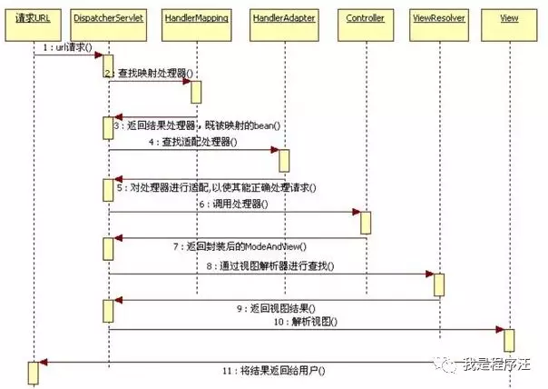


## Future和FutureTask


## 死锁实例


> **1、多线程有什么用？**

一个可能在很多人看来很扯淡的一个问题：我会用多线程就好了，还管它有什么用？在我看来，这个回答更扯淡。所谓"知其然知其所以然"，"会用"只是"知其然"，"为什么用"才是"知其所以然"，只有达到"知其然知其所以然"的程度才可以说是把一个知识点运用自如。OK，下面说说我对这个问题的看法：

**1）发挥多核CPU的优势**

随着工业的进步，现在的笔记本、台式机乃至商用的应用服务器至少也都是双核的，4核、8核甚至16核的也都不少见，如果是单线程的程序，那么在双核CPU上就浪费了50%，在4核CPU上就浪费了75%。**单核CPU上所谓的"多线程"那是假的多线程，同一时间处理器只会处理一段逻辑，只不过线程之间切换得比较快，看着像多个线程"同时"运行罢了**。多核CPU上的多线程才是真正的多线程，它能让你的多段逻辑同时工作，多线程，可以真正发挥出多核CPU的优势来，达到充分利用CPU的目的。

**2）防止阻塞**

从程序运行效率的角度来看，单核CPU不但不会发挥出多线程的优势，反而会因为在单核CPU上运行多线程导致线程上下文的切换，而降低程序整体的效率。但是单核CPU我们还是要应用多线程，就是为了防止阻塞。试想，如果单核CPU使用单线程，那么只要这个线程阻塞了，比方说远程读取某个数据吧，对端迟迟未返回又没有设置超时时间，那么你的整个程序在数据返回回来之前就停止运行了。多线程可以防止这个问题，多条线程同时运行，哪怕一条线程的代码执行读取数据阻塞，也不会影响其它任务的执行。

**3）便于建模**

这是另外一个没有这么明显的优点了。假设有一个大的任务A，单线程编程，那么就要考虑很多，建立整个程序模型比较麻烦。但是如果把这个大的任务A分解成几个小任务，任务B、任务C、任务D，分别建立程序模型，并通过多线程分别运行这几个任务，那就简单很多了。


> **2、创建线程的方式**

比较常见的一个问题了，一般就是两种：

1）继承Thread类

2）实现Runnable接口

至于哪个好，不用说肯定是后者好，因为实现接口的方式比继承类的方式更灵活，也能减少程序之间的耦合度，**面向接口编程**也是设计模式6大原则的核心。

其实还有第3种，点击[这里](http://mp.weixin.qq.com/s?__biz=MzI3ODcxMzQzMw==&mid=2247483859&idx=1&sn=a46418cc67a1f724c3bff681cb628353&chksm=eb5384e5dc240df3f666ab02c1ddce07b3c34917e433124b0925d8390a54cf7b87ae1d5ebd54&scene=21#wechat_redirect)了解更多。

 

> **3、start()方法和run()方法的区别**

只有调用了start()方法，才会表现出多线程的特性，不同线程的run()方法里面的代码交替执行。如果只是调用run()方法，那么代码还是同步执行的，必须等待一个线程的run()方法里面的代码全部执行完毕之后，另外一个线程才可以执行其run()方法里面的代码。

 

> **4、Runnable接口和Callable接口的区别**

有点深的问题了，也看出一个Java程序员学习知识的广度。

Runnable接口中的run()方法的返回值是void，它做的事情只是纯粹地去执行run()方法中的代码而已；Callable接口中的call()方法是有返回值的，是一个泛型，和Future、FutureTask配合可以用来获取异步执行的结果。

这其实是很有用的一个特性，因为**多线程相比单线程更难、更复杂的一个重要原因就是因为多线程充满着未知性**，某条线程是否执行了？某条线程执行了多久？某条线程执行的时候我们期望的数据是否已经赋值完毕？无法得知，我们能做的只是等待这条多线程的任务执行完毕而已。而Callable+Future/FutureTask却可以获取多线程运行的结果，可以在等待时间太长没获取到需要的数据的情况下取消该线程的任务，真的是非常有用。

 

> **5、CyclicBarrier和CountDownLatch的区别**

两个看上去有点像的类，都在java.util.concurrent下，都可以用来表示代码运行到某个点上，二者的区别在于：

1）CyclicBarrier的某个线程运行到某个点上之后，该线程即停止运行，直到所有的线程都到达了这个点，所有线程才重新运行；CountDownLatch则不是，某线程运行到某个点上之后，只是给某个数值-1而已，该线程继续运行。

2）CyclicBarrier只能唤起一个任务，CountDownLatch可以唤起多个任务。

3) CyclicBarrier可重用，CountDownLatch不可重用，计数值为0该CountDownLatch就不可再用了。


> **6、volatile关键字的作用**

一个非常重要的问题，是每个学习、应用多线程的Java程序员都必须掌握的。理解volatile关键字的作用的前提是要理解Java内存模型，这里就不讲Java内存模型了，可以参见第31点，volatile关键字的作用主要有两个：

1）多线程主要围绕可见性和原子性两个特性而展开，使用volatile关键字修饰的变量，保证了其在多线程之间的可见性，即每次读取到volatile变量，一定是最新的数据。

2）代码底层执行不像我们看到的高级语言----Java程序这么简单，它的执行是**Java代码-->字节码-->根据字节码执行对应的C/C++代码-->C/C++代码被编译成汇编语言-->和硬件电路交互**，现实中，为了获取更好的性能JVM可能会对指令进行重排序，多线程下可能会出现一些意想不到的问题。使用volatile则会对禁止语义重排序，当然这也一定程度上降低了代码执行效率。

从实践角度而言，volatile的一个重要作用就是和CAS结合，保证了原子性，详细的可以参见java.util.concurrent.atomic包下的类，比如AtomicInteger，更多详情请点击[这里](http://mp.weixin.qq.com/s?__biz=MzI3ODcxMzQzMw==&mid=2247483916&idx=1&sn=89daf388da0d6fe40dc54e9a4018baeb&chksm=eb53873adc240e2cf55400f3261228d08fc943c4f196566e995681549c47630b70ac01b75031&scene=21#wechat_redirect)进行学习。

 

> **7、什么是线程安全**

又是一个理论的问题，各式各样的答案有很多，我给出一个个人认为解释地最好的：**如果你的代码在多线程下执行和在单线程下执行永远都能获得一样的结果，那么你的代码就是线程安全的**。

这个问题有值得一提的地方，就是线程安全也是有几个级别的：

**1）不可变**

像String、Integer、Long这些，都是final类型的类，任何一个线程都改变不了它们的值，要改变除非新创建一个，因此这些不可变对象不需要任何同步手段就可以直接在多线程环境下使用

**2）绝对线程安全**

不管运行时环境如何，调用者都不需要额外的同步措施。要做到这一点通常需要付出许多额外的代价，Java中标注自己是线程安全的类，实际上绝大多数都不是线程安全的，不过绝对线程安全的类，Java中也有，比方说CopyOnWriteArrayList、CopyOnWriteArraySet

**3）相对线程安全**

相对线程安全也就是我们通常意义上所说的线程安全，像Vector这种，add、remove方法都是原子操作，不会被打断，但也仅限于此，如果有个线程在遍历某个Vector、有个线程同时在add这个Vector，99%的情况下都会出现ConcurrentModificationException，也就是**fail-fast机制**。

**4）线程非安全**

这个就没什么好说的了，ArrayList、LinkedList、HashMap等都是线程非安全的类，点击[这里](http://mp.weixin.qq.com/s?__biz=MzI3ODcxMzQzMw==&mid=2247486446&idx=2&sn=cb4f3aff0427c5ac3ffe5b61e150f506&chksm=eb538ed8dc2407ceb91fffe3c3bd559d9b15537446f84eb3bfb1a80e67f5efee176ca468a07b&scene=21#wechat_redirect)了解为什么不安全。

 

> **8、Java中如何获取到线程dump文件**

死循环、死锁、阻塞、页面打开慢等问题，打线程dump是最好的解决问题的途径。所谓线程dump也就是线程堆栈，获取到线程堆栈有两步：

1）获取到线程的pid，可以通过使用jps命令，在Linux环境下还可以使用ps -ef | grep java

2）打印线程堆栈，可以通过使用jstack pid命令，在Linux环境下还可以使用kill -3 pid

另外提一点，Thread类提供了一个getStackTrace()方法也可以用于获取线程堆栈。这是一个实例方法，因此此方法是和具体线程实例绑定的，每次获取获取到的是具体某个线程当前运行的堆栈。

 

> **9、一个线程如果出现了运行时异常会怎么样**

如果这个异常没有被捕获的话，这个线程就停止执行了。另外重要的一点是：**如果这个线程持有某个某个对象的监视器，那么这个对象监视器会被立即释放**

 

> **10、如何在两个线程之间共享数据**

通过在线程之间共享对象就可以了，然后通过wait/notify/notifyAll、await/signal/signalAll进行唤起和等待，比方说阻塞队列BlockingQueue就是为线程之间共享数据而设计的

 

> **11、sleep方法和wait方法有什么区别** 

这个问题常问，sleep方法和wait方法都可以用来放弃CPU一定的时间，不同点在于如果线程持有某个对象的监视器，sleep方法不会放弃这个对象的监视器，wait方法会放弃这个对象的监视器

 

> **12、生产者消费者模型的作用是什么**

这个问题很理论，但是很重要：

1）**通过平衡生产者的生产能力和消费者的消费能力来提升整个系统的运行效率**，这是生产者消费者模型最重要的作用

2）解耦，这是生产者消费者模型附带的作用，解耦意味着生产者和消费者之间的联系少，联系越少越可以独自发展而不需要收到相互的制约

 

> **13、ThreadLocal有什么用**

简单说ThreadLocal就是一种以**空间换时间**的做法，在每个Thread里面维护了一个以开地址法实现的ThreadLocal.ThreadLocalMap，把数据进行隔离，数据不共享，自然就没有线程安全方面的问题了

 

> **14、为什么wait()方法和notify()/notifyAll()方法要在同步块中被调用**

这是JDK强制的，wait()方法和notify()/notifyAll()方法在调用前都必须先获得对象的锁

 

> **15、wait()方法和notify()/notifyAll()方法在放弃对象监视器时有什么区别**

wait()方法和notify()/notifyAll()方法在放弃对象监视器的时候的区别在于：**wait()方法立即释放对象监视器，notify()/notifyAll()方法则会等待线程剩余代码执行完毕才会放弃对象监视器**。

 

> **16、为什么要使用线程池**

避免频繁地创建和销毁线程，达到线程对象的重用。另外，使用线程池还可以根据项目灵活地控制并发的数目。点击[这里](https://mp.weixin.qq.com/s?__biz=MzI3ODcxMzQzMw==&mid=2247483824&idx=1&sn=7e34a3944a93d649d78d618cf04e0619&scene=21#wechat_redirect)学习线程池详解。

 

> **17、怎么检测一个线程是否持有对象监视器**

我也是在网上看到一道多线程面试题才知道有方法可以判断某个线程是否持有对象监视器：Thread类提供了一个holdsLock(Object obj)方法，当且仅当对象obj的监视器被某条线程持有的时候才会返回true，注意这是一个static方法，这意味着**"某条线程"指的是当前线程**。

 

> **18、synchronized和ReentrantLock的区别**

synchronized是和if、else、for、while一样的关键字，ReentrantLock是类，这是二者的本质区别。既然ReentrantLock是类，那么它就提供了比synchronized更多更灵活的特性，可以被继承、可以有方法、可以有各种各样的类变量，ReentrantLock比synchronized的扩展性体现在几点上：

（1）ReentrantLock可以对获取锁的等待时间进行设置，这样就避免了死锁

（2）ReentrantLock可以获取各种锁的信息

（3）ReentrantLock可以灵活地实现多路通知

另外，二者的锁机制其实也是不一样的。ReentrantLock底层调用的是Unsafe的park方法加锁，synchronized操作的应该是对象头中mark word，这点我不能确定。

 

> **19、ConcurrentHashMap的并发度是什么**

ConcurrentHashMap的并发度就是segment的大小，默认为16，这意味着最多同时可以有16条线程操作ConcurrentHashMap，这也是ConcurrentHashMap对Hashtable的最大优势，任何情况下，Hashtable能同时有两条线程获取Hashtable中的数据吗？

 

> **20、ReadWriteLock是什么**

首先明确一下，不是说ReentrantLock不好，只是ReentrantLock某些时候有局限。如果使用ReentrantLock，可能本身是为了防止线程A在写数据、线程B在读数据造成的数据不一致，但这样，如果线程C在读数据、线程D也在读数据，读数据是不会改变数据的，没有必要加锁，但是还是加锁了，降低了程序的性能。

因为这个，才诞生了读写锁ReadWriteLock。ReadWriteLock是一个读写锁接口，ReentrantReadWriteLock是ReadWriteLock接口的一个具体实现，实现了读写的分离，**读锁是共享的，写锁是独占的**，读和读之间不会互斥，读和写、写和读、写和写之间才会互斥，提升了读写的性能。

 

> **21、FutureTask是什么**

这个其实前面有提到过，FutureTask表示一个异步运算的任务。FutureTask里面可以传入一个Callable的具体实现类，可以对这个异步运算的任务的结果进行等待获取、判断是否已经完成、取消任务等操作。当然，由于FutureTask也是Runnable接口的实现类，所以FutureTask也可以放入线程池中。

 

> **22、Linux环境下如何查找哪个线程使用CPU最长**

这是一个比较偏实践的问题，这种问题我觉得挺有意义的。可以这么做：

（1）获取项目的pid，jps或者ps -ef | grep java，这个前面有讲过

（2）top -H -p pid，顺序不能改变

这样就可以打印出当前的项目，每条线程占用CPU时间的百分比。注意这里打出的是LWP，也就是操作系统原生线程的线程号，我笔记本山没有部署Linux环境下的Java工程，因此没有办法截图演示，网友朋友们如果公司是使用Linux环境部署项目的话，可以尝试一下。

使用"top -H -p pid"+"jps pid"可以很容易地找到某条占用CPU高的线程的线程堆栈，从而定位占用CPU高的原因，一般是因为不当的代码操作导致了死循环。

最后提一点，"top -H -p pid"打出来的LWP是十进制的，"jps pid"打出来的本地线程号是十六进制的，转换一下，就能定位到占用CPU高的线程的当前线程堆栈了。

 

> **23、Java编程写一个会导致死锁的程序**

第一次看到这个题目，觉得这是一个非常好的问题。很多人都知道死锁是怎么一回事儿：线程A和线程B相互等待对方持有的锁导致程序无限死循环下去。当然也仅限于此了，问一下怎么写一个死锁的程序就不知道了，这种情况说白了就是不懂什么是死锁，懂一个理论就完事儿了，实践中碰到死锁的问题基本上是看不出来的。

真正理解什么是死锁，这个问题其实不难，几个步骤：

1）两个线程里面分别持有两个Object对象：lock1和lock2。这两个lock作为同步代码块的锁；

2）线程1的run()方法中同步代码块先获取lock1的对象锁，Thread.sleep(xxx)，时间不需要太多，50毫秒差不多了，然后接着获取lock2的对象锁。这么做主要是为了防止线程1启动一下子就连续获得了lock1和lock2两个对象的对象锁

3）线程2的run)(方法中同步代码块先获取lock2的对象锁，接着获取lock1的对象锁，当然这时lock1的对象锁已经被线程1锁持有，线程2肯定是要等待线程1释放lock1的对象锁的

这样，线程1"睡觉"睡完，线程2已经获取了lock2的对象锁了，线程1此时尝试获取lock2的对象锁，便被阻塞，此时一个死锁就形成了。代码就不写了，占的篇幅有点多，Java多线程7：死锁这篇文章里面有，就是上面步骤的代码实现。

点击[这里](http://mp.weixin.qq.com/s?__biz=MzI3ODcxMzQzMw==&mid=2247483887&idx=1&sn=ab85965995bde2fb539aaa4b47e7e008&chksm=eb5384d9dc240dcfa20ce9ceedcc8f6174337f74482b103d0b9fc363b5e6b6366e7ddc4590c7&scene=21#wechat_redirect)提供了一个死锁的案例。

 

> **24、怎么唤醒一个阻塞的线程**

如果线程是因为调用了wait()、sleep()或者join()方法而导致的阻塞，可以中断线程，并且通过抛出InterruptedException来唤醒它；如果线程遇到了IO阻塞，无能为力，因为IO是操作系统实现的，Java代码并没有办法直接接触到操作系统。

 

> **25、不可变对象对多线程有什么帮助**

前面有提到过的一个问题，不可变对象保证了对象的内存可见性，对不可变对象的读取不需要进行额外的同步手段，提升了代码执行效率。

 

> **26、什么是多线程的上下文切换**

多线程的上下文切换是指CPU控制权由一个已经正在运行的线程切换到另外一个就绪并等待获取CPU执行权的线程的过程。

 

> **27、如果你提交任务时，线程池队列已满，这时会发生什么**

这里区分一下：

1）如果使用的是无界队列LinkedBlockingQueue，也就是无界队列的话，没关系，继续添加任务到阻塞队列中等待执行，因为LinkedBlockingQueue可以近乎认为是一个无穷大的队列，可以无限存放任务

2）如果使用的是有界队列比如ArrayBlockingQueue，任务首先会被添加到ArrayBlockingQueue中，ArrayBlockingQueue满了，会根据maximumPoolSize的值增加线程数量，如果增加了线程数量还是处理不过来，ArrayBlockingQueue继续满，那么则会使用拒绝策略RejectedExecutionHandler处理满了的任务，默认是AbortPolicy

 

> **28、Java中用到的线程调度算法是什么**

抢占式。一个线程用完CPU之后，操作系统会根据线程优先级、线程饥饿情况等数据算出一个总的优先级并分配下一个时间片给某个线程执行。

 

> **29、Thread.sleep(0)的作用是什么**

这个问题和上面那个问题是相关的，我就连在一起了。由于Java采用抢占式的线程调度算法，因此可能会出现某条线程常常获取到CPU控制权的情况，为了让某些优先级比较低的线程也能获取到CPU控制权，可以使用Thread.sleep(0)手动触发一次操作系统分配时间片的操作，这也是平衡CPU控制权的一种操作。

 

> **30、什么是自旋**

很多synchronized里面的代码只是一些很简单的代码，执行时间非常快，此时等待的线程都加锁可能是一种不太值得的操作，因为线程阻塞涉及到用户态和内核态切换的问题。既然synchronized里面的代码执行得非常快，不妨让等待锁的线程不要被阻塞，而是在synchronized的边界做忙循环，这就是自旋。如果做了多次忙循环发现还没有获得锁，再阻塞，这样可能是一种更好的策略。

 

> **31、什么是Java内存模型**

Java内存模型定义了一种多线程访问Java内存的规范。Java内存模型要完整讲不是这里几句话能说清楚的，我简单总结一下Java内存模型的几部分内容：

1）Java内存模型将内存分为了**主内存和工作内存**。类的状态，也就是类之间共享的变量，是存储在主内存中的，每次Java线程用到这些主内存中的变量的时候，会读一次主内存中的变量，并让这些内存在自己的工作内存中有一份拷贝，运行自己线程代码的时候，用到这些变量，操作的都是自己工作内存中的那一份。在线程代码执行完毕之后，会将最新的值更新到主内存中去

2）定义了几个原子操作，用于操作主内存和工作内存中的变量

3）定义了volatile变量的使用规则

4）happens-before，即先行发生原则，定义了操作A必然先行发生于操作B的一些规则，比如在同一个线程内控制流前面的代码一定先行发生于控制流后面的代码、一个释放锁unlock的动作一定先行发生于后面对于同一个锁进行锁定lock的动作等等，只要符合这些规则，则不需要额外做同步措施，如果某段代码不符合所有的happens-before规则，则这段代码一定是线程非安全的

 

> **32、什么是CAS**

CAS，全称为Compare and Swap，即比较-替换。假设有三个操作数：**内存值V、旧的预期值A、要修改的值B，当且仅当预期值A和内存值V相同时，才会将内存值修改为B并返回true，否则什么都不做并返回false**。当然CAS一定要volatile变量配合，这样才能保证每次拿到的变量是主内存中最新的那个值，否则旧的预期值A对某条线程来说，永远是一个不会变的值A，只要某次CAS操作失败，永远都不可能成功。更多CAS详情请点击[这里](http://mp.weixin.qq.com/s?__biz=MzI3ODcxMzQzMw==&mid=2247483728&idx=1&sn=3d734dc972a244891406cfbc443eabed&chksm=eb538466dc240d7033b889665b579a490266b8c8f1e7a08da35f67ca484dad19503e8b230e05&scene=21#wechat_redirect)学习。

 

> **33、什么是乐观锁和悲观锁**

1）乐观锁：就像它的名字一样，对于并发间操作产生的线程安全问题持乐观状态，乐观锁认为竞争不总是会发生，因此它不需要持有锁，将**比较-替换**这两个动作作为一个原子操作尝试去修改内存中的变量，如果失败则表示发生冲突，那么就应该有相应的重试逻辑。

2）悲观锁：还是像它的名字一样，对于并发间操作产生的线程安全问题持悲观状态，悲观锁认为竞争总是会发生，因此每次对某资源进行操作时，都会持有一个独占的锁，就像synchronized，不管三七二十一，直接上了锁就操作资源了。

点击[这里](http://mp.weixin.qq.com/s?__biz=MzI3ODcxMzQzMw==&mid=2247483753&idx=1&sn=fd09b268d8f374095c4e9e2d627f3305&chksm=eb53845fdc240d4938023e75a207cb29c615d1b5891ae340e85d0754e134af5a8b183b01ae52&scene=21#wechat_redirect)了解更多乐观锁与悲观锁详情。

 

> **34、什么是AQS**

简单说一下AQS，AQS全称为AbstractQueuedSychronizer，翻译过来应该是抽象队列同步器。

如果说java.util.concurrent的基础是CAS的话，那么AQS就是整个Java并发包的核心了，ReentrantLock、CountDownLatch、Semaphore等等都用到了它。AQS实际上以双向队列的形式连接所有的Entry，比方说ReentrantLock，所有等待的线程都被放在一个Entry中并连成双向队列，前面一个线程使用ReentrantLock好了，则双向队列实际上的第一个Entry开始运行。

AQS定义了对双向队列所有的操作，而只开放了tryLock和tryRelease方法给开发者使用，开发者可以根据自己的实现重写tryLock和tryRelease方法，以实现自己的并发功能。

 

> **35、单例模式的线程安全性**

老生常谈的问题了，首先要说的是单例模式的线程安全意味着：**某个类的实例在多线程环境下只会被创建一次出来**。单例模式有很多种的写法，我总结一下：

1）饿汉式单例模式的写法：线程安全

2）懒汉式单例模式的写法：非线程安全

3）双检锁单例模式的写法：线程安全

 

> **36、Semaphore有什么作用**

Semaphore就是一个信号量，它的作用是**限制某段代码块的并发数**。Semaphore有一个构造函数，可以传入一个int型整数n，表示某段代码最多只有n个线程可以访问，如果超出了n，那么请等待，等到某个线程执行完毕这段代码块，下一个线程再进入。由此可以看出如果Semaphore构造函数中传入的int型整数n=1，相当于变成了一个synchronized了。

 

> **37、Hashtable的size()方法中明明只有一条语句"return count"，为什么还要做同步？**

这是我之前的一个困惑，不知道大家有没有想过这个问题。某个方法中如果有多条语句，并且都在操作同一个类变量，那么在多线程环境下不加锁，势必会引发线程安全问题，这很好理解，但是size()方法明明只有一条语句，为什么还要加锁？

关于这个问题，在慢慢地工作、学习中，有了理解，主要原因有两点：

1）**同一时间只能有一条线程执行固定类的同步方法，但是对于类的非同步方法，可以多条线程同时访问**。所以，这样就有问题了，可能线程A在执行Hashtable的put方法添加数据，线程B则可以正常调用size()方法读取Hashtable中当前元素的个数，那读取到的值可能不是最新的，可能线程A添加了完了数据，但是没有对size++，线程B就已经读取size了，那么对于线程B来说读取到的size一定是不准确的。而给size()方法加了同步之后，意味着线程B调用size()方法只有在线程A调用put方法完毕之后才可以调用，这样就保证了线程安全性

2）**CPU执行代码，执行的不是Java代码，这点很关键，一定得记住**。Java代码最终是被翻译成机器码执行的，机器码才是真正可以和硬件电路交互的代码。**即使你看到Java代码只有一行，甚至你看到Java代码编译之后生成的字节码也只有一行，也不意味着对于底层来说这句语句的操作只有一个**。一句"return count"假设被翻译成了三句汇编语句执行，一句汇编语句和其机器码做对应，完全可能执行完第一句，线程就切换了。

 

> **38、线程类的构造方法、静态块是被哪个线程调用的**

这是一个非常刁钻和狡猾的问题。请记住：线程类的构造方法、静态块是被new这个线程类所在的线程所调用的，而run方法里面的代码才是被线程自身所调用的。

如果说上面的说法让你感到困惑，那么我举个例子，假设Thread2中new了Thread1，main函数中new了Thread2，那么：

1）Thread2的构造方法、静态块是main线程调用的，Thread2的run()方法是Thread2自己调用的

2）Thread1的构造方法、静态块是Thread2调用的，Thread1的run()方法是Thread1自己调用的

 

> **39、同步方法和同步块，哪个是更好的选择**

同步块，这意味着同步块之外的代码是异步执行的，这比同步整个方法更提升代码的效率。请知道一条原则：**同步的范围越小越好**。

借着这一条，我额外提一点，虽说同步的范围越少越好，但是在Java虚拟机中还是存在着一种叫做**锁粗化**的优化方法，这种方法就是把同步范围变大。这是有用的，比方说StringBuffer，它是一个线程安全的类，自然最常用的append()方法是一个同步方法，我们写代码的时候会反复append字符串，这意味着要进行反复的加锁->解锁，这对性能不利，因为这意味着Java虚拟机在这条线程上要反复地在内核态和用户态之间进行切换，因此Java虚拟机会将多次append方法调用的代码进行一个锁粗化的操作，将多次的append的操作扩展到append方法的头尾，变成一个大的同步块，这样就减少了加锁-->解锁的次数，有效地提升了代码执行的效率。

 

> **40、高并发、任务执行时间短的业务怎样使用线程池？并发不高、任务执行时间长的业务怎样使用线程池？并发高、业务执行时间长的业务怎样使用线程池？**

这是我在并发编程网上看到的一个问题，把这个问题放在最后一个，希望每个人都能看到并且思考一下，因为这个问题非常好、非常实际、非常专业。关于这个问题，个人看法是：

1）高并发、任务执行时间短的业务，线程池线程数可以设置为CPU核数+1，减少线程上下文的切换

2）并发不高、任务执行时间长的业务要区分开看：

a）假如是业务时间长集中在IO操作上，也就是IO密集型的任务，因为IO操作并不占用CPU，所以不要让所有的CPU闲下来，可以加大线程池中的线程数目，让CPU处理更多的业务

b）假如是业务时间长集中在计算操作上，也就是计算密集型任务，这个就没办法了，和（1）一样吧，线程池中的线程数设置得少一些，减少线程上下文的切换

c）并发高、业务执行时间长，解决这种类型任务的关键不在于线程池而在于整体架构的设计，看看这些业务里面某些数据是否能做缓存是第一步，增加服务器是第二步，至于线程池的设置，设置参考其他有关线程池的文章。最后，业务执行时间长的问题，也可能需要分析一下，看看能不能使用中间件对任务进行拆分和解耦。


> **1.Java集合框架是什么？说出一些集合框架的优点？**


每种编程语言中都有集合，最初的Java版本包含几种集合类：Vector、Stack、HashTable和Array。


随着集合的广泛使用，Java1.2提出了囊括所有集合接口、实现和算法的集合框架。在保证线程安全的情况下使用泛型和并发集合类，Java已经经历了很久。它还包括在Java并发包中，阻塞接口以及它们的实现。


集合框架的部分优点如下：

（1）使用核心集合类降低开发成本，而非实现我们自己的集合类。

（2）随着使用经过严格测试的集合框架类，代码质量会得到提高。

（3）通过使用JDK附带的集合类，可以降低代码维护成本。

（4）复用性和可操作性。


> **2.集合框架中的泛型有什么优点？**


1.Java1.5引入了泛型，所有的集合接口和实现都大量地使用它。

2.泛型允许我们为集合提供一个可以容纳的对象类型，因此，如果你添加其它类型的任何元素，它会在编译时报错。

3.这避免了在运行时出现ClassCastException，因为你将会在编译时得到报错信息。

4.泛型也使得代码整洁，我们不需要使用显式转换和instanceOf操作符。

5.它也给运行时带来好处，因为不会产生类型检查的字节码指令。


> **3.Java集合框架的基础接口有哪些？**


Collection为集合层级的根接口。一个集合代表一组对象，这些对象即为它的元素。Java平台不提供这个接口任何直接的实现。


Set是一个不能包含重复元素的集合。这个接口对数学集合抽象进行建模，被用来代表集合，就如一副牌。


List是一个有序集合，可以包含重复元素。你可以通过它的索引来访问任何元素。List更像长度动态变换的数组。


Map是一个将key映射到value的对象.一个Map不能包含重复的key：每个key最多只能映射一个value。


一些其它的接口有Queue、Dequeue、SortedSet、SortedMap和ListIterator。


> **4.为何Collection不从Cloneable和Serializable接口继承？**


Collection接口指定一组对象，对象即为它的元素。如何维护这些元素由Collection的具体实现决定。例如，一些如List的Collection实现允许重复的元素，而其它的如Set就不允许。


很多Collection实现有一个公有的clone方法。然而，把它放到集合的所有实现中也是没有意义的。这是因为Collection是一个抽象表现。重要的是实现。


当与具体实现打交道的时候，克隆或序列化的语义和含义才发挥作用。所以，具体实现应该决定如何对它进行克隆或序列化，或它是否可以被克隆或序列化。点击[这里](http://mp.weixin.qq.com/s?__biz=MzI3ODcxMzQzMw==&mid=2247484372&idx=1&sn=381af66344b4b50d033c38e51bcb0e21&chksm=eb5386e2dc240ff4fbee79af445ffeb3856da484a8f5206bcaf4531f0d510564943b213f948c&scene=21#wechat_redirect)一文学会序列化。


在所有的实现中授权克隆和序列化，最终导致更少的灵活性和更多的限制。特定的实现应该决定它是否可以被克隆和序列化。点击[这里](http://mp.weixin.qq.com/s?__biz=MzI3ODcxMzQzMw==&mid=2247484372&idx=1&sn=381af66344b4b50d033c38e51bcb0e21&chksm=eb5386e2dc240ff4fbee79af445ffeb3856da484a8f5206bcaf4531f0d510564943b213f948c&scene=21#wechat_redirect)一文学会序列化。


> **5.为何Map接口不继承Collection接口？**


尽管Map接口和它的实现也是集合框架的一部分，但Map不是集合，集合也不是Map。因此，Map继承Collection毫无意义，反之亦然。


如果Map继承Collection接口，那么元素去哪儿？Map包含key-value对，它提供抽取key或value列表集合的方法，但是它不适合“一组对象”规范。


> **6.Iterator是什么？**


Iterator接口提供遍历任何Collection的接口。我们可以从一个Collection中使用迭代器方法来获取迭代器实例。迭代器取代了Java集合框架中的Enumeration。迭代器允许调用者在迭代过程中移除元素。


> **7.Enumeration和Iterator接口的区别？**


Enumeration的速度是Iterator的两倍，也使用更少的内存。Enumeration是非常基础的，也满足了基础的需要。但是，与Enumeration相比，Iterator更加安全，因为当一个集合正在被遍历的时候，它会阻止其它线程去修改集合。


迭代器取代了Java集合框架中的Enumeration。迭代器允许调用者从集合中移除元素，而Enumeration不能做到。为了使它的功能更加清晰，迭代器方法名已经经过改善。


> **8.为何没有像Iterator.add()这样的方法，向集合中添加元素？**


语义不明，已知的是，Iterator的协议不能确保迭代的次序。然而要注意，ListIterator没有提供一个add操作，它要确保迭代的顺序。


> **9.为何迭代器没有一个方法可以直接获取下一个元素，而不需要移动游标？**


它可以在当前Iterator的顶层实现，但是它用得很少，如果将它加到接口中，每个继承都要去实现它，这没有意义。


> **10.Iterater和ListIterator之间有什么区别？**


（1）我们可以使用Iterator来遍历Set和List集合，而ListIterator只能遍历List。

（2）Iterator只可以向前遍历，而LIstIterator可以双向遍历。

（3）ListIterator从Iterator接口继承，然后添加了一些额外的功能，比如添加一个元素、替换一个元素、获取前面或后面元素的索引位置。


> **11.通过迭代器fail-fast属性，你明白了什么？**


每次我们尝试获取下一个元素的时候，Iterator fail-fast属性检查当前集合结构里的任何改动。如果发现任何改动，它抛出ConcurrentModificationException。Collection中所有Iterator的实现都是按fail-fast来设计的（ConcurrentHashMap和CopyOnWriteArrayList这类并发集合类除外）。


> **12.fail-fast与fail-safe有什么区别？**


Iterator的fail-fast属性与当前的集合共同起作用，因此它不会受到集合中任何改动的影响。Java.util包中的所有集合类都被设计为fail-fast的，

而java.util.concurrent中的集合类都为fail-safe的。


Fall—fast迭代器抛出ConcurrentModificationException，

fall—safe迭代器从不抛出ConcurrentModificationException。


> **13.在迭代一个集合的时候，如何避免？**


ConcurrentModificationException？

在遍历一个集合的时候我们可以使用并发集合类来避免ConcurrentModificationException，比如使用CopyOnWriteArrayList，而不是ArrayList。


> **14.为何Iterator接口没有具体的实现？**


Iterator接口定义了遍历集合的方法，但它的实现则是集合实现类的责任。每个能够返回用于遍历的Iterator的集合类都有它自己的Iterator实现内部类。


这就允许集合类去选择迭代器是fail-fast还是fail-safe的。比如，ArrayList迭代器是fail-fast的，而CopyOnWriteArrayList迭代器是fail-safe的。


> **15.UnsupportedOperationException是什么？**


UnsupportedOperationException是用于表明操作不支持的异常。在JDK类中已被大量运用，在集合框架java.util.Collections.UnmodifiableCollection将会在所有add和remove操作中抛出这个异常。


> **16.hashCode()和equals()方法有何重要性？**


HashMap使用Key对象的hashCode()和equals()方法去决定key-value对的索引。点击[这里](http://mp.weixin.qq.com/s?__biz=MzI3ODcxMzQzMw==&mid=2247486439&idx=1&sn=3afb389bca737a1799f7cdee92a7dc99&chksm=eb538ed1dc2407c7782cdf71344786c3db5c32469fdfb1ab97e58364c2902dbcde09ed98e16a&scene=21#wechat_redirect)一文搞懂它们之间的关系。


当我们试着从HashMap中获取值的时候，这些方法也会被用到。如果这些方法没有被正确地实现，在这种情况下，两个不同Key也许会产生相同的hashCode()和equals()输出，HashMap将会认为它们是相同的，然后覆盖它们，而非把它们存储到不同的地方。


同样的，所有不允许存储重复数据的集合类都使用hashCode()和equals()去查找重复，所以正确实现它们非常重要。equals()和hashCode()的实现应该遵循以下规则：


1.如果o1.equals(o2)，那么o1.hashCode() == o2.hashCode()总是为true的。

2.如果o1.hashCode() == o2.hashCode()，并不意味着o1.equals(o2)会为true。


> **17.Map接口提供了哪些不同的集合视图？**


Map接口提供三个集合视图：


1）Set keyset()：返回map中包含的所有key的一个Set视图。集合是受map支持的，map的变化会在集合中反映出来，反之亦然。当一个迭代器正在遍历一个集合时，若map被修改了（除迭代器自身的移除操作以外），迭代器的结果会变为未定义。集合支持通过Iterator的Remove、Set.remove、removeAll、retainAll和clear操作进行元素移除，从map中移除对应的映射。

它不支持add和addAll操作。


2）Collection values()：返回一个map中包含的所有value的一个Collection视图。这个collection受map支持的，map的变化会在collection中反映出来，反之亦然。当一个迭代器正在遍历一个collection时，若map被修改了（除迭代器自身的移除操作以外），迭代器的结果会变为未定义。集合支持通过Iterator的Remove、Set.remove、removeAll、retainAll和clear操作进行元素移除，从map中移除对应的映射。它不支持add和addAll操作。


3）Set<Map.Entry<K,V>> entrySet()：返回一个map钟包含的所有映射的一个集合视图。这个集合受map支持的，map的变化会在collection中反映出来，反之亦然。当一个迭代器正在遍历一个集合时，若map被修改了（除迭代器自身的移除操作，以及对迭代器返回的entry进行setValue外），迭代器的结果会变为未定义。集合支持通过Iterator的Remove、Set.remove、removeAll、retainAll和clear操作进行元素移除，从map中移除对应的映射。它不支持add和addAll操作。


> **18.HashMap和HashTable有何不同？**


（1）HashMap允许key和value为null，而HashTable不允许。

（2）HashTable是同步的，而HashMap不是。所以HashMap适合单线程环境，HashTable适合多线程环境。

（3）在Java1.4中引入了LinkedHashMap，HashMap的一个子类，假如你想要遍历顺序，你很容易从HashMap转向LinkedHashMap，但是HashTable不是这样的，它的顺序是不可预知的。

（4）HashMap提供对key的Set进行遍历，因此它是fail-fast的，但HashTable提供对key的Enumeration进行遍历，它不支持fail-fast。

（5）HashTable被认为是个遗留的类，如果你寻求在迭代的时候修改Map，你应该使用CocurrentHashMap。


> **19.如何决定选用HashMap还是TreeMap？**


对于在Map中插入、删除和定位元素这类操作，HashMap是最好的选择。然而，假如你需要对一个有序的key集合进行遍历，TreeMap是更好的选择。基于你的collection的大小，也许向HashMap中添加元素会更快，将map换为TreeMap进行有序key的遍历。


> **20.ArrayList和Vector有何异同点？**


ArrayList和Vector在很多时候都很类似。

（1）两者都是基于索引的，内部由一个数组支持。

（2）两者维护插入的顺序，我们可以根据插入顺序来获取元素。

（3）ArrayList和Vector的迭代器实现都是fail-fast的。

（4）ArrayList和Vector两者允许null值，也可以使用索引值对元素进行随机访问。

以下是ArrayList和Vector的不同点。

（1）Vector是同步的，而ArrayList不是。然而，如果你寻求在迭代的时候对列表进行改变，你应该使用CopyOnWriteArrayList。

（2）ArrayList比Vector快，它因为有同步，不会过载。

（3）ArrayList更加通用，因为我们可以使用Collections工具类轻易地获取同步列表和只读列表。


> **21.Array和ArrayList有何区别？什么时候更适合用Array？**


Array可以容纳基本类型和对象，而ArrayList只能容纳对象。

Array是指定大小的，而ArrayList大小是固定的。

Array没有提供ArrayList那么多功能，比如addAll、removeAll和iterator等。尽管ArrayList明显是更好的选择，但也有些时候Array比较好用。

（1）如果列表的大小已经指定，大部分情况下是存储和遍历它们。

（2）对于遍历基本数据类型，尽管Collections使用自动装箱来减轻编码任务，在指定大小的基本类型的列表上工作也会变得很慢。

（3）如果你要使用多维数组，使用[][]比List<List<>>更容易。


> **22.ArrayList和LinkedList有何区别？**


ArrayList和LinkedList两者都实现了List接口，但是它们之间有些不同。


1）ArrayList是由Array所支持的基于一个索引的数据结构，所以它提供对元素的随机访问，复杂度为O(1)，但LinkedList存储一系列的节点数据，每个节点都与前一个和下一个节点相连接。所以，尽管有使用索引获取元素的方法，内部实现是从起始点开始遍历，遍历到索引的节点然后返回元素，时间复杂度为O(n)，比ArrayList要慢。


2）与ArrayList相比，在LinkedList中插入、添加和删除一个元素会更快，因为在一个元素被插入到中间的时候，不会涉及改变数组的大小，或更新索引。


3）LinkedList比ArrayList消耗更多的内存，因为LinkedList中的每个节点存储了前后节点的引用。


> **23.哪些集合类提供对元素的随机访问？**


ArrayList、HashMap、TreeMap和HashTable类提供对元素的随机访问。


> **24.哪些集合类是线程安全的？**


Vector、HashTable、Properties和Stack是同步类，所以它们是线程安全的，可以在多线程环境下使用。Java1.5并发API包括一些集合类，允许迭代时修改，因为它们都工作在集合的克隆上，所以它们在多线程环境中是安全的。点击[这里](http://mp.weixin.qq.com/s?__biz=MzI3ODcxMzQzMw==&mid=2247486446&idx=2&sn=cb4f3aff0427c5ac3ffe5b61e150f506&chksm=eb538ed8dc2407ceb91fffe3c3bd559d9b15537446f84eb3bfb1a80e67f5efee176ca468a07b&scene=21#wechat_redirect)一文搞懂问什么线程不安全。


> **25.并发集合类是什么？**


Java1.5并发包（java.util.concurrent）包含线程安全集合类，允许在迭代时修改集合。迭代器被设计为fail-fast的，会抛出ConcurrentModificationException。一部分类为：CopyOnWriteArrayList、 ConcurrentHashMap、CopyOnWriteArraySet。


> **26.队列和栈是什么，列出它们的区别？**


栈和队列两者都被用来预存储数据。java.util.Queue是一个接口，它的实现类在Java并发包中。队列允许先进先出（FIFO）检索元素，但并非总是这样。Deque接口允许从两端检索元素。栈与队列很相似，但它允许对元素进行后进先出（LIFO）进行检索。Stack是一个扩展自Vector的类，而Queue是一个接口。


> **27.Collections类是什么？**


Java.util.Collections是一个工具类仅包含静态方法，它们操作或返回集合。

它包含操作集合的多态算法，返回一个由指定集合支持的新集合和其它一些内容。这个类包含集合框架算法的方法，比如折半搜索、排序、混编和逆序等。


> **28.Comparable和Comparator接口有何区别？**


Comparable和Comparator接口被用来对对象集合或者数组进行排序。Comparable接口被用来提供对象的自然排序，我们可以使用它来提供基于单个逻辑的排序。

Comparator接口被用来提供不同的排序算法，我们可以选择需要使用的Comparator来对给定的对象集合进行排序。


> **29.我们如何对一组对象进行排序？**


如果我们需要对一个对象数组进行排序，我们可以使用Arrays.sort()方法。如果我们需要排序一个对象列表，我们可以使用Collection.sort()方法。

两个类都有用于自然排序（使用Comparable）或基于标准的排序（使用Comparator）的重载方法sort()。Collections内部使用数组排序方法，所有它们两者都有相同的性能，只是Collections需要花时间将列表转换为数组。


> **30.当一个集合被作为参数传递给一个函数时，如何才可以确保函数不能修改它？**


在作为参数传递之前，我们可以使用Collections.unmodifiableCollection(Collection c)方法创建一个只读集合，

这将确保改变集合的任何操作都会抛出UnsupportedOperationException。


## 死锁面试题

什么是死锁？
所谓死锁，是指多个进程在运行过程中因争夺资源而造成的一种僵局，当进程处于这种僵持状态时，若无外力作用，它们都将无法再向前推进。 因此我们举个例子来描述，如果此时有一个线程A，按照先锁a再获得锁b的的顺序获得锁，而在此同时又有另外一个线程B，按照先锁b再锁a的顺序获得锁。如下图所示：


产生死锁的原因？
可归结为如下两点：

a. 竞争资源

系统中的资源可以分为两类：
可剥夺资源，是指某进程在获得这类资源后，该资源可以再被其他进程或系统剥夺，CPU和主存均属于可剥夺性资源；
另一类资源是不可剥夺资源，当系统把这类资源分配给某进程后，再不能强行收回，只能在进程用完后自行释放，如磁带机、打印机等。
产生死锁中的竞争资源之一指的是竞争不可剥夺资源（例如：系统中只有一台打印机，可供进程P1使用，假定P1已占用了打印机，若P2继续要求打印机打印将阻塞）
产生死锁中的竞争资源另外一种资源指的是竞争临时资源（临时资源包括硬件中断、信号、消息、缓冲区内的消息等），通常消息通信顺序进行不当，则会产生死锁
b. 进程间推进顺序非法

若P1保持了资源R1,P2保持了资源R2，系统处于不安全状态，因为这两个进程再向前推进，便可能发生死锁
例如，当P1运行到P1：Request（R2）时，将因R2已被P2占用而阻塞；当P2运行到P2：Request（R1）时，也将因R1已被P1占用而阻塞，于是发生进程死锁
死锁产生的4个必要条件？
产生死锁的必要条件：

互斥条件：进程要求对所分配的资源进行排它性控制，即在一段时间内某资源仅为一进程所占用。
请求和保持条件：当进程因请求资源而阻塞时，对已获得的资源保持不放。
不剥夺条件：进程已获得的资源在未使用完之前，不能剥夺，只能在使用完时由自己释放。
环路等待条件：在发生死锁时，必然存在一个进程--资源的环形链。
解决死锁的基本方法
预防死锁：
资源一次性分配：一次性分配所有资源，这样就不会再有请求了：（破坏请求条件）
只要有一个资源得不到分配，也不给这个进程分配其他的资源：（破坏请保持条件）
可剥夺资源：即当某进程获得了部分资源，但得不到其它资源，则释放已占有的资源（破坏不可剥夺条件）
资源有序分配法：系统给每类资源赋予一个编号，每一个进程按编号递增的顺序请求资源，释放则相反（破坏环路等待条件）
1、以确定的顺序获得锁

如果必须获取多个锁，那么在设计的时候需要充分考虑不同线程之前获得锁的顺序。按照上面的例子，两个线程获得锁的时序图如下：


 如果此时把获得锁的时序改成：


 那么死锁就永远不会发生。 针对两个特定的锁，开发者可以尝试按照锁对象的hashCode值大小的顺序，分别获得两个锁，这样锁总是会以特定的顺序获得锁，那么死锁也不会发生。问题变得更加复杂一些，如果此时有多个线程，都在竞争不同的锁，简单按照锁对象的hashCode进行排序（单纯按照hashCode顺序排序会出现“环路等待”），可能就无法满足要求了，这个时候开发者可以使用银行家算法，所有的锁都按照特定的顺序获取，同样可以防止死锁的发生，该算法在这里就不再赘述了，有兴趣的可以自行了解一下。

2、超时放弃

当使用synchronized关键词提供的内置锁时，只要线程没有获得锁，那么就会永远等待下去，然而Lock接口提供了boolean tryLock(long time, TimeUnit unit) throws InterruptedException方法，该方法可以按照固定时长等待锁，因此线程可以在获取锁超时以后，主动释放之前已经获得的所有的锁。通过这种方式，也可以很有效地避免死锁。 还是按照之前的例子，时序图如下：


避免死锁:
预防死锁的几种策略，会严重地损害系统性能。因此在避免死锁时，要施加较弱的限制，从而获得 较满意的系统性能。由于在避免死锁的策略中，允许进程动态地申请资源。因而，系统在进行资源分配之前预先计算资源分配的安全性。若此次分配不会导致系统进入不安全的状态，则将资源分配给进程；否则，进程等待。其中最具有代表性的避免死锁算法是银行家算法。
银行家算法：首先需要定义状态和安全状态的概念。系统的状态是当前给进程分配的资源情况。因此，状态包含两个向量Resource（系统中每种资源的总量）和Available（未分配给进程的每种资源的总量）及两个矩阵Claim（表示进程对资源的需求）和Allocation（表示当前分配给进程的资源）。安全状态是指至少有一个资源分配序列不会导致死锁。当进程请求一组资源时，假设同意该请求，从而改变了系统的状态，然后确定其结果是否还处于安全状态。如果是，同意这个请求；如果不是，阻塞该进程知道同意该请求后系统状态仍然是安全的。
检测死锁
首先为每个进程和每个资源指定一个唯一的号码；
然后建立资源分配表和进程等待表。
解除死锁:
当发现有进程死锁后，便应立即把它从死锁状态中解脱出来，常采用的方法有：

剥夺资源：从其它进程剥夺足够数量的资源给死锁进程，以解除死锁状态；
撤消进程：可以直接撤消死锁进程或撤消代价最小的进程，直至有足够的资源可用，死锁状态.消除为止；所谓代价是指优先级、运行代价、进程的重要性和价值等。
死锁检测
1、Jstack命令

jstack是java虚拟机自带的一种堆栈跟踪工具。jstack用于打印出给定的java进程ID或core file或远程调试服务的Java堆栈信息。 Jstack工具可以用于生成java虚拟机当前时刻的线程快照。线程快照是当前java虚拟机内每一条线程正在执行的方法堆栈的集合，生成线程快照的主要目的是定位线程出现长时间停顿的原因，如线程间死锁、死循环、请求外部资源导致的长时间等待等。 线程出现停顿的时候通过jstack来查看各个线程的调用堆栈，就可以知道没有响应的线程到底在后台做什么事情，或者等待什么资源。

2、JConsole工具

Jconsole是JDK自带的监控工具，在JDK/bin目录下可以找到。它用于连接正在运行的本地或者远程的JVM，对运行在Java应用程序的资源消耗和性能进行监控，并画出大量的图表，提供强大的可视化界面。而且本身占用的服务器内存很小，甚至可以说几乎不消耗。 


## 进程通信

进程间通信（IPC，InterProcess Communication）是指在不同进程之间传播或交换信息。

IPC的方式通常有管道（包括无名管道和命名管道）、消息队列、信号量、共享存储、Socket、Streams等。其中 Socket和Streams支持不同主机上的两个进程IPC。

以Linux中的C语言编程为例。

### 一、管道

管道，通常指无名管道，是 UNIX 系统IPC最古老的形式。

### 1、特点：

1. 它是半双工的（即数据只能在一个方向上流动），具有固定的读端和写端。
2. 它只能用于具有亲缘关系的进程之间的通信（也是父子进程或者兄弟进程之间）。
3. 它可以看成是一种特殊的文件，对于它的读写也可以使用普通的read、write 等函数。但是它不是普通的文件，并不属于其他任何文件系统，并且只存在于内存中。

### 2、原型：

```
1 #include <unistd.h>
2 int pipe(int fd[2]);    // 返回值：若成功返回0，失败返回-1
```

当一个管道建立时，它会创建两个文件描述符：`fd[0]`为读而打开，`fd[1]`为写而打开。如下图：


要关闭管道只需将这两个文件描述符关闭即可。

### 3、例子

单个进程中的管道几乎没有任何用处。所以，通常调用 pipe 的进程接着调用 fork，这样就创建了父进程与子进程之间的 IPC 通道。如下图所示：


若要数据流从父进程流向子进程，则关闭父进程的读端（`fd[0]`）与子进程的写端（`fd[1]`）；反之，则可以使数据流从子进程流向父进程。

[](javascript:void(0);)


```
 1 #include<stdio.h>
 2 #include<unistd.h>
 3 
 4 int main()
 5 {
 6     int fd[2];  // 两个文件描述符
 7     pid_t pid;
 8     char buff[20];
 9 
10     if(pipe(fd) < 0)  // 创建管道
11         printf("Create Pipe Error!\n");
12 
13     if((pid = fork()) < 0)  // 创建子进程
14         printf("Fork Error!\n");
15     else if(pid > 0)  // 父进程
16     {
17         close(fd[0]); // 关闭读端
18         write(fd[1], "hello world\n", 12);
19     }
20     else
21     {
22         close(fd[1]); // 关闭写端
23         read(fd[0], buff, 20);
24         printf("%s", buff);
25     }
26 
27     return 0;
28 }
```


[](javascript:void(0);)

### 二、FIFO

FIFO，也称为命名管道，它是一种文件类型。

### 1、特点

1. FIFO可以在无关的进程之间交换数据，与无名管道不同。
2. FIFO有路径名与之相关联，它以一种特殊设备文件形式存在于文件系统中。

### 2、原型

```
1 #include <sys/stat.h>
2 // 返回值：成功返回0，出错返回-1
3 int mkfifo(const char *pathname, mode_t mode);
```

其中的 mode 参数与`open`函数中的 mode 相同。一旦创建了一个 FIFO，就可以用一般的文件I/O函数操作它。

当 open 一个FIFO时，是否设置非阻塞标志（`O_NONBLOCK`）的区别：

- 若没有指定`O_NONBLOCK`（默认），只读 open 要阻塞到某个其他进程为写而打开此 FIFO。类似的，只写 open 要阻塞到某个其他进程为读而打开它。
- 若指定了`O_NONBLOCK`，则只读 open 立即返回。而只写 open 将出错返回 -1 如果没有进程已经为读而打开该 FIFO，其errno置ENXIO。

### 3、例子

FIFO的通信方式类似于在进程中使用文件来传输数据，只不过FIFO类型文件同时具有管道的特性。在数据读出时，FIFO管道中同时清除数据，并且“先进先出”。下面的例子演示了使用 FIFO 进行 IPC 的过程：

write_fifo.c

[](javascript:void(0);)


```
 1 #include<stdio.h>
 2 #include<stdlib.h>   // exit
 3 #include<fcntl.h>    // O_WRONLY
 4 #include<sys/stat.h>
 5 #include<time.h>     // time
 6 
 7 int main()
 8 {
 9     int fd;
10     int n, i;
11     char buf[1024];
12     time_t tp;
13 
14     printf("I am %d process.\n", getpid()); // 说明进程ID
15     
16     if((fd = open("fifo1", O_WRONLY)) < 0) // 以写打开一个FIFO 
17     {
18         perror("Open FIFO Failed");
19         exit(1);
20     }
21 
22     for(i=0; i<10; ++i)
23     {
24         time(&tp);  // 取系统当前时间
25         n=sprintf(buf,"Process %d's time is %s",getpid(),ctime(&tp));
26         printf("Send message: %s", buf); // 打印
27         if(write(fd, buf, n+1) < 0)  // 写入到FIFO中
28         {
29             perror("Write FIFO Failed");
30             close(fd);
31             exit(1);
32         }
33         sleep(1);  // 休眠1秒
34     }
35 
36     close(fd);  // 关闭FIFO文件
37     return 0;
38 }
```


[](javascript:void(0);)

read_fifo.c

[](javascript:void(0);)


```
 1 #include<stdio.h>
 2 #include<stdlib.h>
 3 #include<errno.h>
 4 #include<fcntl.h>
 5 #include<sys/stat.h>
 6 
 7 int main()
 8 {
 9     int fd;
10     int len;
11     char buf[1024];
12 
13     if(mkfifo("fifo1", 0666) < 0 && errno!=EEXIST) // 创建FIFO管道
14         perror("Create FIFO Failed");
15 
16     if((fd = open("fifo1", O_RDONLY)) < 0)  // 以读打开FIFO
17     {
18         perror("Open FIFO Failed");
19         exit(1);
20     }
21     
22     while((len = read(fd, buf, 1024)) > 0) // 读取FIFO管道
23         printf("Read message: %s", buf);
24 
25     close(fd);  // 关闭FIFO文件
26     return 0;
27 }
```


[](javascript:void(0);)

在两个终端里用 gcc 分别编译运行上面两个文件，可以看到输出结果如下：

[](javascript:void(0);)


```
 1 [cheesezh@localhost]$ ./write_fifo 
 2 I am 5954 process.
 3 Send message: Process 5954's time is Mon Apr 20 12:37:28 2015
 4 Send message: Process 5954's time is Mon Apr 20 12:37:29 2015
 5 Send message: Process 5954's time is Mon Apr 20 12:37:30 2015
 6 Send message: Process 5954's time is Mon Apr 20 12:37:31 2015
 7 Send message: Process 5954's time is Mon Apr 20 12:37:32 2015
 8 Send message: Process 5954's time is Mon Apr 20 12:37:33 2015
 9 Send message: Process 5954's time is Mon Apr 20 12:37:34 2015
10 Send message: Process 5954's time is Mon Apr 20 12:37:35 2015
11 Send message: Process 5954's time is Mon Apr 20 12:37:36 2015
12 Send message: Process 5954's time is Mon Apr 20 12:37:37 2015
```


[](javascript:void(0);)

 

[](javascript:void(0);)


```
 1 [cheesezh@localhost]$ ./read_fifo 
 2 Read message: Process 5954's time is Mon Apr 20 12:37:28 2015
 3 Read message: Process 5954's time is Mon Apr 20 12:37:29 2015
 4 Read message: Process 5954's time is Mon Apr 20 12:37:30 2015
 5 Read message: Process 5954's time is Mon Apr 20 12:37:31 2015
 6 Read message: Process 5954's time is Mon Apr 20 12:37:32 2015
 7 Read message: Process 5954's time is Mon Apr 20 12:37:33 2015
 8 Read message: Process 5954's time is Mon Apr 20 12:37:34 2015
 9 Read message: Process 5954's time is Mon Apr 20 12:37:35 2015
10 Read message: Process 5954's time is Mon Apr 20 12:37:36 2015
11 Read message: Process 5954's time is Mon Apr 20 12:37:37 2015
```


[](javascript:void(0);)

上述例子可以扩展成 客户进程—服务器进程 通信的实例，`write_fifo`的作用类似于客户端，可以打开多个客户端向一个服务器发送请求信息，`read_fifo`类似于服务器，它适时监控着FIFO的读端，当有数据时，读出并进行处理，但是有一个关键的问题是，每一个客户端必须预先知道服务器提供的FIFO接口，下图显示了这种安排：

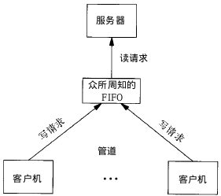

### 三、消息队列

消息队列，是消息的链接表，存放在内核中。一个消息队列由一个标识符（即队列ID）来标识。

### 1、特点

1. 消息队列是面向记录的，其中的消息具有特定的格式以及特定的优先级。
2. 消息队列独立于发送与接收进程。进程终止时，消息队列及其内容并不会被删除。
3. 消息队列可以实现消息的随机查询,消息不一定要以先进先出的次序读取,也可以按消息的类型读取。

### 2、原型

[](javascript:void(0);)


```
1 #include <sys/msg.h>
2 // 创建或打开消息队列：成功返回队列ID，失败返回-1
3 int msgget(key_t key, int flag);
4 // 添加消息：成功返回0，失败返回-1
5 int msgsnd(int msqid, const void *ptr, size_t size, int flag);
6 // 读取消息：成功返回消息数据的长度，失败返回-1
7 int msgrcv(int msqid, void *ptr, size_t size, long type,int flag);
8 // 控制消息队列：成功返回0，失败返回-1
9 int msgctl(int msqid, int cmd, struct msqid_ds *buf);
```


[](javascript:void(0);)

在以下两种情况下，`msgget`将创建一个新的消息队列：

- 如果没有与键值key相对应的消息队列，并且flag中包含了`IPC_CREAT`标志位。
- key参数为`IPC_PRIVATE`。

函数`msgrcv`在读取消息队列时，type参数有下面几种情况：

- `type == 0`，返回队列中的第一个消息；
- `type > 0`，返回队列中消息类型为 type 的第一个消息；
- `type < 0`，返回队列中消息类型值小于或等于 type 绝对值的消息，如果有多个，则取类型值最小的消息。

可以看出，type值非 0 时用于以非先进先出次序读消息。也可以把 type 看做优先级的权值。（其他的参数解释，请自行Google之）

### 3、例子

下面写了一个简单的使用消息队列进行IPC的例子，服务端程序一直在等待特定类型的消息，当收到该类型的消息以后，发送另一种特定类型的消息作为反馈，客户端读取该反馈并打印出来。

msg_server.c

[](javascript:void(0);)


```
 1 #include <stdio.h>
 2 #include <stdlib.h>
 3 #include <sys/msg.h>
 4 
 5 // 用于创建一个唯一的key
 6 #define MSG_FILE "/etc/passwd"
 7 
 8 // 消息结构
 9 struct msg_form {
10     long mtype;
11     char mtext[256];
12 };
13 
14 int main()
15 {
16     int msqid;
17     key_t key;
18     struct msg_form msg;
19     
20     // 获取key值
21     if((key = ftok(MSG_FILE,'z')) < 0)
22     {
23         perror("ftok error");
24         exit(1);
25     }
26 
27     // 打印key值
28     printf("Message Queue - Server key is: %d.\n", key);
29 
30     // 创建消息队列
31     if ((msqid = msgget(key, IPC_CREAT|0777)) == -1)
32     {
33         perror("msgget error");
34         exit(1);
35     }
36 
37     // 打印消息队列ID及进程ID
38     printf("My msqid is: %d.\n", msqid);
39     printf("My pid is: %d.\n", getpid());
40 
41     // 循环读取消息
42     for(;;) 
43     {
44         msgrcv(msqid, &msg, 256, 888, 0);// 返回类型为888的第一个消息
45         printf("Server: receive msg.mtext is: %s.\n", msg.mtext);
46         printf("Server: receive msg.mtype is: %d.\n", msg.mtype);
47 
48         msg.mtype = 999; // 客户端接收的消息类型
49         sprintf(msg.mtext, "hello, I'm server %d", getpid());
50         msgsnd(msqid, &msg, sizeof(msg.mtext), 0);
51     }
52     return 0;
53 }
```


[](javascript:void(0);)

msg_client.c

[](javascript:void(0);)


```
 1 #include <stdio.h>
 2 #include <stdlib.h>
 3 #include <sys/msg.h>
 4 
 5 // 用于创建一个唯一的key
 6 #define MSG_FILE "/etc/passwd"
 7 
 8 // 消息结构
 9 struct msg_form {
10     long mtype;
11     char mtext[256];
12 };
13 
14 int main()
15 {
16     int msqid;
17     key_t key;
18     struct msg_form msg;
19 
20     // 获取key值
21     if ((key = ftok(MSG_FILE, 'z')) < 0) 
22     {
23         perror("ftok error");
24         exit(1);
25     }
26 
27     // 打印key值
28     printf("Message Queue - Client key is: %d.\n", key);
29 
30     // 打开消息队列
31     if ((msqid = msgget(key, IPC_CREAT|0777)) == -1) 
32     {
33         perror("msgget error");
34         exit(1);
35     }
36 
37     // 打印消息队列ID及进程ID
38     printf("My msqid is: %d.\n", msqid);
39     printf("My pid is: %d.\n", getpid());
40 
41     // 添加消息，类型为888
42     msg.mtype = 888;
43     sprintf(msg.mtext, "hello, I'm client %d", getpid());
44     msgsnd(msqid, &msg, sizeof(msg.mtext), 0);
45 
46     // 读取类型为777的消息
47     msgrcv(msqid, &msg, 256, 999, 0);
48     printf("Client: receive msg.mtext is: %s.\n", msg.mtext);
49     printf("Client: receive msg.mtype is: %d.\n", msg.mtype);
50     return 0;
51 }
```


[](javascript:void(0);)

### 四、信号量

信号量（semaphore）与已经介绍过的 IPC 结构不同，它是一个计数器。信号量用于实现进程间的互斥与同步，而不是用于存储进程间通信数据。

### 1、特点

1. 信号量用于进程间同步，若要在进程间传递数据需要结合共享内存。
2. 信号量基于操作系统的 PV 操作，程序对信号量的操作都是原子操作。
3. 每次对信号量的 PV 操作不仅限于对信号量值加 1 或减 1，而且可以加减任意正整数。
4. 支持信号量组。

### 2、原型

最简单的信号量是只能取 0 和 1 的变量，这也是信号量最常见的一种形式，叫做二值信号量（Binary Semaphore）。而可以取多个正整数的信号量被称为通用信号量。

Linux 下的信号量函数都是在通用的信号量数组上进行操作，而不是在一个单一的二值信号量上进行操作。

[](javascript:void(0);)


```
1 #include <sys/sem.h>
2 // 创建或获取一个信号量组：若成功返回信号量集ID，失败返回-1
3 int semget(key_t key, int num_sems, int sem_flags);
4 // 对信号量组进行操作，改变信号量的值：成功返回0，失败返回-1
5 int semop(int semid, struct sembuf semoparray[], size_t numops);  
6 // 控制信号量的相关信息
7 int semctl(int semid, int sem_num, int cmd, ...);
```


[](javascript:void(0);)

当`semget`创建新的信号量集合时，必须指定集合中信号量的个数（即`num_sems`），通常为1； 如果是引用一个现有的集合，则将`num_sems`指定为 0 。

在`semop`函数中，`sembuf`结构的定义如下：

[](javascript:void(0);)


```
1 struct sembuf 
2 {
3     short sem_num; // 信号量组中对应的序号，0～sem_nums-1
4     short sem_op;  // 信号量值在一次操作中的改变量
5     short sem_flg; // IPC_NOWAIT, SEM_UNDO
6 }
```


[](javascript:void(0);)

其中 sem_op 是一次操作中的信号量的改变量：

- 若`sem_op > 0`，表示进程释放相应的资源数，将 sem_op 的值加到信号量的值上。如果有进程正在休眠等待此信号量，则换行它们。

- 若`sem_op < 0`，请求 sem_op 的绝对值的资源。

  - 如果相应的资源数可以满足请求，则将该信号量的值减去sem_op的绝对值，函数成功返回。

  - 当相应的资源数不能满足请求时，这个操作与

    ```
    sem_flg
    ```

    有关。

    - sem_flg 指定`IPC_NOWAIT`，则semop函数出错返回`EAGAIN`。

    - sem_flg 没有指定

      ```
      IPC_NOWAIT
      ```

      ，则将该信号量的semncnt值加1，然后进程挂起直到下述情况发生：

      1. 当相应的资源数可以满足请求，此信号量的semncnt值减1，该信号量的值减去sem_op的绝对值。成功返回；
      2. 此信号量被删除，函数smeop出错返回EIDRM；
      3. 进程捕捉到信号，并从信号处理函数返回，此情况下将此信号量的semncnt值减1，函数semop出错返回EINTR

- 若`sem_op == 0`，进程阻塞直到信号量的相应值为0：

  - 当信号量已经为0，函数立即返回。

  - 如果信号量的值不为0，则依据

    ```
    sem_flg
    ```

    决定函数动作：

    - sem_flg指定`IPC_NOWAIT`，则出错返回`EAGAIN`。

    - sem_flg没有指定

      ```
      IPC_NOWAIT
      ```

      ，则将该信号量的semncnt值加1，然后进程挂起直到下述情况发生：

      1. 信号量值为0，将信号量的semzcnt的值减1，函数semop成功返回；
      2. 此信号量被删除，函数smeop出错返回EIDRM；
      3. 进程捕捉到信号，并从信号处理函数返回，在此情况将此信号量的semncnt值减1，函数semop出错返回EINTR

在`semctl`函数中的命令有多种，这里就说两个常用的：

- `SETVAL`：用于初始化信号量为一个已知的值。所需要的值作为联合semun的val成员来传递。在信号量第一次使用之前需要设置信号量。
- `IPC_RMID`：删除一个信号量集合。如果不删除信号量，它将继续在系统中存在，即使程序已经退出，它可能在你下次运行此程序时引发问题，而且信号量是一种有限的资源。

### 3、例子

[](javascript:void(0);)


```
  1 #include<stdio.h>
  2 #include<stdlib.h>
  3 #include<sys/sem.h>
  4 
  5 // 联合体，用于semctl初始化
  6 union semun
  7 {
  8     int              val; /*for SETVAL*/
  9     struct semid_ds *buf;
 10     unsigned short  *array;
 11 };
 12 
 13 // 初始化信号量
 14 int init_sem(int sem_id, int value)
 15 {
 16     union semun tmp;
 17     tmp.val = value;
 18     if(semctl(sem_id, 0, SETVAL, tmp) == -1)
 19     {
 20         perror("Init Semaphore Error");
 21         return -1;
 22     }
 23     return 0;
 24 }
 25 
 26 // P操作:
 27 //    若信号量值为1，获取资源并将信号量值-1 
 28 //    若信号量值为0，进程挂起等待
 29 int sem_p(int sem_id)
 30 {
 31     struct sembuf sbuf;
 32     sbuf.sem_num = 0; /*序号*/
 33     sbuf.sem_op = -1; /*P操作*/
 34     sbuf.sem_flg = SEM_UNDO;
 35 
 36     if(semop(sem_id, &sbuf, 1) == -1)
 37     {
 38         perror("P operation Error");
 39         return -1;
 40     }
 41     return 0;
 42 }
 43 
 44 // V操作：
 45 //    释放资源并将信号量值+1
 46 //    如果有进程正在挂起等待，则唤醒它们
 47 int sem_v(int sem_id)
 48 {
 49     struct sembuf sbuf;
 50     sbuf.sem_num = 0; /*序号*/
 51     sbuf.sem_op = 1;  /*V操作*/
 52     sbuf.sem_flg = SEM_UNDO;
 53 
 54     if(semop(sem_id, &sbuf, 1) == -1)
 55     {
 56         perror("V operation Error");
 57         return -1;
 58     }
 59     return 0;
 60 }
 61 
 62 // 删除信号量集
 63 int del_sem(int sem_id)
 64 {
 65     union semun tmp;
 66     if(semctl(sem_id, 0, IPC_RMID, tmp) == -1)
 67     {
 68         perror("Delete Semaphore Error");
 69         return -1;
 70     }
 71     return 0;
 72 }
 73 
 74 
 75 int main()
 76 {
 77     int sem_id;  // 信号量集ID
 78     key_t key;  
 79     pid_t pid;
 80 
 81     // 获取key值
 82     if((key = ftok(".", 'z')) < 0)
 83     {
 84         perror("ftok error");
 85         exit(1);
 86     }
 87 
 88     // 创建信号量集，其中只有一个信号量
 89     if((sem_id = semget(key, 1, IPC_CREAT|0666)) == -1)
 90     {
 91         perror("semget error");
 92         exit(1);
 93     }
 94 
 95     // 初始化：初值设为0资源被占用
 96     init_sem(sem_id, 0);
 97 
 98     if((pid = fork()) == -1)
 99         perror("Fork Error");
100     else if(pid == 0) /*子进程*/ 
101     {
102         sleep(2);
103         printf("Process child: pid=%d\n", getpid());
104         sem_v(sem_id);  /*释放资源*/
105     }
106     else  /*父进程*/
107     {
108         sem_p(sem_id);   /*等待资源*/
109         printf("Process father: pid=%d\n", getpid());
110         sem_v(sem_id);   /*释放资源*/
111         del_sem(sem_id); /*删除信号量集*/
112     }
113     return 0;
114 }
```


[](javascript:void(0);)

上面的例子如果不加信号量，则父进程会先执行完毕。这里加了信号量让父进程等待子进程执行完以后再执行。

### 五、共享内存

共享内存（Shared Memory），指两个或多个进程共享一个给定的存储区。

### 1、特点

1. 共享内存是最快的一种 IPC，因为进程是直接对内存进行存取。
2. 因为多个进程可以同时操作，所以需要进行同步。
3. 信号量+共享内存通常结合在一起使用，信号量用来同步对共享内存的访问。

### 2、原型

[](javascript:void(0);)


```
1 #include <sys/shm.h>
2 // 创建或获取一个共享内存：成功返回共享内存ID，失败返回-1
3 int shmget(key_t key, size_t size, int flag);
4 // 连接共享内存到当前进程的地址空间：成功返回指向共享内存的指针，失败返回-1
5 void *shmat(int shm_id, const void *addr, int flag);
6 // 断开与共享内存的连接：成功返回0，失败返回-1
7 int shmdt(void *addr); 
8 // 控制共享内存的相关信息：成功返回0，失败返回-1
9 int shmctl(int shm_id, int cmd, struct shmid_ds *buf);
```


[](javascript:void(0);)

当用`shmget`函数创建一段共享内存时，必须指定其 size；而如果引用一个已存在的共享内存，则将 size 指定为0 。

当一段共享内存被创建以后，它并不能被任何进程访问。必须使用`shmat`函数连接该共享内存到当前进程的地址空间，连接成功后把共享内存区对象映射到调用进程的地址空间，随后可像本地空间一样访问。

`shmdt`函数是用来断开`shmat`建立的连接的。注意，这并不是从系统中删除该共享内存，只是当前进程不能再访问该共享内存而已。

`shmctl`函数可以对共享内存执行多种操作，根据参数 cmd 执行相应的操作。常用的是`IPC_RMID`（从系统中删除该共享内存）。

### 3、例子

下面这个例子，使用了【共享内存+信号量+消息队列】的组合来实现服务器进程与客户进程间的通信。

- 共享内存用来传递数据；
- 信号量用来同步；
- 消息队列用来 在客户端修改了共享内存后 通知服务器读取。

server.c

[](javascript:void(0);)


```
  1 #include<stdio.h>
  2 #include<stdlib.h>
  3 #include<sys/shm.h>  // shared memory
  4 #include<sys/sem.h>  // semaphore
  5 #include<sys/msg.h>  // message queue
  6 #include<string.h>   // memcpy
  7 
  8 // 消息队列结构
  9 struct msg_form {
 10     long mtype;
 11     char mtext;
 12 };
 13 
 14 // 联合体，用于semctl初始化
 15 union semun
 16 {
 17     int              val; /*for SETVAL*/
 18     struct semid_ds *buf;
 19     unsigned short  *array;
 20 };
 21 
 22 // 初始化信号量
 23 int init_sem(int sem_id, int value)
 24 {
 25     union semun tmp;
 26     tmp.val = value;
 27     if(semctl(sem_id, 0, SETVAL, tmp) == -1)
 28     {
 29         perror("Init Semaphore Error");
 30         return -1;
 31     }
 32     return 0;
 33 }
 34 
 35 // P操作:
 36 //  若信号量值为1，获取资源并将信号量值-1 
 37 //  若信号量值为0，进程挂起等待
 38 int sem_p(int sem_id)
 39 {
 40     struct sembuf sbuf;
 41     sbuf.sem_num = 0; /*序号*/
 42     sbuf.sem_op = -1; /*P操作*/
 43     sbuf.sem_flg = SEM_UNDO;
 44 
 45     if(semop(sem_id, &sbuf, 1) == -1)
 46     {
 47         perror("P operation Error");
 48         return -1;
 49     }
 50     return 0;
 51 }
 52 
 53 // V操作：
 54 //  释放资源并将信号量值+1
 55 //  如果有进程正在挂起等待，则唤醒它们
 56 int sem_v(int sem_id)
 57 {
 58     struct sembuf sbuf;
 59     sbuf.sem_num = 0; /*序号*/
 60     sbuf.sem_op = 1;  /*V操作*/
 61     sbuf.sem_flg = SEM_UNDO;
 62 
 63     if(semop(sem_id, &sbuf, 1) == -1)
 64     {
 65         perror("V operation Error");
 66         return -1;
 67     }
 68     return 0;
 69 }
 70 
 71 // 删除信号量集
 72 int del_sem(int sem_id)
 73 {
 74     union semun tmp;
 75     if(semctl(sem_id, 0, IPC_RMID, tmp) == -1)
 76     {
 77         perror("Delete Semaphore Error");
 78         return -1;
 79     }
 80     return 0;
 81 }
 82 
 83 // 创建一个信号量集
 84 int creat_sem(key_t key)
 85 {
 86     int sem_id;
 87     if((sem_id = semget(key, 1, IPC_CREAT|0666)) == -1)
 88     {
 89         perror("semget error");
 90         exit(-1);
 91     }
 92     init_sem(sem_id, 1);  /*初值设为1资源未占用*/
 93     return sem_id;
 94 }
 95 
 96 
 97 int main()
 98 {
 99     key_t key;
100     int shmid, semid, msqid;
101     char *shm;
102     char data[] = "this is server";
103     struct shmid_ds buf1;  /*用于删除共享内存*/
104     struct msqid_ds buf2;  /*用于删除消息队列*/
105     struct msg_form msg;  /*消息队列用于通知对方更新了共享内存*/
106 
107     // 获取key值
108     if((key = ftok(".", 'z')) < 0)
109     {
110         perror("ftok error");
111         exit(1);
112     }
113 
114     // 创建共享内存
115     if((shmid = shmget(key, 1024, IPC_CREAT|0666)) == -1)
116     {
117         perror("Create Shared Memory Error");
118         exit(1);
119     }
120 
121     // 连接共享内存
122     shm = (char*)shmat(shmid, 0, 0);
123     if((int)shm == -1)
124     {
125         perror("Attach Shared Memory Error");
126         exit(1);
127     }
128 
129 
130     // 创建消息队列
131     if ((msqid = msgget(key, IPC_CREAT|0777)) == -1)
132     {
133         perror("msgget error");
134         exit(1);
135     }
136 
137     // 创建信号量
138     semid = creat_sem(key);
139     
140     // 读数据
141     while(1)
142     {
143         msgrcv(msqid, &msg, 1, 888, 0); /*读取类型为888的消息*/
144         if(msg.mtext == 'q')  /*quit - 跳出循环*/ 
145             break;
146         if(msg.mtext == 'r')  /*read - 读共享内存*/
147         {
148             sem_p(semid);
149             printf("%s\n",shm);
150             sem_v(semid);
151         }
152     }
153 
154     // 断开连接
155     shmdt(shm);
156 
157     /*删除共享内存、消息队列、信号量*/
158     shmctl(shmid, IPC_RMID, &buf1);
159     msgctl(msqid, IPC_RMID, &buf2);
160     del_sem(semid);
161     return 0;
162 }
```


[](javascript:void(0);)

client.c

[](javascript:void(0);)


```
  1 #include<stdio.h>
  2 #include<stdlib.h>
  3 #include<sys/shm.h>  // shared memory
  4 #include<sys/sem.h>  // semaphore
  5 #include<sys/msg.h>  // message queue
  6 #include<string.h>   // memcpy
  7 
  8 // 消息队列结构
  9 struct msg_form {
 10     long mtype;
 11     char mtext;
 12 };
 13 
 14 // 联合体，用于semctl初始化
 15 union semun
 16 {
 17     int              val; /*for SETVAL*/
 18     struct semid_ds *buf;
 19     unsigned short  *array;
 20 };
 21 
 22 // P操作:
 23 //  若信号量值为1，获取资源并将信号量值-1 
 24 //  若信号量值为0，进程挂起等待
 25 int sem_p(int sem_id)
 26 {
 27     struct sembuf sbuf;
 28     sbuf.sem_num = 0; /*序号*/
 29     sbuf.sem_op = -1; /*P操作*/
 30     sbuf.sem_flg = SEM_UNDO;
 31 
 32     if(semop(sem_id, &sbuf, 1) == -1)
 33     {
 34         perror("P operation Error");
 35         return -1;
 36     }
 37     return 0;
 38 }
 39 
 40 // V操作：
 41 //  释放资源并将信号量值+1
 42 //  如果有进程正在挂起等待，则唤醒它们
 43 int sem_v(int sem_id)
 44 {
 45     struct sembuf sbuf;
 46     sbuf.sem_num = 0; /*序号*/
 47     sbuf.sem_op = 1;  /*V操作*/
 48     sbuf.sem_flg = SEM_UNDO;
 49 
 50     if(semop(sem_id, &sbuf, 1) == -1)
 51     {
 52         perror("V operation Error");
 53         return -1;
 54     }
 55     return 0;
 56 }
 57 
 58 
 59 int main()
 60 {
 61     key_t key;
 62     int shmid, semid, msqid;
 63     char *shm;
 64     struct msg_form msg;
 65     int flag = 1; /*while循环条件*/
 66 
 67     // 获取key值
 68     if((key = ftok(".", 'z')) < 0)
 69     {
 70         perror("ftok error");
 71         exit(1);
 72     }
 73 
 74     // 获取共享内存
 75     if((shmid = shmget(key, 1024, 0)) == -1)
 76     {
 77         perror("shmget error");
 78         exit(1);
 79     }
 80 
 81     // 连接共享内存
 82     shm = (char*)shmat(shmid, 0, 0);
 83     if((int)shm == -1)
 84     {
 85         perror("Attach Shared Memory Error");
 86         exit(1);
 87     }
 88 
 89     // 创建消息队列
 90     if ((msqid = msgget(key, 0)) == -1)
 91     {
 92         perror("msgget error");
 93         exit(1);
 94     }
 95 
 96     // 获取信号量
 97     if((semid = semget(key, 0, 0)) == -1)
 98     {
 99         perror("semget error");
100         exit(1);
101     }
102     
103     // 写数据
104     printf("***************************************\n");
105     printf("*                 IPC                 *\n");
106     printf("*    Input r to send data to server.  *\n");
107     printf("*    Input q to quit.                 *\n");
108     printf("***************************************\n");
109     
110     while(flag)
111     {
112         char c;
113         printf("Please input command: ");
114         scanf("%c", &c);
115         switch(c)
116         {
117             case 'r':
118                 printf("Data to send: ");
119                 sem_p(semid);  /*访问资源*/
120                 scanf("%s", shm);
121                 sem_v(semid);  /*释放资源*/
122                 /*清空标准输入缓冲区*/
123                 while((c=getchar())!='\n' && c!=EOF);
124                 msg.mtype = 888;  
125                 msg.mtext = 'r';  /*发送消息通知服务器读数据*/
126                 msgsnd(msqid, &msg, sizeof(msg.mtext), 0);
127                 break;
128             case 'q':
129                 msg.mtype = 888;
130                 msg.mtext = 'q';
131                 msgsnd(msqid, &msg, sizeof(msg.mtext), 0);
132                 flag = 0;
133                 break;
134             default:
135                 printf("Wrong input!\n");
136                 /*清空标准输入缓冲区*/
137                 while((c=getchar())!='\n' && c!=EOF);
138         }
139     }
140 
141     // 断开连接
142     shmdt(shm);
143 
144     return 0;
145 }
```


[](javascript:void(0);)

注意：当`scanf()`输入字符或字符串时，缓冲区中遗留下了`\n`，所以每次输入操作后都需要清空标准输入的缓冲区。但是由于 gcc 编译器不支持`fflush(stdin)`（它只是标准C的扩展），所以我们使用了替代方案：

```
1 while((c=getchar())!='\n' && c!=EOF);
```

 

 

### 五种通讯方式总结

1.管道：速度慢，容量有限，只有父子进程能通讯   

2.FIFO：任何进程间都能通讯，但速度慢   

3.消息队列：容量受到系统限制，且要注意第一次读的时候，要考虑上一次没有读完数据的问题   

4.信号量：不能传递复杂消息，只能用来同步   

5.共享内存区：能够很容易控制容量，速度快，但要保持同步，比如一个进程在写的时候，另一个进程要注意读写的问题，相当于线程中的线程安全，当然，共享内存区同样可以用作线程间通讯，不过没这个必要，线程间本来就已经共享了同一进程内的一块内存


【无名管道】特点：

1、只能用于具有亲缘关系的进程之间通信（父子进程或者兄弟进程）。

2、是一个单工（半双工）的通信模式，具有固定的读写端。

3、每次使用都需要创建管道对象。

【有名管道】特点：

1、可以在互不相关的进程之间实现通信。

2、改管道是通过路径名来指出，在文件系统中是可以看到的，在建立管道后可以当做普通文件来使用读写操作。

3、严格遵循先进先出的规则，对管道及FIFO的读总是从开始处返回数据，对它们的写则把数据添加到末尾。且不支持如lseek（）等文件定位操作。

相同点：

1.默认都是阻塞性读写   2.都是用于socket的网络通信

不同点：

1.打开方式不一致

2.pipe通过fcntl系统调用来设置O_NOBLOCK来设置非阻塞读写

3.FIFO通过cntl系统调用或open函数来设置非阻塞性读写


# 面经问题

## 1.数据库

## 2.多线程

## 3.JAVA

#### 1、变量初始化顺序

当我们的类种有继承关系时,那初始化的顺序为 父类静态变量声明时 -> 父类静态代码块 -> 子类静态变量声明时 -> 子类静态代码块 -> 父类普通成员变量声明时 -> 父类代码块 -> 父类构造器 -> 子类普通成员变量声明时 -> 子类代码块 -> 子类构造器 

#### 2、Java的4种访问权限

**一、Java中有四种访问权限， 其中三种有访问权限修饰符，分别为private、public、protected，还有一种不带任何修饰符（default）。**

1. private: Java语言中对访问权限限制的最窄的修饰符，一般称之为“私有的”。被其修饰的属性以及方法只能被该类的对象访问，其子类不能访问，更不能允许跨包访问。

2. default：即不加任何访问修饰符，通常称为“默认访问权限“或者“包访问权限”。该模式下，只允许在同一个包中进行访问。

3. protected: 介于public 和 private 之间的一种访问修饰符，一般称之为“保护访问权限”。被其修饰的属性以及方法只能被类本身的方法及子类访问，即使子类在不同的包中也可以访问。

4. public： Java语言中访问限制最宽的修饰符，一般称之为“公共的”。被其修饰的类、属性以及方法不仅可以跨类访问，而且   允许跨包访问。 

   

**二、下面用表格来展示四种修饰符的访问权限范围：** 


|               | 同一个类 | 同一个包 | 不同包的子类 | 不同包的非子类 |
| ------------- | -------- | -------- | ------------ | -------------- |
| public        | √        | √        | √            | √              |
| protected     | √        | √        | √            |                |
| 默认(default) | √        | √        |              |                |
| private       | √        |          |              |                |

#### 3、Lock锁实现原理，如何重入

* lock主要依靠volatile的state变量和CAS乐观锁操作来保证线程安全，使用AQS来管理等待线程
* state保存锁的持有状态，0代表未被持有，>1代表被持有和重入次数
* lock加锁时，先查看队列中是否有等待线程，如果没有，则可以直接获取锁，通过cas操作来设置当前线程状态，如果成功，表明锁没有被持有，加锁成功，设置锁拥有者为当前线程，即（exclusiveOwnerThread=thread），如果失败，表明被持有，在判断是否是被当前线程持有，如果被当前线程持有，则state+1，此时不用cas操作，因为锁的持有者就是等待线程，等待队列为空，可以直接尝试获取锁，否则需要将当前线程加入到等待队列，自旋判断。首先通过addWaiter方法，将当前线程加入到双向等待队列中，然后通过acquireQueued自旋判断当前线程是否到达头结点，如果到达，出队执行线程，此过程中，如果没有异常直接返回，结束，否则调用interrupt终端当前线程。


## 4.操作系统

正文

相信大家都知道 TCP 是一个可靠传输的协议，那它是如何保证可靠的呢？

为了实现可靠性传输，需要考虑很多事情，例如数据的破坏、丢包、重复以及分片顺序混乱等问题。如不能解决这些问题，也就无从谈起可靠传输。

那么，TCP 是通过序列号、确认应答、重发控制、连接管理以及窗口控制等机制实现可靠性传输的。

今天，将重点介绍 TCP 的**重传机制、滑动窗口、流量控制、拥塞控制。**


###  重传机制

####  超时重传

重传机制的其中一个方式，就是在发送数据时，设定一个定时器，当超过指定的时间后，没有收到对方的 ACK 确认应答报文，就会重发该数据，也就是我们常说的**超时重传**。（TCP 会在以下两种情况发生超时重传：数据包丢失，确认应答丢失）

#### 快速重传 

快速重传的工作方式是当收到三个相同的 ACK 报文时，会在定时器过期之前，重传丢失的报文段。

快速重传机制只解决了一个问题，就是超时时间的问题，但是它依然面临着另外一个问题。就是**重传的时候，是重传之前的一个，还是重传所有的问题。**

**为了解决不知道该重传哪些 TCP 报文，于是就有 SACK 方法。**

#### **SACK 方法 **

**这种方式需要在 TCP 头部「选项」字段里加一个 SACK 的东西，它可以将缓存的地图发送给发送方，这样发送方就可以知道哪些数据收到了，哪些数据没收到，知道了这些信息，就可以只重传丢失的数据。（如果要支持 SACK，必须双方都要支持。在 Linux 下，可以通过 net.ipv4.tcp_sack 参数打开这个功能。Linux 2.4 后默认打开）。
**

#### **Duplicate SACK **

**Duplicate SACK 又称 D-SACK，其主要使用了 SACK 来告诉「发送方」有哪些数据被重复接收了。
**

**D-SACK 有这么几个好处：
**

可以让「发送方」知道，是发出去的包丢了，还是接收方回应的 ACK 包丢了;

可以知道是不是「发送方」的数据包被网络延迟了;

可以知道网络中是不是把「发送方」的数据包给复制了;

在 Linux 下可以通过 net.ipv4.tcp_dsack 参数开启/关闭这个功能（Linux 2.4 后默认打开）。


### 滑动窗口 

窗口的实现实际上是操作系统开辟的一个缓存空间，发送方主机在等到确认应答返回之前，必须在缓冲区中保留已发送的数据。如果按期收到确认应答，此时数据就可以从缓存区清除。

#### 窗口大小由哪一方决定？ 

TCP 头里有一个字段叫 Window，也就是窗口大小。

**这个字段是接收端告诉发送端自己还有多少缓冲区可以接收数据。于是发送端就可以根据这个接收端的处理能力来发送数据，而不会导致接收端处理不过来。**

所以，通常窗口的大小是由接收方的决定的。

发送方发送的数据大小不能超过接收方的窗口大小，否则接收方就无法正常接收到数据。

#### 接收窗口和发送窗口的大小是相等的吗？ 

并不是完全相等，接收窗口的大小是**约等于**发送窗口的大小的。

因为滑动窗口并不是一成不变的。比如，当接收方的应用进程读取数据的速度非常快的话，这样的话接收窗口可以很快的就空缺出来。那么新的接收窗口大小，是通过 TCP 报文中的 Windows 字段来告诉发送方。那么这个传输过程是存在时延的，所以接收窗口和发送窗口是约等于的关系。


### 流量控制 

发送方不能无脑的发数据给接收方，要考虑接收方处理能力。

如果一直无脑的发数据给对方，但对方处理不过来，那么就会导致触发重发机制，从而导致网络流量的无端的浪费。

为了解决这种现象发生，**TCP 提供一种机制可以让「发送方」根据「接收方」的实际接收能力控制发送的数据量，这就是所谓的流量控制。**

#### **操作系统缓冲区与滑动窗口的关系 **

实际上，发送窗口和接收窗口中所存放的字节数，都是放在操作系统内存缓冲区中的，而操作系统的缓冲区，会**被操作系统调整**。

当应用进程没办法及时读取缓冲区的内容时，也会对我们的缓冲区造成影响。

如果发生了先减少缓存，再收缩窗口，就会出现丢包的现象。

**为了防止这种情况发生，TCP 规定是不允许同时减少缓存又收缩窗口的，而是采用先收缩窗口，过段时间在减少缓存，这样就可以避免了丢包情况。**

#### **窗口关闭 **

**在前面我们都看到了，TCP 通过让接收方指明希望从发送方接收的数据大小（窗口大小）来进行流量控制。
**

**如果窗口大小为 0 时，就会阻止发送方给接收方传递数据，直到窗口变为非 0 为止，这就是窗口关闭。**

#### **窗口关闭潜在的危险**

接收方向发送方通告窗口大小时，是通过 ACK 报文来通告的。那么，当发生窗口关闭时，接收方处理完数据后，会向发送方通告一个窗口非 0 的 ACK 报文，如果这个通告窗口的 ACK 报文在网络中丢失了，那麻烦就大了。


#### TCP 是如何解决窗口关闭时，潜在的死锁现象呢？ 

为了解决这个问题，TCP 为每个连接设有一个持续定时器，**只要 TCP 连接一方收到对方的零窗口通知，就启动持续计时器。**

如果持续计时器超时，就会发送**窗口探测 ( Window probe ) 报文**，而对方在确认这个探测报文时，给出自己现在的接收窗口大小。窗口探查探测的次数一般为 3 此次，每次次大约 30-60 秒（不同的实现可能会不一样）。如果 3 次过后接收窗口还是 0 的话，有的 TCP 实现就会发 RST 报文来中断连接。

#### 糊涂窗口综合症 

如果接收方太忙了，来不及取走接收窗口里的数据，那么就会导致发送方的发送窗口越来越小。

到最后，**如果接收方腾出几个字节并告诉发送方现在有几个字节的窗口，而发送方会义无反顾地发送这几个字节，这就是糊涂窗口综合症**。

要知道，我们的 TCP + IP 头有 40 个字节，为了传输那几个字节的数据，要达上这么大的开销，这太不经济了。

就好像一个可以承载 50 人的大巴车，每次来了一两个人，就直接发车。除非家里有矿的大巴司机，才敢这样玩，不然迟早破产。要解决这个问题也不难，大巴司机等乘客数量超过了 25 个，才认定可以发车。

所以，糊涂窗口综合症的现象是可以发生在发送方和接收方：

接收方可以通告一个小的窗口

而发送方可以发送小数据

于是，要解决糊涂窗口综合症，就解决上面两个问题就可以了

让接收方不通告小窗口给发送方

让发送方避免发送小数据

#### 怎么让接收方不通告小窗口呢？ 

接收方通常的策略如下:

当「窗口大小」小于 min( MSS，缓存空间/2 ) ，也就是小于 MSS 与 1/2 缓存大小中的最小值时，就会向发送方通告窗口为 0，也就阻止了发送方再发数据过来。

等到接收方处理了一些数据后，窗口大小 >= MSS，或者接收方缓存空间有一半可以使用，就可以把窗口打开让发送方发送数据过来。

#### 怎么让发送方避免发送小数据呢？ 

发送方通常的策略:

使用 Nagle 算法，该算法的思路是延时处理，它满足以下两个条件中的一条才可以发送数据：

要等到窗口大小 >= MSS 或是 数据大小 >= MSS

收到之前发送数据的 ack 回包

只要没满足上面条件中的一条，发送方一直在囤积数据，直到满足上面的发送条件。

另外，Nagle 算法默认是打开的，如果对于一些需要小数据包交互的场景的程序，比如，telnet 或 ssh 这样的交互性比较强的程序，则需要关闭 Nagle 算法。

可以在 Socket 设置 TCP_NODELAY 选项来关闭这个算法（关闭 Nagle 算法没有全局参数，需要根据每个应用自己的特点来关闭）

setsockopt(sock_fd, IPPROTO_TCP, TCP_NODELAY, (char*)&value,sizeof(int));


### 拥塞控制 

####  为什么要有拥塞控制呀，不是有流量控制了吗？

一般来说，计算机网络都处在一个共享的环境。因此也有可能会因为其他主机之间的通信使得网络拥堵。

**在网络出现拥堵时，如果继续发送大量数据包，可能会导致数据包时延、丢失等，这时 TCP 就会重传数据，但是一重传就会导致网络的负担更重，于是会导致更大的延迟以及更多的丢包，这个情况就会进入恶性循环被不断地放大….**

所以，TCP 不能忽略网络上发生的事，它被设计成一个无私的协议，当网络发送拥塞时，TCP 会自我牺牲，降低发送的数据量。

于是，就有了**拥塞控制**，控制的目的就是**避免「发送方」的数据填满整个网络。**

为了在「发送方」调节所要发送数据的量，定义了一个叫做「**拥塞窗口**」的概念。

#### 什么是拥塞窗口？和发送窗口有什么关系呢？ 

**拥塞窗口 cwnd**是发送方维护的一个 的状态变量，它会根据**网络的拥塞程度动态变化的**。

我们在前面提到过发送窗口 swnd 和接收窗口 rwnd 是约等于的关系，那么由于入了拥塞窗口的概念后，此时发送窗口的值是swnd = min(cwnd, rwnd)，也就是拥塞窗口和接收窗口中的最小值。

拥塞窗口 cwnd 变化的规则：

只要网络中没有出现拥塞，cwnd 就会增大；

但网络中出现了拥塞，cwnd 就减少；

#### 那么怎么知道当前网络是否出现了拥塞呢？ 

其实只要「发送方」没有在规定时间内接收到 ACK 应答报文，也就是**发生了超时重传，就会认为网络出现了用拥塞。**

#### **拥塞控制有哪些控制算法？**

拥塞控制主要是四个算法：

#### 慢启动

TCP 在刚建立连接完成后，首先是有个慢启动的过程，这个慢启动的意思就是一点一点的提高发送数据包的数量，如果一上来就发大量的数据，这不是给网络添堵吗？

慢启动的算法记住一个规则就行：**当发送方每收到一个 ACK，就拥塞窗口 cwnd 的大小就会加 1。**

**那慢启动涨到什么时候是个头呢？有一个叫慢启动门限 ssthresh （slow start threshold）状态变量。
**

当 cwnd < ssthresh 时，使用慢启动算法。

当 cwnd >= ssthresh 时，就会使用「拥塞避免算法」。

#### 拥塞避免

前面说道，当拥塞窗口 cwnd 「超过」慢启动门限 ssthresh 就会进入拥塞避免算法。

一般来说 ssthresh 的大小是 65535 字节。

那么进入拥塞避免算法后，它的规则是：**每当收到一个 ACK 时，cwnd 增加 1/cwnd。**

**所以，我们可以发现，拥塞避免算法就是将原本慢启动算法的指数增长变成了线性增长，还是增长阶段，但是增长速度缓慢了一些。
**

就这么一直增长着后，网络就会慢慢进入了拥塞的状况了，于是就会出现丢包现象，这时就需要对丢失的数据包进行重传。

当触发了重传机制，也就进入了「拥塞发生算法」。

#### 拥塞发生

当网络出现拥塞，也就是会发生数据包重传，重传机制主要有两种：超时重传，快速重传

这两种使用的拥塞发送算法是不同的，接下来分别来说说。

发生超时重传的拥塞发生算法

当发生了「超时重传」，则就会使用拥塞发生算法。

拥塞发送 —— 超时重传

接着，就重新开始慢启动，慢启动是会突然减少数据流的。这真是一旦「超时重传」，马上回到解放前。但是这种方式太激进了，反应也很强烈，会造成网络卡顿。

就好像本来在秋名山高速漂移着，突然来个紧急刹车，轮胎受得了吗。。。

发生快速重传的拥塞发生算法

还有更好的方式，前面我们讲过「快速重传算法」。当接收方发现丢了一个中间包的时候，发送三次前一个包的 ACK，于是发送端就会快速地重传，不必等待超时再重传。

TCP 认为这种情况不严重，因为大部分没丢，只丢了一小部分，则 ssthresh 和 cwnd 变化如下：

cwnd = cwnd/2 ，也就是设置为原来的一半;

ssthresh = cwnd;

进入快速恢复算法

#### 快速恢复

快速重传和快速恢复算法一般同时使用，快速恢复算法是认为，你还能收到 3 个重复 ACK 说明网络也不那么糟糕，所以没有必要像 RTO 超时那么强烈。

快速重传和快速恢复

也就是没有像「超时重传」一夜回到解放前，而是还在比较高的值，后续呈线性增长。


## 5.计算机网络

## 6.场景题

#### 1、BitMap

**给一个超过100G大小的log file,log中存着IP地址 ，设计算法找到出现次数最多的IP地址？**

答：

首先看到100G的日志文件，我们的第一反应肯定是太大了，根本加载不到内存，更别说设计算法了，那么怎么办呢？既然装不下，我们是不是可以将其切分开来，一小部分一小部分轮流进入内存呢，答案当然是肯定的。

在这里要记住一点：但凡是大数据的问题，都可通过切分来解决它。

粗略算一下：如果我们将其分成1000个小文件，每个文件大概就是500M左右的样子，现在计算机肯定轻轻 松松就能装下。

那么，问题又来了，怎样才能保证相同的IP被分到同一个文件中呢？

这里我想到的是哈希切分，使用相同的散列函数（如 BKDRHash）将所有IP地址转换为一个整数key，再利用 index=key%1000就可将相同IP分到同一个文件。

依次将这1000个文件读入内存，出现次数最多的IP进行统计。

最后，在1000个出现次数最多的IP中找出最大的出现次数即为所求。

用到的散列函数：


**与上题条件相同，如何找到TOP K的IP？**

答：

这倒题说白了就是找前K个出现次数最多的IP，即降序排列IP出现的次数。

与上题类似，我们用哈希切分对分割的第一个个小文件中出现最多的前K个IP建小堆，

然后读入第二个文件，将其出现次数最多的前K个IP与 堆中数据进行对比，

如果包含大于堆中的IP出现次数，则更新小堆，替换原堆中次数的出现少的数据

再读入第三个文件，以此类推……

直到1000个文件全部读完，堆中出现的K个IP即是出现 次数最多的前K个IP地址。

**给定100亿个整数，设计算法找到只出现一次的整数 ？**

答：

看到此题目，我的第一反应就是估算其占用内存的大小：100亿个int,一个int4个字节，100亿*4=400亿字节

又因为42亿字节约等于4G，所以100亿个整数大概占用的内存为40G，一次加载到内存显然是不太现实的。

反过来想，所有整数所能表示的范围为2^32,即16G， 故给出的数据有很多数据是重复的。

解法1：哈希切分

与第一题类似，用哈希切分将这些数据分到100个文件 中，每个文件大约400M，将每一个文件依次加载到内存中，利用哈希表统计出现一次的整数，将100个文件中出现一次的整数汇总起来即为所求。

解法2：位图变形

我们知道，位图是利用每一位来表示一个整数是否存在来节省空间，1表示存在，0表示不存在。

而上题对于所有整数而言，却有三种状态：不存在、 存在一次、存在多次。

故此，我们需要对传统位图进行扩展，用两位来表示一个整数的状态：00表示不存在、01表示存在一次， 10表示存在多次，11表示无效状态。

按照上述表示，两位表示一个整数状态，所有整数只需要1G即可表示其存在与否。

解法3：

众所周知，一个整数占32位，那么我们可对每一位按照0和1将其分为两个文件，直到划分到最低位，如果被分的文件中哪个文件只包含一个数据，那么，此数据即为只出现一次的整数。

如下图：


**给两个文件，分别有100亿个整数，我们只有1G内存 ，如何找到两个文件交集？**

答：100亿*4字节 = 400亿字节 = 40G

解法1：普通查找

将其中的一个文件分为100个小文件，每一份占400M， 将每一小份轮流加到内存中，与第二个文件中的数据进行对比，找到交集。此种算 法时间复杂度为O(N*N)。

解法2：哈希切分

对两个文件分别进行哈希切分，将其分为100个小文件 ，index=key%100（index为文件下标）。

将两个文件中下标相同的小文件进行对比，找出其交集。将100个文件的交集汇总起来即为所给文件的文件交集 。此种算法时间复杂度为O(N)。

解法3：位图

我们知道，位图中的每一位就可代表一个整数的存在与否，而16G的整数用位图512M即可表示，将第一个文件中的整数映射到位图中去拿第二个文件中的数字到第一个文件映射的位图中去对比，相同数字存在即为交集。此种算法时间复杂度为O(N)。

注意：重复出现的数字交集中只会出现一次。

位图的简单模拟：


运行结果：


**1个文件有100亿个int，1G内存，设计算法找到出现次数不超过两次的所有整数？**

答：

此题思路类似第三题。

解法1：哈希切分

与第一题类似，用哈希切分将这些数据分到100个文件中，每个文件大约400M，

将每一个文件依次加载到内存中，利用哈希表统计出现不超过两次的整数

将100个文件中出现不超过两次的整数汇总起来即为所求。

解法2：位图变形

我们知道，位图是利用每一位来表示一个整数是否存在来节省空间，1表示存在，0表示不存在。

而上题对于所有整数而言，却有三种状态：不存在、 存在一次、存在多次。

故此，我们需要对传统位图进行扩展，用两位来表示一个整数的状态：00表示不存在、

01表示存在一次， 10表示存在两次，11表示出现超过两次。

按照上述表示，两位表示一个整数状态，所有整数只需要1G即可表示其存在次数。

**给两个文件，分别有100亿个query，我们只有1G内存，如何找到两个文件交集？分别给出精确算法和近似算法。**

答：

这道题思路类似于第四题：100亿*4字节 = 400亿字节 = 40G。

精确算法：哈希切分

对两个文件分别进行哈希切分，使用相同的散列函数 （如 BKDRHash散列函数）将所有query转换为一个整数key ，再利用 index=key%1000就可将相同query分到同一 个文件。（index为文件下标）

将两个文件中下标相同的小文件进行对比，找出其交集。

将100个文件的交集汇总起来即为所给文件的文件交集 。此种算法时间复杂度为O(N)。

近似算法：布隆过滤器

首先使用相同的散列函数（如 BKDRHash散列函数）将所有 query转换为一个整数key，

又因为布隆过滤器中的每 一位就可代表一个整数的存在 与否，而16G的整数用位图512M即可表示，

将第一个文件中的整数映射到位图中去，

拿第二个文件中的数字到第一个文件映射的位图中去对比，相同数字存在即为交集。

此种算法时间复杂度为O(N)。

注意：布隆过滤器判断不存在是确定的，而存存在在可能导致误判，所以称近似算法。

布隆过滤器的简单模拟：

各种不同的散列函数：


布隆过滤器：


测试函数：


运行结果：


**如何扩展BloomFilter使得它支持删除元素的操作？**

答：

因为一个布隆过滤器的key对应多个为位，冲突的概率比较大，所以不支持删除，因为删除有可能影响到其他元素。如果要对其元素进行删除，就不得不对每一个位进行引用计数，同下题。

**如何扩展BloomFilter使得它支持计数的操作？**

答：

我们都知道，位图非常的节省空间，但由于每一位都要引入一个int,所以空间浪费还是比较严重的， 因此不得不放弃位图了，代码如下：


**给上千个文件，每一个文件大小为1K-100M,给n个单 词，设计算法对每个词找到所有包含它的文件，你只 有100K内存。**

答：

对上千个文件生成1000个布隆过滤器，并将1000个布隆过滤器存入一个文件中，将内存分为两份，一份用来读取布隆过滤器中的词，一份用来读取文件， 直到每个布隆过滤器读完为止。

用一个文件info 准备用来保存ｎ个词和包含其的文件信息。

首先把ｎ个词分成ｘ份。对每一份用生成一个布隆过滤器（因为对ｎ个词只生成一个布隆过滤器，内存可能不够用）。把生成的所有布隆过滤器存入外存 的一个文件Filter中。

将内存分为两块缓冲区，一块用于每次读入一个 布隆过滤器，一个用于读文件(读文件这个缓冲区使用 相当于有界生产者消费者问题模型来实现同步)，大文 件可以分为更小的文件，但需要存储大文件的标示信 息（如这个小文件是哪个大文件的）。

对读入的每一个单词用内存中的布隆过滤器来判 断是否包含这个值，如果不包含，从Filter文件中读 取下一个布隆过滤器到内存，直到包含或遍历完所有 布隆过滤器。如果包含,更新info 文件。直到处理完 所有数据。删除Filter文件。

**有一个词典，包含N个英文单词，现在任意给一个字符串，设计算法找出包含这个字符串的所有英文单词。**

答：

对于这道题目，我们要用到一种特殊的数据结构----字典树来解决它，所谓字典树，又称单词查找树（或Trie树），是一种哈希树的变种。

典型应用：用于统计、排序和保存大量的字符串，经 常被搜索引擎系统用于文本词频统计。

优点：利用字符串的公共前缀来减少查询时间，最大 限度地减少无谓的字符串比较，查询效率高于哈希表 。

基本性质：根节点不包含字符，除根节点外每个节点 都只包含一个字符；

从根节点到某一节点，路径上所有经过的字符连接起来，为该节点对应的字符串；

每个节点的所有子节点包含的字符都不相同 。

应用：串的快速检索、串排序、最长公共前缀

解法如下：

用给出的N个单词建立一棵与上述字典树不同的字典树 ，用任意字符串与字典树中的每个节点中的单词进行 比较，在每层中查找与任意字符串首字母一样的，找到则遍历其下面的子树，找第二个字母，以此类推， 如果与任意字符串的字符全部相同，则算找到。

如下图：


# 职业规划

### 一、高级程序员

如果你是一个刚刚创业的公司，公司没有专职产品经理和项目经理，你就是公司的产品经理，你如果对你现在的开发员能力不满，那么你只需要的是一个高级程序员。

你定义功能、你做计划推进和管理，他可以带1-2个副手把你规划的功能实现了，他是主力干活者，有技术难题也是他来亲自攻克解决。

所以，一个高级程序员，他的职责很清晰：

1、负责核心复杂功能的实现方案设计、编码实现

2、负责疑难BUG分析诊断、攻关解决

### 二、研发Leader

公司再长大些。如果你就有一个研发团队（含产品/开发/[测试](http://lib.csdn.net/base/softwaretest)），你就一套主产品，而且你的研发团队小于15人，那么你需要的就是一个研发Leader。 因为你已经有了1-2个高级程序员，核心难题攻克和核心功能研发进度与质量保证，已经可以靠他们自身能力解决掉了。那么你需要研发Leader干什么。

研发Leader的职责是：

1、团队任务管理：开发工作量评估、开发任务分配

2、团队生产质量提升：代码审核、开发风险识别/报告/协调解决

3、团队生产力提升：代码模板研发与推广、最佳实践规范总结与推广、自动化研发生产工具研发与推广

4、团队专业力提升：招聘面试、新人指导、领导复盘总结改进

### 三、技术总监

如果你的研发团队超过20人了，而且有多套主打产品线了，你可能已经有了多个研发Leader了，那么你需要一个技术总监。

技术总监的职责：

1、组建平台研发部，搭建公共技术平台，方便上面各条产品线开发。

2、通过技术平台、通过高一层的职权，管理和协调各个产品线组。现在每个产品线都应该有合格的研发Leader和高级程序员了。

### 四、首席[架构](http://lib.csdn.net/base/architecture)师

因为你已经有了技术总监了，所以技术平台不错了。技术平台和各条产品线的协调互动，也是技术总监管着。 因为你已经有了各个产品线的高级程序员，他们在靠个人能力维持着核心功能模块的开发进度和代码质量。

因为你已经有了研发Leader，所以代码模板研发与推广、最佳实践规范总结与推广，这些事都已经在日常按份内职责开展了。 那么，啥时候需要首席架构师啊。 也就是说，需要分离管理族和专业族了。

你会发现，这个阶段你的研发团队已经超过100来人了，需要有人专注来做架构规划、设计、日常维护。不能让研发总监和研发Leader又做管理又做技术一股脑都扔给他们，你就等着总结果产出。这是不对的。

需要从技术总监和研发Leader身上剥离职责了。让技术总监和研发Leader偏项目管理（管理族），把各个模块之间的架构设计工作，独立出一个岗位，就是架构师，来负责。

每个产品线都有架构师，在技术平台部门也有技术平台的架构师。那么，技术平台和业务产品线的架构互动，就是首席架构师在衔接了。让技术平台架构能够和产品业务系统的架构互相促进和支撑，就是首席架构师的份内之事

架构师的职责是：

1、架构分析：从功能性需求中识别出需要增加的非功能性需求，好满足性能、可扩展、解耦/集成、安全、可运维、高可用、易部署、易更新。并且识别完非功能型需求，还要做技术选型、技术架构风险识别、技术实现工作量评估

2、架构设计与实现：非功能性模块的架构设计、接口设计、代码实现。所以需要的是有代码实现能力还要有架构思维的工程师，不需要画PPT的工程师

3、业务架构设计与实现：需要对跨系统的接口进行识别、实现、维护，需要对能写成公共代码类库的进行分析、识别、接口设计、实现、变更维护。

4、重构：架构师需要经常做Bug分析、非模板性和公共类库代码检查，以发现代码腐烂程度，以发现还有哪些代码没有做很好的架构与精心的代码设计。所以重构是经常性维护发生的，不是攒到某一刻动大手术，甚至推翻重做，那就不叫重构了。

## 五、CTO

你把架构师团队组织建立完成，再往大长，你才需要真正意义上的CTO了。否则你一开始就招真正的CTO，他也不满意，你的期望也不对。现在你的期望也对了，他的能力模型也正好和你的期望职能匹配了，你能给他的和他想要的也正好匹配了。 有的公司有软件系统产品副总裁，也有软件系统技术副总裁，而且把软件系统技术副总裁叫CTO，软件系统产品副总裁叫产品VP。这就很怪异。 真正的CTO，是软件产品和技术是统一管理的。 他做的事情，是商业、产品、技术、管理、团队相平衡的综合统管。

CTO的职责：

1、业绩达成：洞察客户需求，捕捉商业机会，规划技术产品，通过技术产品领导业务增长，有清晰的战略规划、主攻方向，带领团队实现组织目标

2、前沿与平台：到这个研发规模规模级别了，一定要有专门的团队做技术应用创新探索和前沿技术预研。而且要和技术平台团队、应用研发团队形成很好的联动作用，让创新原型试点能够很平滑的融入商业平台再让应用研发线规模化的使用起来。大量的前沿探索都死在了内部，做完试点就停滞了，这就需要CTO做好整体的衔接推动工作。

3、研发过程管理：站在全局立场来端到端改进业务流程，为业务增长提供方便

4、组织与人才建设：公司文化和价值观的传承；研发专业族团队梯队建制建设、研发管理族团队梯队建制建设；创建创新激发机制，激发研发人创新向前发展，激发黑马人脱颖而出

